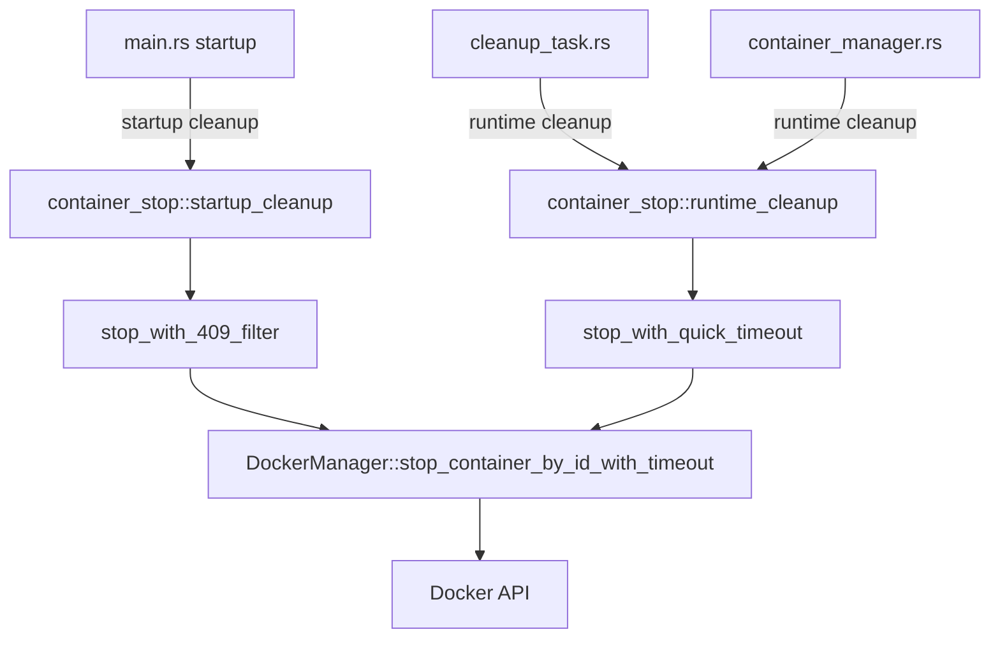

# Design Document

## Overview

This design document outlines the unified container stopping module that will consolidate all container stopping logic into a single, reusable module within the `docker_manager` crate. The module will provide two distinct stopping strategies optimized for different scenarios: startup cleanup and runtime cleanup.

## Architecture

### Module Location

```
crates/docker_manager/src/
├── lib.rs                    (existing)
├── manager.rs                (existing)
├── types.rs                  (existing)
├── utils.rs                  (existing)
└── container_stop.rs         (new - unified stopping logic)
```

### High-Level Design



## Components and Interfaces

### 1. Container Stop Module (`container_stop.rs`)

#### Public API

```rust
/// 启动时容器清理策略
/// 
/// 特点：
/// - 使用5秒超时
/// - 过滤409冲突错误（容器已在删除中）
/// - 不阻塞服务启动
pub async fn startup_cleanup_containers(
    docker_manager: &DockerManager,
    pattern: &str,
) -> Result<CleanupResult, DockerError>

/// 运行时容器清理策略
///
/// 特点：
/// - 使用3秒优雅停止超时
/// - 立即强制停止
/// - 快速释放资源
pub async fn runtime_cleanup_container(
    docker_manager: &DockerManager,
    container_id: &str,
) -> Result<(), DockerError>

/// 运行时批量清理容器
pub async fn runtime_cleanup_containers(
    docker_manager: &DockerManager,
    container_ids: Vec<String>,
) -> Result<CleanupResult, DockerError>
```

#### Internal Helper Functions

```rust
/// 停止单个容器（启动场景）
async fn stop_container_startup_mode(
    docker_manager: &DockerManager,
    container_id: &str,
) -> Result<(), DockerError>

/// 停止单个容器（运行时场景）
async fn stop_container_runtime_mode(
    docker_manager: &DockerManager,
    container_id: &str,
) -> Result<(), DockerError>

/// 检查是否为409冲突错误
fn is_409_conflict_error(error: &DockerError) -> bool

/// 创建清理结果统计
fn create_cleanup_result(
    total: usize,
    successful: usize,
    failed: usize,
    removed_ids: Vec<String>,
    failures: Vec<ContainerRemovalFailure>,
) -> CleanupResult
```

### 2. Configuration Constants

```rust
/// 启动清理超时时间（秒）
const STARTUP_CLEANUP_TIMEOUT_SECONDS: u64 = 5;

/// 运行时清理超时时间（秒）
const RUNTIME_CLEANUP_TIMEOUT_SECONDS: u64 = 3;

/// 容器停止后的等待时间（毫秒）
const POST_STOP_WAIT_MS: u64 = 100;
```

## Data Models

### CleanupResult (existing, reused)

```rust
pub struct CleanupResult {
    pub total_found: usize,
    pub successfully_removed: usize,
    pub failed_removals: usize,
    pub removed_container_ids: Vec<String>,
    pub failed_removals_details: Vec<ContainerRemovalFailure>,
    pub duration_ms: u64,
}
```

### ContainerRemovalFailure (existing, reused)

```rust
pub struct ContainerRemovalFailure {
    pub container_id: String,
    pub container_name: String,
    pub error_message: String,
}
```

## Error Handling

### Startup Cleanup Error Handling

1. **409 Conflict Errors**
   - Log at INFO level: "容器已在删除中，跳过"
   - Do not count as failure
   - Continue processing other containers

2. **Other Errors**
   - Log at WARN level with error details
   - Count as failure in statistics
   - Continue processing other containers
   - Do not block service startup

### Runtime Cleanup Error Handling

1. **All Errors**
   - Log at WARN level with error details
   - Return error to caller
   - Caller decides whether to continue

2. **Timeout Handling**
   - If graceful stop times out, force stop immediately
   - Log timeout at WARN level
   - Continue with force stop

## Testing Strategy

### Unit Tests

```rust
#[cfg(test)]
mod tests {
    use super::*;

    #[test]
    fn test_is_409_conflict_error() {
        // Test 409 error detection
    }

    #[test]
    fn test_cleanup_result_creation() {
        // Test result statistics calculation
    }

    #[tokio::test]
    async fn test_startup_cleanup_filters_409() {
        // Test that 409 errors are filtered during startup
    }

    #[tokio::test]
    async fn test_runtime_cleanup_quick_timeout() {
        // Test that runtime cleanup uses 3-second timeout
    }
}
```

### Integration Tests

1. **Startup Cleanup Integration**
   - Create test containers
   - Simulate 409 conflict scenario
   - Verify service continues without error

2. **Runtime Cleanup Integration**
   - Create running container
   - Verify 3-second timeout behavior
   - Verify force stop after timeout

## Implementation Details

### Startup Cleanup Flow

```
1. List all containers matching pattern
2. For each container:
   a. Call stop_container_startup_mode
   b. Use 5-second timeout
   c. If 409 error: log INFO, skip to next
   d. If other error: log WARN, count as failure
   e. If success: count as success
3. Return CleanupResult with statistics
```

### Runtime Cleanup Flow

```
1. For given container_id:
   a. Call stop_container_runtime_mode
   b. Use 3-second graceful timeout
   c. If timeout: force stop immediately
   d. Remove container
   e. Log result
2. Return success or error
```

### Integration Points

#### main.rs Changes

```rust
// Before
match startup_cleanup_orphaned_containers(&docker_manager).await {
    Ok(cleaned_count) => { /* ... */ }
    Err(e) => { /* ... */ }
}

// After
use docker_manager::container_stop;

match container_stop::startup_cleanup_containers(&docker_manager, "rcoder-agent-*").await {
    Ok(result) => {
        if result.successfully_removed > 0 {
            info!("✅ 启动时清理完成，共清理了 {} 个遗留容器", result.successfully_removed);
        }
    }
    Err(e) => {
        warn!("⚠️ 启动时容器清理失败: {}，但这不影响服务启动", e);
    }
}
```

#### cleanup_task.rs Changes

```rust
// In destroy_docker_container method
use docker_manager::container_stop;

// Replace stop_container_by_id_with_timeout call
container_stop::runtime_cleanup_container(&docker_manager, &container_id).await?;
```

#### container_manager.rs Changes

```rust
// If needed for container cleanup
use docker_manager::container_stop;

container_stop::runtime_cleanup_container(&docker_manager, &container_id).await?;
```

## Performance Considerations

1. **Startup Cleanup**
   - Parallel processing of containers (existing behavior maintained)
   - 5-second timeout prevents long blocking
   - 409 filtering reduces unnecessary retries

2. **Runtime Cleanup**
   - 3-second timeout balances speed and graceful shutdown
   - Immediate force stop after timeout
   - Minimal resource holding time

## Security Considerations

1. **Container Isolation**
   - Only stop containers matching specific patterns
   - Validate container ownership before stopping

2. **Error Information**
   - Do not expose sensitive container details in logs
   - Use generic error messages for external errors

## Logging Strategy

### Log Levels

- **INFO**: Normal operations, 409 conflicts during startup
- **WARN**: Unexpected errors, timeouts
- **ERROR**: Critical failures (none expected in this module)
- **DEBUG**: Detailed operation flow (for development)

### Log Format

```rust
// Startup cleanup
info!("🧹 [STARTUP_CLEANUP] 开始清理容器: pattern={}", pattern);
info!("✅ [STARTUP_CLEANUP] 容器清理成功: container_id={}", container_id);
info!("🔄 [STARTUP_CLEANUP] 容器已在删除中，跳过: container_id={}", container_id);
warn!("⚠️ [STARTUP_CLEANUP] 容器清理失败: container_id={}, error={}", container_id, error);

// Runtime cleanup
info!("🔥 [RUNTIME_CLEANUP] 开始停止容器: container_id={}", container_id);
info!("✅ [RUNTIME_CLEANUP] 容器停止成功: container_id={}", container_id);
warn!("⏰ [RUNTIME_CLEANUP] 容器停止超时，强制停止: container_id={}", container_id);
warn!("⚠️ [RUNTIME_CLEANUP] 容器停止失败: container_id={}, error={}", container_id, error);
```

## Migration Strategy

### Phase 1: Create New Module
- Implement `container_stop.rs` in docker_manager crate
- Add unit tests
- Export public API from lib.rs

### Phase 2: Update main.rs
- Replace startup cleanup logic
- Test service startup with orphaned containers
- Verify 409 error filtering

### Phase 3: Update cleanup_task.rs
- Replace destroy_docker_container logic
- Test runtime cleanup behavior
- Verify 3-second timeout

### Phase 4: Update container_manager.rs (if needed)
- Replace any container stopping logic
- Test container lifecycle

### Phase 5: Cleanup
- Remove old duplicated code
- Update documentation
- Final integration testing

## Rollback Plan

If issues are discovered:
1. Revert changes to calling code (main.rs, cleanup_task.rs, etc.)
2. Keep new module for future use
3. Restore original inline implementations
4. Document issues for future redesign
