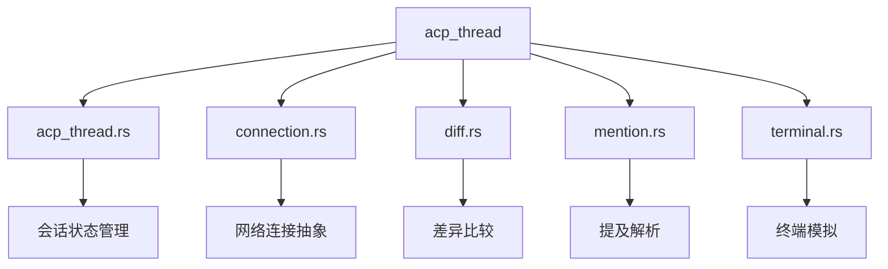
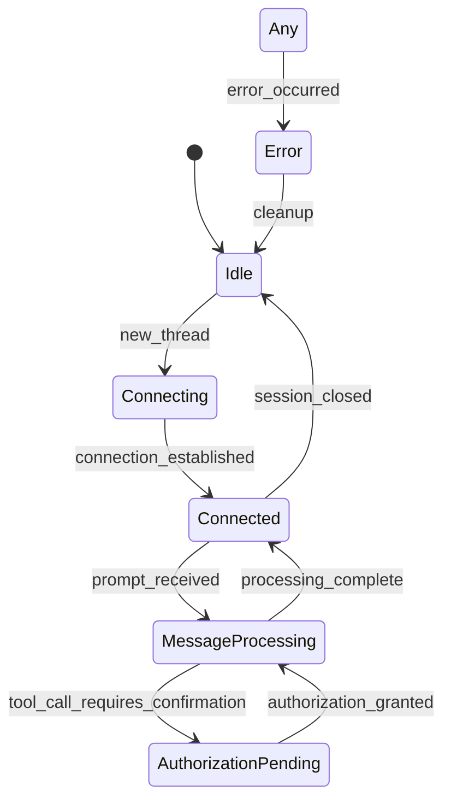
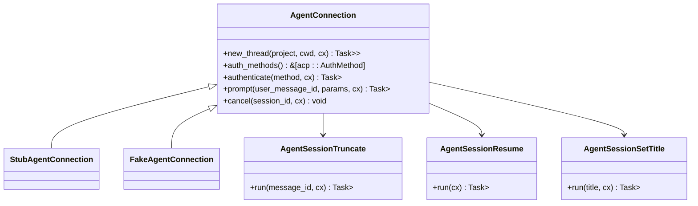
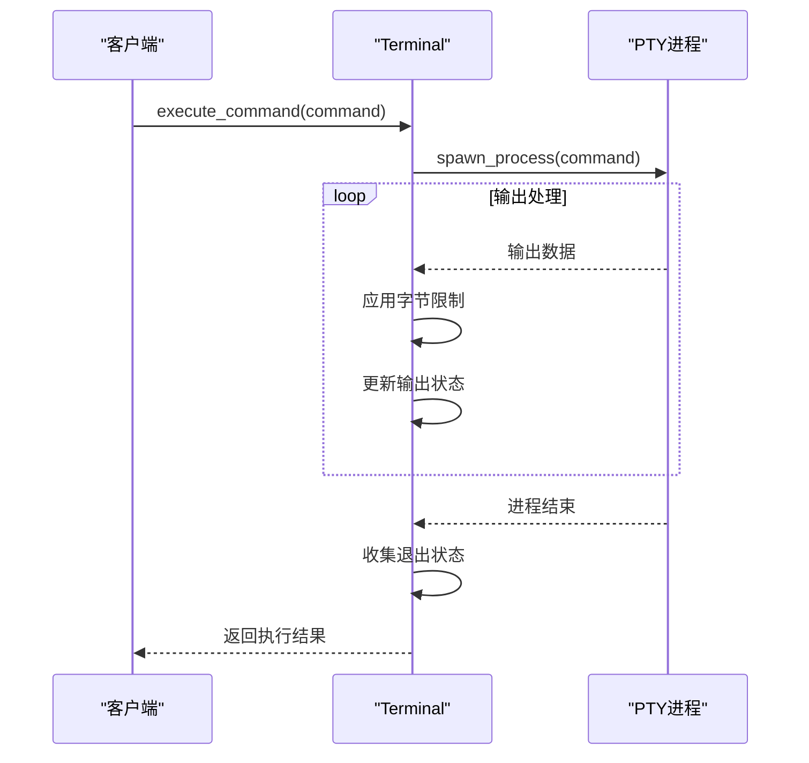
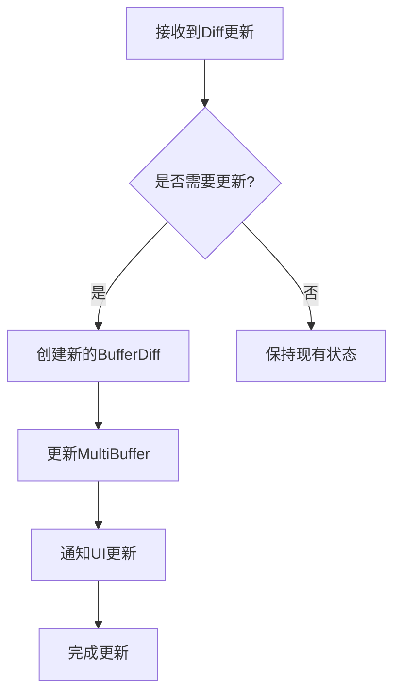
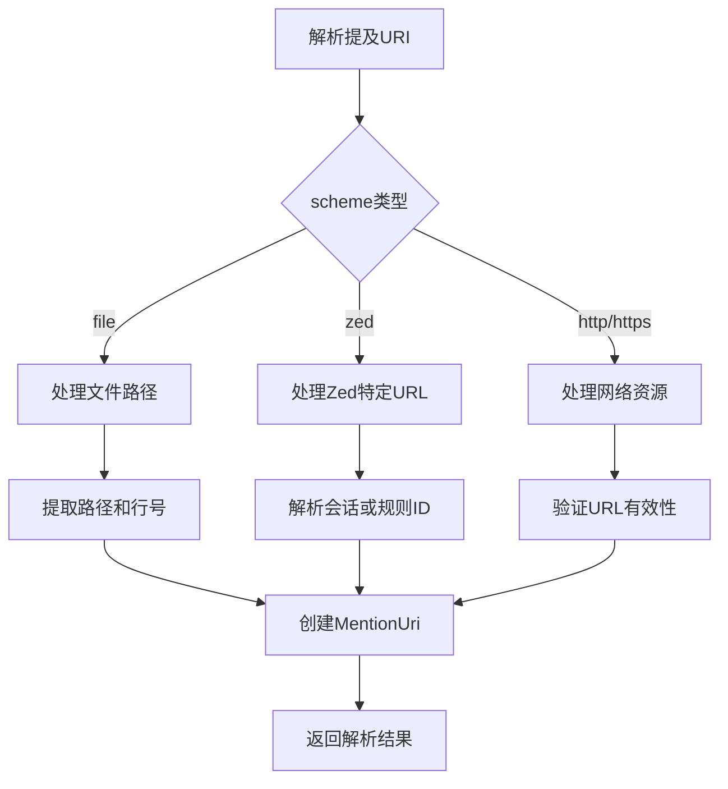
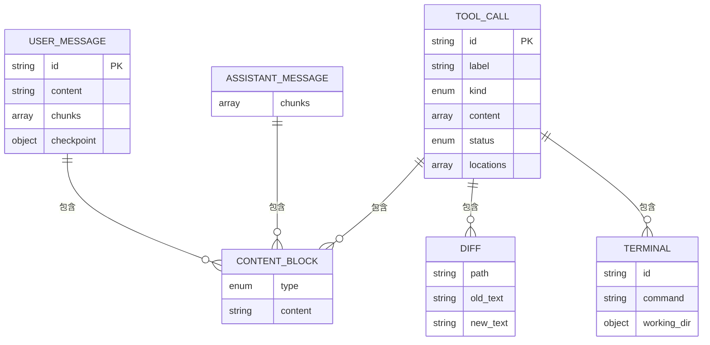
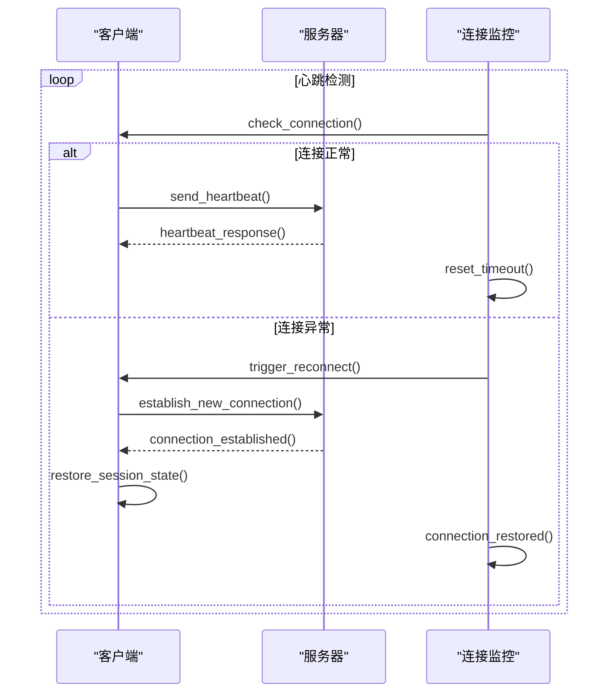

# ACP会话架构

<cite>
**本文档中引用的文件**   
- [acp_thread.rs](file://crates/acp_thread/src/acp_thread.rs)
- [connection.rs](file://crates/acp_thread/src/connection.rs)
- [diff.rs](file://crates/acp_thread/src/diff.rs)
- [mention.rs](file://crates/acp_thread/src/mention.rs)
- [terminal.rs](file://crates/acp_thread/src/terminal.rs)
</cite>

## 目录
1. [引言](#引言)
2. [项目结构](#项目结构)
3. [核心组件](#核心组件)
4. [会话状态机实现](#会话状态机实现)
5. [网络传输层抽象](#网络传输层抽象)
6. [终端环境模拟](#终端环境模拟)
7. [增量更新与提及解析](#增量更新与提及解析)
8. [消息格式与序列化](#消息格式与序列化)
9. [长连接保活与错误恢复](#长连接保活与错误恢复)
10. [结论](#结论)

## 引言
ACP（Agent Client Protocol）会话层架构设计旨在实现客户端与AI代理之间的高效双向通信。本架构通过acp_thread crate维护会话状态，支持复杂的交互式命令执行场景。系统采用分层设计，将网络传输、终端模拟、内容处理等职责分离，确保了系统的可维护性和扩展性。

## 项目结构
acp_thread crate包含多个核心模块，分别处理会话的不同方面。这种模块化设计使得各功能组件可以独立演进，同时保持良好的集成性。

**图示来源**
- [acp_thread.rs](file://crates/acp_thread/src/acp_thread.rs)
- [connection.rs](file://crates/acp_thread/src/connection.rs)
- [diff.rs](file://crates/acp_thread/src/diff.rs)
- [mention.rs](file://crates/acp_thread/src/mention.rs)
- [terminal.rs](file://crates/acp_thread/src/terminal.rs)

## 核心组件
acp_thread crate的核心组件包括会话管理、连接抽象、终端模拟和内容处理等模块。这些组件协同工作，实现了完整的ACP会话功能。

**组件来源**
- [acp_thread.rs](file://crates/acp_thread/src/acp_thread.rs#L775-L800)
- [connection.rs](file://crates/acp_thread/src/connection.rs#L21-L50)
- [terminal.rs](file://crates/acp_thread/src/terminal.rs#L10-L20)

## 会话状态机实现
acp_thread.rs实现了ACP会话的状态机，管理从连接建立到消息分发的完整生命周期。状态机通过事件驱动的方式处理各种会话事件，确保状态转换的正确性和一致性。

**图示来源**
- [acp_thread.rs](file://crates/acp_thread/src/acp_thread.rs#L775-L800)
- [connection.rs](file://crates/acp_thread/src/connection.rs#L21-L50)

## 网络传输层抽象
connection.rs通过AgentConnection trait抽象了网络传输层，提供了统一的接口来处理不同类型的连接。这种抽象使得上层逻辑无需关心具体的网络实现细节。

**图示来源**
- [connection.rs](file://crates/acp_thread/src/connection.rs#L21-L150)

## 终端环境模拟
terminal.rs模块实现了终端环境的模拟，支持交互式命令执行。通过封装底层终端操作，提供了安全的命令执行环境和输出处理机制。

**图示来源**
- [terminal.rs](file://crates/acp_thread/src/terminal.rs#L10-L50)

## 增量更新与提及解析
diff.rs和mention.rs模块分别处理增量更新和提及解析的特殊逻辑。这些功能增强了会话的表达能力和交互性。

### 增量更新处理

**图示来源**
- [diff.rs](file://crates/acp_thread/src/diff.rs#L10-L100)

### 提及解析逻辑

**图示来源**
- [mention.rs](file://crates/acp_thread/src/mention.rs#L25-L100)

## 消息格式与序列化
ACP会话采用结构化的消息格式，通过serde进行序列化和反序列化。消息格式设计考虑了扩展性和兼容性，支持多种内容类型。

**图示来源**
- [acp_thread.rs](file://crates/acp_thread/src/acp_thread.rs#L40-L200)
- [diff.rs](file://crates/acp_thread/src/diff.rs#L10-L20)
- [terminal.rs](file://crates/acp_thread/src/terminal.rs#L10-L20)

## 长连接保活与错误恢复
系统实现了长连接保活策略和错误恢复机制，确保会话的稳定性和可靠性。通过心跳检测和自动重连，最大限度地减少连接中断的影响。

**图示来源**
- [connection.rs](file://crates/acp_thread/src/connection.rs#L21-L50)
- [acp_thread.rs](file://crates/acp_thread/src/acp_thread.rs#L775-L800)

## 结论
ACP会话架构通过清晰的分层设计和模块化实现，提供了稳定可靠的双向通信通道。各组件职责明确，接口定义清晰，为后续功能扩展和性能优化奠定了良好基础。系统的错误恢复机制和长连接保活策略确保了在复杂网络环境下的稳定性，而丰富的消息格式支持则满足了多样化的交互需求。