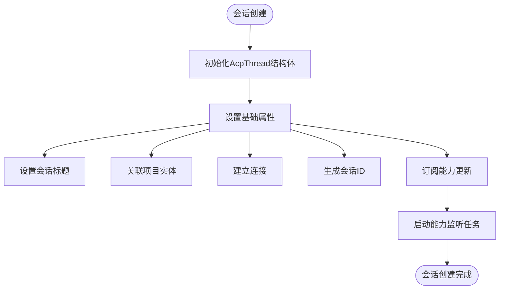
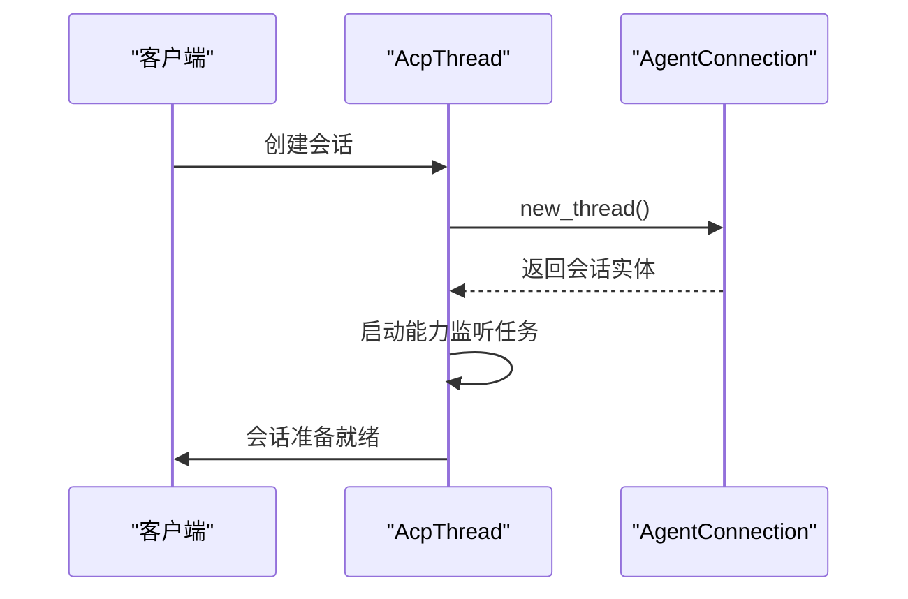
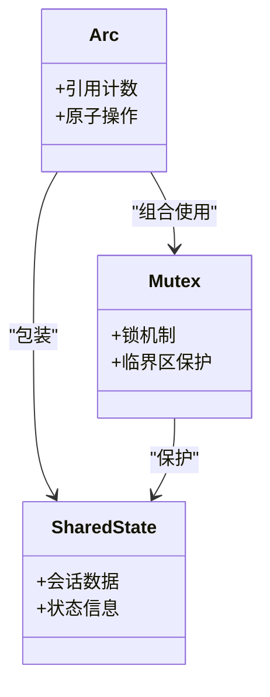
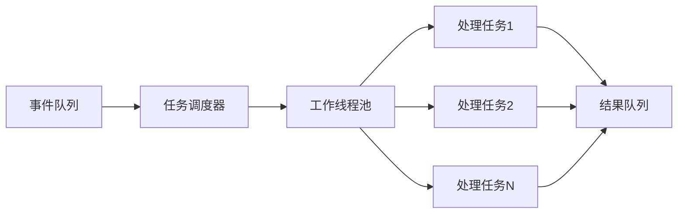
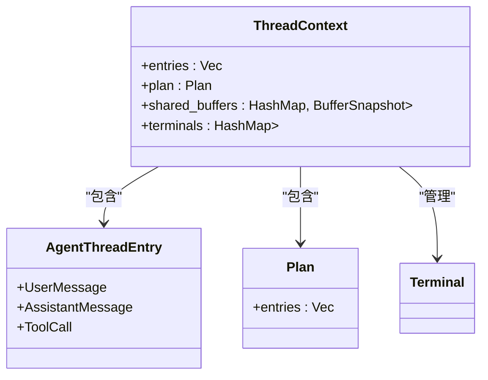
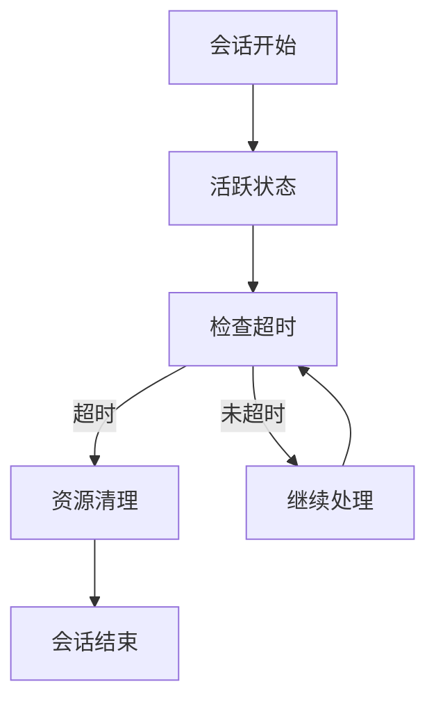

# 会话生命周期管理

<cite>
**本文档引用的文件**
- [acp_thread.rs](file://crates/acp_thread/src/acp_thread.rs)
- [connection.rs](file://crates/acp_thread/src/connection.rs)
- [terminal.rs](file://crates/acp_thread/src/terminal.rs)
- [diff.rs](file://crates/acp_thread/src/diff.rs)
</cite>

## 目录
1. [简介](#简介)
2. [会话状态机概述](#会话状态机概述)
3. [会话生命周期阶段](#会话生命周期阶段)
4. [状态转换与处理逻辑](#状态转换与处理逻辑)
5. [线程安全的状态共享](#线程安全的状态共享)
6. [异步消息处理机制](#异步消息处理机制)
7. [会话上下文设计](#会话上下文设计)
8. [超时配置与资源回收](#超时配置与资源回收)
9. [总结](#总结)

## 简介
本文档深入解析`acp_thread.rs`中实现的ACP会话状态机，详细说明会话的创建、激活、暂停、恢复和销毁等生命周期阶段。文档记录了会话状态转换的触发条件和处理逻辑，包括初始化握手、消息循环启动、异常中断处理和资源清理机制。

**Section sources**
- [acp_thread.rs](file://crates/acp_thread/src/acp_thread.rs#L0-L799)

## 会话状态机概述
ACP会话状态机通过`AcpThread`结构体实现，管理整个会话的生命周期。该状态机负责处理用户消息、助手响应、工具调用等交互过程，并维护会话的状态信息。

```mermaid
classDiagram
class AcpThread {
+title : SharedString
+entries : Vec<AgentThreadEntry>
+plan : Plan
+project : Entity<Project>
+action_log : Entity<ActionLog>
+shared_buffers : HashMap<Entity<Buffer>, BufferSnapshot>
+send_task : Option<Task<()>>
+connection : Rc<dyn AgentConnection>
+session_id : acp : : SessionId
+token_usage : Option<TokenUsage>
+prompt_capabilities : acp : : PromptCapabilities
+_observe_prompt_capabilities : Task<anyhow : : Result<()>>
+terminals : HashMap<acp : : TerminalId, Entity<Terminal>>
}
class AgentThreadEntry {
+UserMessage(UserMessage)
+AssistantMessage(AssistantMessage)
+ToolCall(ToolCall)
}
class ToolCall {
+id : acp : : ToolCallId
+label : Entity<Markdown>
+kind : acp : : ToolKind
+content : Vec<ToolCallContent>
+status : ToolCallStatus
+locations : Vec<acp : : ToolCallLocation>
+resolved_locations : Vec<Option<AgentLocation>>
+raw_input : Option<serde_json : : Value>
+raw_output : Option<serde_json : : Value>
}
class ToolCallStatus {
+Pending
+WaitingForConfirmation
+InProgress
+Completed
+Failed
+Rejected
+Canceled
}
AcpThread --> AgentThreadEntry : "包含"
AcpThread --> ToolCall : "管理"
ToolCall --> ToolCallStatus : "具有"
```

**Diagram sources**
- [acp_thread.rs](file://crates/acp_thread/src/acp_thread.rs#L0-L799)

**Section sources**
- [acp_thread.rs](file://crates/acp_thread/src/acp_thread.rs#L0-L799)

## 会话生命周期阶段
ACP会话的生命周期包含创建、激活、暂停、恢复和销毁五个主要阶段，每个阶段都有明确的状态标识和处理逻辑。

### 会话创建
会话创建阶段通过`AcpThread::new`方法初始化，设置会话的基本属性和初始状态。



**Diagram sources**
- [acp_thread.rs](file://crates/acp_thread/src/acp_thread.rs#L851-L893)

**Section sources**
- [acp_thread.rs](file://crates/acp_thread/src/acp_thread.rs#L851-L893)

### 会话激活
会话激活阶段启动消息处理循环，开始接收和处理用户输入。

### 会话暂停与恢复
会话暂停和恢复机制允许在特定条件下暂时停止会话处理，并在条件满足时恢复。

### 会话销毁
会话销毁阶段清理所有相关资源，包括终端、缓冲区和连接。

## 状态转换与处理逻辑
会话状态转换由特定事件触发，每个状态转换都有相应的处理逻辑。

### 初始化握手
初始化握手过程建立会话与服务器的连接，并交换能力信息。



**Diagram sources**
- [acp_thread.rs](file://crates/acp_thread/src/acp_thread.rs#L851-L893)
- [connection.rs](file://crates/acp_thread/src/connection.rs#L0-L481)

**Section sources**
- [acp_thread.rs](file://crates/acp_thread/src/acp_thread.rs#L851-L893)
- [connection.rs](file://crates/acp_thread/src/connection.rs#L0-L481)

### 消息循环启动
消息循环启动后，会话开始处理用户消息和系统事件。

### 异常中断处理
当发生异常时，会话状态机会进行适当的错误处理和状态恢复。

### 资源清理机制
在会话结束时，所有分配的资源都会被正确清理。

## 线程安全的状态共享
ACP会话通过`Arc<Mutex<>>`实现线程安全的状态共享，确保多线程环境下的数据一致性。

### Arc<Mutex<>>实现原理
`Arc`提供原子引用计数，`Mutex`提供互斥访问，两者结合实现安全的共享状态。



**Diagram sources**
- [acp_thread.rs](file://crates/acp_thread/src/acp_thread.rs#L0-L799)

**Section sources**
- [acp_thread.rs](file://crates/acp_thread/src/acp_thread.rs#L0-L799)

## 异步消息处理机制
ACP会话利用Tokio任务调度实现异步消息处理，提高系统响应性和吞吐量。

### Tokio任务调度
通过Tokio的异步运行时，会话可以并发处理多个消息和事件。



**Diagram sources**
- [acp_thread.rs](file://crates/acp_thread/src/acp_thread.rs#L851-L893)

**Section sources**
- [acp_thread.rs](file://crates/acp_thread/src/acp_thread.rs#L851-L893)

## 会话上下文设计
会话上下文（ThreadContext）的数据结构设计支持多轮对话的上下文管理。

### ThreadContext数据结构
`ThreadContext`包含会话所需的所有上下文信息，支持复杂的对话场景。



**Diagram sources**
- [acp_thread.rs](file://crates/acp_thread/src/acp_thread.rs#L0-L799)

**Section sources**
- [acp_thread.rs](file://crates/acp_thread/src/acp_thread.rs#L0-L799)

## 超时配置与资源回收
会话系统实现了超时配置和资源回收策略，确保系统资源的有效利用。

### 超时配置
通过配置参数控制会话的超时行为，防止资源长时间占用。

### 资源回收策略
实现自动化的资源回收机制，及时释放不再使用的资源。



**Diagram sources**
- [acp_thread.rs](file://crates/acp_thread/src/acp_thread.rs#L0-L799)

**Section sources**
- [acp_thread.rs](file://crates/acp_thread/src/acp_thread.rs#L0-L799)

## 总结
ACP会话状态机通过精心设计的状态管理和资源控制机制，实现了高效、可靠的会话处理。系统采用线程安全的设计和异步处理模式，能够应对复杂的多轮对话场景，同时确保资源的有效利用和系统的稳定性。