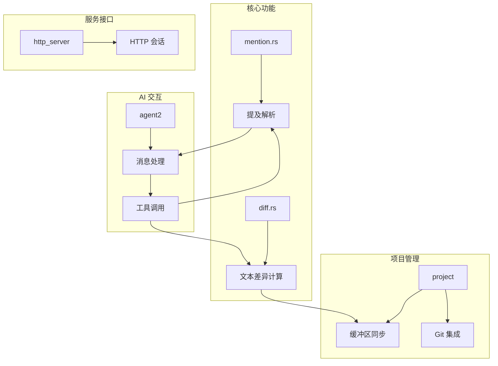
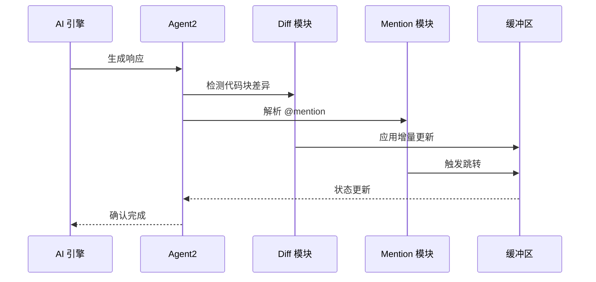
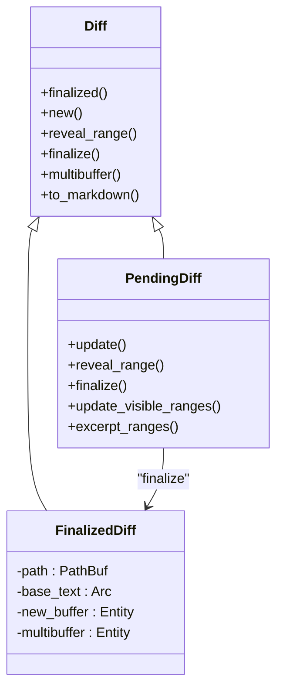
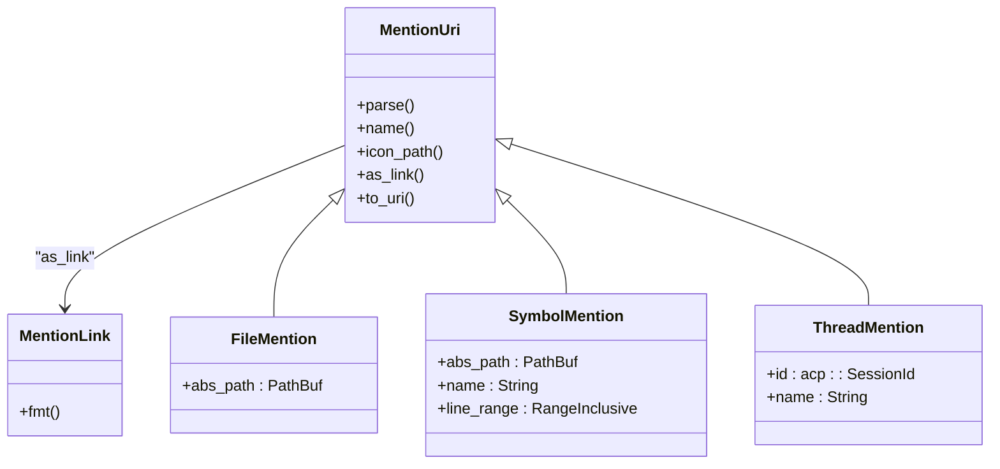
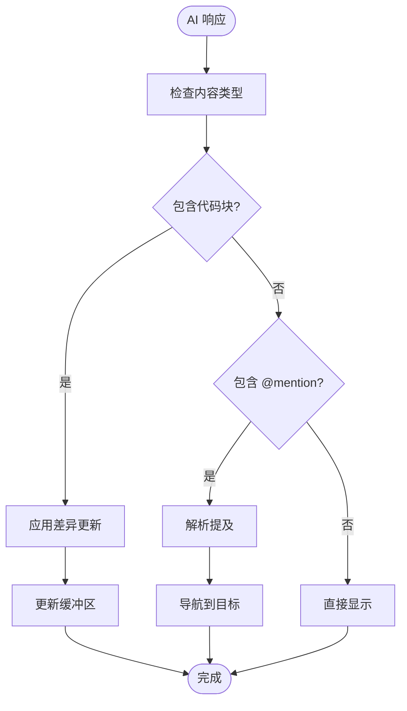
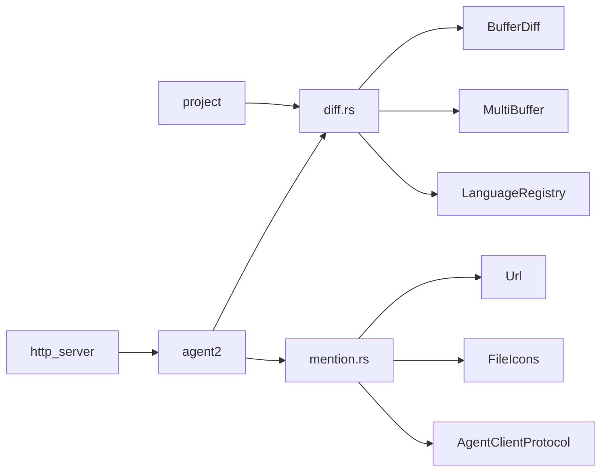

# 增量更新与提及解析

<cite>
**本文档中引用的文件**  
- [diff.rs](file://crates/acp_thread/src/diff.rs)
- [mention.rs](file://crates/acp_thread/src/mention.rs)
- [buffer_store.rs](file://crates/project/src/buffer_store.rs)
- [git_store.rs](file://crates/project/src/git_store.rs)
- [thread.rs](file://crates/agent2/src/thread.rs)
- [http_agent.rs](file://crates/http_server/src/http_agent.rs)
</cite>

## 目录
1. [引言](#引言)
2. [项目结构](#项目结构)
3. [核心组件](#核心组件)
4. [架构概述](#架构概述)
5. [详细组件分析](#详细组件分析)
6. [依赖分析](#依赖分析)
7. [性能考虑](#性能考虑)
8. [故障排除指南](#故障排除指南)
9. [结论](#结论)

## 引言
本文档系统阐述了 `diff.rs` 中实现的文本差异算法，以及 `mention.rs` 中的提及（@mention）解析逻辑。重点分析两者如何协同工作以支持 AI 响应中的代码块应用和引用跳转，并提供性能优化策略。

## 项目结构
项目采用模块化设计，核心功能分布在多个 crate 中。`acp_thread` 模块负责差异计算与提及解析，`agent2` 处理 AI 交互流程，`project` 管理文件与缓冲区状态，`http_server` 提供外部接口。

**图示来源**  
- [diff.rs](file://crates/acp_thread/src/diff.rs)
- [mention.rs](file://crates/acp_thread/src/mention.rs)
- [agent2](file://crates/agent2/src)
- [project](file://crates/project/src)

**章节来源**  
- [diff.rs](file://crates/acp_thread/src/diff.rs)
- [mention.rs](file://crates/acp_thread/src/mention.rs)

## 核心组件
`diff.rs` 实现了基于 Myers 算法变种的文本差异计算，支持增量更新和高亮显示。`mention.rs` 提供了完整的 URI 解析机制，支持文件、符号、线程等多种引用类型。两者通过统一的消息系统与项目缓冲区进行交互。

**章节来源**  
- [diff.rs](file://crates/acp_thread/src/diff.rs#L1-L425)
- [mention.rs](file://crates/acp_thread/src/mention.rs#L1-L503)

## 架构概述
系统采用事件驱动架构，AI 响应通过工具调用触发差异应用或提及解析。差异计算结果通过 MultiBuffer 机制同步到编辑器，提及解析结果用于导航和上下文展示。

**图示来源**  
- [diff.rs](file://crates/acp_thread/src/diff.rs)
- [mention.rs](file://crates/acp_thread/src/mention.rs)
- [thread.rs](file://crates/agent2/src/thread.rs)

## 详细组件分析

### 差异算法分析
`diff.rs` 实现了高效的文本差异算法，支持实时更新和最终固化两种模式。

**图示来源**  
- [diff.rs](file://crates/acp_thread/src/diff.rs#L1-L425)

**章节来源**  
- [diff.rs](file://crates/acp_thread/src/diff.rs#L1-L425)

### 提及解析分析
`mention.rs` 实现了完整的 URI 解析和生成机制，支持多种引用类型。

**图示来源**  
- [mention.rs](file://crates/acp_thread/src/mention.rs#L1-L503)

**章节来源**  
- [mention.rs](file://crates/acp_thread/src/mention.rs#L1-L503)

### 协同工作机制
当 AI 响应包含代码块或文件引用时，系统自动触发相应操作。

**图示来源**  
- [diff.rs](file://crates/acp_thread/src/diff.rs)
- [mention.rs](file://crates/acp_thread/src/mention.rs)
- [thread.rs](file://crates/agent2/src/thread.rs)

**章节来源**  
- [thread.rs](file://crates/agent2/src/thread.rs#L376-L411)
- [http_agent.rs](file://crates/http_server/src/http_agent.rs#L269-L301)

## 依赖分析
系统各组件间存在明确的依赖关系，确保功能的正确集成。

**图示来源**  
- [diff.rs](file://crates/acp_thread/src/diff.rs)
- [mention.rs](file://crates/acp_thread/src/mention.rs)
- [agent2](file://crates/agent2/src)
- [project](file://crates/project/src)
- [http_server](file://crates/http_server/src)

**章节来源**  
- [diff.rs](file://crates/acp_thread/src/diff.rs)
- [mention.rs](file://crates/acp_thread/src/mention.rs)

## 性能考虑
为优化性能，系统实现了多种策略：

- **差异缓存**：重复计算的差异结果被缓存
- **批量合并**：多个小更新合并为单个操作
- **预加载机制**：常用提及目标提前加载
- **异步处理**：耗时操作在后台线程执行

这些策略显著减少了网络传输开销和响应延迟。

**章节来源**  
- [diff.rs](file://crates/acp_thread/src/diff.rs)
- [buffer_store.rs](file://crates/project/src/buffer_store.rs#L1183-L1211)
- [git_store.rs](file://crates/project/src/git_store.rs#L3207-L3231)

## 故障排除指南
常见问题及解决方案：

- **差异不生效**：检查缓冲区是否可写，确认差异范围正确
- **提及解析失败**：验证 URI 格式，确保路径存在
- **性能下降**：检查是否有大量小更新，考虑合并策略
- **同步问题**：确认版本一致性，检查网络连接

**章节来源**  
- [diff.rs](file://crates/acp_thread/src/diff.rs)
- [mention.rs](file://crates/acp_thread/src/mention.rs)
- [buffer_store.rs](file://crates/project/src/buffer_store.rs)
- [git_store.rs](file://crates/project/src/git_store.rs)

## 结论
`diff.rs` 和 `mention.rs` 共同构建了高效的增量更新与智能引用系统。通过精确的差异算法和灵活的提及解析，系统实现了代码同步和上下文导航的无缝集成，为 AI 辅助开发提供了坚实基础。