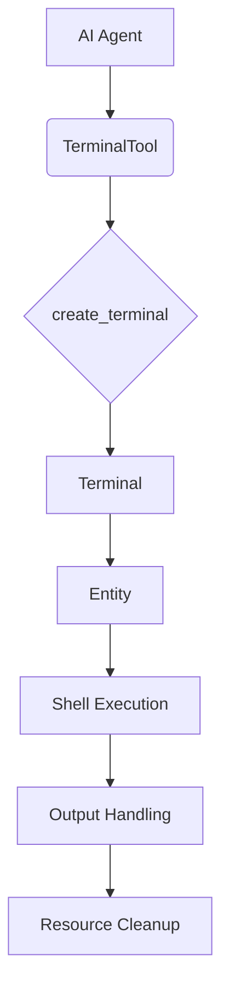
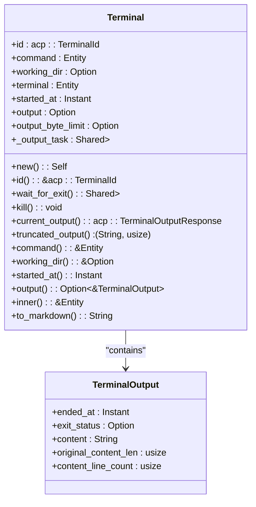
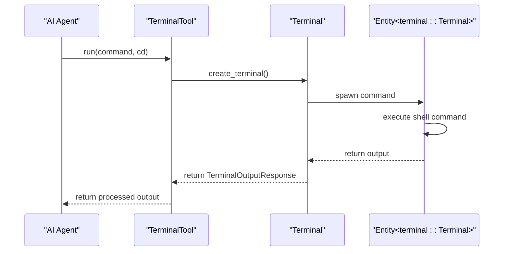
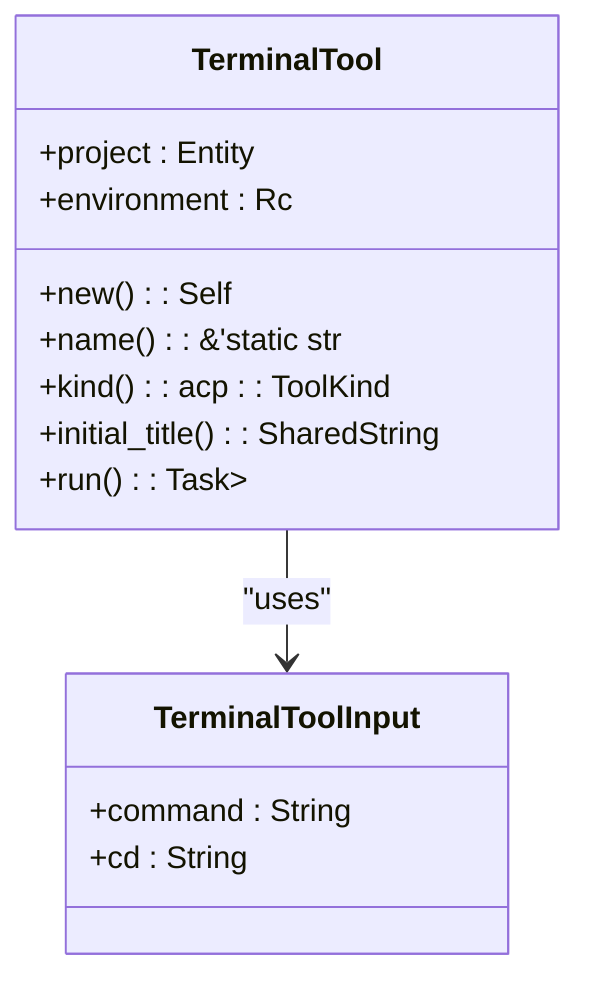
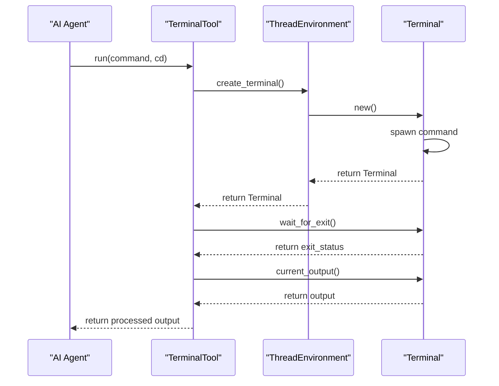
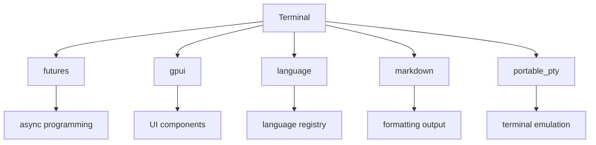

# 终端I/O处理与交互模拟

<cite>
**本文档引用的文件**  
- [terminal.rs](file://crates/acp_thread/src/terminal.rs)
- [terminal_tool.rs](file://crates/agent2/src/tools/terminal_tool.rs)
- [terminals.rs](file://crates/project/src/terminals.rs)
</cite>

## 目录
1. [引言](#引言)
2. [项目结构](#项目结构)
3. [核心组件](#核心组件)
4. [架构概述](#架构概述)
5. [详细组件分析](#详细组件分析)
6. [依赖分析](#依赖分析)
7. [性能考虑](#性能考虑)
8. [故障排除指南](#故障排除指南)
9. [结论](#结论)

## 引言
本文档全面记录了 `terminal.rs` 中实现的虚拟终端环境，重点说明如何通过模拟标准输入输出流来支持AI代理执行shell命令和交互式程序。文档详细描述了终端缓冲区管理、命令执行上下文隔离、输出流分块传输机制，以及ANSI转义序列处理、TTY样式保留和分页输出截断策略。此外，结合代码示例展示了终端会话的启动流程、信号传递（如SIGINT）模拟和资源限制（超时、内存）控制，并讨论了安全性考虑，如沙箱隔离与命令白名单机制。

## 项目结构
项目结构清晰地划分为多个crates，每个crate负责不同的功能模块。`acp_thread` crate中的`terminal.rs`文件负责终端的核心实现，`agent2` crate中的`terminal_tool.rs`文件提供了AI代理与终端交互的工具接口，而`project` crate中的`terminals.rs`文件则管理项目级别的终端实例和配置。

**Section sources**
- [terminal.rs](file://crates/acp_thread/src/terminal.rs#L1-L172)
- [terminal_tool.rs](file://crates/agent2/src/tools/terminal_tool.rs#L1-L213)
- [terminals.rs](file://crates/project/src/terminals.rs#L1-L594)

## 核心组件
核心组件包括`Terminal`结构体，它封装了终端会话的所有状态和行为，以及`TerminalTool`结构体，它作为AI代理调用终端命令的接口。这些组件共同实现了终端环境的创建、管理和交互。

**Section sources**
- [terminal.rs](file://crates/acp_thread/src/terminal.rs#L1-L172)
- [terminal_tool.rs](file://crates/agent2/src/tools/terminal_tool.rs#L1-L213)

## 架构概述
系统架构围绕终端会话的生命周期管理展开，从创建终端实例到执行命令，再到处理输出和资源清理。`Terminal`结构体通过`Entity<terminal::Terminal>`与底层终端实现交互，而`TerminalTool`则通过`ThreadEnvironment`接口创建和管理终端实例。

**Diagram sources**
- [terminal.rs](file://crates/acp_thread/src/terminal.rs#L1-L172)
- [terminal_tool.rs](file://crates/agent2/src/tools/terminal_tool.rs#L1-L213)

## 详细组件分析

### Terminal 结构体分析
`Terminal`结构体是虚拟终端环境的核心，它管理终端会话的整个生命周期，包括命令执行、输出捕获和资源清理。

#### 类图

**Diagram sources**
- [terminal.rs](file://crates/acp_thread/src/terminal.rs#L1-L172)

#### 序列图

**Diagram sources**
- [terminal.rs](file://crates/acp_thread/src/terminal.rs#L1-L172)
- [terminal_tool.rs](file://crates/agent2/src/tools/terminal_tool.rs#L1-L213)

### TerminalTool 结构体分析
`TerminalTool`结构体是AI代理与终端交互的接口，它负责创建终端实例、执行命令并处理输出。

#### 类图

**Diagram sources**
- [terminal_tool.rs](file://crates/agent2/src/tools/terminal_tool.rs#L1-L213)

#### 序列图

**Diagram sources**
- [terminal_tool.rs](file://crates/agent2/src/tools/terminal_tool.rs#L1-L213)

## 依赖分析
系统依赖于多个外部库和内部模块，包括`futures`用于异步编程，`gpui`用于UI组件管理，`language`用于语言注册，`markdown`用于格式化输出，以及`portable_pty`用于终端模拟。

**Diagram sources**
- [terminal.rs](file://crates/acp_thread/src/terminal.rs#L1-L172)

## 性能考虑
在设计和实现终端环境时，需要考虑性能因素，如输出流的分块传输、资源限制（超时、内存）控制，以及ANSI转义序列的高效处理。通过合理设置输出字节限制和使用异步任务，可以有效管理资源并提高响应速度。

## 故障排除指南
在使用终端环境时，可能会遇到各种问题，如命令执行失败、输出截断或资源耗尽。通过检查`TerminalOutput`中的`exit_status`和`truncated`字段，可以快速定位问题原因。此外，确保工作目录正确设置，并遵循命令白名单机制，可以避免大多数常见问题。

**Section sources**
- [terminal.rs](file://crates/acp_thread/src/terminal.rs#L1-L172)
- [terminal_tool.rs](file://crates/agent2/src/tools/terminal_tool.rs#L1-L213)

## 结论
本文档详细记录了`terminal.rs`中实现的虚拟终端环境，涵盖了从核心组件到架构设计的各个方面。通过模拟标准输入输出流，支持AI代理执行shell命令和交互式程序，同时确保了安全性、性能和可维护性。未来的工作可以进一步优化资源管理和错误处理机制，以提供更稳定和高效的终端体验。