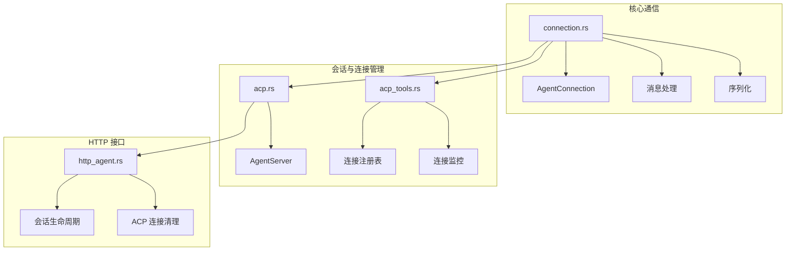
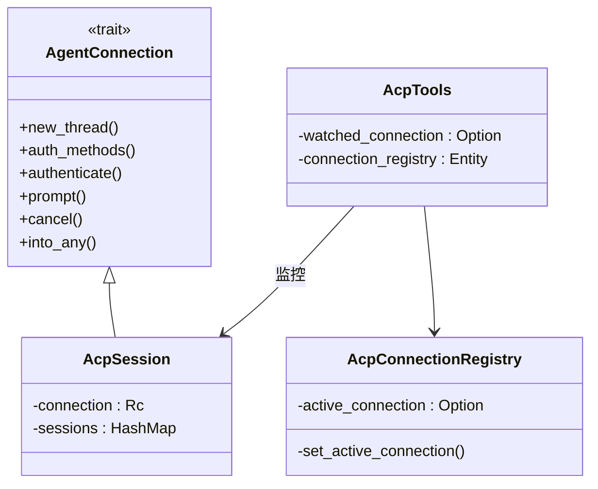
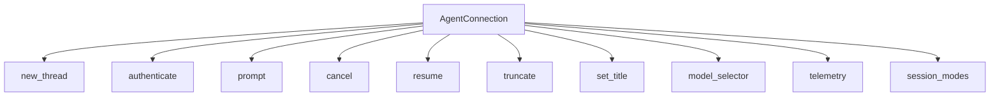
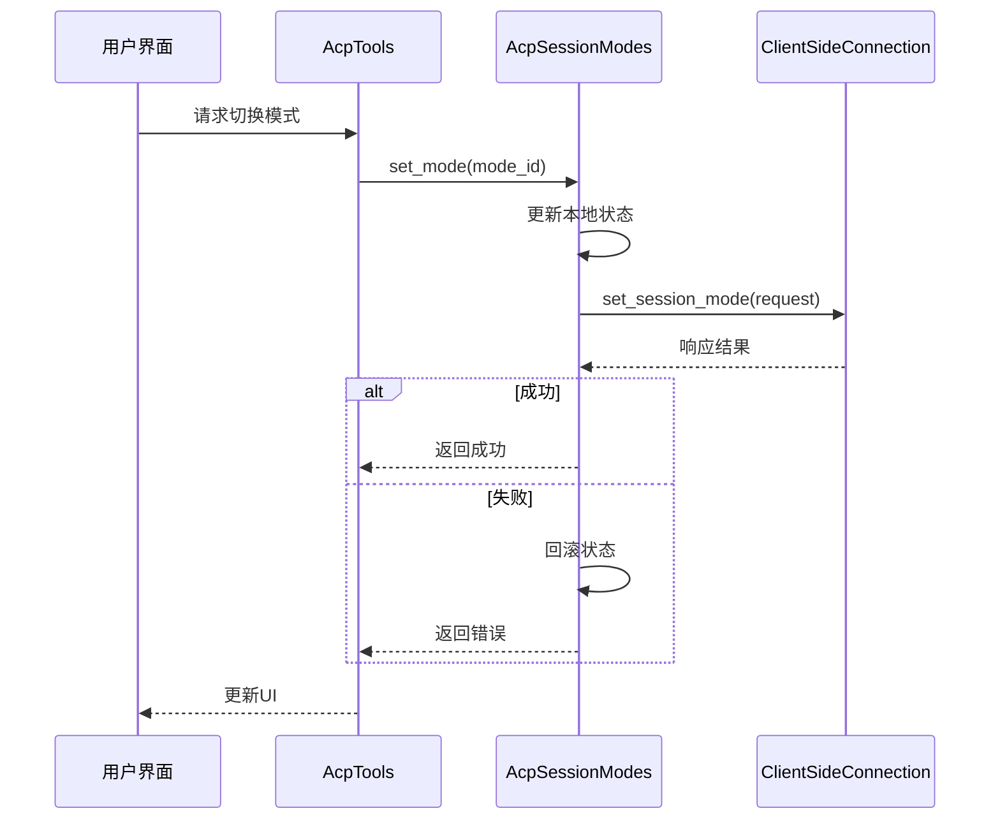
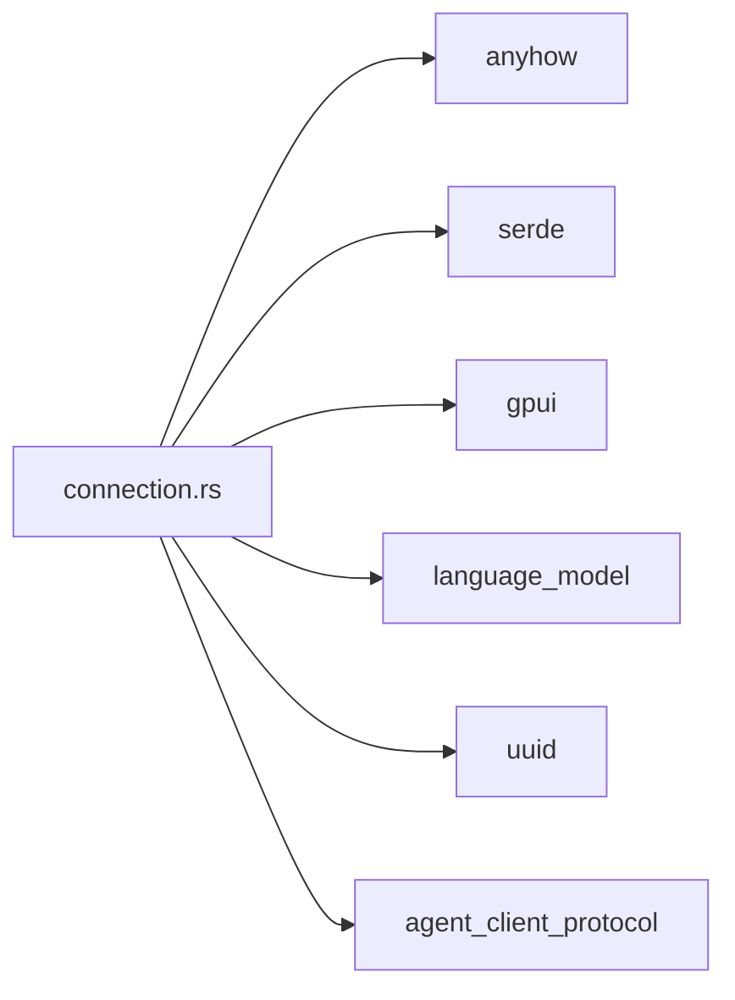

# 连接协议与通信机制

<cite>
**本文档中引用的文件**  
- [connection.rs](file://crates/acp_thread/src/connection.rs)
- [acp.rs](file://crates/agent_servers/src/acp.rs)
- [http_agent.rs](file://crates/http_server/src/http_agent.rs)
- [acp_tools.rs](file://crates/acp_tools/src/acp_tools.rs)
</cite>

## 目录
1. [引言](#引言)
2. [项目结构](#项目结构)
3. [核心组件](#核心组件)
4. [架构概述](#架构概述)
5. [详细组件分析](#详细组件分析)
6. [依赖分析](#依赖分析)
7. [性能考虑](#性能考虑)
8. [故障排除指南](#故障排除指南)
9. [结论](#结论)

## 引言
本文档详细描述了 `connection.rs` 中实现的 ACP（Agent Client Protocol）通信协议栈，重点分析了基于 WebSocket 的双向消息通道、消息帧格式、序列化机制、连接管理策略以及错误处理机制。同时，结合相关模块分析了连接状态监控、会话管理与多会话复用机制。

## 项目结构
ACP 协议栈主要分布在 `crates` 目录下的多个模块中，核心通信逻辑位于 `acp_thread` 模块的 `connection.rs` 文件中，而会话管理与连接协调则由 `agent_servers` 和 `acp_tools` 模块共同实现。

**Diagram sources**  
- [connection.rs](file://crates/acp_thread/src/connection.rs)
- [acp.rs](file://crates/agent_servers/src/acp.rs)
- [acp_tools.rs](file://crates/acp_tools/src/acp_tools.rs)
- [http_agent.rs](file://crates/http_server/src/http_agent.rs)

**Section sources**  
- [connection.rs](file://crates/acp_thread/src/connection.rs)
- [acp.rs](file://crates/agent_servers/src/acp.rs)

## 核心组件
`connection.rs` 定义了 `AgentConnection` trait，作为 ACP 通信的核心抽象。该 trait 提供了创建新会话、身份验证、发送提示、取消会话等关键方法。`UserMessageId` 用于唯一标识用户消息，支持消息追踪与上下文管理。

**Section sources**  
- [connection.rs](file://crates/acp_thread/src/connection.rs#L1-L50)

## 架构概述
ACP 通信协议栈采用分层架构，`AgentConnection` 作为顶层接口，由具体的服务器实现（如 `AcpSession`）提供具体功能。连接通过 `AcpConnectionRegistry` 进行全局注册与管理，允许工具（如 `AcpTools`）监控和调试通信过程。

**Diagram sources**  
- [connection.rs](file://crates/acp_thread/src/connection.rs#L25-L100)
- [acp.rs](file://crates/agent_servers/src/acp.rs#L416-L461)
- [acp_tools.rs](file://crates/acp_tools/src/acp_tools.rs#L47-L94)

## 详细组件分析

### AgentConnection 接口分析
`AgentConnection` 是 ACP 通信的核心接口，定义了客户端与代理服务器交互的所有方法。它通过 `Rc<dyn Any>` 支持运行时类型转换，允许在不同上下文中使用具体实现。

#### 接口方法

**Diagram sources**  
- [connection.rs](file://crates/acp_thread/src/connection.rs#L25-L100)

**Section sources**  
- [connection.rs](file://crates/acp_thread/src/connection.rs#L25-L100)

### 会话模式管理
`AgentSessionModes` trait 提供了会话模式的查询与切换功能。`AcpSessionModes` 实现了该 trait，通过 `ClientSideConnection` 与后端通信，确保模式变更的原子性。

#### 模式切换流程

**Diagram sources**  
- [acp.rs](file://crates/agent_servers/src/acp.rs#L463-L505)

**Section sources**  
- [acp.rs](file://crates/agent_servers/src/acp.rs#L463-L505)

### 连接注册与监控
`AcpConnectionRegistry` 负责管理当前活动的 ACP 连接，`AcpTools` 通过注册表获取连接实例并进行监控。`WatchedConnection` 记录了连接的请求/响应方法映射，用于调试。

#### 连接监控流程

**Diagram sources**  
- [acp_tools.rs](file://crates/acp_tools/src/acp_tools.rs#L47-L94)
- [acp_tools.rs](file://crates/acp_tools/src/acp_tools.rs#L162-L184)

**Section sources**  
- [acp_tools.rs](file://crates/acp_tools/src/acp_tools.rs#L47-L184)

## 依赖分析
ACP 通信栈依赖于多个外部 crate，包括 `anyhow` 用于错误处理，`serde` 用于序列化，`gpui` 作为 UI 框架，`language_model` 用于模型信息，`uuid` 用于生成唯一标识符。

**Diagram sources**  
- [connection.rs](file://crates/acp_thread/src/connection.rs#L1-L10)

**Section sources**  
- [connection.rs](file://crates/acp_thread/src/connection.rs#L1-L10)

## 性能考虑
会话上下文管理在 `http_agent.rs` 中实现了简单的清理策略，当上下文大小超过限制时，会保留最近的 10 条消息以控制内存使用。更复杂的策略（如删除最旧消息、压缩内容）可在此基础上扩展。

## 故障排除指南
- **连接失败**：检查 `auth_methods` 和 `authenticate` 方法的实现，确保身份验证流程正确。
- **会话取消失败**：确认 `cancel` 方法正确调用了底层连接的取消通知。
- **模式切换异常**：检查 `set_mode` 的原子性实现，确保网络失败时能正确回滚状态。
- **消息丢失**：验证 `WatchedConnection` 中的 `incoming_request_methods` 和 `outgoing_request_methods` 映射是否正确更新。

**Section sources**  
- [http_agent.rs](file://crates/http_server/src/http_agent.rs#L397-L431)
- [acp.rs](file://crates/agent_servers/src/acp.rs#L416-L461)

## 结论
`connection.rs` 实现的 ACP 通信协议栈提供了一个健壮、可扩展的客户端-代理通信框架。通过清晰的 trait 定义和模块化设计，支持身份验证、会话管理、模式切换等核心功能。结合 `acp_tools` 的监控能力，为开发和调试提供了有力支持。未来可进一步优化会话上下文管理和错误恢复机制。