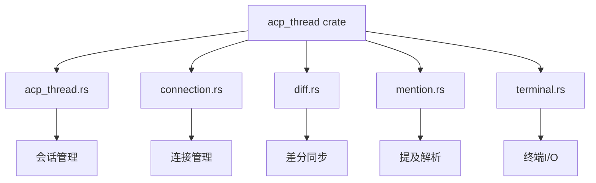
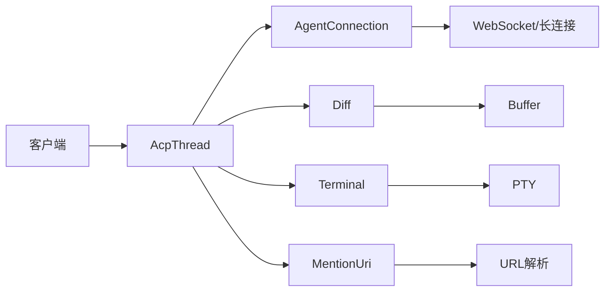
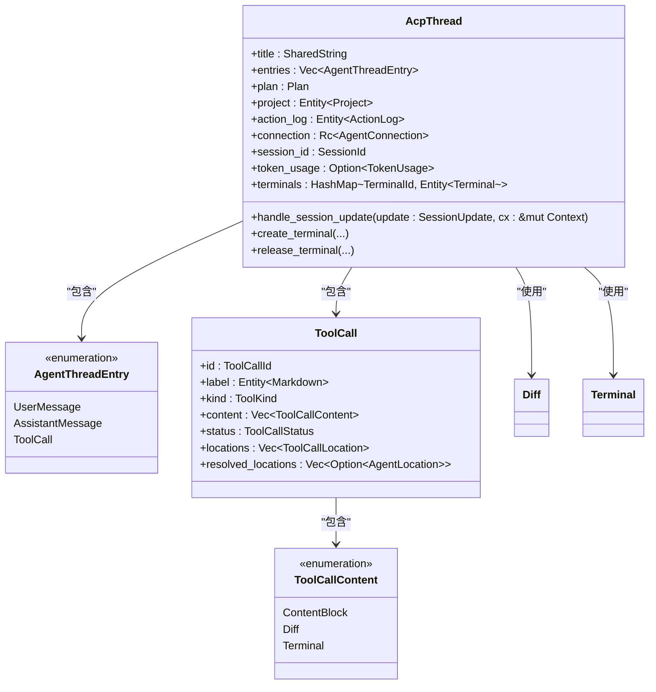
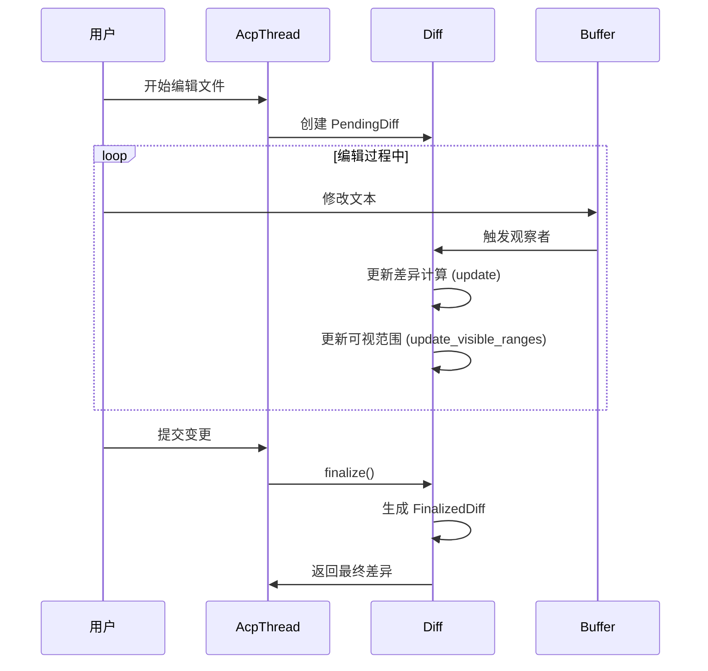
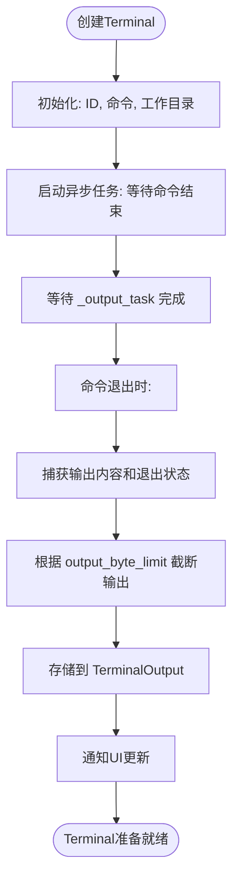
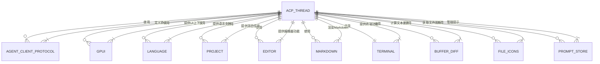

# ACP协议实现

<cite>
**本文档引用的文件**  
- [acp_thread.rs](file://crates/acp_thread/src/acp_thread.rs)
- [connection.rs](file://crates/acp_thread/src/connection.rs)
- [diff.rs](file://crates/acp_thread/src/diff.rs)
- [mention.rs](file://crates/acp_thread/src/mention.rs)
- [terminal.rs](file://crates/acp_thread/src/terminal.rs)
</cite>

## 目录
1. [简介](#简介)
2. [项目结构](#项目结构)
3. [核心组件](#核心组件)
4. [架构概述](#架构概述)
5. [详细组件分析](#详细组件分析)
6. [依赖分析](#依赖分析)
7. [性能考虑](#性能考虑)
8. [故障排除指南](#故障排除指南)
9. [结论](#结论)

## 简介
ACP（Agent Client Protocol）协议是客户端与AI代理之间进行双向通信的核心机制。`acp_thread` crate 实现了该协议的具体会话管理功能，支持实时协作编辑场景下的消息传递、差分同步、终端I/O处理和提及解析等关键功能。本文档深入分析其实现细节，涵盖消息帧格式、连接稳定性维护、错误恢复机制等设计要点。

## 项目结构
`acp_thread` crate 是 ACP 协议的核心实现模块，位于 `crates/acp_thread` 目录下。其源码结构清晰地划分了不同功能模块：



**图示来源**  
- [acp_thread.rs](file://crates/acp_thread/src/acp_thread.rs)
- [connection.rs](file://crates/acp_thread/src/connection.rs)
- [diff.rs](file://crates/acp_thread/src/diff.rs)
- [mention.rs](file://crates/acp_thread/src/mention.rs)
- [terminal.rs](file://crates/acp_thread/src/terminal.rs)

**本节来源**  
- [acp_thread.rs](file://crates/acp_thread/src/acp_thread.rs)
- [Cargo.toml](file://crates/acp_thread/Cargo.toml)

## 核心组件
`acp_thread` crate 的核心功能围绕 `AcpThread` 结构体展开，它管理着客户端与AI代理之间的完整会话生命周期。主要组件包括消息条目（`AgentThreadEntry`）、工具调用（`ToolCall`）、差分同步（`Diff`）、终端处理（`Terminal`）和提及解析（`MentionUri`）。这些组件协同工作，实现了复杂的实时交互逻辑。

**本节来源**  
- [acp_thread.rs](file://crates/acp_thread/src/acp_thread.rs#L0-L799)
- [diff.rs](file://crates/acp_thread/src/diff.rs#L0-L424)
- [terminal.rs](file://crates/acp_thread/src/terminal.rs#L0-L172)

## 架构概述
`acp_thread` crate 采用模块化设计，各组件职责分明，通过清晰的接口进行交互。`AcpThread` 作为核心协调者，依赖 `AgentConnection` trait 与底层传输层（如WebSocket）进行通信。`Diff`、`Terminal` 和 `MentionUri` 等模块则专注于特定领域的数据处理和状态管理。



**图示来源**  
- [acp_thread.rs](file://crates/acp_thread/src/acp_thread.rs#L0-L799)
- [connection.rs](file://crates/acp_thread/src/connection.rs#L0-L481)

## 详细组件分析

### 消息与会话管理分析
`AcpThread` 结构体是整个会话的中枢，它维护了消息条目列表、计划条目、项目引用、动作日志以及与代理的连接。它通过 `AgentConnection` trait 与外部世界通信，处理来自AI代理的更新，并将用户输入转发给代理。



**图示来源**  
- [acp_thread.rs](file://crates/acp_thread/src/acp_thread.rs#L0-L799)

**本节来源**  
- [acp_thread.rs](file://crates/acp_thread/src/acp_thread.rs#L0-L799)

### 差分同步机制分析
`diff` 模块负责处理文件内容的增量更新。它通过 `Diff` 枚举区分“待定”（Pending）和“已定稿”（Finalized）两种状态。`PendingDiff` 在用户编辑时动态更新差异高亮，而 `FinalizedDiff` 则用于展示最终确定的变更。



**图示来源**  
- [diff.rs](file://crates/acp_thread/src/diff.rs#L0-L424)

**本节来源**  
- [diff.rs](file://crates/acp_thread/src/diff.rs#L0-L424)

### 终端I/O处理分析
`terminal` 模块封装了对终端会话的管理。`Terminal` 结构体包装了一个底层的 `terminal::Terminal` 实例，并通过异步任务监控命令的执行状态。它支持输出截断，防止过长的输出影响性能。



**图示来源**  
- [terminal.rs](file://crates/acp_thread/src/terminal.rs#L0-L172)

**本节来源**  
- [terminal.rs](file://crates/acp_thread/src/terminal.rs#L0-L172)

### 提及解析功能分析
`mention` 模块实现了对特殊链接（Mention）的解析和生成。`MentionUri` 枚举定义了多种提及类型，如文件、目录、符号、线程等。它通过解析 `zed://` 或 `file://` 等URL方案，将用户输入中的 `@` 引用转换为结构化的数据。

```mermaid
stateDiagram-v2
[*] --> ParseInput
ParseInput --> CheckScheme
CheckScheme --> |file : //| ParseFile
CheckScheme --> |zed : //| ParseZed
CheckScheme --> |http(s) : //| ParseFetch
CheckScheme --> |其他| Error
ParseFile --> HasFragment
HasFragment --> |是| ParseLineRange
ParseLineRange --> HasSymbol
HasSymbol --> |是| CreateSymbolMention
HasSymbol --> |否| CreateSelectionMention
HasFragment --> |否| IsDirectory
IsDirectory --> |是| CreateDirectoryMention
IsDirectory --> |否| CreateFileMention
ParseZed --> MatchPath
MatchPath --> |/agent/thread/| CreateThreadMention
MatchPath --> |/agent/text-thread/| CreateTextThreadMention
MatchPath --> |/agent/rule/| CreateRuleMention
MatchPath --> |/agent/pasted-image| CreatePastedImageMention
MatchPath --> |/agent/untitled-buffer| CreateSelectionMention
MatchPath --> |其他| Error
ParseFetch --> CreateFetchMention
CreateSymbolMention --> [*]
CreateSelectionMention --> [*]
CreateDirectoryMention --> [*]
CreateFileMention --> [*]
CreateThreadMention --> [*]
CreateTextThreadMention --> [*]
CreateRuleMention --> [*]
CreatePastedImageMention --> [*]
CreateFetchMention --> [*]
Error --> [*]
```

**图示来源**  
- [mention.rs](file://crates/acp_thread/src/mention.rs#L0-L502)

**本节来源**  
- [mention.rs](file://crates/acp_thread/src/mention.rs#L0-L502)

## 依赖分析
`acp_thread` crate 依赖于多个内部和外部库，形成了一个复杂的依赖网络。



**图示来源**  
- [Cargo.toml](file://crates/acp_thread/Cargo.toml)
- [acp_thread.rs](file://crates/acp_thread/src/acp_thread.rs)

**本节来源**  
- [Cargo.toml](file://crates/acp_thread/Cargo.toml)
- [acp_thread.rs](file://crates/acp_thread/src/acp_thread.rs)

## 性能考虑
`acp_thread` crate 在设计时考虑了多项性能优化：
1.  **增量更新**：`Diff` 模块的 `PendingDiff` 状态允许在用户编辑时进行高效的增量差异计算，避免了全量重算。
2.  **输出截断**：`Terminal` 模块支持 `output_byte_limit`，可以防止过长的命令输出导致内存占用过高或UI卡顿。
3.  **异步处理**：所有耗时操作（如差异计算、终端命令执行）都通过 `Task` 在后台异步执行，确保UI的响应性。
4.  **资源复用**：`ToolCall` 的 `update_fields` 方法会尝试复用现有的 `content` 条目，减少不必要的对象创建和销毁。

## 故障排除指南
在使用 `acp_thread` 时可能遇到的常见问题及解决方法：

**连接中断**
- **现象**：WebSocket连接意外断开。
- **原因**：网络不稳定或代理服务崩溃。
- **解决**：`AgentConnection` trait 的实现应包含重连逻辑。检查 `connection.rs` 中的 `cancel` 和错误处理方法。

**终端命令卡死**
- **现象**：`Terminal` 的 `_output_task` 长时间不完成。
- **原因**：执行的命令进入无限循环或等待用户输入。
- **解决**：调用 `Terminal::kill` 方法强制终止底层进程。确保代理在发送长时间运行的命令前获得用户确认。

**提及解析失败**
- **现象**：`MentionUri::parse` 返回错误。
- **原因**：输入的URL格式不正确，例如行号不是1-based或缺少必要的查询参数。
- **解决**：参考 `mention.rs` 中的单元测试，确保URL符合规范。检查 `single_query_param` 函数的限制。

**本节来源**  
- [connection.rs](file://crates/acp_thread/src/connection.rs#L0-L481)
- [terminal.rs](file://crates/acp_thread/src/terminal.rs#L0-L172)
- [mention.rs](file://crates/acp_thread/src/mention.rs#L0-L502)

## 结论
`acp_thread` crate 成功实现了一个功能完备的ACP协议客户端会话管理器。其模块化设计使得代码结构清晰，易于维护和扩展。通过 `Diff`、`Terminal` 和 `MentionUri` 等模块，它为实时协作编辑场景提供了强大的支持。未来可以进一步优化错误恢复机制和连接稳定性，以提升用户体验。