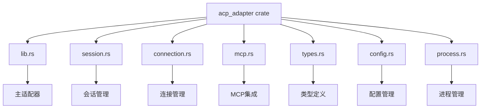
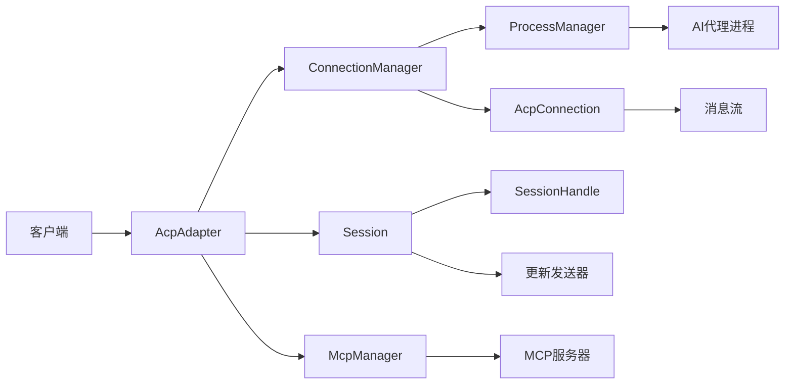
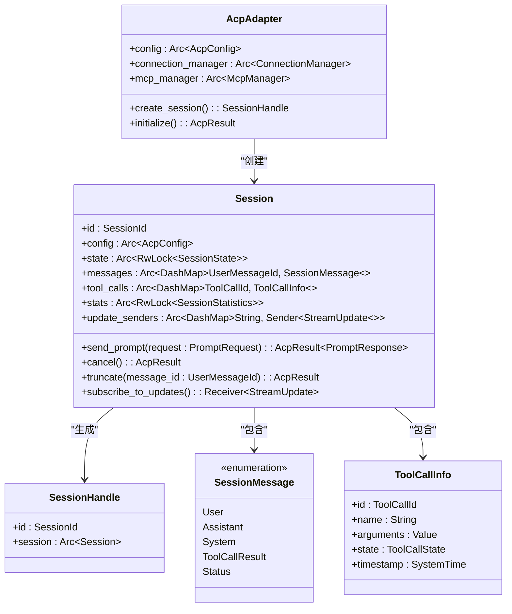
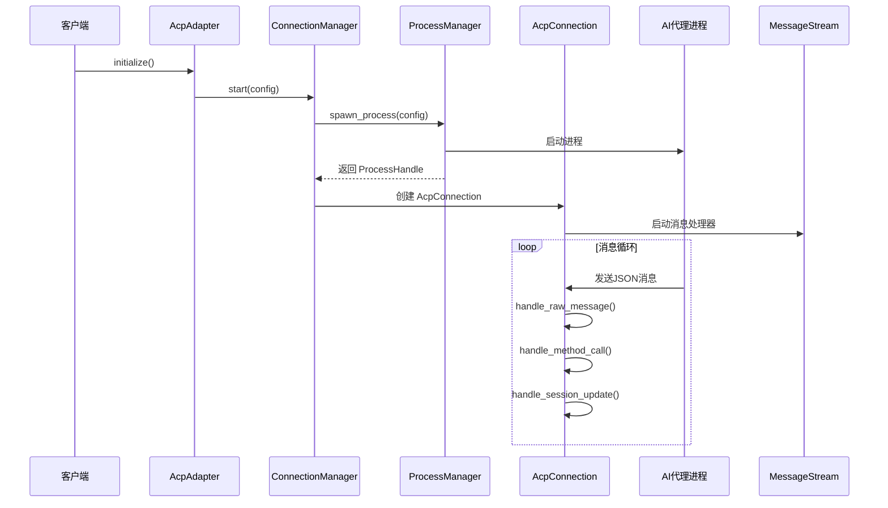
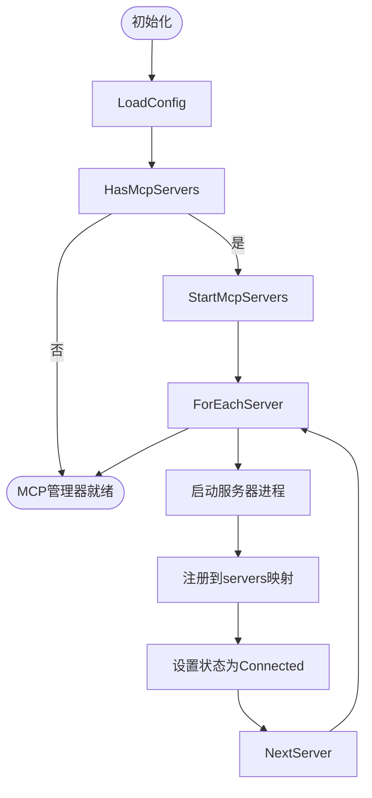
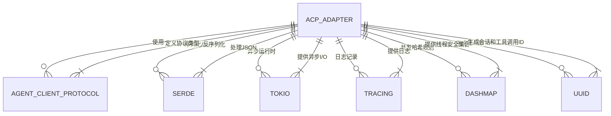

# ACP协议实现

<cite>
**本文档引用的文件**  
- [lib.rs](file://crates/acp_adapter/src/lib.rs) - *新增的ACP适配器核心实现*
- [session.rs](file://crates/acp_adapter/src/session.rs) - *会话管理功能实现*
- [connection.rs](file://crates/acp_adapter/src/connection.rs) - *连接管理功能实现*
- [mcp.rs](file://crates/acp_adapter/src/mcp.rs) - *MCP集成实现*
- [types.rs](file://crates/acp_adapter/src/types.rs) - *类型定义*
- [config.rs](file://crates/acp_adapter/src/config.rs) - *配置管理*
- [process.rs](file://crates/acp_adapter/src/process.rs) - *进程管理*
</cite>

## 更新摘要
**变更内容**   
- 根据代码变更，将文档重点从已废弃的 `acp_thread` 模块转移到新引入的 `acp_adapter` crate
- 新增 `acp_adapter` crate 的架构和核心组件分析
- 更新项目结构和依赖关系说明
- 移除关于 `acp_thread`、`diff`、`terminal`、`mention` 等已删除模块的过时内容
- 添加新的序列图展示 `acp_adapter` 的核心工作流程

## 目录
1. [简介](#简介)
2. [项目结构](#项目结构)
3. [核心组件](#核心组件)
4. [架构概述](#架构概述)
5. [详细组件分析](#详细组件分析)
6. [依赖分析](#依赖分析)
7. [性能考虑](#性能考虑)
8. [故障排除指南](#故障排除指南)
9. [结论](#结论)

## 简介
ACP（Agent Client Protocol）协议是客户端与AI代理之间进行双向通信的核心机制。根据最新的代码变更，`acp_adapter` crate 已成为ACP协议的核心实现模块，取代了旧的 `acp_thread` 模块。`acp_adapter` 提供了连接管理、会话生命周期、消息处理和MCP（Model Context Protocol）集成等核心功能。本文档深入分析 `acp_adapter` 的实现细节，涵盖其模块化设计、会话管理、连接稳定性维护和错误处理机制。

## 项目结构
`acp_adapter` crate 是 ACP 协议的新核心实现模块，位于 `crates/acp_adapter` 目录下。其源码结构清晰地划分了不同功能模块：

**图示来源**  
- [lib.rs](file://crates/acp_adapter/src/lib.rs)
- [session.rs](file://crates/acp_adapter/src/session.rs)
- [connection.rs](file://crates/acp_adapter/src/connection.rs)
- [mcp.rs](file://crates/acp_adapter/src/mcp.rs)
- [types.rs](file://crates/acp_adapter/src/types.rs)
- [config.rs](file://crates/acp_adapter/src/config.rs)
- [process.rs](file://crates/acp_adapter/src/process.rs)

**本节来源**  
- [lib.rs](file://crates/acp_adapter/src/lib.rs)
- [Cargo.toml](file://crates/acp_adapter/Cargo.toml)

## 核心组件
`acp_adapter` crate 的核心功能围绕 `AcpAdapter` 结构体展开，它作为主协调者，管理着与AI代理的通信会话。主要组件包括 `Session`（会话管理）、`AcpConnection`（连接管理）、`McpManager`（MCP集成）和 `ProcessManager`（进程管理）。这些组件协同工作，实现了从配置初始化到消息收发的完整通信流程。

**本节来源**  
- [lib.rs](file://crates/acp_adapter/src/lib.rs#L85-L91)
- [session.rs](file://crates/acp_adapter/src/session.rs#L0-L685)
- [connection.rs](file://crates/acp_adapter/src/connection.rs#L20-L30)
- [mcp.rs](file://crates/acp_adapter/src/mcp.rs#L0-L226)

## 架构概述
`acp_adapter` crate 采用分层的模块化设计，各组件职责分明。`AcpAdapter` 作为顶层入口，聚合了 `ConnectionManager` 和 `McpManager`。`ConnectionManager` 负责管理与代理进程的通信，通过 `ProcessManager` 启动和监控底层进程。`Session` 模块则管理会话状态和消息流，而 `McpManager` 负责与外部MCP服务器的集成。

**图示来源**  
- [lib.rs](file://crates/acp_adapter/src/lib.rs#L85-L91)
- [connection.rs](file://crates/acp_adapter/src/connection.rs#L20-L30)
- [session.rs](file://crates/acp_adapter/src/session.rs#L0-L685)
- [mcp.rs](file://crates/acp_adapter/src/mcp.rs#L0-L226)

## 详细组件分析

### 消息与会话管理分析
`Session` 结构体是整个会话的中枢，它维护了会话状态、消息列表、工具调用信息和统计信息。`SessionHandle` 提供了安全的异步接口，允许外部代码与会话进行交互，如发送提示、取消操作和订阅更新。

**图示来源**  
- [lib.rs](file://crates/acp_adapter/src/lib.rs#L85-L91)
- [session.rs](file://crates/acp_adapter/src/session.rs#L0-L685)

**本节来源**  
- [session.rs](file://crates/acp_adapter/src/session.rs#L0-L685)

### 连接与进程管理分析
`ConnectionManager` 负责管理与AI代理的底层连接。它通过 `ProcessManager` 启动代理进程，并创建 `AcpConnection` 来处理消息的收发。`AcpConnection` 使用 `MessageStream` 监听进程输出，并将接收到的JSON消息路由到相应的处理函数。

**图示来源**  
- [connection.rs](file://crates/acp_adapter/src/connection.rs#L20-L30)
- [process.rs](file://crates/acp_adapter/src/process.rs#L0-L429)

**本节来源**  
- [connection.rs](file://crates/acp_adapter/src/connection.rs#L20-L30)
- [process.rs](file://crates/acp_adapter/src/process.rs#L0-L429)

### MCP集成分析
`McpManager` 负责管理与MCP（Model Context Protocol）服务器的连接。它可以在初始化时启动配置的MCP服务器，并提供获取工具、资源和提示的方法。`McpAdapter` 作为适配层，将MCP工具转换为内部工具格式，供会话使用。

**图示来源**  
- [mcp.rs](file://crates/acp_adapter/src/mcp.rs#L0-L226)

**本节来源**  
- [mcp.rs](file://crates/acp_adapter/src/mcp.rs#L0-L226)

## 依赖分析
`acp_adapter` crate 依赖于多个关键库，形成了一个强大的功能组合。

**图示来源**  
- [Cargo.toml](file://crates/acp_adapter/Cargo.toml)
- [lib.rs](file://crates/acp_adapter/src/lib.rs)

**本节来源**  
- [Cargo.toml](file://crates/acp_adapter/Cargo.toml)
- [lib.rs](file://crates/acp_adapter/src/lib.rs)

## 性能考虑
`acp_adapter` crate 在设计时考虑了多项性能优化：
1.  **并发数据结构**：使用 `dashmap::DashMap` 和 `tokio::sync::RwLock` 等并发安全的数据结构，允许多个任务安全地访问会话和连接状态。
2.  **异步处理**：所有I/O操作（进程通信、文件读写）都通过 `tokio` 异步执行，确保主线程不会被阻塞。
3.  **资源复用**：`ProcessManager` 通过监控器自动重启失败的进程，提高了系统的容错性和可用性。
4.  **高效序列化**：使用 `serde_json` 进行高效的JSON序列化和反序列化，减少消息处理的开销。

## 故障排除指南
在使用 `acp_adapter` 时可能遇到的常见问题及解决方法：

**连接失败**
- **现象**：无法启动AI代理进程。
- **原因**：配置的命令不存在或权限不足。
- **解决**：检查 `AcpConfig` 中的 `process.command` 是否正确，并确保该命令在系统PATH中或提供完整路径。

**会话无响应**
- **现象**：发送提示后长时间无响应。
- **原因**：代理进程未正确处理输入或输出流。
- **解决**：检查 `AcpConnection` 的 `handle_raw_message` 方法日志，确认消息是否被正确解析。确保代理进程以 `stdio` 模式运行。

**MCP服务器未启动**
- **现象**：`McpManager::initialize` 失败。
- **原因**：MCP服务器配置错误或命令无法执行。
- **解决**：检查 `AcpConfig` 中的 `mcp_servers` 配置，确保每个服务器的 `command` 和 `args` 正确。

**本节来源**  
- [connection.rs](file://crates/acp_adapter/src/connection.rs#L20-L30)
- [process.rs](file://crates/acp_adapter/src/process.rs#L0-L429)
- [mcp.rs](file://crates/acp_adapter/src/mcp.rs#L0-L226)

## 结论
`acp_adapter` crate 成功实现了一个现代化、模块化的ACP协议客户端适配器。它取代了旧的 `acp_thread` 实现，提供了更清晰的架构和更强大的功能，包括对MCP的原生支持。其核心设计围绕 `AcpAdapter`、`Session` 和 `ConnectionManager` 展开，通过异步和并发技术确保了高性能和高响应性。未来可以进一步完善MCP集成和错误恢复机制，以提供更健壮的用户体验。