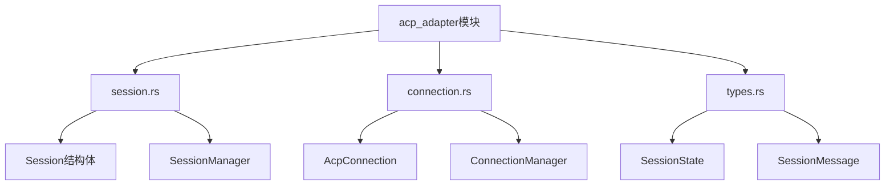
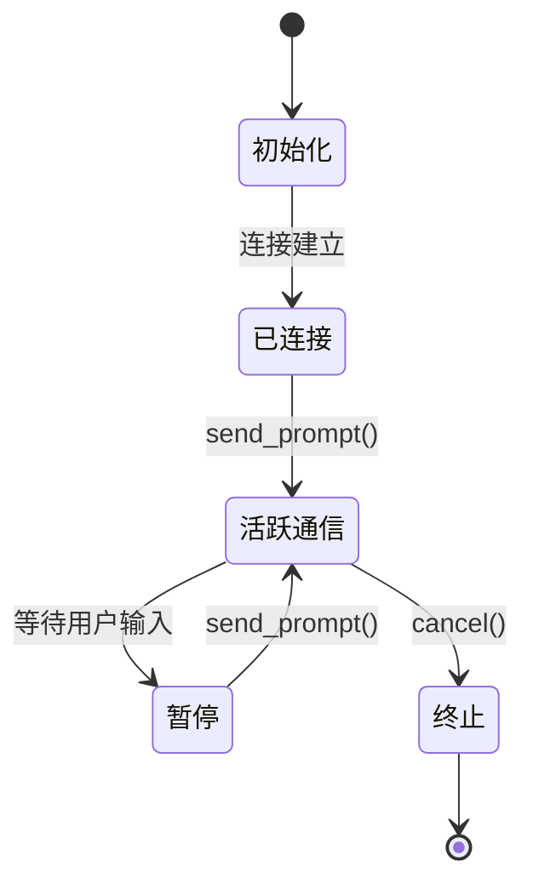
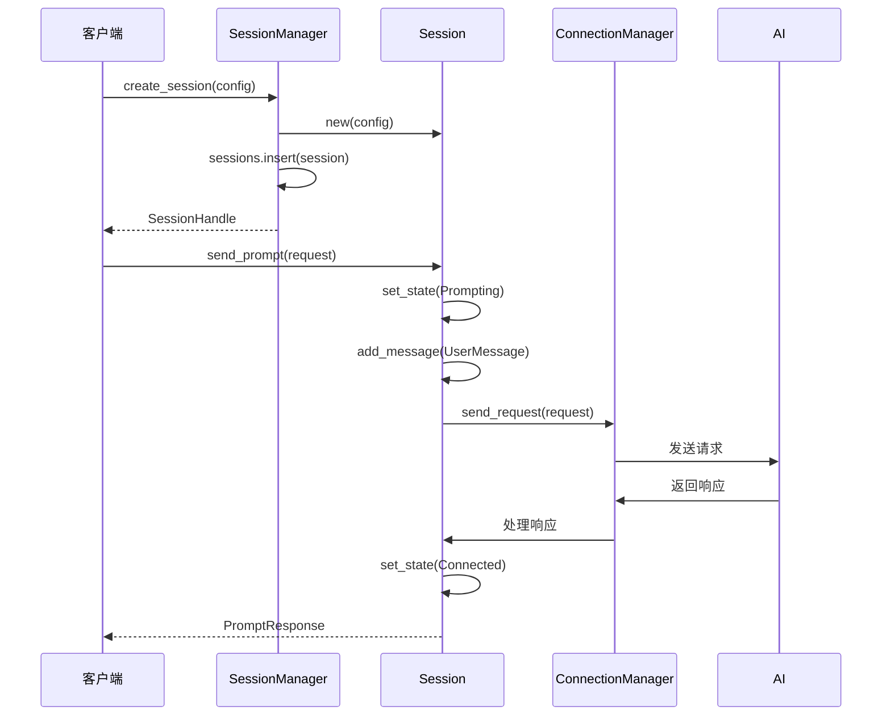
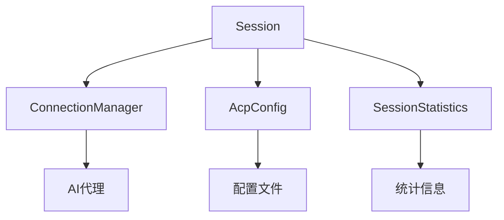

# 会话管理

<cite>
**本文档中引用的文件**  
- [session.rs](file://crates/acp_adapter/src/session.rs) - *新增的会话管理模块*
- [connection.rs](file://crates/acp_adapter/src/connection.rs) - *更新的连接管理实现*
- [types.rs](file://crates/acp_adapter/src/types.rs) - *会话相关类型定义*
- [main.rs](file://crates/rcoder/src/main.rs) - *HTTP会话API端点*
</cite>

## 更新摘要
**变更内容**   
- 新增了基于`SessionManager`的会话管理架构
- 更新了会话生命周期管理流程
- 添加了会话持久化和统计功能
- 重构了连接与会话的交互机制
- 增加了会话API端点说明

## 目录
1. [简介](#简介)
2. [项目结构](#项目结构)
3. [核心组件](#核心组件)
4. [架构概述](#架构概述)
5. [详细组件分析](#详细组件分析)
6. [依赖分析](#依赖分析)
7. [性能考虑](#性能考虑)
8. [故障排除指南](#故障排除指南)
9. [结论](#结论)

## 简介
本文档深入探讨了ACP协议中的会话管理机制，重点分析`acp_adapter`模块如何创建、维护和销毁客户端与AI代理之间的通信会话。文档详细描述了`Session`结构体的状态机设计，涵盖初始化、活跃通信、暂停和终止等状态。此外，还说明了会话上下文如何与项目系统集成，以及如何处理多客户端并发连接。结合`connection.rs`中的连接管理逻辑，阐述了心跳机制、超时检测和连接恢复策略。通过实际代码示例展示会话生命周期管理流程，并分析在高并发场景下的性能优化措施。

## 项目结构
`acp_adapter`模块位于`crates/acp_adapter/src`目录下，主要包含以下文件：
- `session.rs`：定义了`Session`和`SessionManager`结构体，负责会话的创建、维护和销毁。
- `connection.rs`：定义了`AcpConnection`和`ConnectionManager`，用于管理与AI代理的连接。
- `types.rs`：定义了会话相关的类型，包括`SessionState`、`SessionMessage`等。

**图示来源**
- [session.rs](file://crates/acp_adapter/src/session.rs#L124-L685)
- [connection.rs](file://crates/acp_adapter/src/connection.rs#L20-L558)
- [types.rs](file://crates/acp_adapter/src/types.rs#L107-L162)

**节来源**
- [session.rs](file://crates/acp_adapter/src/session.rs#L0-L685)
- [connection.rs](file://crates/acp_adapter/src/connection.rs#L0-L558)

## 核心组件
`Session`结构体是会话管理的核心，负责处理与AI代理的通信。它通过`ConnectionManager`与代理进行交互，管理会话的生命周期。`SessionManager`负责全局会话的创建、获取和销毁。

**节来源**
- [session.rs](file://crates/acp_adapter/src/session.rs#L124-L685)

## 架构概述
`acp_adapter`模块通过`Session`结构体和`ConnectionManager`实现会话管理。`Session`负责单个会话的创建、维护和销毁，而`ConnectionManager`负责与AI代理的连接管理。

```mermaid
classDiagram
class Session {
+id : SessionId
+config : Arc<AcpConfig>
+connection_manager : Arc<ConnectionManager>
+state : Arc<RwLock<SessionState>>
+messages : Arc<DashMap<UserMessageId, SessionMessage>>
+tool_calls : Arc<DashMap<ToolCallId, ToolCallInfo>>
+stats : Arc<RwLock<SessionStatistics>>
+update_senders : Arc<DashMap<String, mpsc : : Sender<StreamUpdate>>>
+permission_requests : Arc<DashMap<ToolCallId, PermissionRequest>>
+title : Arc<RwLock<Option<String>>>
+created_at : SystemTime
+new(config : Arc<AcpConfig>) Session
+handle() SessionHandle
+id() &SessionId
+state() SessionState
+set_state(new_state : SessionState)
+send_prompt(request : PromptRequest) AcpResult<PromptResponse>
+cancel() AcpResult<()>
+truncate(message_id : UserMessageId) AcpResult<()>
+set_title(title : String) AcpResult<()>
+get_messages() Vec<SessionMessage>
+get_tool_calls() Vec<ToolCallInfo>
+subscribe_to_updates() mpsc : : Receiver<StreamUpdate>
+request_permission(request : PermissionRequest) AcpResult<PermissionResponse>
+add_message(message : SessionMessage)
+add_tool_call(tool_call : ToolCallInfo)
+create_update_sender() mpsc : : Sender<StreamUpdate>
+send_update(update : StreamUpdate)
+handle_tool_call(tool_call : ToolCall) AcpResult<()>
+update_tool_call_state(tool_call_id : &ToolCallId, new_state : ToolCallState)
+get_stats() SessionStatistics
+clear_history() AcpResult<()>
+save_to_file(path : &Path) AcpResult<()>
+load_from_file(path : &Path) AcpResult<()>
}
class SessionManager {
+sessions : Arc<DashMap<SessionId, Arc<Session>>>
+new() SessionManager
+create_session(config : Arc<AcpConfig>) AcpResult<SessionHandle>
+get_session(session_id : &SessionId) Option<SessionHandle>
+remove_session(session_id : &SessionId) AcpResult<()>
+list_sessions() Vec<SessionId>
+get_all_session_stats() Vec<(SessionId, SessionStatistics)>
+shutdown() AcpResult<()>
}
class AcpConnection {
+id : String
+config : Arc<ConnectionConfig>
+process_handle : ProcessHandle
+state : Arc<RwLock<ConnectionState>>
+stats : Arc<RwLock<ConnectionStats>>
+pending_requests : Arc<DashMap<String, mpsc : : Sender<PromptResponse>>>
+session_update_tx : Option<mpsc : : Sender<SessionUpdate>>
+new(id : String, config : Arc<ConnectionConfig>, process_handle : ProcessHandle) AcpConnection
+id() &str
+state() ConnectionState
+stats() ConnectionStats
+set_session_update_tx(tx : mpsc : : Sender<SessionUpdate>)
+send_message(message : String) AcpResult<()>
+send_request(request : PromptRequest) AcpResult<PromptResponse>
+handle_raw_message(json : &str) AcpResult<()>
+handle_method_call(method : &str, params : &Value) AcpResult<()>
+handle_session_update(update_value : &Value) AcpResult<()>
+session_update_to_stream_update(update : SessionUpdate) Option<StreamUpdate>
+handle_response_result(result : &Value) AcpResult<()>
+handle_response_error(error : &Value) AcpResult<()>
+handle_notification(notification : &Value) AcpResult<()>
+close() AcpResult<()>
}
class ConnectionManager {
+process_manager : Arc<ProcessManager>
+connections : Arc<DashMap<String, AcpConnection>>
+config : Arc<RwLock<Option<Arc<AcpConfig>>>>
+new() ConnectionManager
+start(config : &AcpConfig) AcpResult<()>
+start_message_handler(connection_id : String, process_handle : ProcessHandle) AcpResult<()>
+get_connection(connection_id : &str) Option<AcpConnection>
+get_or_create_connection() AcpResult<AcpConnection>
+send_message(message : String) AcpResult<()>
+send_request(request : PromptRequest) AcpResult<PromptResponse>
+close_connection(connection_id : &str) AcpResult<()>
+shutdown() AcpResult<()>
+get_stats() Vec<(String, ConnectionStats)>
+register_session(session_id : SessionId, session : Arc<Session>) AcpResult<()>
}
Session --> ConnectionManager : "uses"
SessionManager --> Session : "manages"
ConnectionManager --> AcpConnection : "manages"
```

**图示来源**
- [session.rs](file://crates/acp_adapter/src/session.rs#L124-L685)
- [connection.rs](file://crates/acp_adapter/src/connection.rs#L20-L558)

## 详细组件分析
### Session分析
`Session`结构体通过`new`方法创建会话，并通过`send_prompt`方法发送消息。会话的状态由`state`方法返回，可能的值包括`Initializing`、`Connected`、`Prompting`、`Paused`和`Closed`。

#### 状态机设计
`Session`的状态机设计包括以下状态：
- **初始化**：通过`new`方法创建会话，状态为`Initializing`。
- **已连接**：连接建立后，状态变为`Connected`。
- **活跃通信**：通过`send_prompt`方法发送消息，会话处于`Prompting`状态。
- **暂停**：会话暂时停止，等待用户输入。
- **终止**：通过`cancel`方法终止会话，状态变为`Closed`。

**图示来源**
- [session.rs](file://crates/acp_adapter/src/session.rs#L124-L685)
- [types.rs](file://crates/acp_adapter/src/types.rs#L107-L118)

**节来源**
- [session.rs](file://crates/acp_adapter/src/session.rs#L124-L685)

### SessionManager分析
`SessionManager`负责全局会话的管理，提供了创建、获取、删除和列出会话的功能。

**图示来源**
- [session.rs](file://crates/acp_adapter/src/session.rs#L568-L631)

**节来源**
- [session.rs](file://crates/acp_adapter/src/session.rs#L568-L631)

## 依赖分析
`Session`模块依赖于`ConnectionManager`，通过`connection_manager`字段与AI代理进行通信。此外，`Session`还依赖于`AcpConfig`等外部组件。

**图示来源**
- [session.rs](file://crates/acp_adapter/src/session.rs#L124-L685)
- [connection.rs](file://crates/acp_adapter/src/connection.rs#L328-L333)

**节来源**
- [session.rs](file://crates/acp_adapter/src/session.rs#L124-L685)
- [connection.rs](file://crates/acp_adapter/src/connection.rs#L328-L333)

## 性能考虑
在高并发场景下，`Session`模块通过异步任务和事件驱动机制来优化性能。`send_prompt`方法返回一个`AcpResult<PromptResponse>`，允许非阻塞地发送消息。此外，`Session`通过`DashMap`数据结构来管理消息和工具调用，确保高并发下的性能。

## 故障排除指南
### 常见问题
- **会话无法创建**：检查`ConnectionManager`的配置是否正确。
- **消息发送失败**：检查网络连接和AI代理的状态。
- **性能问题**：检查`DashMap`的使用情况，确保并发访问效率。

**节来源**
- [session.rs](file://crates/acp_adapter/src/session.rs#L124-L685)

## 结论
`acp_adapter`模块通过`Session`结构体和`SessionManager`实现了高效的会话管理。通过状态机设计和异步任务，`Session`能够处理复杂的通信场景，并在高并发环境下保持良好的性能。未来的工作可以进一步优化缓存策略和错误处理机制。