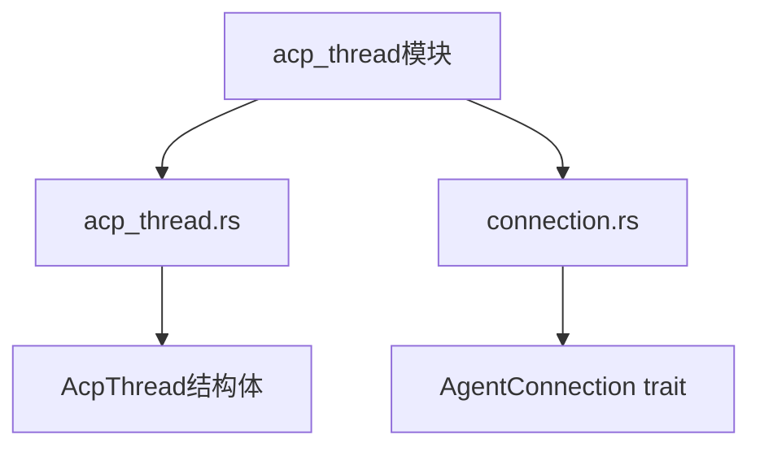
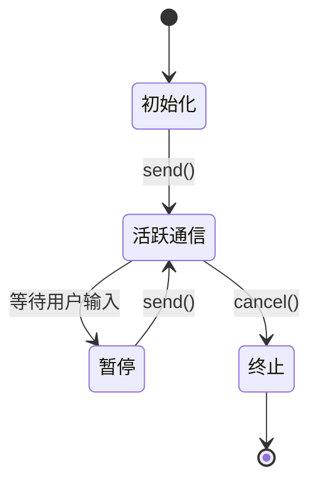
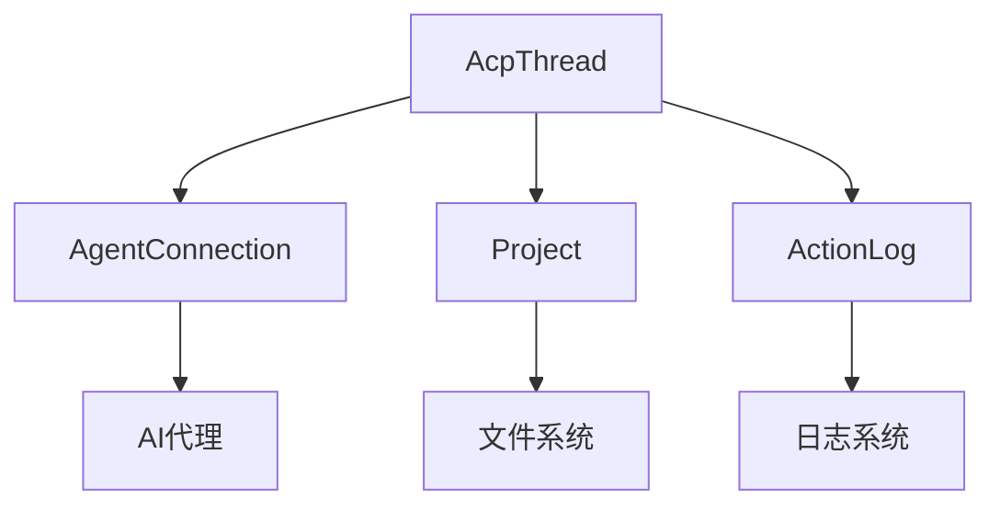

# 会话管理

<cite>
**本文档中引用的文件**  
- [acp_thread.rs](file://crates/acp_thread/src/acp_thread.rs)
- [connection.rs](file://crates/acp_thread/src/connection.rs)
</cite>

## 目录
1. [简介](#简介)
2. [项目结构](#项目结构)
3. [核心组件](#核心组件)
4. [架构概述](#架构概述)
5. [详细组件分析](#详细组件分析)
6. [依赖分析](#依赖分析)
7. [性能考虑](#性能考虑)
8. [故障排除指南](#故障排除指南)
9. [结论](#结论)

## 简介
本文档深入探讨了ACP协议中的会话管理机制，重点分析`acp_thread`模块如何创建、维护和销毁客户端与AI代理之间的通信会话。文档详细描述了`AcpThread`结构体的状态机设计，涵盖初始化、活跃通信、暂停和终止等状态。此外，还说明了会话上下文如何与项目系统集成，以及如何处理多客户端并发连接。结合`connection.rs`中的连接管理逻辑，阐述了心跳机制、超时检测和连接恢复策略。通过实际代码示例展示会话生命周期管理流程，并分析在高并发场景下的性能优化措施。

## 项目结构
`acp_thread`模块位于`crates/acp_thread/src`目录下，主要包含以下文件：
- `acp_thread.rs`：定义了`AcpThread`结构体及其相关方法，负责会话的创建、维护和销毁。
- `connection.rs`：定义了`AgentConnection` trait，用于管理与AI代理的连接。



**图示来源**
- [acp_thread.rs](file://crates/acp_thread/src/acp_thread.rs#L853-L2452)
- [connection.rs](file://crates/acp_thread/src/connection.rs#L0-L481)

**节来源**
- [acp_thread.rs](file://crates/acp_thread/src/acp_thread.rs#L0-L799)
- [connection.rs](file://crates/acp_thread/src/connection.rs#L0-L481)

## 核心组件
`AcpThread`结构体是会话管理的核心，负责处理与AI代理的通信。它通过`AgentConnection` trait与代理进行交互，管理会话的生命周期。

**节来源**
- [acp_thread.rs](file://crates/acp_thread/src/acp_thread.rs#L853-L2452)

## 架构概述
`AcpThread`模块通过`AcpThread`结构体和`AgentConnection` trait实现会话管理。`AcpThread`负责会话的创建、维护和销毁，而`AgentConnection`负责与AI代理的通信。

```mermaid
classDiagram
class AcpThread {
+title : SharedString
+entries : Vec<AgentThreadEntry>
+plan : Plan
+project : Entity<Project>
+action_log : Entity<ActionLog>
+shared_buffers : HashMap<Entity<Buffer>, BufferSnapshot>
+send_task : Option<Task<()>>
+connection : Rc<dyn AgentConnection>
+session_id : acp : : SessionId
+token_usage : Option<TokenUsage>
+prompt_capabilities : acp : : PromptCapabilities
+_observe_prompt_capabilities : Task<anyhow : : Result<()>>
+terminals : HashMap<acp : : TerminalId, Entity<Terminal>>
+new(title : impl Into<SharedString>, connection : Rc<dyn AgentConnection>, project : Entity<Project>, action_log : Entity<ActionLog>, session_id : acp : : SessionId, prompt_capabilities_rx : watch : : Receiver<acp : : PromptCapabilities>, cx : &mut Context<Self>) Self
+prompt_capabilities() acp : : PromptCapabilities
+connection() &Rc<dyn AgentConnection>
+action_log() &Entity<ActionLog>
+project() &Entity<Project>
+title() SharedString
+entries() &[AgentThreadEntry]
+session_id() &acp : : SessionId
+status() ThreadStatus
+token_usage() Option<&TokenUsage>
+has_pending_edit_tool_calls() bool
+used_tools_since_last_user_message() bool
+handle_session_update(update : acp : : SessionUpdate, cx : &mut Context<Self>) Result<(), acp : : Error>
+push_user_content_block(message_id : Option<UserMessageId>, chunk : acp : : ContentBlock, cx : &mut Context<Self>)
+push_assistant_content_block(chunk : acp : : ContentBlock, is_thought : bool, cx : &mut Context<Self>)
+push_entry(entry : AgentThreadEntry, cx : &mut Context<Self>)
+can_set_title(cx : &mut Context<Self>) bool
+set_title(title : SharedString, cx : &mut Context<Self>) Task<Result<()>>
+update_token_usage(usage : Option<TokenUsage>, cx : &mut Context<Self>)
+update_retry_status(status : RetryStatus, cx : &mut Context<Self>)
+update_tool_call(update : impl Into<ToolCallUpdate>, cx : &mut Context<Self>) Result<()>
+upsert_tool_call(tool_call : acp : : ToolCall, cx : &mut Context<Self>) Result<(), acp : : Error>
+upsert_tool_call_inner(update : acp : : ToolCallUpdate, status : ToolCallStatus, cx : &mut Context<Self>) Result<(), acp : : Error>
+index_for_tool_call(id : &acp : : ToolCallId) Option<usize>
+tool_call_mut(id : &acp : : ToolCallId) Option<(usize, &mut ToolCall)>
+tool_call(id : &acp : : ToolCallId) Option<(usize, &ToolCall)>
+resolve_locations(id : acp : : ToolCallId, cx : &mut Context<Self>)
+request_tool_call_authorization(tool_call : acp : : ToolCallUpdate, options : Vec<acp : : PermissionOption>, respect_always_allow_setting : bool, cx : &mut Context<Self>) Result<BoxFuture<'static, acp : : RequestPermissionOutcome>>
+authorize_tool_call(id : acp : : ToolCallId, option_id : acp : : PermissionOptionId, option_kind : acp : : PermissionOptionKind, cx : &mut Context<Self>)
+first_tool_awaiting_confirmation() Option<&ToolCall>
+plan() &Plan
+update_plan(request : acp : : Plan, cx : &mut Context<Self>)
+clear_completed_plan_entries(cx : &mut Context<Self>)
+send(message : Vec<acp : : ContentBlock>, cx : &mut Context<Self>) BoxFuture<'static, Result<()>>
+can_resume(cx : &App) bool
+resume(cx : &mut Context<Self>) BoxFuture<'static, Result<()>>
+run_turn(cx : &mut Context<Self>, f : impl 'static + AsyncFnOnce(WeakEntity<Self>, &mut AsyncApp) -> Result<acp : : PromptResponse>) BoxFuture<'static, Result<()>>
+cancel(cx : &mut Context<Self>) Task<()>
+restore_checkpoint(id : UserMessageId, cx : &mut Context<Self>) Task<Result<()>>
+rewind(id : UserMessageId, cx : &mut Context<Self>) Task<Result<()>>
+update_last_checkpoint(cx : &mut Context<Self>) Task<Result<()>>
+last_user_message() Option<(usize, &mut UserMessage)>
+user_message_mut(id : &UserMessageId) Option<(usize, &mut UserMessage)>
+read_text_file(path : PathBuf, line : Option<u32>, limit : Option<u32>, reuse_shared_snapshot : bool, cx : &mut Context<Self>) Task<Result<String>>
+write_text_file(path : PathBuf, content : String, cx : &mut Context<Self>) Task<Result<()>>
+create_terminal(command : String, args : Vec<String>, extra_env : Vec<acp : : EnvVariable>, cwd : Option<PathBuf>, output_byte_limit : Option<u64>, cx : &mut Context<Self>) Task<Result<Entity<Terminal>>>
+kill_terminal(terminal_id : acp : : TerminalId, cx : &mut Context<Self>) Result<()>
+release_terminal(terminal_id : acp : : TerminalId, cx : &mut Context<Self>) Result<()>
+terminal(terminal_id : acp : : TerminalId) Result<Entity<Terminal>>
+to_markdown(cx : &App) String
+emit_load_error(error : LoadError, cx : &mut Context<Self>)
}
class AgentConnection {
+new_thread(self : Rc<Self>, project : Entity<Project>, cwd : &Path, cx : &mut App) Task<Result<Entity<AcpThread>>>
+auth_methods() &[acp : : AuthMethod]
+authenticate(method : acp : : AuthMethodId, cx : &mut App) Task<Result<()>>
+prompt(user_message_id : Option<UserMessageId>, params : acp : : PromptRequest, cx : &mut App) Task<Result<acp : : PromptResponse>>
+resume(_session_id : &acp : : SessionId, _cx : &App) Option<Rc<dyn AgentSessionResume>>
+cancel(session_id : &acp : : SessionId, cx : &mut App)
+truncate(_session_id : &acp : : SessionId, _cx : &App) Option<Rc<dyn AgentSessionTruncate>>
+set_title(_session_id : &acp : : SessionId, _cx : &App) Option<Rc<dyn AgentSessionSetTitle>>
+model_selector() Option<Rc<dyn AgentModelSelector>>
+telemetry() Option<Rc<dyn AgentTelemetry>>
+session_modes(_session_id : &acp : : SessionId, _cx : &App) Option<Rc<dyn AgentSessionModes>>
+into_any(self : Rc<Self>) Rc<dyn Any>
}
AcpThread --> AgentConnection : "uses"
```

**图示来源**
- [acp_thread.rs](file://crates/acp_thread/src/acp_thread.rs#L853-L2452)
- [connection.rs](file://crates/acp_thread/src/connection.rs#L0-L481)

## 详细组件分析
### AcpThread分析
`AcpThread`结构体通过`new`方法创建会话，并通过`send`方法发送消息。会话的状态由`status`方法返回，可能的值包括`Generating`和`Idle`。

#### 状态机设计
`AcpThread`的状态机设计包括以下状态：
- **初始化**：通过`new`方法创建会话。
- **活跃通信**：通过`send`方法发送消息，会话处于`Generating`状态。
- **暂停**：会话暂时停止，等待用户输入。
- **终止**：通过`cancel`方法终止会话。



**图示来源**
- [acp_thread.rs](file://crates/acp_thread/src/acp_thread.rs#L853-L2452)

**节来源**
- [acp_thread.rs](file://crates/acp_thread/src/acp_thread.rs#L853-L2452)

## 依赖分析
`AcpThread`模块依赖于`AgentConnection` trait，通过`connection`字段与AI代理进行通信。此外，`AcpThread`还依赖于`Project`和`ActionLog`等外部组件。



**图示来源**
- [acp_thread.rs](file://crates/acp_thread/src/acp_thread.rs#L853-L2452)
- [connection.rs](file://crates/acp_thread/src/connection.rs#L0-L481)

**节来源**
- [acp_thread.rs](file://crates/acp_thread/src/acp_thread.rs#L853-L2452)
- [connection.rs](file://crates/acp_thread/src/connection.rs#L0-L481)

## 性能考虑
在高并发场景下，`AcpThread`模块通过异步任务和事件驱动机制来优化性能。`send`方法返回一个`BoxFuture`，允许非阻塞地发送消息。此外，`AcpThread`通过`shared_buffers`字段缓存缓冲区快照，减少重复读取的开销。

## 故障排除指南
### 常见问题
- **会话无法创建**：检查`AgentConnection`的实现是否正确。
- **消息发送失败**：检查网络连接和AI代理的状态。
- **性能问题**：检查`shared_buffers`的使用情况，确保缓存有效。

**节来源**
- [acp_thread.rs](file://crates/acp_thread/src/acp_thread.rs#L853-L2452)

## 结论
`acp_thread`模块通过`AcpThread`结构体和`AgentConnection` trait实现了高效的会话管理。通过状态机设计和异步任务，`AcpThread`能够处理复杂的通信场景，并在高并发环境下保持良好的性能。未来的工作可以进一步优化缓存策略和错误处理机制。