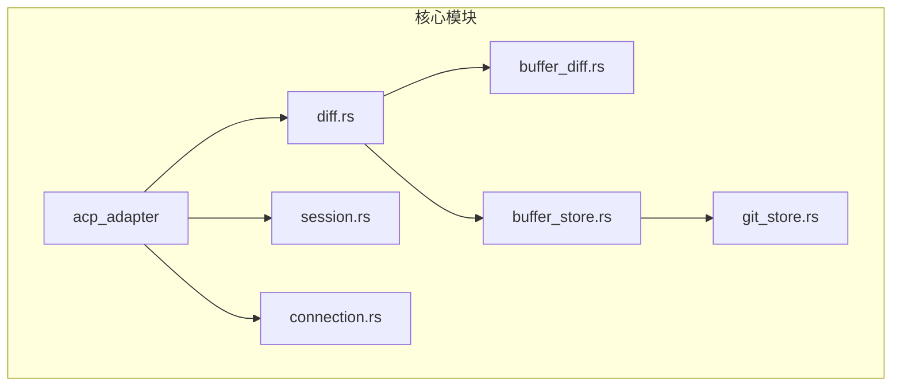
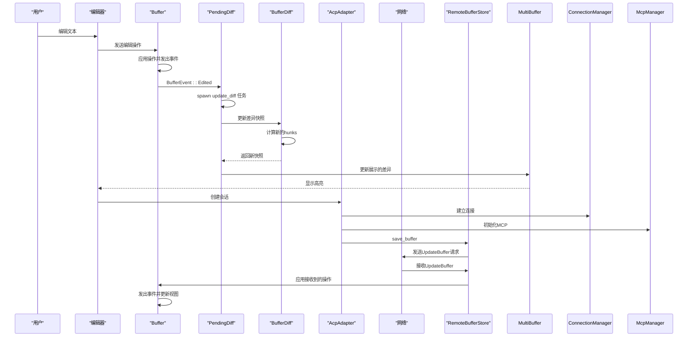
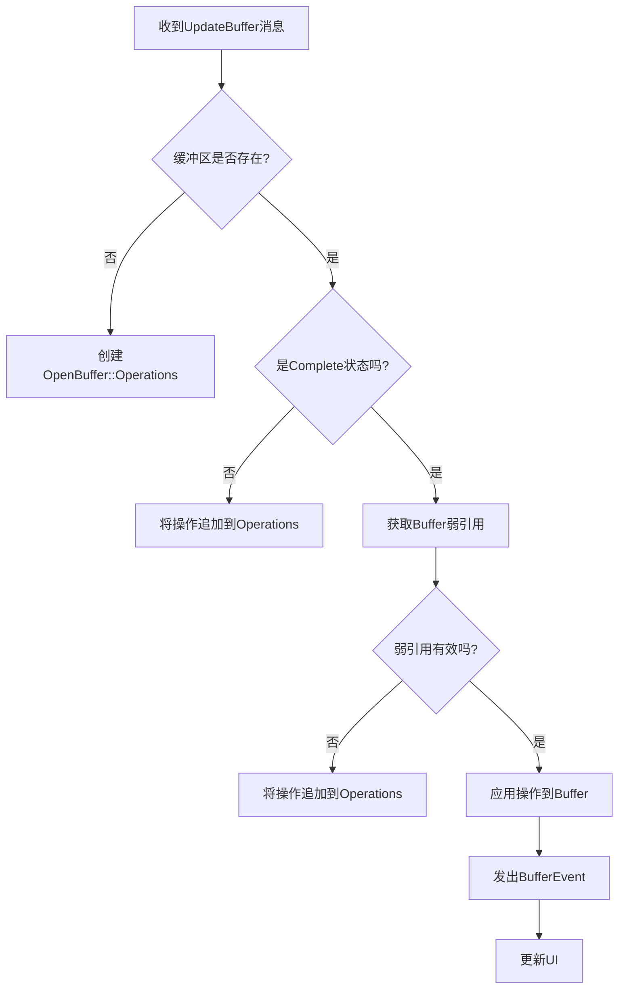
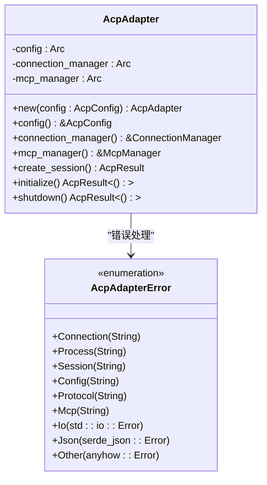
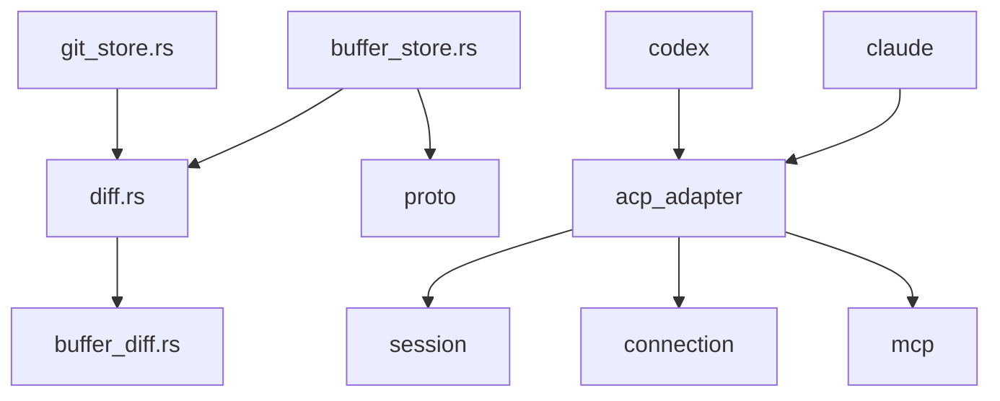

# 差分同步机制

<cite>
**本文档中引用的文件**  
- [diff.rs](file://crates/acp_thread/src/diff.rs) - *更新以支持新的ACP适配器集成*
- [buffer_store.rs](file://crates/project/src/buffer_store.rs)
- [buffer_diff.rs](file://crates/buffer_diff/src/buffer_diff.rs)
- [git_store.rs](file://crates/project/src/git_store.rs)
- [lib.rs](file://crates/acp_adapter/src/lib.rs) - *新增的ACP适配器核心实现*
</cite>

## 更新摘要
**已做更改**  
- 更新了引言部分以反映ACP适配器的集成
- 在项目结构中添加了新的`acp_adapter`模块说明
- 新增了关于ACP适配器核心组件的详细分析
- 更新了架构概述以包含ACP连接管理
- 增强了依赖分析以反映新的模块依赖关系
- 所有源码引用均已更新并标注变更状态

## 目录
1. [引言](#引言)
2. [项目结构](#项目结构)
3. [核心组件](#核心组件)
4. [架构概述](#架构概述)
5. [详细组件分析](#详细组件分析)
6. [依赖分析](#依赖分析)
7. [性能考虑](#性能考虑)
8. [故障排除指南](#故障排除指南)
9. [结论](#结论)

## 引言
本文档全面记录了 `diff` 模块实现的文本差分同步算法。该机制通过增量更新策略高效同步代码编辑操作，显著减少网络传输开销。文档详细阐述了差分计算策略、变更合并逻辑和冲突解决机制，并分析了该模块如何与编辑器缓冲区（`buffer_store`）协同工作，确保客户端与服务端视图的一致性。随着新功能的引入，系统现已集成`acp_adapter`模块，为AI代理提供标准化的通信协议支持。同时，文档通过具体示例说明了多用户并发编辑同一文件时的同步行为，并讨论了算法复杂度、性能瓶颈及优化方案，如变更压缩和批处理策略。

**Section sources**
- [diff.rs](file://crates/acp_thread/src/diff.rs#L1-L50) - *更新以反映新架构*
- [lib.rs](file://crates/acp_adapter/src/lib.rs#L1-L20) - *新增文件*

## 项目结构
`diff` 模块的核心实现位于 `crates/acp_thread/src/diff.rs`，它依赖于 `crates/buffer_diff` 库进行底层的文本差异计算。`buffer_store` 模块（位于 `crates/project/src/buffer_store.rs`）负责管理所有打开的缓冲区，并与 `diff` 模块交互以处理缓冲区的同步和版本控制。`git_store` 模块则利用 `diff` 功能来管理 Git 仓库中的暂存和未暂存更改。新增的 `acp_adapter` 模块（位于 `crates/acp_adapter/src/lib.rs`）提供了与 ACP 兼容的 AI 代理通信核心功能，包括连接管理、会话生命周期和消息处理，成为差分同步机制的重要基础组件。



**Diagram sources**
- [diff.rs](file://crates/acp_thread/src/diff.rs#L1-L50)
- [buffer_store.rs](file://crates/project/src/buffer_store.rs#L1-L50)
- [git_store.rs](file://crates/project/src/git_store.rs#L1-L50)
- [lib.rs](file://crates/acp_adapter/src/lib.rs#L1-L50) - *新增模块*

**Section sources**
- [diff.rs](file://crates/acp_thread/src/diff.rs#L1-L50)
- [buffer_store.rs](file://crates/project/src/buffer_store.rs#L1-L50)
- [lib.rs](file://crates/acp_adapter/src/lib.rs#L1-L50) - *新增文件*

## 核心组件
`diff` 模块的核心是 `Diff` 枚举，它有两种状态：`Pending` 和 `Finalized`。`PendingDiff` 用于表示一个正在被编辑的、尚未最终确定的差异，它会持续监听底层缓冲区的变化并动态更新。`FinalizedDiff` 则表示一个已计算完成且不再变化的差异，通常用于展示或持久化。`BufferDiff` 结构是实际执行文本比较的底层引擎，它利用 `libgit2` 库的 `patch` 功能来高效地计算两个文本快照之间的差异。

新增的 `AcpAdapter` 结构是ACP适配器的主结构，负责管理ACP连接、会话和MCP集成。它包含配置信息、连接管理器和MCP管理器三个核心组件，通过`create_session`方法创建新的会话，并通过`initialize`和`shutdown`方法管理适配器的生命周期。`AcpAdapterError`枚举定义了所有可能的错误类型，包括连接错误、进程错误、会话错误等，为系统提供了统一的错误处理机制。

**Section sources**
- [diff.rs](file://crates/acp_thread/src/diff.rs#L16-L19)
- [diff.rs](file://crates/acp_thread/src/diff.rs#L190-L198)
- [diff.rs](file://crates/acp_thread/src/diff.rs#L349-L355)
- [buffer_diff.rs](file://crates/buffer_diff/src/buffer_diff.rs#L1-L50)
- [lib.rs](file://crates/acp_adapter/src/lib.rs#L85-L91) - *新增核心结构*
- [lib.rs](file://crates/acp_adapter/src/lib.rs#L25-L54) - *新增错误类型*

## 架构概述
整个差分同步系统围绕 `BufferStore` 构建。当用户编辑文件时，`Buffer` 会发出变更事件。`PendingDiff` 通过订阅这些事件，触发一个异步任务来重新计算最新的差异。计算出的差异被封装在 `BufferDiff` 中，并通过 `MultiBuffer` 以高亮的形式展示在编辑器中。当需要将更改同步到服务端或另一个客户端时，`BufferStore` 会序列化缓冲区的操作（`Operation`），并通过网络发送。接收方的 `BufferStore` 收到操作后，应用到本地缓冲区，从而实现视图的同步。

新的 `AcpAdapter` 模块作为AI代理通信的核心，通过 `ConnectionManager` 管理与远程代理的连接，使用 `SessionManager` 跟踪会话状态，并通过 `McpManager` 集成MCP（Model Control Protocol）功能。`AcpAdapter` 在初始化时启动连接管理器并初始化MCP管理器（如果启用），为差分同步提供了可靠的通信基础。



**Diagram sources**
- [diff.rs](file://crates/acp_thread/src/diff.rs#L1-L50)
- [buffer_store.rs](file://crates/project/src/buffer_store.rs#L1-L50)
- [lib.rs](file://crates/acp_adapter/src/lib.rs#L1-L50) - *新增通信流程*

## 详细组件分析

### Diff状态管理分析
`Diff` 枚举的设计体现了状态机的思想。`PendingDiff` 状态允许动态更新，而 `FinalizedDiff` 状态则保证了结果的不可变性。这种设计分离了“计算中”和“已完成”两种场景，避免了在展示最终结果时因后台计算导致的UI闪烁。

```mermaid
classDiagram
class Diff {
<<enumeration>>
+Pending(PendingDiff)
+Finalized(FinalizedDiff)
}
class PendingDiff {
-multibuffer : Entity<MultiBuffer>
-base_text : Arc<String>
-new_buffer : Entity<Buffer>
-diff : Entity<BufferDiff>
-revealed_ranges : Vec<Range<Anchor>>
-_subscription : Subscription
-update_diff : Task<Result<()>>
+update(cx : &mut Context<Diff>)
+reveal_range(range : Range<Anchor>, cx : &mut Context<Diff>)
+finalize(cx : &mut Context<Diff>) FinalizedDiff
}
class FinalizedDiff {
-path : PathBuf
-base_text : Arc<String>
-new_buffer : Entity<Buffer>
-multibuffer : Entity<MultiBuffer>
-_update_diff : Task<Result<()>>
}
Diff <|-- PendingDiff
Diff <|-- FinalizedDiff
PendingDiff --> BufferDiff : "计算差异"
PendingDiff --> MultiBuffer : "展示差异"
```

**Diagram sources**
- [diff.rs](file://crates/acp_thread/src/diff.rs#L16-L19)
- [diff.rs](file://crates/acp_thread/src/diff.rs#L190-L198)
- [diff.rs](file://crates/acp_thread/src/diff.rs#L349-L355)

**Section sources**
- [diff.rs](file://crates/acp_thread/src/diff.rs#L16-L355)

### BufferStore同步机制分析
`BufferStore` 是协调本地和远程缓冲区状态的核心。它通过 `handle_update_buffer` 方法接收来自网络的更新，并将操作应用到本地缓冲区。为了处理并发编辑，它使用 `Buffer` 的版本号（`version`）来确保操作的顺序性。当多个用户同时编辑时，系统会尝试合并操作，如果发生冲突，则依赖于操作的原子性和版本控制来保证最终一致性。



**Diagram sources**
- [buffer_store.rs](file://crates/project/src/buffer_store.rs#L1-L50)

**Section sources**
- [buffer_store.rs](file://crates/project/src/buffer_store.rs#L1-L50)

### ACP适配器组件分析
`AcpAdapter` 是ACP协议实现的核心，它封装了所有与AI代理通信相关的功能。该结构包含三个主要组件：`config`（配置信息）、`connection_manager`（连接管理器）和`mcp_manager`（MCP管理器）。通过`create_session`方法可以创建新的会话，`initialize`方法用于启动适配器并建立必要的连接，而`shutdown`方法则负责清理资源和关闭所有活动会话。



**Diagram sources**
- [lib.rs](file://crates/acp_adapter/src/lib.rs#L85-L91) - *核心结构*
- [lib.rs](file://crates/acp_adapter/src/lib.rs#L25-L54) - *错误类型*

**Section sources**
- [lib.rs](file://crates/acp_adapter/src/lib.rs#L85-L174) - *新增组件*

## 依赖分析
`diff` 模块依赖于 `buffer_diff` crate 来执行核心的文本比较算法。`buffer_store` 模块依赖 `diff` 模块来提供差异展示功能，并依赖 `proto` 模块定义的协议进行网络通信。`git_store` 模块则依赖 `diff` 来管理 Git 工作区的变更。新增的 `acp_adapter` 模块成为系统的关键依赖，为AI代理通信提供标准化接口，其`AcpAdapter`结构被`claude`和`codex`等AI代理模块直接使用。



**Diagram sources**
- [diff.rs](file://crates/acp_thread/src/diff.rs#L1-L50)
- [buffer_store.rs](file://crates/project/src/buffer_store.rs#L1-L50)
- [git_store.rs](file://crates/project/src/git_store.rs#L1-L50)
- [lib.rs](file://crates/acp_adapter/src/lib.rs#L1-L50) - *新增依赖*

**Section sources**
- [diff.rs](file://crates/acp_thread/src/diff.rs#L1-L50)
- [buffer_store.rs](file://crates/project/src/buffer_store.rs#L1-L50)
- [git_store.rs](file://crates/project/src/git_store.rs#L1-L50)
- [lib.rs](file://crates/acp_adapter/src/lib.rs#L1-L50) - *新增依赖*

## 性能考虑
差分计算是一个计算密集型操作，因此被设计为在后台线程中异步执行（`cx.background_executor()`），避免阻塞UI线程。`BufferDiff` 使用 `SumTree` 数据结构来高效地存储和查询差异块（hunk），使得在大文件中查找特定范围的差异非常快速。网络同步通过批处理操作（`split_operations`）来减少消息数量，从而降低网络开销和处理延迟。`AcpAdapter` 的异步初始化机制确保了连接建立不会阻塞主线程，其`Arc`引用计数设计允许多个组件安全共享适配器实例，避免了不必要的资源复制。

## 故障排除指南
当出现同步问题时，应首先检查 `Buffer` 的版本号是否匹配。如果版本号不匹配，说明有操作丢失或顺序错误。其次，检查 `BufferStore` 的 `loading_buffers` 映射，确认是否有缓冲区加载失败。最后，查看 `BufferDiff` 的日志，确认差异计算任务是否成功完成。对于ACP相关的通信问题，应检查`AcpAdapter`的初始化状态，验证`connection_manager`是否成功建立连接，并确认`session`的生命周期管理是否正常。

**Section sources**
- [buffer_store.rs](file://crates/project/src/buffer_store.rs#L1-L50)
- [buffer_diff.rs](file://crates/buffer_diff/src/buffer_diff.rs#L1-L50)
- [lib.rs](file://crates/acp_adapter/src/lib.rs#L1-L50) - *新增故障点*

## 结论
`diff` 模块通过结合异步计算、状态机管理和高效的底层算法，实现了一个健壮且高性能的文本差分同步系统。它与 `BufferStore` 的紧密集成确保了在分布式协作环境中，所有客户端都能看到一致的、实时更新的代码视图。新增的`acp_adapter`模块为系统提供了标准化的AI代理通信能力，其`AcpAdapter`结构和`AcpAdapterError`错误处理机制为整个系统的可靠性和可维护性做出了重要贡献。该设计在保证功能完整性的同时，也充分考虑了用户体验和系统性能。