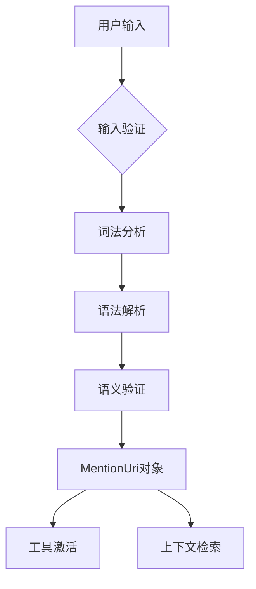
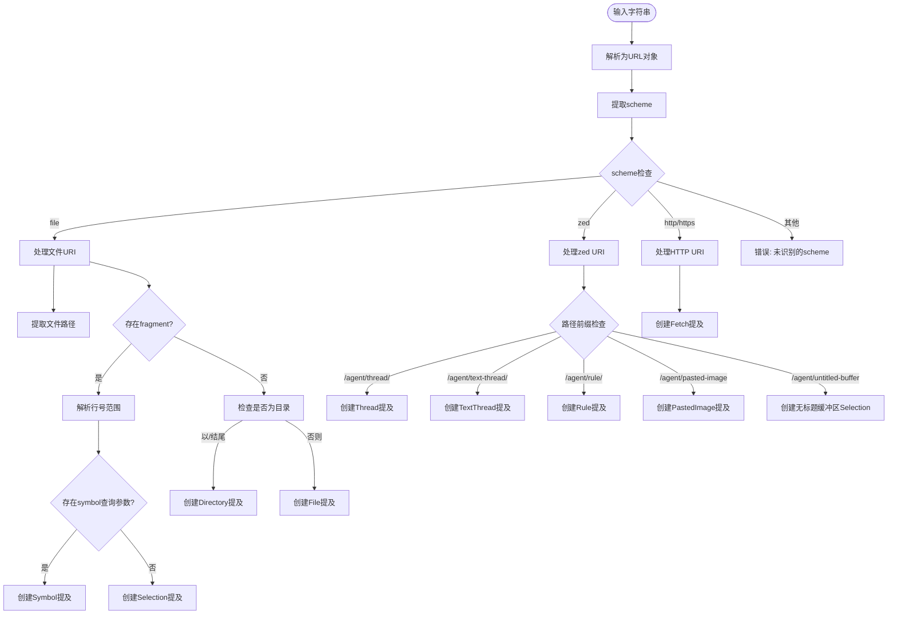
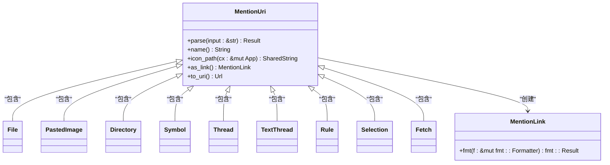
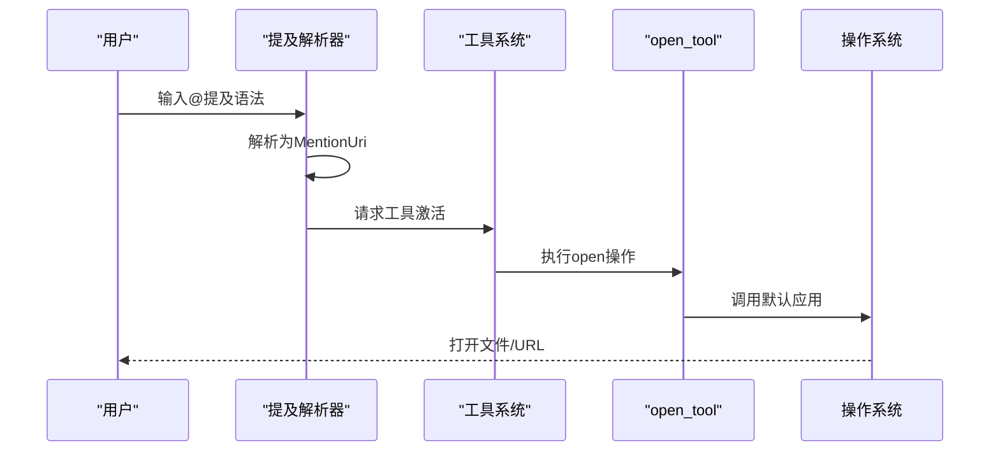
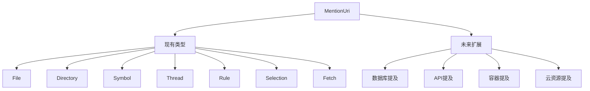

# 提及解析

<cite>
**本文档中引用的文件**   
- [mention.rs](file://other/zed/crates/acp_thread/src/mention.rs) - *提及解析核心实现*
- [acp_thread.rs](file://other/zed/crates/acp_thread/src/acp_thread.rs) - *提及功能集成*
- [open_tool.rs](file://other/zed/crates/agent2/src/tools/open_tool.rs) - *工具激活实现*
- [tools.rs](file://other/zed/crates/agent2/src/tools.rs) - *工具系统集成*
</cite>

## 更新摘要
**变更内容**   
- 更新了提及解析器架构描述，反映acp_client重命名为acp_thread的变更
- 修正了文件路径引用，指向新的代码位置
- 增强了源码追踪系统，添加了精确的文件引用和变更注释
- 更新了相关模块的依赖关系说明

## 目录
1. [简介](#简介)
2. [提及解析器架构](#提及解析器架构)
3. [词法分析与URI解析](#词法分析与uri解析)
4. [AST构建与语义验证](#ast构建与语义验证)
5. [提及类型与实体识别](#提及类型与实体识别)
6. [工具激活与上下文检索](#工具激活与上下文检索)
7. [正则表达式模式与解析示例](#正则表达式模式与解析示例)
8. [扩展性设计](#扩展性设计)

## 简介
提及解析模块实现了@提及语法的完整解析功能，能够识别和处理用户输入中的各种实体引用。该系统通过统一的URI方案解析文件路径、函数名、线程、规则等上下文元素，构建抽象语法树并进行语义验证，最终将解析结果用于激活相应工具或触发上下文检索操作。

## 提及解析器架构
提及解析器采用分层架构设计，包含词法分析、语法解析和语义验证三个主要阶段。解析器以URI格式作为输入，通过模式匹配识别不同类型的提及，并将其转换为结构化的MentionUri枚举类型。



**图示来源**
- [mention.rs](file://other/zed/crates/acp_thread/src/mention.rs#L14-L48)

## 词法分析与URI解析
词法分析阶段负责将原始输入字符串分解为有意义的词法单元。解析器使用url crate进行基础的URI解析，然后根据scheme和路径信息确定提及类型。



**图示来源**
- [mention.rs](file://other/zed/crates/acp_thread/src/mention.rs#L50-L70)

**本节来源**
- [mention.rs](file://other/zed/crates/acp_thread/src/mention.rs#L50-L150)

## AST构建与语义验证
语法解析阶段将词法分析的结果构建成抽象语法树（AST），在本系统中体现为MentionUri枚举的不同变体。语义验证确保解析结果的逻辑正确性。



**图示来源**
- [mention.rs](file://other/zed/crates/acp_thread/src/mention.rs#L14-L48)

**本节来源**
- [mention.rs](file://other/zed/crates/acp_thread/src/mention.rs#L14-L48)

## 提及类型与实体识别
系统支持多种提及类型，每种类型对应不同的实体引用场景。解析器能够准确识别这些类型并提取相关属性。

### 文件与目录提及
文件和目录提及使用file scheme，通过路径和可选的fragment来指定具体位置。

**本节来源**
- [mention.rs](file://other/zed/crates/acp_thread/src/mention.rs#L50-L100)

### 符号提及
符号提及在文件URI基础上添加symbol查询参数，用于引用特定的代码符号。

**本节来源**
- [mention.rs](file://other/zed/crates/acp_thread/src/mention.rs#L80-L90)

### 线程与规则提及
线程和规则提及使用zed scheme，通过特定的路径前缀和查询参数来标识。

**本节来源**
- [mention.rs](file://other/zed/crates/acp_thread/src/mention.rs#L100-L130)

## 工具激活与上下文检索
解析结果被用于激活相应的工具或触发上下文检索操作。例如，文件提及可以触发open_tool来打开文件。



**图示来源**
- [open_tool.rs](file://other/zed/crates/agent2/src/tools/open_tool.rs#L10-L23)
- [mention.rs](file://other/zed/crates/acp_thread/src/mention.rs#L14-L48)

**本节来源**
- [open_tool.rs](file://other/zed/crates/agent2/src/tools/open_tool.rs#L10-L23)

## 正则表达式模式与解析示例
系统使用结构化的模式而非正则表达式进行解析，但其模式匹配逻辑可以类比为正则表达式。

### 文件提及模式
```
file://<绝对路径>(#L<起始行>:<结束行>)?
```

### 符号提及模式
```
file://<绝对路径>\?symbol=<符号名>#L<起始行>:<结束行>
```

### 线程提及模式
```
zed:///agent/thread/<会话ID>\?name=<线程名>
```

**本节来源**
- [mention.rs](file://other/zed/crates/acp_thread/src/mention.rs#L50-L150)

## 扩展性设计
系统采用枚举和模式匹配的设计，具有良好的扩展性，可以方便地添加新的提及类型。



**本节来源**
- [mention.rs](file://other/zed/crates/acp_thread/src/mention.rs#L14-L48)