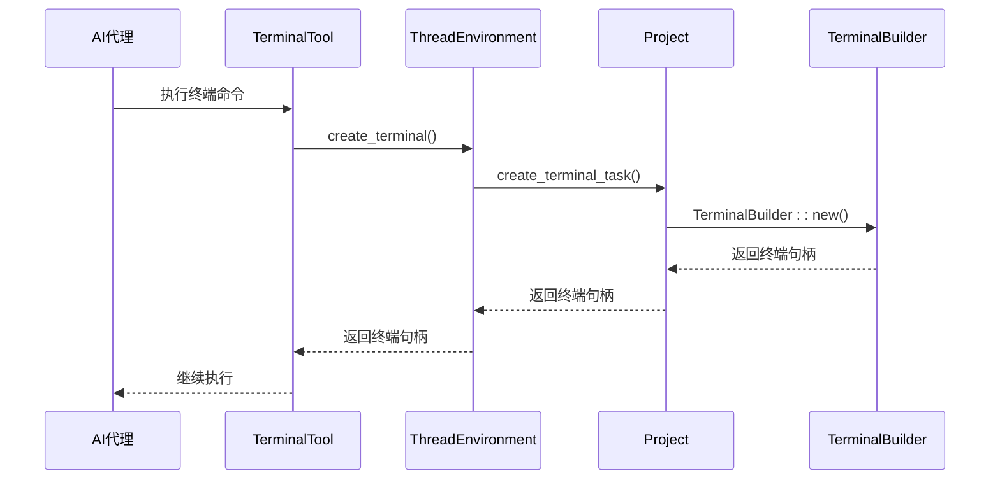
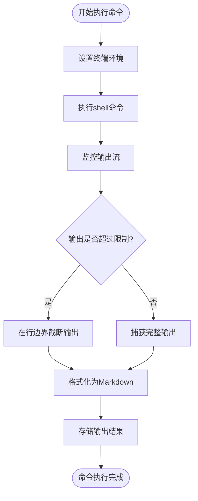
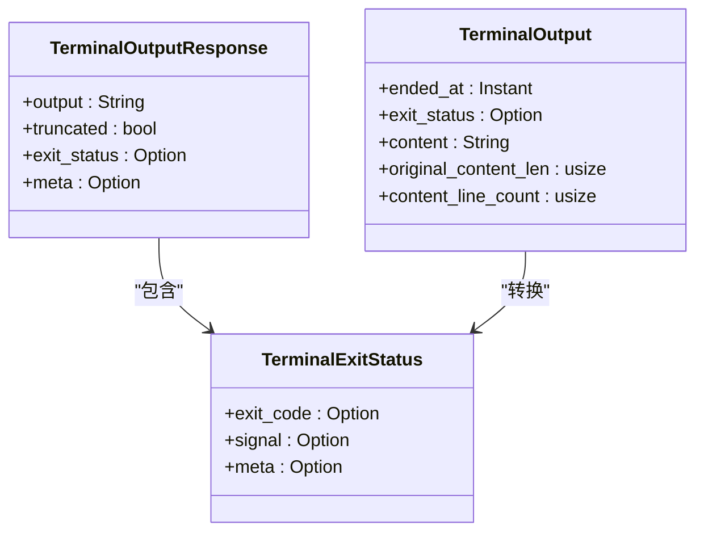
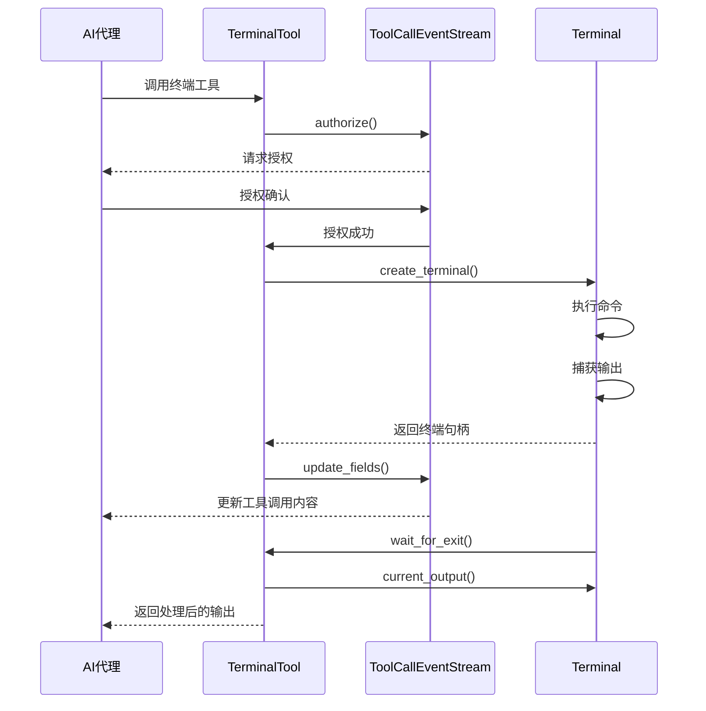
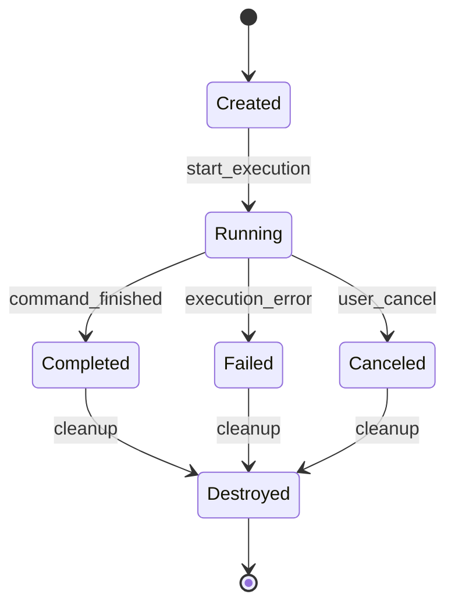

# 终端I/O集成

<cite>
**本文档中引用的文件**  
- [terminal_tool.rs](file://crates/agent2/src/tools/terminal_tool.rs)
- [terminal.rs](file://crates/acp_thread/src/terminal.rs)
- [terminals.rs](file://crates/project/src/terminals.rs)
- [thread.rs](file://crates/agent2/src/thread.rs)
- [agent.rs](file://crates/agent2/src/agent.rs)
- [acp_thread.rs](file://crates/acp_thread/src/acp_thread.rs)
</cite>

## 目录
1. [引言](#引言)
2. [终端会话创建机制](#终端会话创建机制)
3. [命令执行与输出捕获](#命令执行与输出捕获)
4. [终端I/O数据帧格式](#终端io数据帧格式)
5. [ACP协议交互流程](#acp协议交互流程)
6. [会话生命周期管理](#会话生命周期管理)
7. [资源隔离与权限控制](#资源隔离与权限控制)
8. [故障排查指南](#故障排查指南)
9. [结论](#结论)

## 引言
本文档深入解析terminal模块如何实现AI代理与终端环境的双向交互。通过分析代码结构和交互流程，详细说明终端会话的创建、命令执行、输出流捕获机制以及数据帧封装格式。文档还描述了流控策略和安全性考虑，结合实际使用场景展示如何通过ACP协议传输shell命令、接收执行结果并实时渲染到客户端界面。同时分析终端会话的生命周期管理、资源隔离和权限控制措施，并提供常见问题的解决方案。

## 终端会话创建机制
终端会话的创建通过`TerminalTool`工具触发，该工具实现了`AgentTool`接口。当AI代理需要执行shell命令时，会调用`TerminalTool`的`run`方法。该方法首先通过`working_dir`函数确定工作目录，确保目录位于项目的工作树内。然后通过`ThreadEnvironment`接口的`create_terminal`方法创建终端实例。

终端创建过程涉及多个组件的协作。`Project`结构体提供了`create_terminal_task`和`create_terminal_shell`方法，用于创建终端任务和shell会话。这些方法会根据项目设置和远程连接状态配置shell环境，包括shell类型、环境变量和激活脚本。对于远程连接，会通过`create_remote_shell`函数构建SSH连接命令，并设置适当的TERM环境变量以确保颜色显示正常。

**Diagram sources**
- [terminal_tool.rs](file://crates/agent2/src/tools/terminal_tool.rs#L17-L34)
- [thread.rs](file://crates/agent2/src/thread.rs#L554-L560)
- [terminals.rs](file://crates/project/src/terminals.rs#L22-L24)

**Section sources**
- [terminal_tool.rs](file://crates/agent2/src/tools/terminal_tool.rs#L36-L39)
- [terminals.rs](file://crates/project/src/terminals.rs#L22-L24)

## 命令执行与输出捕获
命令执行和输出捕获机制通过`Terminal`结构体实现。该结构体封装了终端会话的核心功能，包括命令执行、输出捕获和状态管理。当创建终端实例时，会启动一个异步任务来监控命令执行状态，并在命令完成后捕获输出。

输出捕获采用流式处理方式，实时读取stdout和stderr流，保持写入顺序。`truncated_output`方法负责处理输出截断逻辑，当输出超过指定字节限制时，会在最后一行完整处截断，避免截断中间的字符序列。输出内容会被格式化为Markdown代码块，便于在客户端界面渲染。

**Diagram sources**
- [terminal.rs](file://crates/acp_thread/src/terminal.rs#L8-L17)
- [terminal.rs](file://crates/acp_thread/src/terminal.rs#L19-L25)

**Section sources**
- [terminal.rs](file://crates/acp_thread/src/terminal.rs#L8-L17)
- [terminal.rs](file://crates/acp_thread/src/terminal.rs#L19-L25)

## 终端I/O数据帧格式
终端I/O数据帧采用结构化格式封装，确保数据的完整性和可解析性。`TerminalOutputResponse`结构体定义了输出响应的格式，包含输出内容、截断标志和退出状态。输出内容以字符串形式存储，经过适当的转义处理，确保特殊字符的正确传输。

数据帧的封装遵循ACP协议规范，通过`ToolCallContent::Terminal`枚举值将终端ID嵌入工具调用内容中。这种设计实现了终端会话与AI对话的无缝集成，允许在对话流中引用和显示终端输出。`TerminalOutput`结构体还记录了输出的原始长度和行数，为后续的分析和处理提供元数据。

**Diagram sources**
- [terminal.rs](file://crates/acp_thread/src/terminal.rs#L19-L25)
- [acp_thread.rs](file://crates/acp_thread/src/acp_thread.rs#L664-L668)

**Section sources**
- [terminal.rs](file://crates/acp_thread/src/terminal.rs#L19-L25)
- [acp_thread.rs](file://crates/acp_thread/src/acp_thread.rs#L664-L668)

## ACP协议交互流程
ACP协议交互流程实现了AI代理与终端环境的双向通信。当AI代理调用终端工具时，会通过`ToolCallEventStream`发送工具调用事件，包含命令内容和工作目录。终端执行完成后，通过相同的事件流返回执行结果。

交互流程包括授权、执行和结果返回三个阶段。在授权阶段，系统会验证命令的执行权限，确保安全性。执行阶段通过`create_terminal`方法启动终端会话，并监控其状态。结果返回阶段将输出内容封装为`TerminalOutputResponse`，并通过事件流发送回AI代理。

**Diagram sources**
- [terminal_tool.rs](file://crates/agent2/src/tools/terminal_tool.rs#L17-L34)
- [thread.rs](file://crates/agent2/src/thread.rs#L526-L530)

**Section sources**
- [terminal_tool.rs](file://crates/agent2/src/tools/terminal_tool.rs#L17-L34)
- [thread.rs](file://crates/agent2/src/thread.rs#L526-L530)

## 会话生命周期管理
终端会话的生命周期由`Terminal`结构体和`Project`结构体共同管理。`Terminal`结构体通过`_output_task`字段跟踪命令执行任务，确保在会话结束时正确清理资源。`Project`结构体通过`local_handles`字段维护对所有本地终端句柄的弱引用，防止内存泄漏。

会话生命周期包括创建、运行和销毁三个阶段。创建阶段通过`TerminalBuilder`初始化终端实例。运行阶段监控命令执行状态，捕获输出并更新会话状态。销毁阶段通过`cx.observe_release`机制自动清理终端句柄，确保资源的正确释放。

**Diagram sources**
- [terminals.rs](file://crates/project/src/terminals.rs#L22-L24)
- [terminal.rs](file://crates/acp_thread/src/terminal.rs#L8-L17)

**Section sources**
- [terminals.rs](file://crates/project/src/terminals.rs#L22-L24)
- [terminal.rs](file://crates/acp_thread/src/terminal.rs#L8-L17)

## 资源隔离与权限控制
资源隔离与权限控制通过多层机制实现。首先，工作目录限制确保命令只能在项目的工作树内执行，防止越权访问。`working_dir`函数验证输入目录是否属于项目工作树，拒绝非法路径。

其次，输出字节限制防止大输出导致的资源耗尽。`COMMAND_OUTPUT_LIMIT`常量设置为16KB，超过限制的输出会被截断。此外，系统禁止执行长期运行的命令，如服务器或文件监视器，避免资源占用。

权限控制通过`ToolCallAuthorization`机制实现，在执行敏感操作前请求用户确认。`ThreadEnvironment`接口的`create_terminal`方法需要异步授权，确保每个终端操作都经过验证。

**Diagram sources**
- [terminal_tool.rs](file://crates/agent2/src/tools/terminal_tool.rs#L17-L34)
- [thread.rs](file://crates/agent2/src/thread.rs#L526-L530)

**Section sources**
- [terminal_tool.rs](file://crates/agent2/src/tools/terminal_tool.rs#L17-L34)
- [thread.rs](file://crates/agent2/src/thread.rs#L526-L530)

## 故障排查指南
### 连接中断问题
连接中断可能由网络问题或远程服务器故障引起。检查SSH连接配置，确保主机名、端口和认证信息正确。对于远程连接，验证服务器是否在线并允许SSH连接。

### 输出乱码问题
输出乱码通常由字符编码不匹配引起。确保终端和shell使用相同的字符编码（推荐UTF-8）。检查LANG和LC_ALL环境变量设置，确保它们与系统区域设置一致。

### 命令执行失败
命令执行失败可能由权限不足、路径错误或依赖缺失引起。验证工作目录是否正确，检查命令所需的权限和依赖。对于远程执行，确保目标系统安装了必要的工具和库。

### 输出截断问题
输出截断是正常的安全机制，防止大输出导致性能问题。如果需要完整输出，考虑将输出重定向到文件，然后使用读取文件工具获取内容。

### 环境变量问题
环境变量可能影响命令执行结果。检查项目设置中的环境变量配置，确保它们与预期一致。对于虚拟环境，验证激活脚本是否正确执行。

**Section sources**
- [terminal_tool.rs](file://crates/agent2/src/tools/terminal_tool.rs#L17-L34)
- [terminals.rs](file://crates/project/src/terminals.rs#L22-L24)
- [terminal.rs](file://crates/acp_thread/src/terminal.rs#L8-L17)

## 结论
terminal模块通过精心设计的架构实现了AI代理与终端环境的高效、安全交互。通过分析终端会话的创建、命令执行、输出捕获和生命周期管理机制，展示了系统如何在保证安全性的同时提供强大的终端操作能力。ACP协议的集成使得终端操作能够无缝融入AI对话流，为用户提供直观的交互体验。资源隔离和权限控制措施确保了系统的安全性，而详细的故障排查指南则帮助用户快速解决常见问题。