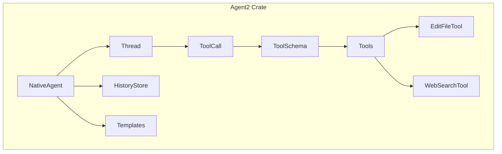
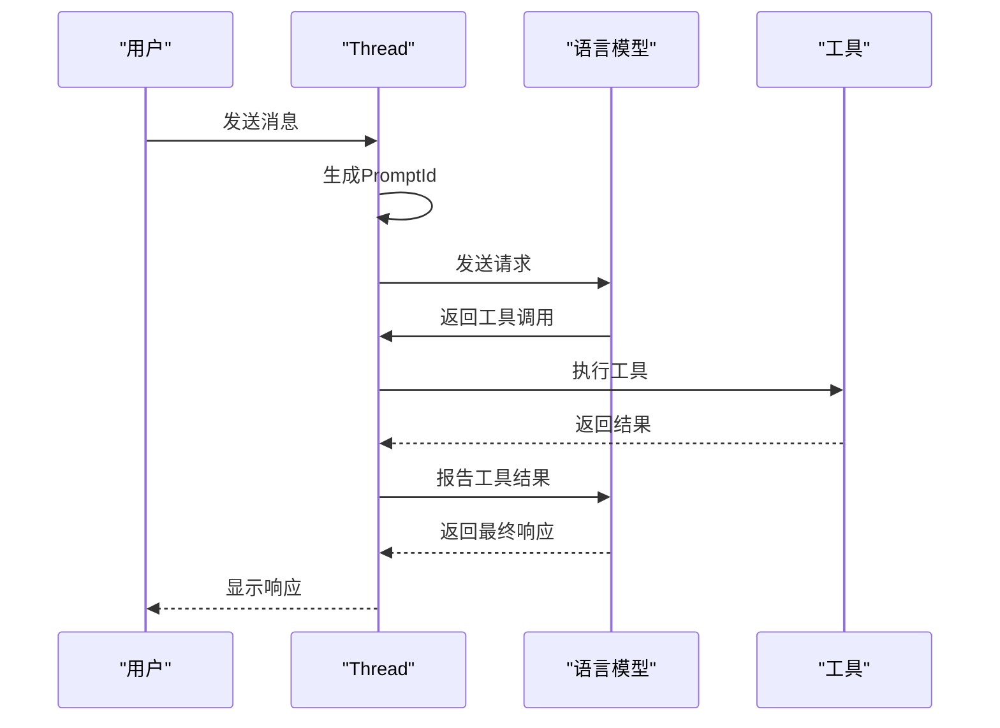
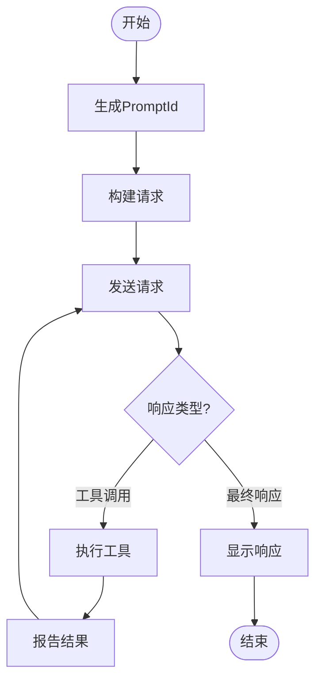
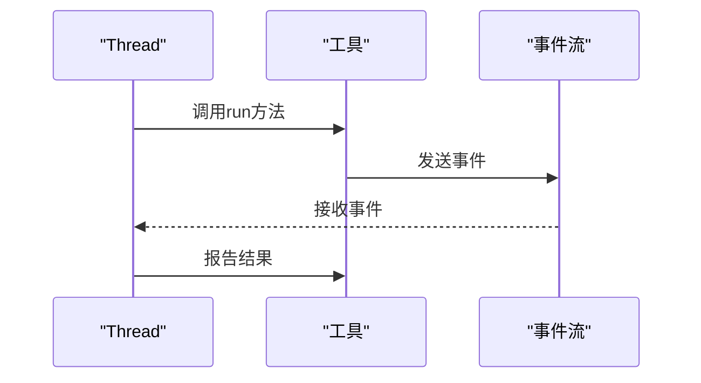
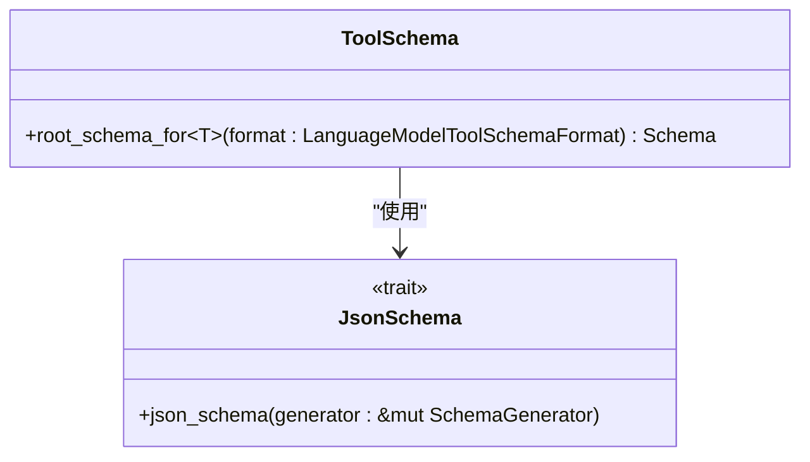
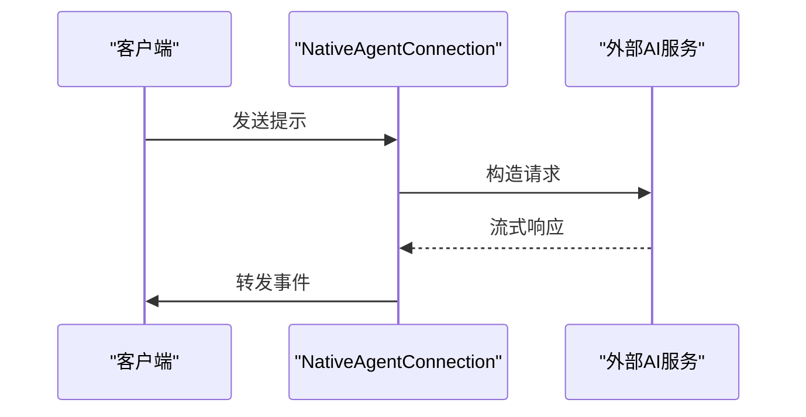
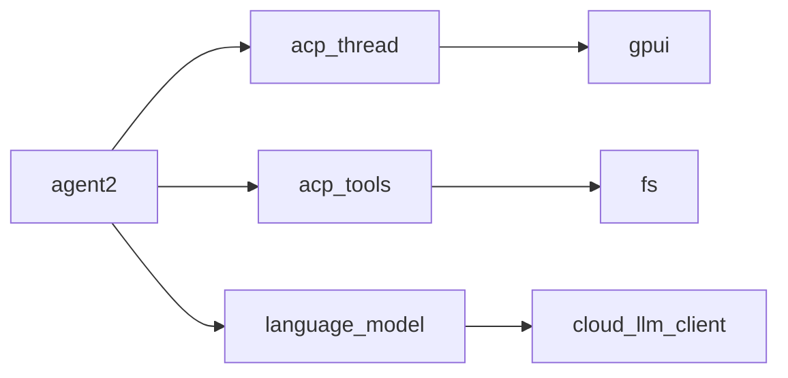

# AI代理核心架构

<cite>
**本文档引用的文件**
- [agent.rs](file://crates/agent2/src/agent.rs)
- [thread.rs](file://crates/agent2/src/thread.rs)
- [tool_schema.rs](file://crates/agent2/src/tool_schema.rs)
- [tools.rs](file://crates/agent2/src/tools.rs)
- [agent2.rs](file://crates/agent2/src/agent2.rs)
- [edit_file_tool.rs](file://crates/agent2/src/tools/edit_file_tool.rs)
- [web_search_tool.rs](file://crates/agent2/src/tools/web_search_tool.rs)
</cite>

## 目录
1. [简介](#简介)
2. [项目结构](#项目结构)
3. [核心组件](#核心组件)
4. [架构概述](#架构概述)
5. [详细组件分析](#详细组件分析)
6. [依赖分析](#依赖分析)
7. [性能考量](#性能考量)
8. [故障排除指南](#故障排除指南)
9. [结论](#结论)

## 简介
`agent2` crate 是一个AI代理系统的核心逻辑中枢，负责管理对话状态、执行工具调用以及与外部AI服务（如Claude）集成。该系统采用模块化设计，通过状态机管理对话流程，并支持灵活的工具注册与执行机制。其主要功能包括会话管理、提示工程处理、响应解析和错误重试策略。

## 项目结构
`agent2` crate 的目录结构清晰地划分了不同职责的模块，主要包括：

- `src/agent.rs`: 定义了 `NativeAgent` 和 `NativeAgentConnection` 结构体，作为代理的核心连接点。
- `src/thread.rs`: 实现了 `Thread` 结构体，用于维护对话上下文和状态机逻辑。
- `src/tool_schema.rs`: 提供工具描述的序列化与动态调用机制。
- `src/tools/`: 包含各种内置工具的具体实现，如 `edit_file_tool` 和 `web_search_tool`。
- `src/db.rs`: 负责持久化存储对话数据。
- `src/templates.rs`: 管理系统提示模板。

**图表来源**
- [agent.rs](file://crates/agent2/src/agent.rs#L1133-L1135)
- [thread.rs](file://crates/agent2/src/thread.rs#L509-L524)
- [tool_schema.rs](file://crates/agent2/src/tool_schema.rs#L1-L43)
- [tools.rs](file://crates/agent2/src/tools.rs#L1-L60)

**章节来源**
- [agent2.rs](file://crates/agent2/src/agent2.rs#L6-L6)

## 核心组件

`agent2` crate 的核心组件包括 `Thread` 结构体、工具调用系统和会话管理机制。`Thread` 结构体通过状态机设计来管理对话流程，确保每个用户消息都能得到适当的处理。工具调用系统允许注册和执行各种工具，如文件编辑和网络搜索，从而扩展代理的功能。

**章节来源**
- [thread.rs](file://crates/agent2/src/thread.rs#L509-L524)
- [tools.rs](file://crates/agent2/src/tools.rs#L1-L60)

## 架构概述

`agent2` crate 的架构设计围绕 `Thread` 结构体展开，它负责维护对话上下文并协调工具调用。当用户发送消息时，`Thread` 会生成一个 `PromptId` 并启动一个新的对话轮次。在此过程中，`Thread` 会构建一个包含系统提示和用户消息的请求，并将其发送给选定的语言模型。如果模型返回工具调用，则 `Thread` 会执行相应的工具并报告结果。

**图表来源**
- [thread.rs](file://crates/agent2/src/thread.rs#L509-L524)
- [agent.rs](file://crates/agent2/src/agent.rs#L1133-L1135)

## 详细组件分析

### Thread结构体的状态机设计
`Thread` 结构体通过状态机设计来管理对话流程。每当用户发送消息时，`Thread` 会创建一个新的 `PromptId` 并启动一个新的对话轮次。在此过程中，`Thread` 会构建一个包含系统提示和用户消息的请求，并将其发送给选定的语言模型。如果模型返回工具调用，则 `Thread` 会执行相应的工具并报告结果。

#### 状态机流程图

**图表来源**
- [thread.rs](file://crates/agent2/src/thread.rs#L509-L524)

### 会话管理机制
`Thread` 结构体通过 `prompt_id` 和 `messages` 字段来维护对话上下文。每次用户发送消息时，`Thread` 都会生成一个新的 `PromptId` 并将消息添加到 `messages` 列表中。此外，`Thread` 还会跟踪每个消息的令牌使用情况，并在必要时更新会话标题和摘要。

**章节来源**
- [thread.rs](file://crates/agent2/src/thread.rs#L509-L524)

### 工具调用系统
`agent2` crate 提供了一个灵活的工具调用系统，允许注册和执行各种工具。工具通过 `AgentTool` trait 定义，每个工具都有一个唯一的名称、描述和输入模式。`Thread` 结构体会根据当前会话的配置选择启用的工具，并在需要时执行它们。

#### 工具调用流程

**图表来源**
- [thread.rs](file://crates/agent2/src/thread.rs#L509-L524)
- [tools.rs](file://crates/agent2/src/tools.rs#L1-L60)

### 工具描述的序列化与动态调用机制
`tool_schema.rs` 文件提供了工具描述的序列化与动态调用机制。通过 `root_schema_for` 函数，可以为任何实现了 `JsonSchema` trait 的类型生成 JSON 模式。这使得工具的输入模式可以在运行时动态生成，并根据不同的格式要求进行调整。

**图表来源**
- [tool_schema.rs](file://crates/agent2/src/tool_schema.rs#L1-L43)

### 提示工程处理流程和响应解析逻辑
`Thread` 结构体通过 `build_completion_request` 方法构建完成请求。该方法会收集所有启用的工具，并将它们的输入模式添加到请求中。然后，`Thread` 会将请求发送给选定的语言模型，并处理返回的事件流。对于每个事件，`Thread` 会调用相应的处理函数，如 `handle_text_event` 或 `handle_tool_use_event`。

**章节来源**
- [thread.rs](file://crates/agent2/src/thread.rs#L509-L524)

### 与外部AI服务的集成模式
`agent2` crate 通过 `NativeAgentConnection` 结构体与外部AI服务（如Claude）集成。`NativeAgentConnection` 实现了 `AgentConnection` trait，提供了创建新会话、发送提示和取消会话等功能。此外，`NativeAgentConnection` 还支持模型选择和权限认证。

#### 请求构造与流式响应处理

**图表来源**
- [agent.rs](file://crates/agent2/src/agent.rs#L1133-L1135)

### 错误重试策略
`Thread` 结构体实现了基于指数退避的错误重试策略。当遇到可恢复的错误时，`Thread` 会根据错误类型选择适当的重试策略，并在指定的延迟后重新尝试。最大重试次数由 `MAX_RETRY_ATTEMPTS` 常量定义。

**章节来源**
- [thread.rs](file://crates/agent2/src/thread.rs#L509-L524)

## 依赖分析

`agent2` crate 依赖于多个其他crate，包括 `acp_thread`、`acp_tools` 和 `language_model`。这些依赖项提供了必要的接口和功能，使 `agent2` 能够与其他系统集成并执行复杂的任务。

**图表来源**
- [Cargo.toml](file://crates/agent2/Cargo.toml#L1-L10)

## 性能考量

`agent2` crate 在设计时考虑了性能优化。例如，`Thread` 结构体通过缓存令牌使用情况和会话标题来减少不必要的计算。此外，`Thread` 还支持流式响应处理，允许在接收到部分响应时立即向用户显示内容。

[无来源，因为本节提供一般性指导]

## 故障排除指南

### 常见问题
- **工具调用失败**: 检查工具是否正确注册，并确保输入符合预期模式。
- **模型响应延迟**: 确认网络连接正常，并检查外部AI服务的状态。
- **会话标题未更新**: 确保 `generate_title` 方法被正确调用。

**章节来源**
- [thread.rs](file://crates/agent2/src/thread.rs#L509-L524)

## 结论

`agent2` crate 是一个功能强大且高度可扩展的AI代理系统。通过状态机设计、灵活的工具调用系统和与外部AI服务的无缝集成，`agent2` 能够有效地管理复杂的对话流程。未来的工作可以集中在进一步优化性能和增加更多内置工具上。

[无来源，因为本节总结而不分析特定文件]