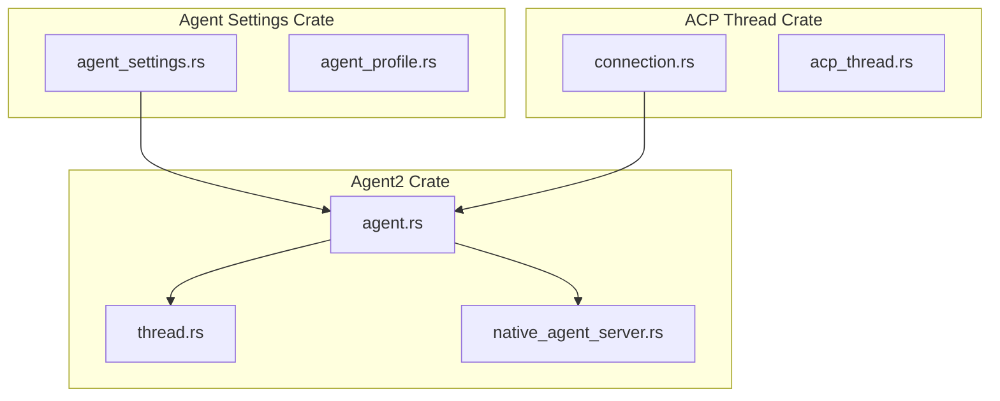
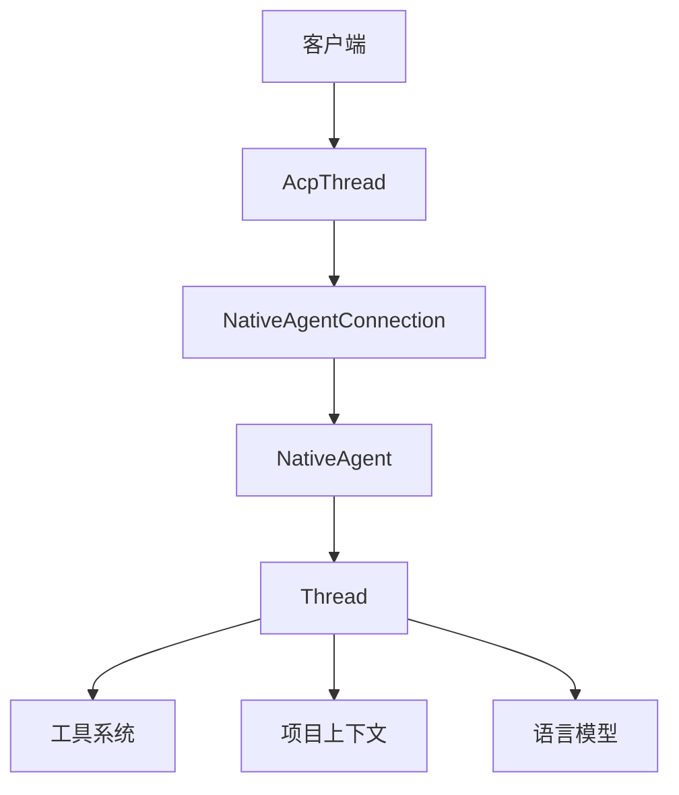
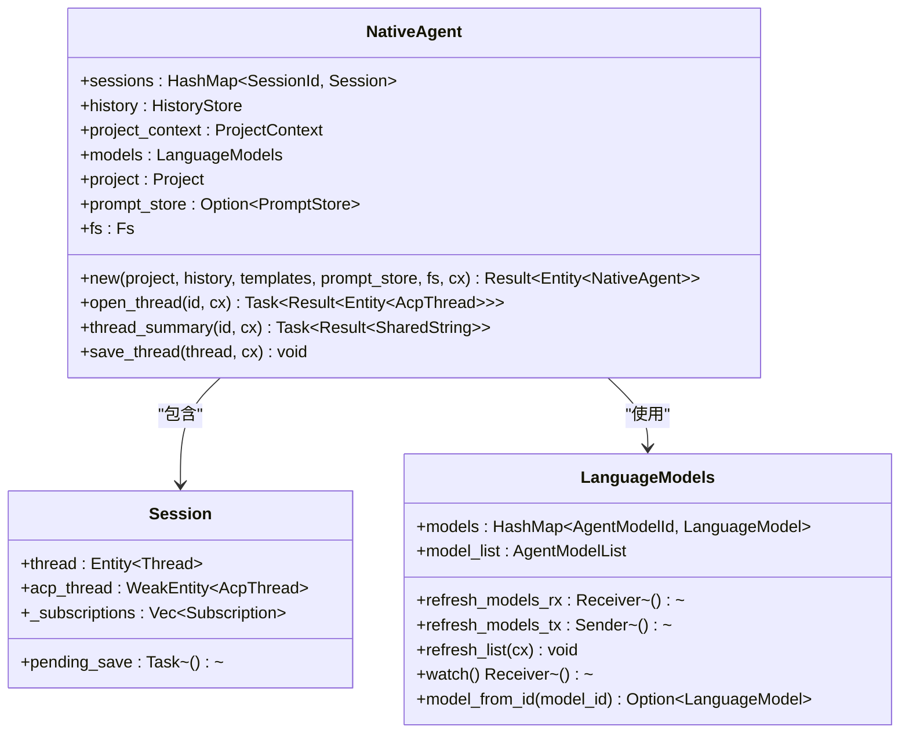
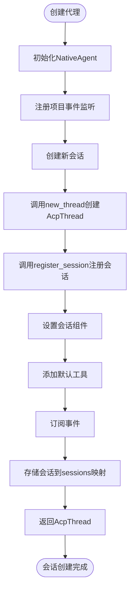
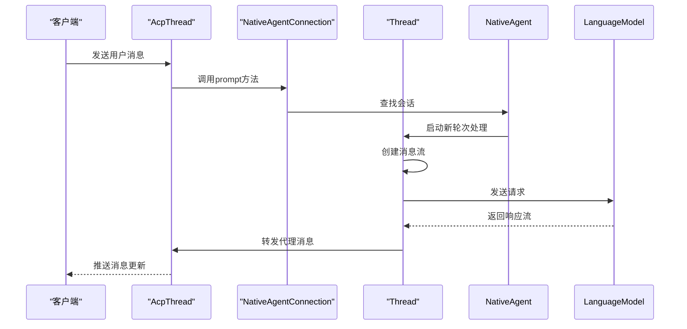
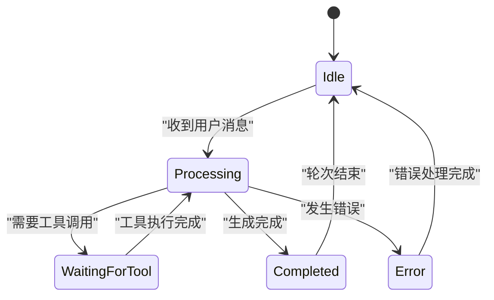
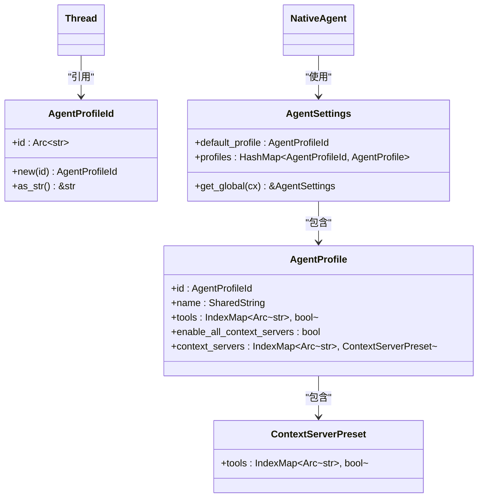
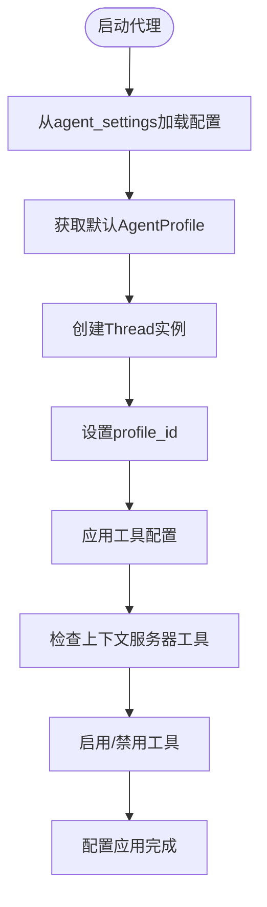

# 代理实例管理

<cite>
**本文档中引用的文件**   
- [agent.rs](file://crates/agent2/src/agent.rs)
- [thread.rs](file://crates/agent2/src/thread.rs)
- [agent_profile.rs](file://crates/agent_settings/src/agent_profile.rs)
- [agent_settings.rs](file://crates/agent_settings/src/agent_settings.rs)
- [connection.rs](file://crates/acp_thread/src/connection.rs)
</cite>

## 目录
1. [引言](#引言)
2. [项目结构](#项目结构)
3. [核心组件](#核心组件)
4. [架构概述](#架构概述)
5. [详细组件分析](#详细组件分析)
6. [依赖分析](#依赖分析)
7. [性能考虑](#性能考虑)
8. [故障排除指南](#故障排除指南)
9. [结论](#结论)

## 引言
本文档深入分析了Agent结构体的设计与生命周期管理机制，阐述其作为AI代理运行时实例的核心职责。详细说明了代理的初始化流程、状态保持、与项目上下文（Project Context）的绑定关系，以及如何通过WeakEntity引用维护跨组件的松耦合。结合代码片段解释了代理的异步任务调度机制、事件监听系统（如AcpThreadEvent）和资源清理策略。讨论了AgentProfileId在个性化配置中的作用，并说明其与agent_settings crate的集成方式。提供了代理创建、启动、暂停和销毁的实际调用示例，涵盖错误处理和资源泄漏防护措施。

## 项目结构
代理系统分布在多个crates中，主要功能集中在agent2 crate中。该系统通过模块化设计实现了代理实例的创建、管理和通信功能。



**图示来源**
- [agent.rs](file://crates/agent2/src/agent.rs)
- [thread.rs](file://crates/agent2/src/thread.rs)
- [agent_settings.rs](file://crates/agent_settings/src/agent_settings.rs)
- [connection.rs](file://crates/acp_thread/src/connection.rs)

**本节来源**
- [agent.rs](file://crates/agent2/src/agent.rs)
- [thread.rs](file://crates/agent2/src/thread.rs)

## 核心组件
代理系统的核心由NativeAgent、Thread和AcpThread三个主要组件构成。NativeAgent负责管理多个会话的生命周期，Thread处理具体的对话逻辑和状态维护，而AcpThread则负责与外部系统的协议通信。

**本节来源**
- [agent.rs](file://crates/agent2/src/agent.rs#L1-L100)
- [thread.rs](file://crates/agent2/src/thread.rs#L1-L100)

## 架构概述
代理系统采用分层架构设计，将业务逻辑与通信协议分离。NativeAgent作为顶层协调者，管理多个会话实例。每个会话由Thread和AcpThread协同工作，其中Thread专注于内部状态管理和业务逻辑执行，AcpThread则处理外部通信协议。



**图示来源**
- [agent.rs](file://crates/agent2/src/agent.rs#L1-L50)
- [thread.rs](file://crates/agent2/src/thread.rs#L1-L50)

## 详细组件分析
### NativeAgent分析
NativeAgent是代理系统的核心管理组件，负责会话的创建、管理和销毁。它通过维护一个会话ID到会话实例的映射来跟踪所有活动会话。

#### 类图


**图示来源**
- [agent.rs](file://crates/agent2/src/agent.rs#L100-L200)

#### 会话管理流程


**图示来源**
- [agent.rs](file://crates/agent2/src/agent.rs#L300-L400)

**本节来源**
- [agent.rs](file://crates/agent2/src/agent.rs#L1-L500)

### Thread分析
Thread组件负责管理单个对话会话的内部状态和业务逻辑。它处理消息序列、工具调用和语言模型交互。

#### 消息处理流程


**图示来源**
- [thread.rs](file://crates/agent2/src/thread.rs#L500-L600)

#### 状态管理


**图示来源**
- [thread.rs](file://crates/agent2/src/thread.rs#L1000-L1100)

**本节来源**
- [thread.rs](file://crates/agent2/src/thread.rs#L1-L1500)

### 配置管理分析
代理系统的配置管理通过AgentProfileId实现个性化设置，与agent_settings crate紧密集成。

#### 配置结构


**图示来源**
- [agent_settings.rs](file://crates/agent_settings/src/agent_settings.rs#L1-L20)
- [agent_profile.rs](file://crates/agent_settings/src/agent_profile.rs#L1-L20)

#### 配置应用流程


**图示来源**
- [thread.rs](file://crates/agent2/src/thread.rs#L200-L300)
- [agent_settings.rs](file://crates/agent_settings/src/agent_settings.rs#L100-L120)

**本节来源**
- [agent_settings.rs](file://crates/agent_settings/src/agent_settings.rs#L1-L150)
- [agent_profile.rs](file://crates/agent_settings/src/agent_profile.rs#L1-L150)

## 依赖分析
代理系统通过清晰的依赖关系实现了组件间的松耦合。核心依赖关系如下：

```mermaid
graph TD
agent_settings --> agent : "提供配置"
acp_thread --> agent : "提供通信协议"
project --> agent : "提供项目上下文"
language_model --> agent : "提供语言模型"
fs --> agent : "提供文件系统访问"
prompt_store --> agent : "提供提示存储"
```

**图示来源**
- [agent.rs](file://crates/agent2/src/agent.rs#L1-L50)
- [Cargo.toml](file://crates/agent2/Cargo.toml#L1-L20)

**本节来源**
- [agent.rs](file://crates/agent2/src/agent.rs#L1-L50)
- [Cargo.toml](file://crates/agent2/Cargo.toml#L1-L20)

## 性能考虑
代理系统在设计时考虑了多项性能优化措施，包括异步任务调度、缓存机制和资源复用。

### 异步任务调度
系统采用任务队列和事件驱动模型，确保UI响应性。所有耗时操作都在后台线程执行，通过Task和Future机制管理异步操作。

### 缓存机制
- 项目上下文缓存：通过watch::Receiver机制监听项目变化，仅在必要时重新构建上下文
- 模型列表缓存：LanguageModels组件缓存模型信息，减少重复查询
- 会话状态缓存：Thread组件缓存消息历史和状态，提高响应速度

### 资源管理
系统通过WeakEntity引用避免循环引用，确保资源能够正确释放。会话结束时自动清理相关资源，防止内存泄漏。

## 故障排除指南
### 常见问题
1. **会话创建失败**：检查项目上下文是否正确初始化
2. **工具调用失败**：验证工具配置是否正确，检查权限设置
3. **模型连接问题**：确认语言模型提供者已正确认证

### 调试方法
1. 启用日志记录，查看详细的执行流程
2. 使用调试工具检查会话状态
3. 验证配置文件的正确性

**本节来源**
- [agent.rs](file://crates/agent2/src/agent.rs#L1000-L1100)
- [thread.rs](file://crates/agent2/src/thread.rs#L2000-L2100)

## 结论
代理实例管理系统通过精心设计的架构实现了高效、可扩展的AI代理运行时环境。系统采用分层设计，将通信协议、业务逻辑和配置管理分离，提高了代码的可维护性和可扩展性。通过WeakEntity引用和事件驱动模型，实现了组件间的松耦合和高效的资源管理。AgentProfileId机制提供了灵活的个性化配置能力，使系统能够适应不同的使用场景和用户需求。