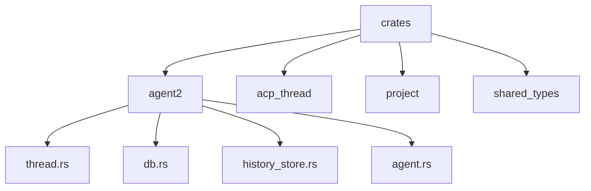
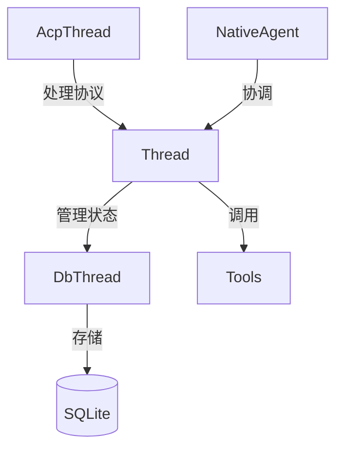
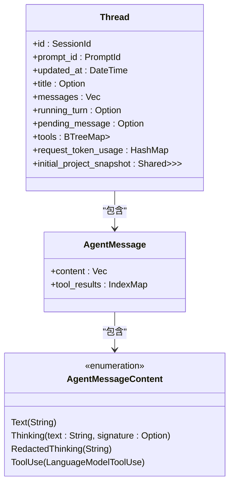
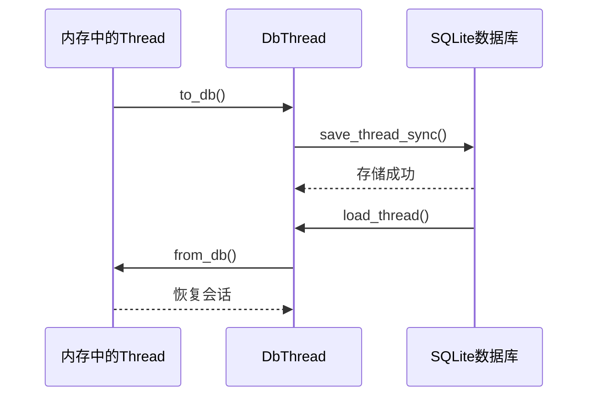
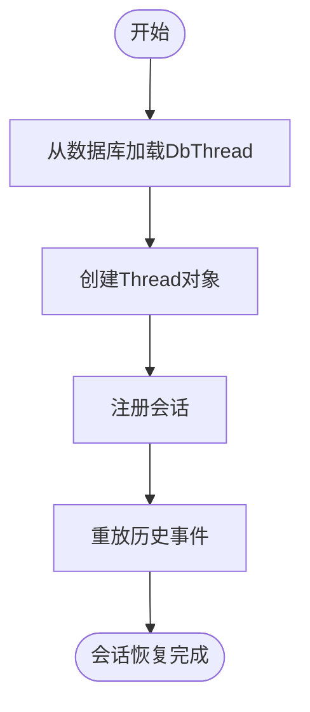
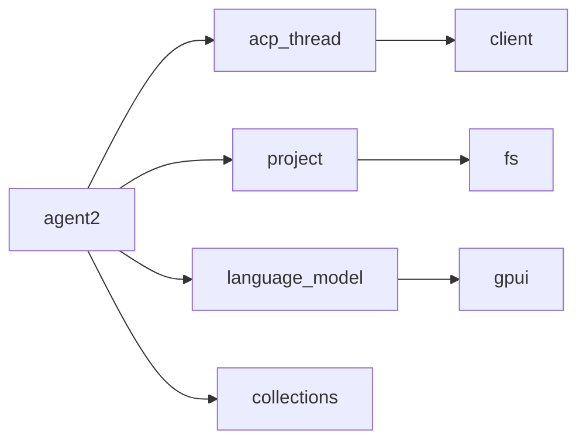

# 会话上下文管理

<cite>
**本文档中引用的文件**  
- [thread.rs](file://crates/agent2/src/thread.rs)
- [db.rs](file://crates/agent2/src/db.rs)
- [history_store.rs](file://crates/agent2/src/history_store.rs)
- [agent.rs](file://crates/agent2/src/agent.rs)
- [agent2.rs](file://crates/agent2/src/agent2.rs)
</cite>

## 目录
1. [简介](#简介)
2. [项目结构](#项目结构)
3. [核心组件](#核心组件)
4. [架构概述](#架构概述)
5. [详细组件分析](#详细组件分析)
6. [依赖分析](#依赖分析)
7. [性能考虑](#性能考虑)
8. [故障排除指南](#故障排除指南)
9. [结论](#结论)

## 简介
本文档全面解析了`Thread`结构体的上下文维护机制，阐明其如何在多轮对话中保持语义连贯性。详细描述了消息历史（AgentMessage）的存储结构、工具调用结果的索引映射（IndexMap）、以及TokenUsage的累积与追踪策略。解释了DbThread与内存中Thread对象的序列化/反序列化过程，包括项目快照（ProjectSnapshot）的持久化逻辑。结合AgentMessageContent枚举说明文本、思考过程和工具使用内容的混合表示方法。提供了会话恢复、截断和摘要生成的具体实现路径，并分析了updated_at时间戳在并发控制中的作用。

## 项目结构
该仓库采用模块化设计，主要功能集中在`crates`目录下。`agent2`模块是核心，负责会话管理、消息处理和工具调用。`acp_thread`模块处理与外部代理的通信协议。`project`模块管理项目上下文和文件系统。`shared_types`提供跨模块共享的数据类型。

**图源**  
- [thread.rs](file://crates/agent2/src/thread.rs)
- [db.rs](file://crates/agent2/src/db.rs)
- [history_store.rs](file://crates/agent2/src/history_store.rs)

**节源**  
- [thread.rs](file://crates/agent2/src/thread.rs)
- [db.rs](file://crates/agent2/src/db.rs)

## 核心组件
`Thread`结构体是会话管理的核心，它维护了完整的对话历史、工具状态和上下文信息。`DbThread`结构体定义了持久化数据的格式，确保会话可以在重启后恢复。`HistoryStore`管理会话的历史记录和最近打开的条目。

**节源**  
- [thread.rs](file://crates/agent2/src/thread.rs#L579-L610)
- [db.rs](file://crates/agent2/src/db.rs#L34-L53)
- [history_store.rs](file://crates/agent2/src/history_store.rs)

## 架构概述
系统采用分层架构，上层为`AcpThread`处理协议通信，中层为`Thread`处理业务逻辑，底层为`DbThread`负责数据持久化。`NativeAgent`作为协调者，管理多个会话的生命周期。

**图源**  
- [thread.rs](file://crates/agent2/src/thread.rs)
- [agent.rs](file://crates/agent2/src/agent.rs)

## 详细组件分析

### Thread结构体分析
`Thread`结构体维护了会话的所有状态，包括消息历史、工具使用情况和令牌使用统计。

#### 类图

**图源**  
- [thread.rs](file://crates/agent2/src/thread.rs#L579-L610)
- [thread.rs](file://crates/agent2/src/thread.rs#L509-L524)

**节源**  
- [thread.rs](file://crates/agent2/src/thread.rs#L579-L610)

### 消息存储与序列化
`DbThread`结构体定义了持久化数据的格式，通过`from_json`和`save_thread_sync`方法实现序列化和反序列化。

#### 序列图

**图源**  
- [thread.rs](file://crates/agent2/src/thread.rs)
- [db.rs](file://crates/agent2/src/db.rs)

**节源**  
- [db.rs](file://crates/agent2/src/db.rs#L34-L53)

### 会话恢复流程
会话恢复通过`NativeAgent`的`open_thread`方法实现，从数据库加载`DbThread`并重建内存中的`Thread`对象。

#### 流程图

**图源**  
- [agent.rs](file://crates/agent2/src/agent.rs)

**节源**  
- [agent.rs](file://crates/agent2/src/agent.rs)

## 依赖分析
系统依赖关系清晰，`agent2`模块依赖`acp_thread`进行通信，依赖`project`获取项目上下文，依赖`language_model`进行AI推理。

**图源**  
- [agent2.rs](file://crates/agent2/src/agent2.rs)
- [Cargo.toml](file://crates/agent2/Cargo.toml)

**节源**  
- [agent2.rs](file://crates/agent2/src/agent2.rs)

## 性能考虑
- 使用`IndexMap`高效存储工具调用结果
- 对会话数据进行zstd压缩以减少存储空间
- 使用`watch::Sender/Receiver`实现高效的变更通知
- `Shared<Task>`用于共享异步操作，避免重复计算

## 故障排除指南
- **会话无法恢复**：检查数据库文件`threads.db`是否存在，确认`DbThread`版本兼容性
- **工具调用失败**：检查`tools`字段是否正确注册了工具实现
- **性能下降**：监控`request_token_usage`，考虑对长会话进行截断或摘要
- **并发冲突**：`updated_at`字段用于乐观并发控制，确保会话更新时时间戳正确

**节源**  
- [thread.rs](file://crates/agent2/src/thread.rs)
- [db.rs](file://crates/agent2/src/db.rs)

## 结论
`Thread`结构体通过精心设计的状态管理机制，实现了复杂的会话上下文维护功能。其分层架构将内存状态与持久化存储分离，既保证了运行时性能，又确保了数据可靠性。通过`AgentMessageContent`的混合表示和`IndexMap`的工具结果索引，系统能够灵活处理多模态的AI交互。`updated_at`时间戳和`watch`通道的组合使用，有效解决了并发控制和实时更新的问题。