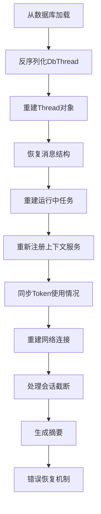
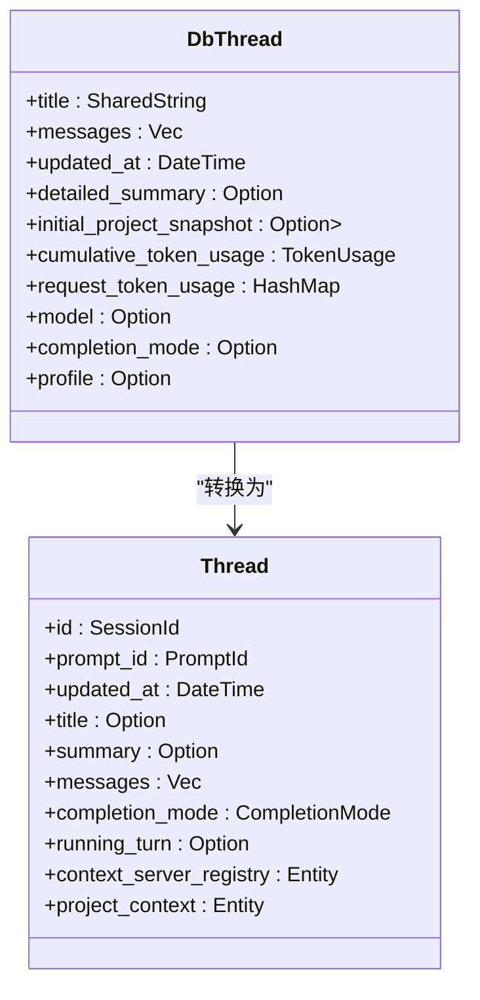
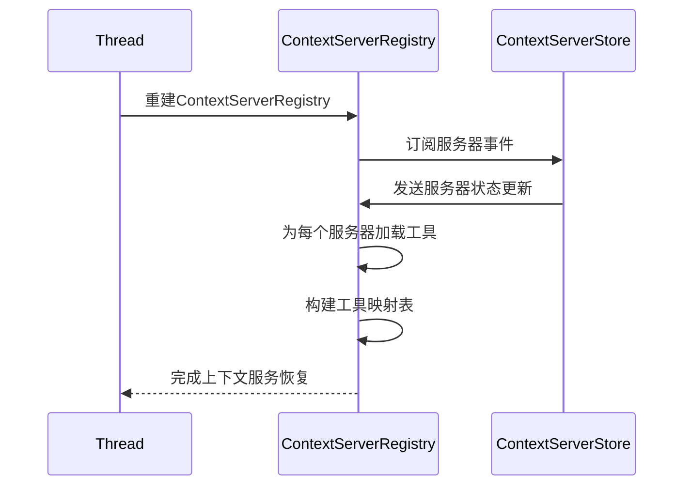
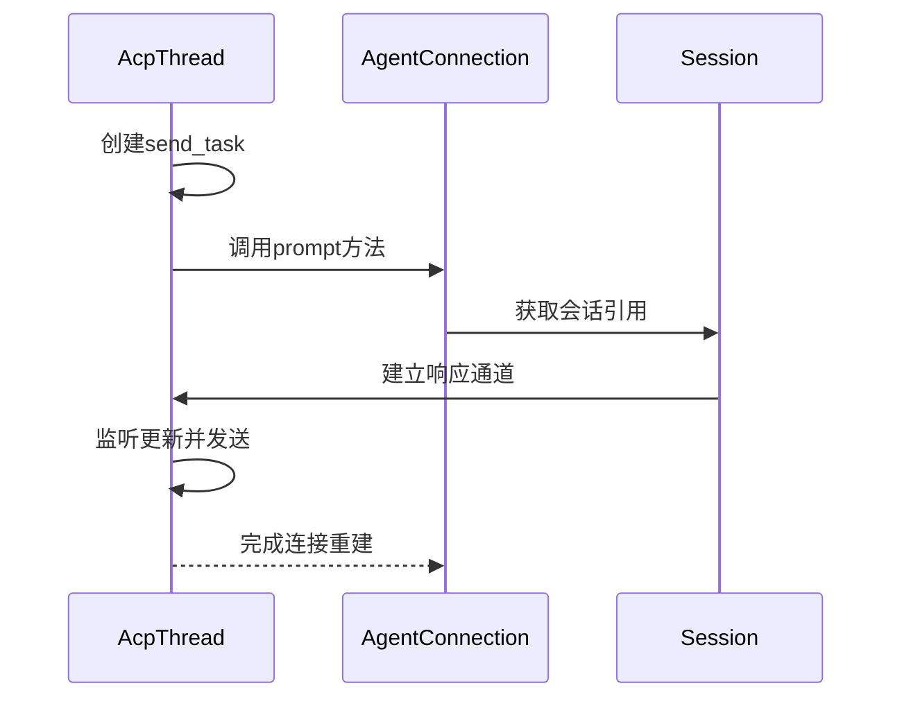
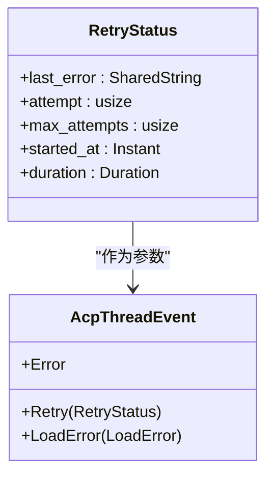

# 会话恢复机制

<cite>
**本文档引用的文件**
- [db.rs](file://crates/agent2/src/db.rs)
- [thread.rs](file://crates/agent2/src/thread.rs)
- [acp_thread.rs](file://crates/acp_thread/src/acp_thread.rs)
- [context_server_registry.rs](file://crates/agent2/src/tools/context_server_registry.rs)
- [connection.rs](file://crates/acp_thread/src/connection.rs)
</cite>

## 目录
1. [引言](#引言)
2. [会话恢复流程概述](#会话恢复流程概述)
3. [DbThread反序列化与Thread重建](#dbthread反序列化与thread重建)
4. [消息结构转换与内存重建](#消息结构转换与内存重建)
5. [运行中任务与上下文服务恢复](#运行中任务与上下文服务恢复)
6. [条目对应关系与恢复策略](#条目对应关系与恢复策略)
7. [Token使用与能力同步机制](#token使用与能力同步机制)
8. [网络连接与发送任务重建](#网络连接与发送任务重建)
9. [会话截断、摘要与错误恢复](#会话截断摘要与错误恢复)
10. [重试机制与RetryStatus](#重试机制与retrystatus)

## 引言
本文档详细说明了会话恢复的完整流程，从数据库中存储的会话数据反序列化开始，到内存中完整会话对象的重建过程。重点分析了消息数据结构的转换、运行中任务的恢复、上下文服务的重新注册等关键机制。

## 会话恢复流程概述
会话恢复流程始于从数据库加载序列化的会话数据（DbThread），经过反序列化后重建为内存中的Thread对象。该过程涉及消息结构转换、运行状态恢复、上下文服务重新注册、网络连接重建等多个关键步骤，确保会话能够从断点处继续执行。



**Diagram sources**
- [db.rs](file://crates/agent2/src/db.rs#L34-L53)
- [thread.rs](file://crates/agent2/src/thread.rs#L579-L610)

## DbThread反序列化与Thread重建
会话恢复的第一步是从数据库中加载并反序列化DbThread结构。DbThread是会话数据在数据库中的持久化表示，包含会话标题、消息列表、更新时间等核心信息。



**Diagram sources**
- [db.rs](file://crates/agent2/src/db.rs#L34-L53)
- [thread.rs](file://crates/agent2/src/thread.rs#L579-L610)

**Section sources**
- [db.rs](file://crates/agent2/src/db.rs#L34-L53)
- [thread.rs](file://crates/agent2/src/thread.rs#L579-L610)

## 消息结构转换与内存重建
在会话恢复过程中，需要将DbThread中的消息列表转换为内存中的消息结构。这一过程涉及从DbMessage到Message的类型转换，以及消息内容的重新构建。

**Section sources**
- [db.rs](file://crates/agent2/src/db.rs#L34-L53)
- [thread.rs](file://crates/agent2/src/thread.rs#L1951-L2001)

## 运行中任务与上下文服务恢复
会话恢复需要重建运行中的任务（running_turn）并重新注册上下文服务。context_server_registry负责管理上下文服务器的注册和工具调用。



**Diagram sources**
- [context_server_registry.rs](file://crates/agent2/src/tools/context_server_registry.rs#L0-L32)
- [thread.rs](file://crates/agent2/src/thread.rs#L1918-L1949)

**Section sources**
- [context_server_registry.rs](file://crates/agent2/src/tools/context_server_registry.rs#L0-L32)
- [thread.rs](file://crates/agent2/src/thread.rs#L1918-L1949)

## 条目对应关系与恢复策略
AcpThread中的entries与AgentThreadEntry存在明确的对应关系，包括UserMessage、AssistantMessage和ToolCall三种条目的恢复策略。

```mermaid
classDiagram
class AcpThread {
+entries : Vec<AgentThreadEntry>
+send_task : Option<Task<()>>
+connection : Rc<dyn AgentConnection>
+token_usage : Option<TokenUsage>
}
class AgentThreadEntry {
+UserMessage(UserMessage)
+AssistantMessage(AssistantMessage)
+ToolCall(ToolCall)
}
class UserMessage {
+id : UserMessageId
+content : ContentBlock
+chunks : Vec<ContentBlock>
}
class AssistantMessage {
+id : AssistantMessageId
+content : Vec<ContentBlock>
+tool_calls : Vec<ToolCall>
}
class ToolCall {
+id : ToolCallId
+name : SharedString
+arguments : serde_json : : Value
}
AcpThread --> AgentThreadEntry : "包含"
AgentThreadEntry <|-- UserMessage
AgentThreadEntry <|-- AssistantMessage
AgentThreadEntry <|-- ToolCall
```

**Diagram sources**
- [acp_thread.rs](file://crates/acp_thread/src/acp_thread.rs#L775-L789)
- [acp_thread.rs](file://crates/acp_thread/src/acp_thread.rs#L112-L117)

**Section sources**
- [acp_thread.rs](file://crates/acp_thread/src/acp_thread.rs#L775-L789)
- [acp_thread.rs](file://crates/acp_thread/src/acp_thread.rs#L112-L117)

## Token使用与能力同步机制
会话恢复过程中需要同步token_usage和prompt_capabilities，确保模型使用情况和功能能力的准确性。

**Section sources**
- [http_agent.rs](file://crates/http_server/src/http_agent.rs#L362-L395)
- [acp_thread.rs](file://crates/acp_thread/src/acp_thread.rs#L891-L929)

## 网络连接与发送任务重建
send_task的重建是会话恢复的关键环节，它负责处理与代理的网络通信。



**Diagram sources**
- [connection.rs](file://crates/acp_thread/src/connection.rs#L379-L412)
- [acp_thread.rs](file://crates/acp_thread/src/acp_thread.rs#L1462-L1497)

**Section sources**
- [connection.rs](file://crates/acp_thread/src/connection.rs#L379-L412)
- [acp_thread.rs](file://crates/acp_thread/src/acp_thread.rs#L1462-L1497)

## 会话截断、摘要与错误恢复
会话恢复机制包含会话截断、摘要生成和错误恢复的具体实现路径。

**Section sources**
- [http_agent.rs](file://crates/http_server/src/http_agent.rs#L269-L301)
- [thread.rs](file://crates/agent2/src/thread.rs#L1318-L1355)

## 重试机制与RetryStatus
RetryStatus在重试机制中扮演重要角色，记录了重试状态的关键信息。



**Diagram sources**
- [acp_thread.rs](file://crates/acp_thread/src/acp_thread.rs#L766-L773)
- [acp_thread.rs](file://crates/acp_thread/src/acp_thread.rs#L791-L807)

**Section sources**
- [acp_thread.rs](file://crates/acp_thread/src/acp_thread.rs#L766-L773)
- [thread.rs](file://crates/agent2/src/thread.rs#L1353-L1394)