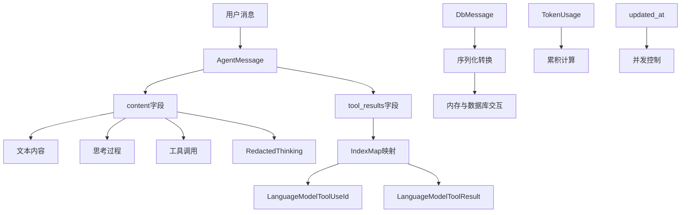
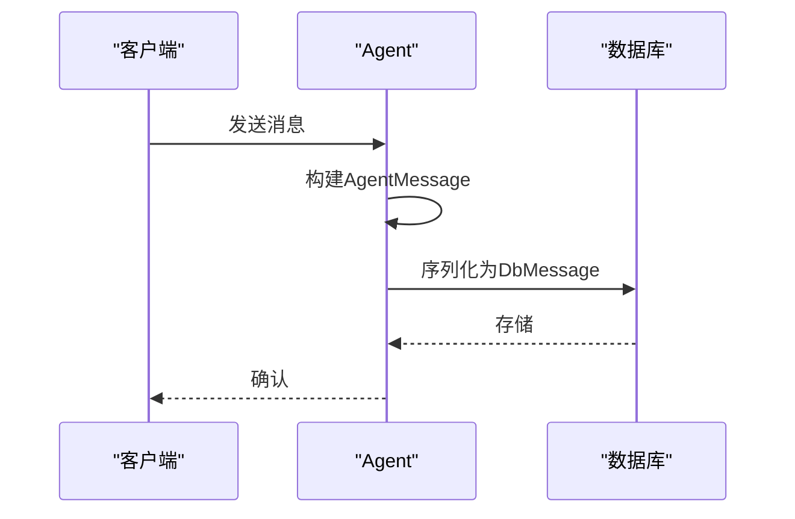
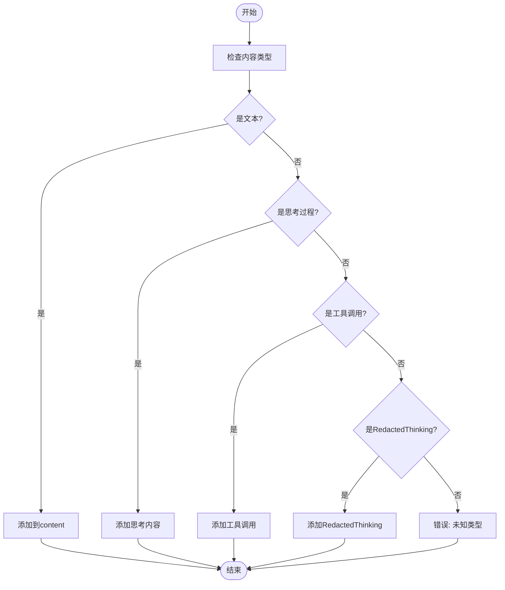
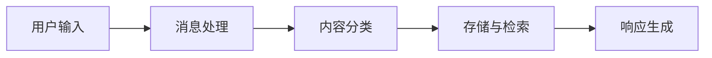
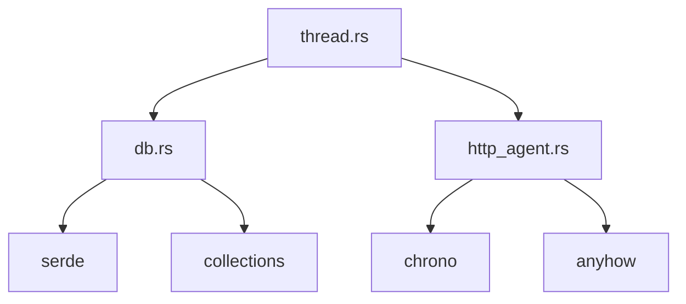

# 消息结构设计

<cite>
**本文档中引用的文件**   
- [thread.rs](file://crates/agent2/src/thread.rs)
- [db.rs](file://crates/agent2/src/db.rs)
- [http_agent.rs](file://crates/http_server/src/http_agent.rs)
</cite>

## 目录
1. [引言](#引言)
2. [核心组件](#核心组件)
3. [架构概述](#架构概述)
4. [详细组件分析](#详细组件分析)
5. [依赖分析](#依赖分析)
6. [性能考虑](#性能考虑)
7. [故障排除指南](#故障排除指南)
8. [结论](#结论)

## 引言
本文档深入解析AgentMessage结构体的设计原理，重点阐述其content字段如何通过AgentMessageContent枚举支持文本、思考过程和工具调用的混合内容表示。详细说明tool_results字段使用IndexMap进行工具调用结果索引的实现机制，包括LanguageModelToolUseId与LanguageModelToolResult的映射关系。结合DbMessage的序列化结构，分析消息在内存与数据库间的转换过程，特别关注TokenUsage的累积计算逻辑和updated_at时间戳的并发控制作用。提供实际代码示例展示多轮对话中消息的构建与处理流程，并说明RedactedThinking等特殊内容类型的使用场景。

## 核心组件

[深入分析核心组件，包括代码片段和解释]

**Section sources**
- [thread.rs](file://crates/agent2/src/thread.rs#L509-L524)
- [db.rs](file://crates/agent2/src/db.rs#L22-L22)

## 架构概述

[系统架构的全面可视化和解释]



**Diagram sources **
- [thread.rs](file://crates/agent2/src/thread.rs#L509-L524)
- [db.rs](file://crates/agent2/src/db.rs#L22-L22)

## 详细组件分析

[对每个关键组件的彻底分析，包括图表、代码片段路径和解释]

### AgentMessage结构分析
[对AgentMessage结构的分析内容，包含具体文件分析]

#### 对于对象导向组件：
```mermaid
classDiagram
class AgentMessage {
+Vec<AgentMessageContent> content
+IndexMap<LanguageModelToolUseId, LanguageModelToolResult> tool_results
+to_markdown() String
+to_request() Vec<LanguageModelRequestMessage>
}
class AgentMessageContent {
+Text(String)
+Thinking{text : String, signature : Option<String>}
+RedactedThinking(String)
+ToolUse(LanguageModelToolUse)
}
AgentMessage --> AgentMessageContent : "包含"
```

**Diagram sources **
- [thread.rs](file://crates/agent2/src/thread.rs#L509-L513)
- [thread.rs](file://crates/agent2/src/thread.rs#L515-L524)

#### 对于API/服务组件：


**Diagram sources **
- [thread.rs](file://crates/agent2/src/thread.rs#L509-L524)
- [db.rs](file://crates/agent2/src/db.rs#L22-L22)

#### 对于复杂逻辑组件：


**Diagram sources **
- [thread.rs](file://crates/agent2/src/thread.rs#L515-L524)

**Section sources**
- [thread.rs](file://crates/agent2/src/thread.rs#L509-L524)

### 概念概述
[不分析特定文件的一般概念内容]



[没有来源，因为此图表显示的是概念工作流，而不是实际的代码结构]

[没有来源，因为此部分不分析特定的源文件]

## 依赖分析

[对组件间依赖关系的分析]



**Diagram sources **
- [thread.rs](file://crates/agent2/src/thread.rs)
- [db.rs](file://crates/agent2/src/db.rs)
- [http_agent.rs](file://crates/http_server/src/http_agent.rs)

**Section sources**
- [thread.rs](file://crates/agent2/src/thread.rs)
- [db.rs](file://crates/agent2/src/db.rs)

## 性能考虑

[不分析特定文件的一般性能讨论]
[没有来源，因为此部分提供一般指导]

## 故障排除指南

[错误处理代码和调试工具的分析]

**Section sources**
- [thread.rs](file://crates/agent2/src/thread.rs#L509-L524)
- [db.rs](file://crates/agent2/src/db.rs#L22-L22)

## 结论

[发现和建议的总结]
[没有来源，因为此部分总结而不分析特定文件]