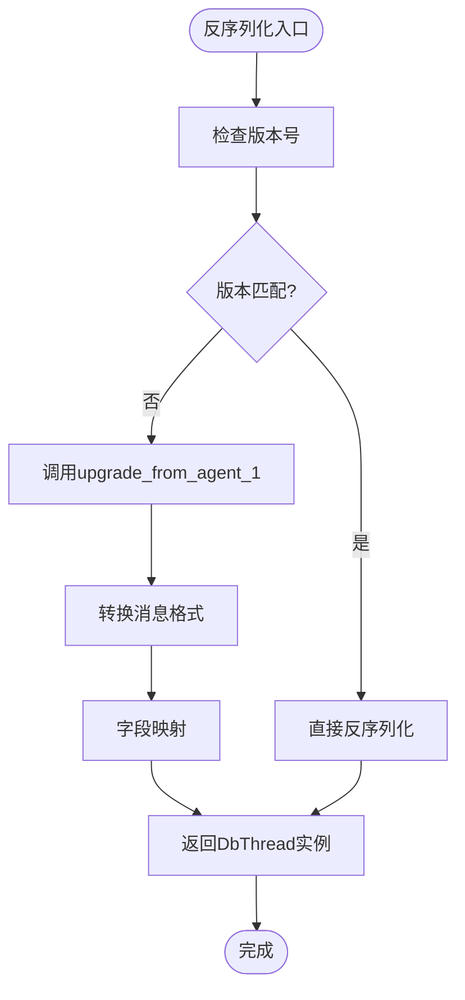
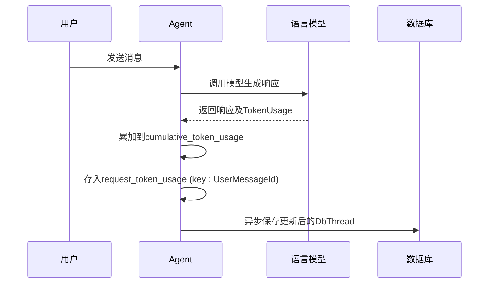
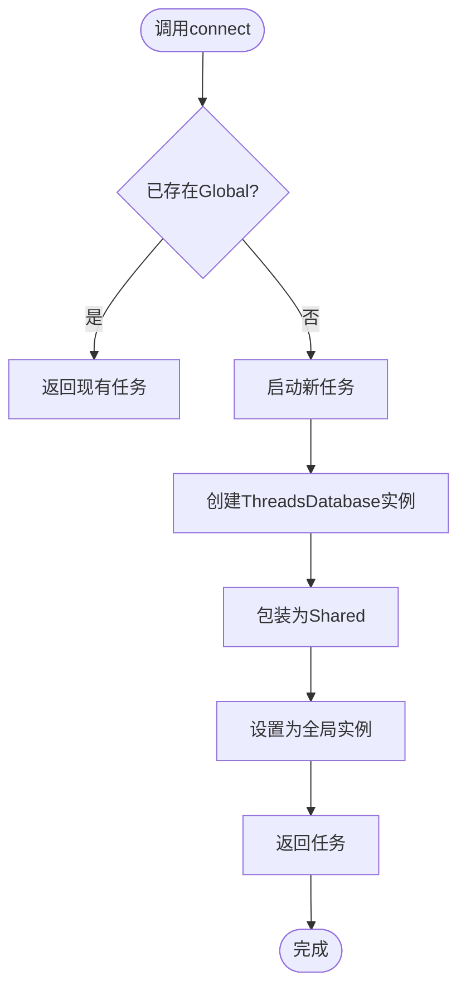

# 状态持久化机制

<cite>
**本文档引用的文件**  
- [db.rs](file://crates/agent2/src/db.rs)
- [thread.rs](file://crates/agent2/src/thread.rs)
- [http_agent.rs](file://crates/http_server/src/http_agent.rs)
</cite>

## 目录
1. [引言](#引言)
2. [核心数据结构](#核心数据结构)
3. [DbThread序列化策略](#dbthread序列化策略)
4. [元数据与会话索引](#元数据与会话索引)
5. [快照与上下文存储](#快照与上下文存储)
6. [Token使用量累积逻辑](#token使用量累积逻辑)
7. [全局数据库异步加载机制](#全局数据库异步加载机制)
8. [错误处理与兼容性策略](#错误处理与兼容性策略)
9. [结论](#结论)

## 引言
本文档全面阐述了`DbThread`结构体在会话状态持久化中的设计原理与实现机制。重点分析其字段的序列化策略、与内存中`Thread`对象的映射关系、元数据索引作用、快照存储机制以及Token使用量的累积逻辑。同时，结合`GlobalThreadsDatabase`的异步加载模式，说明会话数据的延迟初始化和错误处理策略，并提供数据库模式演进的兼容性建议。

## 核心数据结构

本节介绍会话持久化系统中的核心数据结构及其职责。

**Section sources**
- [db.rs](file://crates/agent2/src/db.rs#L26-L53)

## DbThread序列化策略

`DbThread`结构体是会话数据持久化的核心载体，其字段设计体现了内存对象与存储格式的映射关系。

### 字段映射与序列化
- `title`: 会话标题，直接映射为`SharedString`类型，用于快速索引。
- `messages`: 消息列表，存储为`Vec<DbMessage>`，完整保留对话历史。
- `updated_at`: 时间戳，记录会话最后更新时间，用于排序和同步。
- `detailed_summary`: 详细摘要，可选字段，存储由AI生成的会话内容总结。
- `cumulative_token_usage`: 累积Token使用量，记录整个会话生命周期内的总消耗。
- `request_token_usage`: 按请求粒度记录Token使用量，键为`UserMessageId`，值为对应请求的使用统计。

### 版本控制与升级
`DbThread`实现了版本控制机制（`VERSION: "0.3.0"`），通过`from_json`方法支持从旧版本（Agent 1）数据格式升级。当检测到版本不匹配时，自动调用`upgrade_from_agent_1`方法进行数据迁移，确保向后兼容。



**Diagram sources**
- [db.rs](file://crates/agent2/src/db.rs#L55-L232)

**Section sources**
- [db.rs](file://crates/agent2/src/db.rs#L34-L53)
- [db.rs](file://crates/agent2/src/db.rs#L55-L232)

## 元数据与会话索引

`DbThreadMetadata`结构体用于轻量级会话索引，优化列表查询性能。

### 结构定义
```rust
pub struct DbThreadMetadata {
    pub id: acp::SessionId,
    #[serde(alias = "summary")]
    pub title: SharedString,
    pub updated_at: DateTime<Utc>,
}
```

### 索引作用
- **快速列表加载**：`list_threads`方法仅查询`threads`表的`id`、`summary`（映射为`title`）和`updated_at`字段，避免加载完整会话数据。
- **排序依据**：按`updated_at`降序排列，确保最近活动的会话优先显示。
- **并发控制**：`updated_at`时间戳可用于乐观锁机制，在并发更新时检测冲突。

**Section sources**
- [db.rs](file://crates/agent2/src/db.rs#L26-L32)
- [db.rs](file://crates/agent2/src/db.rs#L270-L288)

## 快照与上下文存储

### initial_project_snapshot机制
`initial_project_snapshot`字段存储了会话创建时的项目快照，类型为`Option<Arc<agent::thread::ProjectSnapshot>>`。

- **作用**：为AI代理提供稳定的初始上下文，避免因项目文件动态变化导致推理不一致。
- **存储**：作为`DbThread`的一部分，与会话数据一同序列化到数据库。
- **延迟加载**：仅在需要时从数据库加载完整快照数据，减少内存占用。

**Section sources**
- [db.rs](file://crates/agent2/src/db.rs#L42-L43)

## Token使用量累积逻辑

### 累积模型设计
系统采用两级Token使用量统计模型：

1. **cumulative_token_usage**：会话级累积总量，反映整体资源消耗。
2. **request_token_usage**：请求级明细记录，键为`UserMessageId`，支持按用户消息追溯消耗。

### 累积逻辑
- **初始化**：两个字段均使用`#[serde(default)]`，确保新会话的默认值为零或空。
- **更新时机**：每次AI响应生成后，将本次请求的Token使用量累加到`cumulative_token_usage`，并以当前`UserMessageId`为键存入`request_token_usage`。
- **数据来源**：Token计数由底层语言模型服务提供，通过`language_model::TokenUsage`结构体传递。



**Diagram sources**
- [db.rs](file://crates/agent2/src/db.rs#L46-L48)
- [http_agent.rs](file://crates/http_server/src/http_agent.rs#L524-L532)

**Section sources**
- [db.rs](file://crates/agent2/src/db.rs#L46-L48)
- [http_agent.rs](file://crates/http_server/src/http_agent.rs#L524-L532)

## 全局数据库异步加载机制

### GlobalThreadsDatabase设计
`GlobalThreadsDatabase`是一个全局单例包装器，其内部持有`Shared<Task<Result<Arc<ThreadsDatabase>, Arc<anyhow::Error>>>>`。

- **延迟初始化**：首次调用`connect`时才启动数据库连接任务，避免启动时阻塞。
- **异步加载**：使用`BackgroundExecutor`在后台线程建立SQLite连接。
- **共享任务**：`Shared<Task>`确保多个调用者共享同一个连接任务，避免重复初始化。

### 初始化流程


**Diagram sources**
- [db.rs](file://crates/agent2/src/db.rs#L239-L239)
- [db.rs](file://crates/agent2/src/db.rs#L241-L270)

**Section sources**
- [db.rs](file://crates/agent2/src/db.rs#L234-L237)
- [db.rs](file://crates/agent2/src/db.rs#L239-L239)
- [db.rs](file://crates/agent2/src/db.rs#L241-L270)

## 错误处理与兼容性策略

### 错误处理
- **连接失败**：`new`方法返回`Result`，连接异常被包装为`Arc<anyhow::Error>`，便于跨线程传递。
- **查询异常**：所有数据库操作封装在`Task<Result<...>>`中，调用者需处理`Result`。
- **反序列化失败**：`from_json`方法处理版本不匹配和格式错误，尽可能恢复数据。

### 兼容性处理
- **字段默认值**：广泛使用`#[serde(default)]`，确保新增字段不影响旧数据读取。
- **别名支持**：`DbThreadMetadata`中`title`字段使用`#[serde(alias = "summary")]`，兼容数据库中旧的列名。
- **版本升级**：`upgrade_from_agent_1`方法专门处理从Agent 1到Agent 2的数据迁移，保证平滑升级。

**Section sources**
- [db.rs](file://crates/agent2/src/db.rs#L55-L232)
- [db.rs](file://crates/agent2/src/db.rs#L250-L255)

## 结论
`DbThread`的持久化设计通过精细的字段划分、版本控制和异步加载机制，实现了高效、可靠且兼容的会话状态管理。`DbThreadMetadata`优化了列表查询性能，`initial_project_snapshot`保证了上下文稳定性，两级Token统计模型提供了细粒度的资源监控。`GlobalThreadsDatabase`的异步单例模式平衡了启动性能与资源开销。整体设计充分考虑了错误处理和向后兼容性，为系统的稳定运行提供了坚实基础。