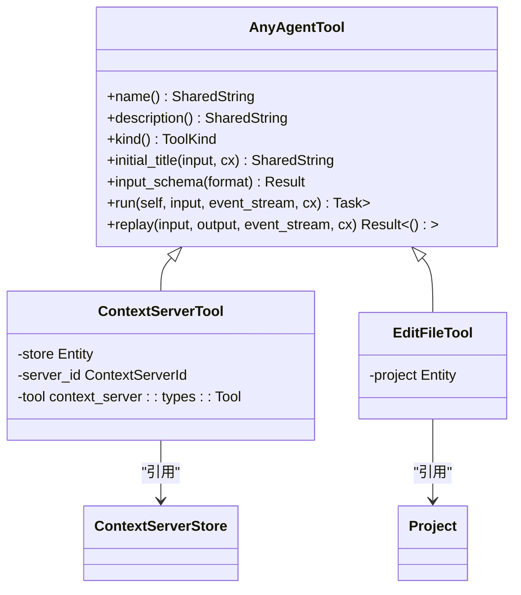
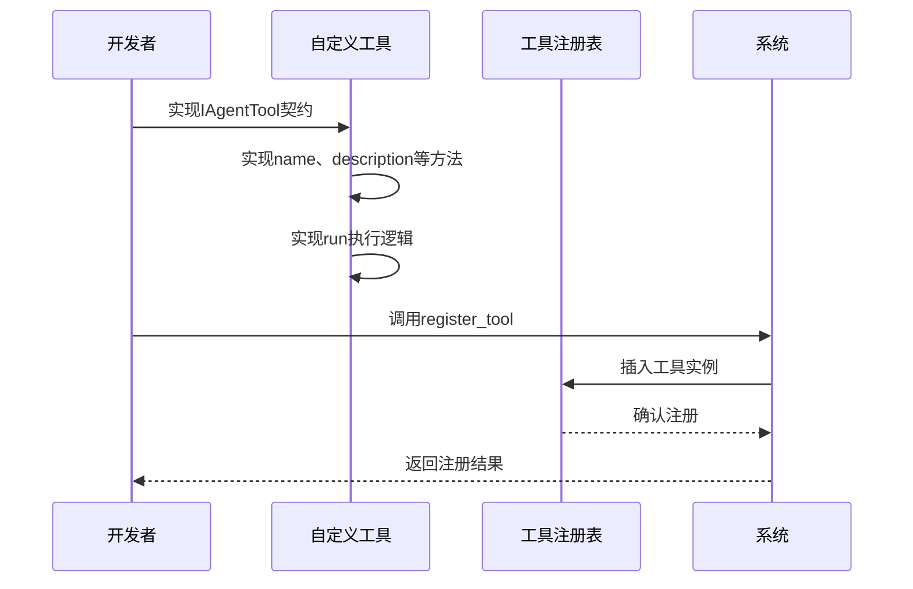

# 工具注册与发现

<cite>
**本文档引用的文件**
- [context_server_registry.rs](file://crates/agent2/src/tools/context_server_registry.rs)
- [edit_file_tool.rs](file://crates/agent2/src/tools/edit_file_tool.rs)
- [agent2.rs](file://crates/agent2/src/agent2.rs)
- [thread.rs](file://crates/agent2/src/thread.rs)
</cite>

## 目录
1. [引言](#引言)
2. [工具注册机制](#工具注册机制)
3. [工具发现流程](#工具发现流程)
4. [工具注册表设计](#工具注册表设计)
5. [工具生命周期管理](#工具生命周期管理)
6. [自定义工具集成](#自定义工具集成)
7. [结论](#结论)

## 引言
本系统实现了灵活的工具注册与发现机制，支持动态加载和管理各类功能工具。通过精心设计的类型系统和线程安全的数据结构，系统能够在运行时高效地注册、查询和执行工具。该机制不仅支持本地工具的静态注册，还支持远程上下文服务器工具的动态发现与加载，为系统的可扩展性和灵活性提供了坚实基础。

## 工具注册机制

系统通过`Agent2::register_tool`方法实现工具的动态注册功能。该方法将工具实例以名称为键注册到内部的工具映射表中，使得工具可以通过其唯一名称被发现和调用。注册过程确保了线程安全性，允许多个线程并发访问工具注册表而不会导致数据竞争。

工具注册的核心是`BTreeMap<SharedString, Arc<dyn AnyAgentTool>>`数据结构，它提供了有序的键值存储和高效的查找性能。使用`Arc`（原子引用计数）智能指针确保了工具实例的共享所有权和线程安全，多个组件可以安全地引用同一个工具实例而无需担心内存管理问题。

**工具注册机制**
- [context_server_registry.rs](file://crates/agent2/src/tools/context_server_registry.rs#L34-L73)
- [thread.rs](file://crates/agent2/src/thread.rs#L1889-L1916)

## 工具发现流程

工具发现过程通过名称匹配从注册表中检索对应的工具实例。当系统需要执行特定工具时，会根据工具名称在`BTreeMap`中进行查找。由于`BTreeMap`基于红黑树实现，查找操作具有O(log n)的时间复杂度，保证了高效的工具检索性能。

在工具发现过程中，系统首先检查本地注册的工具，然后查询上下文服务器注册表中的远程工具。这种分层发现机制确保了工具调用的一致性接口，无论工具是本地实现还是远程服务提供。对于上下文服务器工具，系统会动态从运行中的服务器实例中加载可用工具列表，并将其注册到本地注册表中。

**工具发现流程**
- [context_server_registry.rs](file://crates/agent2/src/tools/context_server_registry.rs#L75-L112)
- [thread.rs](file://crates/agent2/src/thread.rs#L1889-L1916)

## 工具注册表设计

工具注册表的核心设计采用了`BTreeMap<SharedString, Arc<dyn AnyAgentTool>>`结构，这种选择基于多个关键考量。首先，`BTreeMap`提供了有序的键存储，确保工具名称的字典序排列，有利于调试和工具列表的确定性展示。其次，`SharedString`作为键类型，提供了高效的字符串共享和比较操作，减少了内存占用和比较开销。

线程安全考量方面，`Arc<dyn AnyAgentTool>`确保了工具实例的共享引用计数管理。`Arc`（原子引用计数）在多线程环境下通过原子操作维护引用计数，避免了传统引用计数在并发场景下的竞态条件。这种设计允许多个执行线程同时访问和执行同一工具实例，而不会导致内存安全问题。

**图示来源**
- [context_server_registry.rs](file://crates/agent2/src/tools/context_server_registry.rs#L208-L241)
- [edit_file_tool.rs](file://crates/agent2/src/tools/edit_file_tool.rs)

**工具注册表设计**
- [thread.rs](file://crates/agent2/src/thread.rs#L2197-L2247)
- [context_server_registry.rs](file://crates/agent2/src/tools/context_server_registry.rs)

## 工具生命周期管理

工具的生命周期管理包括注册、启用、禁用和注销等操作。系统提供了完整的工具列表查询接口，允许运行时检查当前可用的工具集合。对于重复注册的情况，系统采用覆盖策略，新的工具实例会替换已存在的同名工具，确保工具定义的最新性。

上下文服务器工具的生命周期与服务器实例紧密关联。当上下文服务器启动时，系统自动加载其提供的工具；当服务器停止或出错时，相关工具会从注册表中移除。这种自动化的生命周期管理减少了手动维护的复杂性，确保了工具注册表的准确性和一致性。

运行时工具列表查询接口通过迭代器模式暴露注册表内容，避免了数据复制的开销。客户端代码可以安全地遍历当前可用的工具，而不会阻塞其他线程的工具注册或执行操作。

**工具生命周期管理**
- [context_server_registry.rs](file://crates/agent2/src/tools/context_server_registry.rs#L34-L73)
- [context_server_registry.rs](file://crates/agent2/src/tools/context_server_registry.rs#L75-L112)

## 自定义工具集成

自定义工具通过实现`IAgentTool` trait契约完成集成。开发者需要为工具实现必要的方法，包括名称、描述、输入模式和执行逻辑。系统提供了`AgentTool` trait作为基础实现，简化了自定义工具的开发过程。

集成过程遵循以下步骤：首先定义工具结构体并实现`AgentTool` trait，然后通过`erase`方法将其转换为`Arc<dyn AnyAgentTool>`类型，最后调用`register_tool`方法完成注册。这种设计模式实现了工具接口的抽象化，使得系统可以统一处理各种类型的工具，无论其具体实现如何。

**图示来源**
- [thread.rs](file://crates/agent2/src/thread.rs#L2153-L2202)
- [edit_file_tool.rs](file://crates/agent2/src/tools/edit_file_tool.rs)

**自定义工具集成**
- [thread.rs](file://crates/agent2/src/thread.rs#L2107-L2153)
- [edit_file_tool.rs](file://crates/agent2/src/tools/edit_file_tool.rs)

## 结论
本系统的工具注册与发现机制通过精心设计的数据结构和类型系统，实现了高效、安全和灵活的工具管理。`BTreeMap<SharedString, Arc<dyn AnyAgentTool>>`的设计不仅保证了线程安全和高性能，还支持了本地工具与远程工具的统一管理。动态注册机制和完整的生命周期管理为系统的可扩展性提供了坚实基础，使得新工具的集成变得简单而可靠。这种架构设计模式为构建模块化、可扩展的应用系统提供了有价值的参考。