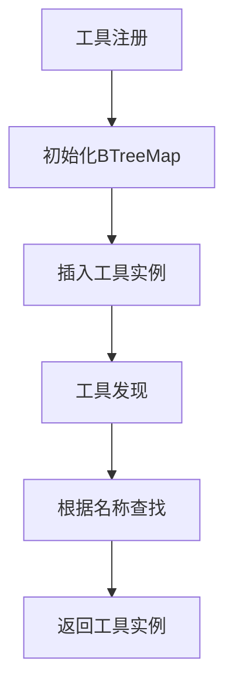
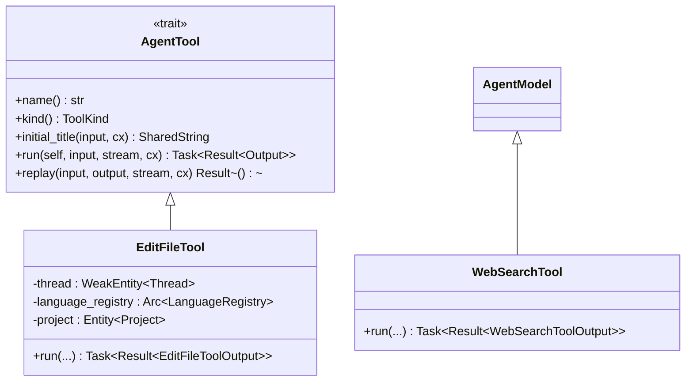
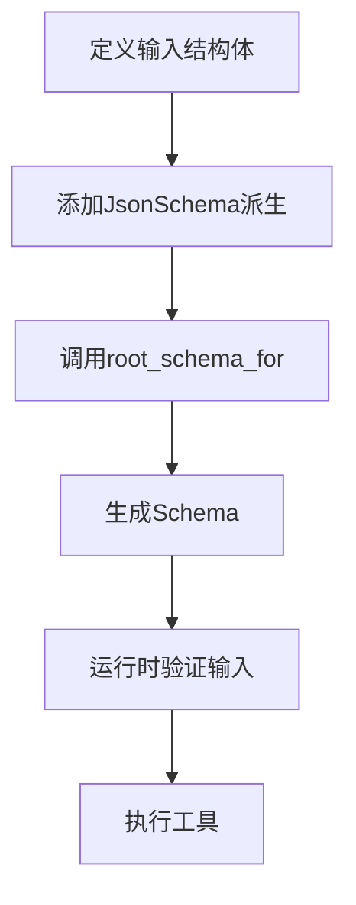
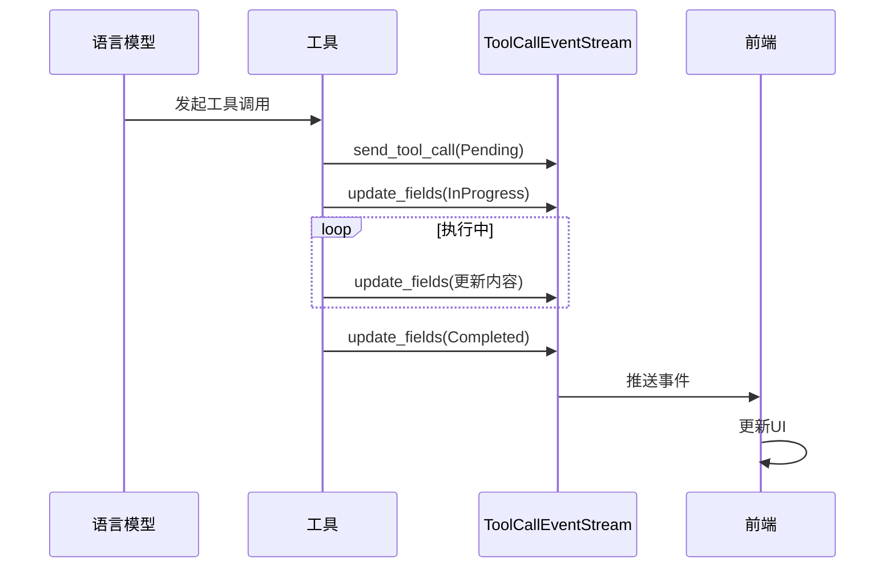
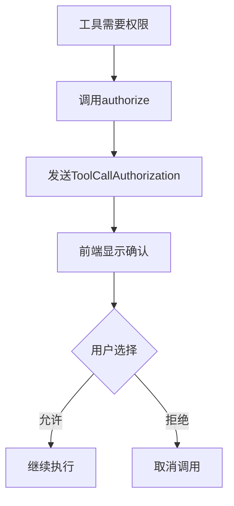

# 工具调用机制

<cite>
**本文档中引用的文件**  
- [tools.rs](file://crates/agent2/src/tools.rs)
- [tool_schema.rs](file://crates/agent2/src/tool_schema.rs)
- [thread.rs](file://crates/agent2/src/thread.rs)
- [edit_file_tool.rs](file://crates/agent2/src/tools/edit_file_tool.rs)
- [web_search_tool.rs](file://crates/agent2/src/tools/web_search_tool.rs)
- [test_tools.rs](file://crates/agent2/src/tests/test_tools.rs)
</cite>

## 目录
1. [引言](#引言)
2. [工具注册与发现机制](#工具注册与发现机制)
3. [工具接口契约与实现](#工具接口契约与实现)
4. [工具描述的JSON Schema生成](#工具描述的json-schema生成)
5. [工具执行的流式反馈机制](#工具执行的流式反馈机制)
6. [工具权限请求与用户确认](#工具权限请求与用户确认)
7. [结论](#结论)

## 引言
本文档系统阐述了工具生态系统（Tools Ecosystem）的注册、发现与执行机制。重点分析了工具如何通过 `BTreeMap<SharedString, Arc<dyn AnyAgentTool>>` 实现动态注册与调用，结合 `edit_file_tool` 和 `web_search_tool` 等具体实现说明工具接口契约。同时解析了 `tool_schema.rs` 中工具描述的 JSON Schema 生成逻辑及其在运行时验证中的应用，深入探讨了 `ToolCallEventStream` 如何实现工具执行过程的流式反馈，包括 Pending、InProgress、Completed 等状态转换。最后，提供了工具权限请求（如 `ToolRequiringPermission`）的处理流程和用户确认机制的实现细节。

## 工具注册与发现机制

工具的注册与发现是整个工具调用机制的基础。系统通过 `BTreeMap<SharedString, Arc<dyn AnyAgentTool>>` 结构实现工具的动态注册与调用。该结构以工具名称为键，以工具实例的智能指针为值，确保了工具的高效查找与线程安全共享。

在 `Thread` 结构体中，`tools` 字段即为该 `BTreeMap`，用于存储所有已注册的工具。工具的注册通常在系统初始化或上下文服务器启动时完成，通过调用 `register_tool` 方法将工具实例插入到 `BTreeMap` 中。

工具的发现则通过工具名称进行查找。当模型生成工具调用请求时，系统根据工具名称从 `BTreeMap` 中查找对应的工具实例。若未找到本地注册的工具，则会尝试从上下文服务器注册表中查找远程工具。

**Diagram sources**
- [thread.rs](file://crates/agent2/src/thread.rs#L1-L2659)

**Section sources**
- [thread.rs](file://crates/agent2/src/thread.rs#L1-L2659)

## 工具接口契约与实现

工具接口契约通过 `AgentTool` trait 定义，所有工具必须实现该 trait。`AgentTool` 定义了工具的基本行为，包括工具名称、类型、初始标题、运行逻辑和重放逻辑。

### edit_file_tool 实现
`edit_file_tool` 是一个用于创建或编辑文件的工具。其输入结构体 `EditFileToolInput` 包含 `display_description`、`path` 和 `mode` 字段，分别表示编辑描述、文件路径和操作模式。工具在运行时会先验证路径有效性，然后授权用户确认，最后执行编辑操作。

### web_search_tool 实现
`web_search_tool` 用于在互联网上搜索信息。其输入结构体 `WebSearchToolInput` 仅包含 `query` 字段，表示搜索查询。工具通过 `WebSearchRegistry` 获取活动的搜索提供者，并发起搜索请求。搜索结果通过 `ToolCallEventStream` 实时反馈给用户。

**Diagram sources**
- [edit_file_tool.rs](file://crates/agent2/src/tools/edit_file_tool.rs#L1-L1747)
- [web_search_tool.rs](file://crates/agent2/src/tools/web_search_tool.rs#L1-L133)

**Section sources**
- [edit_file_tool.rs](file://crates/agent2/src/tools/edit_file_tool.rs#L1-L1747)
- [web_search_tool.rs](file://crates/agent2/src/tools/web_search_tool.rs#L1-L133)

## 工具描述的JSON Schema生成

工具描述的 JSON Schema 生成逻辑位于 `tool_schema.rs` 文件中。系统使用 `schemars` 库为工具输入结构体生成 JSON Schema，以便在运行时进行输入验证。

`root_schema_for` 函数根据指定的格式（`JsonSchema` 或 `JsonSchemaSubset`）生成根 Schema。对于 `JsonSchemaSubset` 格式，系统会应用 `ToJsonSchemaSubsetTransform` 转换，确保 Schema 符合子集规范，例如将 `oneOf` 替换为 `anyOf`，并确保 `type` 字段不为数组。

生成的 Schema 用于在工具调用前验证输入参数的合法性，防止无效输入导致工具执行失败。

**Diagram sources**
- [tool_schema.rs](file://crates/agent2/src/tool_schema.rs#L1-L44)

**Section sources**
- [tool_schema.rs](file://crates/agent2/src/tool_schema.rs#L1-L44)

## 工具执行的流式反馈机制

`ToolCallEventStream` 是实现工具执行过程流式反馈的核心组件。它通过事件流的方式，将工具执行的各个阶段（Pending、InProgress、Completed）实时通知给前端。

`ToolCallEventStream` 包含 `tool_use_id`、`stream` 和 `fs` 字段，分别表示工具调用ID、事件流和文件系统。工具在执行过程中，通过调用 `update_fields` 方法更新工具调用的状态、标题、内容等信息。前端监听这些事件，实时更新UI，向用户展示工具执行进度。

例如，`web_search_tool` 在搜索过程中，会实时更新搜索结果的数量和链接，使用户能够即时了解搜索进展。

**Diagram sources**
- [thread.rs](file://crates/agent2/src/thread.rs#L2385-L2390)
- [web_search_tool.rs](file://crates/agent2/src/tools/web_search_tool.rs#L1-L133)

**Section sources**
- [thread.rs](file://crates/agent2/src/thread.rs#L2385-L2390)
- [web_search_tool.rs](file://crates/agent2/src/tools/web_search_tool.rs#L1-L133)

## 工具权限请求与用户确认

某些工具在执行前需要用户授权，例如修改系统配置文件或访问敏感数据。系统通过 `ToolRequiringPermission` 结构体实现权限请求机制。

当工具需要用户确认时，会调用 `event_stream.authorize` 方法，向用户弹出确认对话框。用户可以选择允许或拒绝。若用户拒绝，工具调用将被取消；若用户允许，工具将继续执行。

`ToolCallAuthorization` 事件用于传递权限请求，包含工具调用信息、权限选项和响应通道。前端收到该事件后，显示确认界面，并将用户选择通过响应通道返回给工具。

**Diagram sources**
- [test_tools.rs](file://crates/agent2/src/tests/test_tools.rs#L93-L96)

**Section sources**
- [test_tools.rs](file://crates/agent2/src/tests/test_tools.rs#L93-L96)

## 结论
本文档详细阐述了工具生态系统的注册、发现与执行机制。通过 `BTreeMap` 实现工具的动态管理，`AgentTool` trait 定义统一接口，`JSON Schema` 确保输入验证，`ToolCallEventStream` 提供流式反馈，以及权限请求机制保障安全执行。这些组件共同构建了一个灵活、安全、可扩展的工具调用框架，为智能代理提供了强大的能力支持。