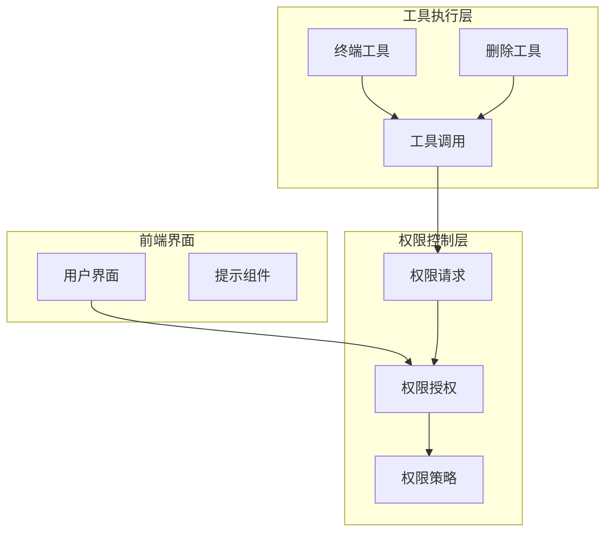
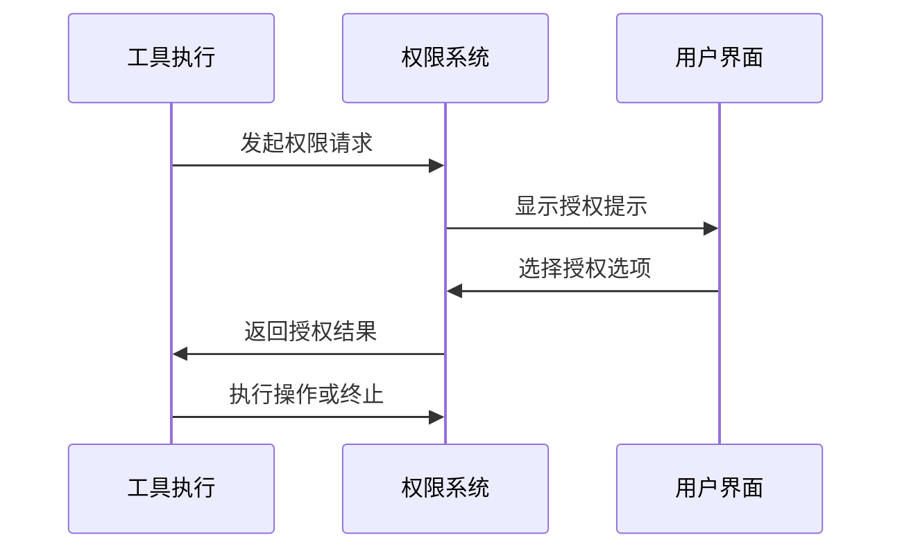
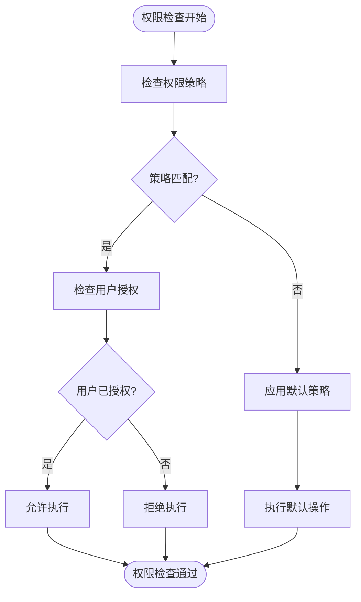

# 权限与安全控制

<cite>
**本文档中引用的文件**  
- [delete_path_tool.rs](file://crates/agent2/src/tools/delete_path_tool.rs)
- [terminal_tool.rs](file://crates/agent2/src/tools/terminal_tool.rs)
- [tools.rs](file://crates/agent2/src/tools.rs)
- [thread.rs](file://crates/agent2/src/thread.rs)
- [acp_thread.rs](file://crates/acp_thread/src/acp_thread.rs)
- [test_tools.rs](file://crates/agent2/src/tests/test_tools.rs)
</cite>

## 目录
1. [引言](#引言)
2. [权限控制系统架构](#权限控制系统架构)
3. ToolRequiringPermission trait 机制分析
4. 高风险操作中的权限应用
5. 权限请求流程
6. 前端交互提示机制
7. 权限策略存储与持久化
8. 安全边界与默认拒绝原则
9. 权限检查拦截逻辑
10. 自定义权限策略扩展
11. 结论

## 引言
本文档详细说明权限与安全控制系统的设计与实现，重点分析高风险操作工具的权限管理机制。系统通过严格的权限控制框架确保对文件系统和终端执行等敏感操作的安全性，防止未经授权的访问和潜在的安全风险。

## 权限控制系统架构

**Diagram sources**
- [thread.rs](file://crates/agent2/src/thread.rs#L2385-L2465)
- [acp_thread.rs](file://crates/acp_thread/src/acp_thread.rs#L1308-L1343)

**Section sources**
- [thread.rs](file://crates/agent2/src/thread.rs#L2385-L2532)
- [acp_thread.rs](file://crates/acp_thread/src/acp_thread.rs#L1308-L1385)

## ToolRequiringPermission trait 机制分析

`ToolRequiringPermission` trait 是权限控制系统的核心接口，定义了需要用户授权的工具的基本行为规范。该trait通过标准化的权限请求流程，确保所有高风险操作都经过明确的用户确认。

该机制实现了统一的权限抽象层，使得不同类型的工具能够以一致的方式处理权限请求。trait的设计遵循最小权限原则，要求每个工具明确声明其权限需求，并提供清晰的操作意图描述。

**Section sources**
- [test_tools.rs](file://crates/agent2/src/tests/test_tools.rs#L93-L116)

## 高风险操作中的权限应用

### 删除路径工具 (delete_path_tool)

删除路径工具实现了对文件系统中文件或目录的递归删除功能。该工具被归类为高风险操作，因为其可能导致不可逆的数据丢失。系统通过权限控制系统确保每次删除操作都经过用户明确授权。

工具在执行前会验证目标路径是否在项目范围内，并生成详细的删除计划，包括将要删除的所有文件和目录。这种预览机制增强了用户对操作后果的理解和控制。

[SPEC SYMBOL](file://crates/agent2/src/tools/delete_path_tool.rs#L3-L140)

### 终端工具 (terminal_tool)

终端工具允许执行shell命令，具有极高的系统访问权限。为防止恶意命令执行，系统实施了多重安全控制：

1. 工作目录限制：命令必须在项目根目录之一中执行
2. 输出限制：设置16KB的输出大小上限
3. 进程限制：禁止运行无限期运行的服务或监视器

工具通过分离`cd`参数和`command`参数，避免了路径注入攻击的风险。

[SPEC SYMBOL](file://crates/agent2/src/tools/terminal_tool.rs#L14-L213)

**Section sources**
- [delete_path_tool.rs](file://crates/agent2/src/tools/delete_path_tool.rs#L3-L140)
- [terminal_tool.rs](file://crates/agent2/src/tools/terminal_tool.rs#L14-L213)

## 权限请求流程

权限请求流程采用异步响应模式，确保用户界面的流畅性和响应性。当工具需要权限时，系统会生成包含以下信息的请求：

- 操作类型和名称
- 预期影响范围
- 可用的授权选项

流程包括三个关键阶段：请求生成、用户决策和结果处理。每个阶段都有明确的状态转换和错误处理机制。

**Diagram sources**
- [thread.rs](file://crates/agent2/src/thread.rs#L2437-L2465)
- [acp_thread.rs](file://crates/acp_thread/src/acp_thread.rs#L1308-L1343)

**Section sources**
- [thread.rs](file://crates/agent2/src/thread.rs#L2437-L2465)
- [acp_thread.rs](file://crates/acp_thread/src/acp_thread.rs#L1308-L1343)

## 前端交互提示机制

前端交互提示在用户决策过程中起着关键作用。系统根据操作的风险等级和类型，生成相应的提示信息，包括：

- 操作名称和描述
- 潜在影响说明
- 授权选项（始终允许、允许一次、拒绝）

提示界面采用渐进式披露设计，首先显示简洁的操作摘要，用户可选择查看详细信息。这种设计平衡了信息完整性和界面简洁性。

**Section sources**
- [thread.rs](file://crates/agent2/src/thread.rs#L2437-L2465)

## 权限策略存储与持久化

权限策略采用分层存储机制，确保配置的持久性和一致性。系统存储以下类型的权限设置：

- 会话级临时授权
- 项目级持久化策略
- 全局默认设置

存储机制通过数据库连接和异步任务确保数据的可靠持久化，同时避免阻塞主线程。策略变更会触发相应的事件通知，确保系统各组件的同步更新。

**Section sources**
- [agent.rs](file://crates/agent2/src/agent.rs#L1-L799)

## 安全边界与默认拒绝原则

系统遵循默认拒绝的安全原则，即所有高风险操作在未经明确授权前均被禁止。这种设计显著降低了意外或恶意操作的风险。

安全边界通过以下机制实现：
- 操作类型分类（删除、执行等）
- 权限级别划分
- 上下文感知的访问控制

默认拒绝原则确保了系统的最小攻击面，即使在配置错误或漏洞存在的情况下也能提供基本的安全保障。

## 权限检查拦截逻辑

权限检查采用拦截器模式，在工具执行的关键路径上设置检查点。拦截逻辑包括：

1. 权限状态验证
2. 策略匹配
3. 用户授权检查
4. 审计日志记录

异常处理流程确保在权限检查失败时能够提供清晰的错误信息，并保持系统的稳定状态。

**Diagram sources**
- [acp_thread.rs](file://crates/acp_thread/src/acp_thread.rs#L1342-L1385)

**Section sources**
- [acp_thread.rs](file://crates/acp_thread/src/acp_thread.rs#L1342-L1385)

## 自定义权限策略扩展

系统提供灵活的扩展接口，支持自定义权限策略的实现。扩展机制包括：

- 策略插件接口
- 权限评估钩子
- 自定义授权流程

开发者可以通过实现特定的trait来定义新的权限规则，系统会自动将其集成到现有的权限控制框架中。

**Section sources**
- [test_tools.rs](file://crates/agent2/src/tests/test_tools.rs#L93-L116)

## 结论
权限与安全控制系统通过严谨的设计和实现，为高风险操作提供了可靠的安全保障。系统采用分层架构、默认拒绝原则和灵活的扩展机制，既确保了安全性，又保持了足够的灵活性以适应不同的使用场景。