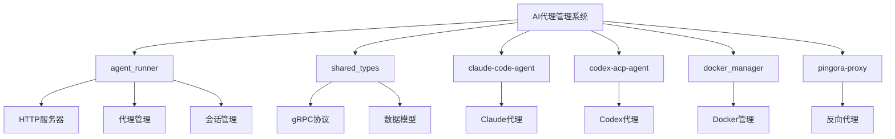
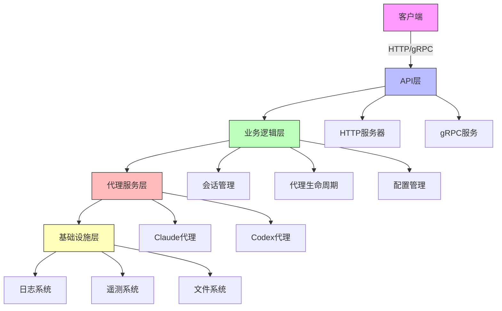
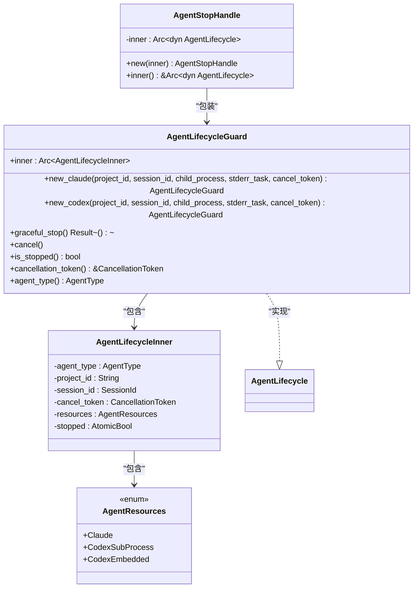
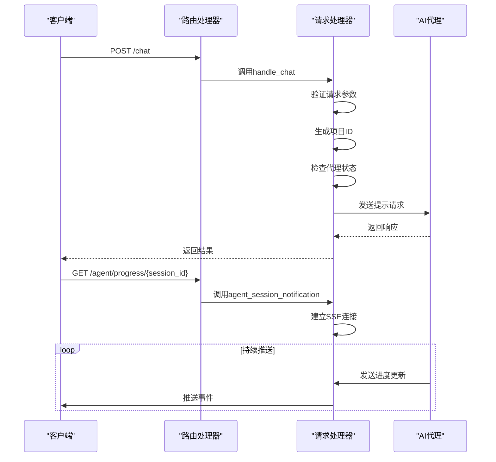
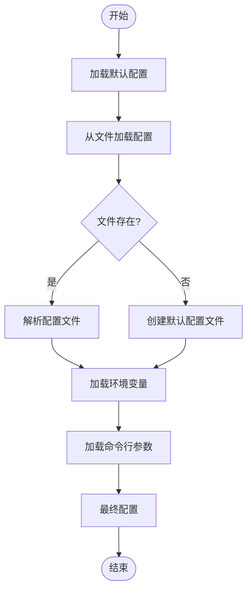
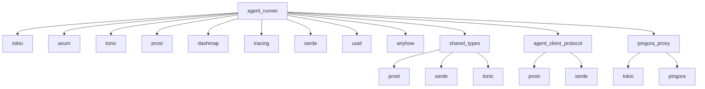

# AI代理管理

<cite>
**本文档引用的文件**   
- [lib.rs](file://crates/agent_runner/src/lib.rs)
- [main.rs](file://crates/agent_runner/src/main.rs)
- [agent_model.rs](file://crates/shared_types/src/model/agent_model.rs)
- [agent.rs](file://crates/shared_types/src/grpc/agent.rs)
- [mod.rs](file://crates/agent_runner/src/proxy_agent/mod.rs)
- [router.rs](file://crates/agent_runner/src/router.rs)
- [config.rs](file://crates/agent_runner/src/config.rs)
- [agent_type.rs](file://crates/shared_types/src/model/agent_type.rs)
- [agent_service.rs](file://crates/agent_runner/src/proxy_agent/agent_service.rs)
- [chat_handler.rs](file://crates/agent_runner/src/handler/chat_handler.rs)
- [acp_agent.rs](file://crates/agent_runner/src/proxy_agent/acp_agent.rs)
- [claude_code_agent.rs](file://crates/agent_runner/src/proxy_agent/claude_code_agent.rs)
- [chat_prompt.rs](file://crates/shared_types/src/model/chat_prompt.rs)
- [attachment.rs](file://crates/shared_types/src/model/attachment.rs)
- [session_cache.rs](file://crates/agent_runner/src/service/session_cache.rs)
- [cleanup_task.rs](file://crates/agent_runner/src/proxy_agent/cleanup_task.rs)
</cite>

## 目录
1. [简介](#简介)
2. [项目结构](#项目结构)
3. [核心组件](#核心组件)
4. [架构概述](#架构概述)
5. [详细组件分析](#详细组件分析)
6. [依赖分析](#依赖分析)
7. [性能考虑](#性能考虑)
8. [故障排除指南](#故障排除指南)
9. [结论](#结论)

## 简介
AI代理管理系统是一个基于Rust构建的高性能平台，旨在为AI驱动的开发提供完整的代理集成解决方案。该系统通过ACP（Agent Client Protocol）协议与各种AI代理进行通信，支持Claude和Codex等不同类型的AI代理服务。系统采用模块化设计，包含HTTP服务器、反向代理、会话管理、生命周期控制等核心功能，能够高效地处理AI代理的创建、通信和资源管理。

系统的主要特点包括：
- 支持多种AI代理类型（Claude、Codex）
- 基于gRPC的高效通信协议
- 完整的会话生命周期管理
- 高性能的反向代理服务
- 详细的日志和遥测系统
- 灵活的配置选项

**Section sources**
- [main.rs](file://crates/agent_runner/src/main.rs#L1-L232)
- [lib.rs](file://crates/agent_runner/src/lib.rs#L1-L17)

## 项目结构
AI代理管理系统采用Rust的crate模块化结构，主要由多个独立的crate组成，每个crate负责特定的功能模块。项目根目录下的crates文件夹包含了所有核心组件。

主要目录结构如下：
- `crates/` - 核心功能模块
  - `agent_runner/` - 主代理运行器，负责HTTP服务和代理管理
  - `shared_types/` - 共享的数据类型和协议定义
  - `claude-code-agent/` - Claude代码代理实现
  - `codex-acp-agent/` - Codex ACP代理实现
  - `docker_manager/` - Docker容器管理
  - `pingora-proxy/` - Pingora反向代理服务
- `docker/` - Docker相关脚本和配置
- `specs/` - 系统设计文档
- `scripts/` - 辅助脚本

这种模块化设计使得各个组件可以独立开发和测试，同时通过共享类型库保持接口的一致性。

**Diagram sources **
- [main.rs](file://crates/agent_runner/src/main.rs#L1-L232)
- [lib.rs](file://crates/agent_runner/src/lib.rs#L1-L17)

**Section sources**
- [main.rs](file://crates/agent_runner/src/main.rs#L1-L232)
- [lib.rs](file://crates/agent_runner/src/lib.rs#L1-L17)

## 核心组件
AI代理管理系统的核心组件包括代理生命周期管理、会话状态跟踪、通信通道管理和配置系统。这些组件协同工作，确保AI代理的高效运行和资源的正确管理。

代理生命周期管理通过`AgentLifecycleGuard`结构体实现，遵循RAII（Resource Acquisition Is Initialization）原则，当守卫对象被丢弃时自动清理代理资源。该组件支持优雅停止和强制清理两种模式，确保代理服务能够安全地终止。

会话状态通过`ProjectAndAgentInfo`结构体进行跟踪，记录了项目ID、会话ID、通信通道、模型提供商配置等关键信息。这些信息存储在全局的`DashMap`中，支持高效的并发访问。

通信通道管理使用无界通道（unbounded channel）实现，包括用于发送提示的`prompt_tx`和用于发送取消通知的`cancel_tx`。这种设计确保了消息的可靠传递，同时避免了缓冲区溢出的问题。

配置系统支持命令行参数、环境变量和配置文件三种配置方式，按照优先级顺序进行覆盖。默认配置文件为`config.yml`，包含服务端口、项目目录、代理配置等关键参数。

**Section sources**
- [agent_model.rs](file://crates/shared_types/src/model/agent_model.rs#L1-L483)
- [config.rs](file://crates/agent_runner/src/config.rs#L1-L270)

## 架构概述
AI代理管理系统的整体架构采用分层设计，从上到下分为API层、业务逻辑层、代理服务层和基础设施层。各层之间通过明确定义的接口进行通信，确保了系统的可维护性和可扩展性。

**Diagram sources **
- [main.rs](file://crates/agent_runner/src/main.rs#L1-L232)
- [router.rs](file://crates/agent_runner/src/router.rs#L1-L200)

## 详细组件分析

### 代理生命周期管理分析
代理生命周期管理是AI代理管理系统的核心功能之一，负责代理服务的创建、运行和销毁。该组件通过`AgentLifecycleGuard`结构体实现，确保了资源的安全管理和自动清理。

**Diagram sources **
- [agent_model.rs](file://crates/shared_types/src/model/agent_model.rs#L99-L483)

**Section sources**
- [agent_model.rs](file://crates/shared_types/src/model/agent_model.rs#L99-L483)

### API接口分析
API接口组件负责处理外部请求，提供HTTP和gRPC两种通信方式。系统通过Axum框架实现RESTful API，同时支持gRPC协议，满足不同场景的需求。

**Diagram sources **
- [chat_handler.rs](file://crates/agent_runner/src/handler/chat_handler.rs#L1-L321)
- [router.rs](file://crates/agent_runner/src/router.rs#L1-L200)

**Section sources**
- [chat_handler.rs](file://crates/agent_runner/src/handler/chat_handler.rs#L1-L321)
- [router.rs](file://crates/agent_runner/src/router.rs#L1-L200)

### 配置系统分析
配置系统是AI代理管理系统的基础组件，负责管理应用的各种配置参数。系统支持多种配置方式，包括命令行参数、环境变量和配置文件，提供了灵活的配置选项。

**Diagram sources **
- [config.rs](file://crates/agent_runner/src/config.rs#L1-L270)

**Section sources**
- [config.rs](file://crates/agent_runner/src/config.rs#L1-L270)

## 依赖分析
AI代理管理系统依赖于多个第三方库和内部组件，形成了复杂的依赖关系网络。主要依赖包括：

**Diagram sources **
- [Cargo.toml](file://crates/agent_runner/Cargo.toml)
- [Cargo.toml](file://crates/shared_types/Cargo.toml)

**Section sources**
- [Cargo.toml](file://crates/agent_runner/Cargo.toml)
- [Cargo.toml](file://crates/shared_types/Cargo.toml)

## 性能考虑
AI代理管理系统在设计时充分考虑了性能因素，采用了多种优化策略来确保系统的高效运行。

首先，系统使用异步I/O模型，基于Tokio运行时，能够高效地处理大量并发请求。通过使用无界通道和DashMap等无锁数据结构，减少了线程竞争，提高了并发性能。

其次，代理服务的生命周期管理采用了RAII原则，确保资源的及时释放，避免了内存泄漏。同时，系统实现了优雅停止机制，在终止代理服务时会先发送取消信号，等待任务自然退出，然后再强制清理资源。

在通信方面，系统支持gRPC协议，相比传统的RESTful API具有更高的性能和更低的延迟。同时，通过使用Protocol Buffers进行序列化，减少了网络传输的数据量。

日志系统采用了分层设计，支持文件和控制台两种输出方式，并且可以按天滚动保存日志文件，既保证了调试信息的完整性，又避免了日志文件过大影响系统性能。

**Section sources**
- [main.rs](file://crates/agent_runner/src/main.rs#L1-L232)
- [agent_model.rs](file://crates/shared_types/src/model/agent_model.rs#L99-L483)

## 故障排除指南
在使用AI代理管理系统时，可能会遇到各种问题。以下是一些常见问题及其解决方案：

1. **代理服务无法启动**
   - 检查环境变量是否正确设置，特别是API密钥等认证信息
   - 查看日志文件，确认是否有权限或网络连接问题
   - 确保项目工作目录存在且有写入权限

2. **会话连接中断**
   - 检查网络连接是否稳定
   - 确认代理服务是否正常运行
   - 查看系统资源使用情况，确保没有内存或CPU瓶颈

3. **配置不生效**
   - 确认配置优先级：命令行参数 > 环境变量 > 配置文件 > 默认配置
   - 检查配置文件格式是否正确
   - 重启服务使配置生效

4. **性能下降**
   - 监控系统资源使用情况
   - 检查是否有长时间运行的任务占用资源
   - 考虑增加硬件资源或优化代理配置

5. **通信失败**
   - 检查端口是否被占用
   - 确认防火墙设置是否允许相关端口通信
   - 验证gRPC服务是否正常启动

**Section sources**
- [main.rs](file://crates/agent_runner/src/main.rs#L1-L232)
- [config.rs](file://crates/agent_runner/src/config.rs#L1-L270)
- [agent_model.rs](file://crates/shared_types/src/model/agent_model.rs#L1-L483)

## 结论
AI代理管理系统通过模块化设计和先进的Rust技术栈，提供了一个高效、可靠的AI代理管理解决方案。系统具有良好的可扩展性和可维护性，能够满足不同规模的应用需求。

核心优势包括：
- 完整的代理生命周期管理
- 高性能的异步I/O模型
- 灵活的配置系统
- 详细的日志和监控
- 支持多种AI代理类型

未来可以考虑的改进方向包括：
- 增加更多的AI代理类型支持
- 优化资源利用率，减少内存占用
- 增强安全特性，如身份验证和访问控制
- 提供更丰富的监控指标和告警功能
- 支持分布式部署，提高系统的可用性

总体而言，该系统为AI驱动的开发提供了一个强大的基础平台，能够有效提升开发效率和系统性能。