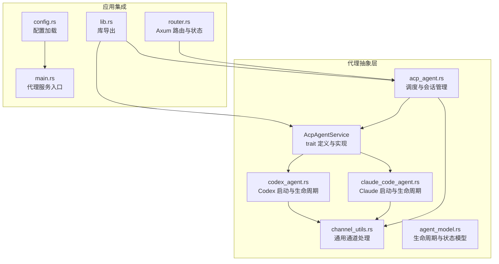
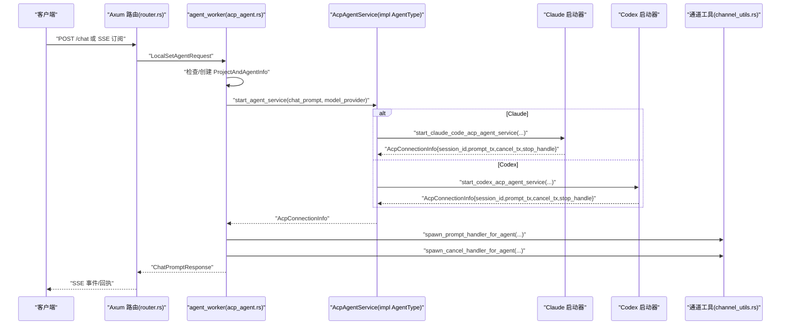
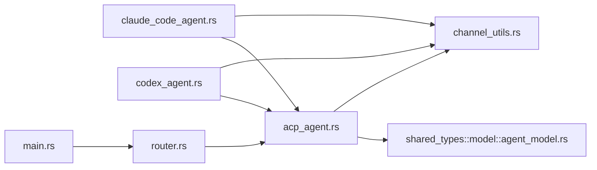

# 代理抽象层

<cite>
**本文引用的文件**
- [acp_agent.rs](file://crates/agent_runner/src/proxy_agent/acp_agent.rs)
- [claude_code_agent.rs](file://crates/agent_runner/src/proxy_agent/claude_code_agent.rs)
- [codex_agent.rs](file://crates/agent_runner/src/proxy_agent/codex_agent.rs)
- [agent_service.rs](file://crates/agent_runner/src/proxy_agent/agent_service.rs)
- [channel_utils.rs](file://crates/agent_runner/src/proxy_agent/channel_utils.rs)
- [agent_model.rs](file://crates/shared_types/src/model/agent_model.rs)
- [router.rs](file://crates/agent_runner/src/router.rs)
- [config.rs](file://crates/agent_runner/src/config.rs)
- [lib.rs](file://crates/agent_runner/src/lib.rs)
- [main.rs](file://crates/agent_runner/src/main.rs)
- [agent-abstraction-layer-design.md](file://specs/agent-abstraction-layer-design.md)
- [docker_container_agent.rs](file://crates/rcoder/src/proxy_agent/docker_container_agent.rs)
</cite>

## 目录
1. [简介](#简介)
2. [项目结构](#项目结构)
3. [核心组件](#核心组件)
4. [架构总览](#架构总览)
5. [详细组件分析](#详细组件分析)
6. [依赖关系分析](#依赖关系分析)
7. [性能考量](#性能考量)
8. [故障排查指南](#故障排查指南)
9. [结论](#结论)
10. [附录](#附录)

## 简介
本文件聚焦于 rcoder 项目中的“代理抽象层”，系统性阐述 ACP 协议适配机制与 Codex、Claude Code 等不同 AI 代理的统一接口设计。文档围绕 acp_agent.rs、claude_code_agent.rs、codex_agent.rs 中的核心 trait 实现与多态调用模式展开，解释抽象层如何屏蔽底层代理差异，提供一致的启动、通信与状态管理接口；并说明其与 agent_service.rs 的协作关系，以及在 rcoder 主应用中的集成方式。最后给出配置扩展指南、常见实现错误与调试方法，以及性能优化建议。

## 项目结构
代理抽象层位于 agent_runner crate 的 proxy_agent 子模块中，核心文件包括：
- ACP 代理服务公共 trait 定义与实现：agent_service.rs
- Claude Code ACP 代理启动与生命周期管理：claude_code_agent.rs
- Codex ACP 代理启动与生命周期管理：codex_agent.rs
- 通用 ACP 代理调度与会话管理：acp_agent.rs
- 通用通道处理工具（取消与 Prompt 处理）：channel_utils.rs
- 共享模型与生命周期接口：shared_types/src/model/agent_model.rs
- 路由与应用状态：agent_runner/src/router.rs
- 配置加载与默认行为：agent_runner/src/config.rs
- 主入口与库导出：agent_runner/src/main.rs、lib.rs

图表来源
- [agent_service.rs](file://crates/agent_runner/src/proxy_agent/agent_service.rs#L1-L62)
- [acp_agent.rs](file://crates/agent_runner/src/proxy_agent/acp_agent.rs#L1-L392)
- [claude_code_agent.rs](file://crates/agent_runner/src/proxy_agent/claude_code_agent.rs#L1-L311)
- [codex_agent.rs](file://crates/agent_runner/src/proxy_agent/codex_agent.rs#L1-L398)
- [channel_utils.rs](file://crates/agent_runner/src/proxy_agent/channel_utils.rs#L1-L230)
- [agent_model.rs](file://crates/shared_types/src/model/agent_model.rs#L1-L483)
- [router.rs](file://crates/agent_runner/src/router.rs#L1-L200)
- [config.rs](file://crates/agent_runner/src/config.rs#L1-L270)
- [main.rs](file://crates/agent_runner/src/main.rs#L1-L214)
- [lib.rs](file://crates/agent_runner/src/lib.rs#L1-L17)

章节来源
- [agent_service.rs](file://crates/agent_runner/src/proxy_agent/agent_service.rs#L1-L62)
- [acp_agent.rs](file://crates/agent_runner/src/proxy_agent/acp_agent.rs#L1-L392)
- [claude_code_agent.rs](file://crates/agent_runner/src/proxy_agent/claude_code_agent.rs#L1-L311)
- [codex_agent.rs](file://crates/agent_runner/src/proxy_agent/codex_agent.rs#L1-L398)
- [channel_utils.rs](file://crates/agent_runner/src/proxy_agent/channel_utils.rs#L1-L230)
- [agent_model.rs](file://crates/shared_types/src/model/agent_model.rs#L1-L483)
- [router.rs](file://crates/agent_runner/src/router.rs#L1-L200)
- [config.rs](file://crates/agent_runner/src/config.rs#L1-L270)
- [main.rs](file://crates/agent_runner/src/main.rs#L1-L214)
- [lib.rs](file://crates/agent_runner/src/lib.rs#L1-L17)

## 核心组件
- ACP 代理服务公共 trait：AcpAgentService，定义统一的启动与类型名查询接口，由 AgentType 实现多态分发。
- Claude Code 与 Codex 代理启动器：分别封装子进程启动、ACP 连接建立、会话创建、通道处理与生命周期管理。
- 通用调度与会话管理：acp_agent.rs 负责项目级代理实例的缓存、模型配置变更检测与复用、Prompt 构建与发送。
- 通用通道处理：channel_utils.rs 提供取消与 Prompt 的统一处理任务，负责状态更新与错误传播。
- 生命周期与状态模型：agent_model.rs 定义 AgentStatus、ProjectAndAgentInfo、AgentLifecycle/AgentLifecycleGuard 等，保证资源清理与优雅停止。
- 应用集成：router.rs 提供 HTTP 路由与应用状态，config.rs 提供配置加载与默认行为，main.rs 启动代理服务。

章节来源
- [agent_service.rs](file://crates/agent_runner/src/proxy_agent/agent_service.rs#L1-L62)
- [acp_agent.rs](file://crates/agent_runner/src/proxy_agent/acp_agent.rs#L1-L392)
- [claude_code_agent.rs](file://crates/agent_runner/src/proxy_agent/claude_code_agent.rs#L1-L311)
- [codex_agent.rs](file://crates/agent_runner/src/proxy_agent/codex_agent.rs#L1-L398)
- [channel_utils.rs](file://crates/agent_runner/src/proxy_agent/channel_utils.rs#L1-L230)
- [agent_model.rs](file://crates/shared_types/src/model/agent_model.rs#L1-L483)
- [router.rs](file://crates/agent_runner/src/router.rs#L1-L200)
- [config.rs](file://crates/agent_runner/src/config.rs#L1-L270)
- [main.rs](file://crates/agent_runner/src/main.rs#L1-L214)

## 架构总览
代理抽象层通过“统一 trait + 多态实现”的方式，屏蔽 Claude 与 Codex 的差异，向上提供一致的启动与通信接口。acp_agent.rs 作为调度器，结合 DashMap 缓存与模型配置变更检测，实现项目级代理复用；Claude 与 Codex 的启动器各自负责子进程与 ACP 连接细节；channel_utils.rs 提供统一的取消与 Prompt 处理，确保会话状态一致性与错误传播。

图表来源
- [acp_agent.rs](file://crates/agent_runner/src/proxy_agent/acp_agent.rs#L164-L392)
- [agent_service.rs](file://crates/agent_runner/src/proxy_agent/agent_service.rs#L1-L62)
- [claude_code_agent.rs](file://crates/agent_runner/src/proxy_agent/claude_code_agent.rs#L1-L311)
- [codex_agent.rs](file://crates/agent_runner/src/proxy_agent/codex_agent.rs#L1-L398)
- [channel_utils.rs](file://crates/agent_runner/src/proxy_agent/channel_utils.rs#L1-L230)
- [router.rs](file://crates/agent_runner/src/router.rs#L1-L200)

## 详细组件分析

### ACP 协议适配与统一接口
- AcpAgentService 定义统一启动接口与类型名查询，AgentType 通过实现该 trait 将 Claude 与 Codex 的具体启动逻辑纳入多态分发。
- Claude 与 Codex 的启动器均通过子进程启动 ACP 代理，建立 ClientSideConnection，完成 initialize/new_session/load_session 等步骤，并通过通道工具启动 Prompt 与取消处理任务。
- acp_agent.rs 作为上层调度器，负责：
  - 项目级代理实例缓存（DashMap）与生命周期管理（AgentStopHandle/Arc<dyn AgentLifecycle>）。
  - 模型配置变更检测，必要时重启代理服务。
  - Prompt 构建（系统提示词、附件、request_id 元数据）并通过 session_id 发送到对应通道。
  - 会话映射与清理，确保清理任务能正确识别活跃会话。

章节来源
- [agent_service.rs](file://crates/agent_runner/src/proxy_agent/agent_service.rs#L1-L62)
- [claude_code_agent.rs](file://crates/agent_runner/src/proxy_agent/claude_code_agent.rs#L1-L311)
- [codex_agent.rs](file://crates/agent_runner/src/proxy_agent/codex_agent.rs#L1-L398)
- [acp_agent.rs](file://crates/agent_runner/src/proxy_agent/acp_agent.rs#L1-L392)
- [channel_utils.rs](file://crates/agent_runner/src/proxy_agent/channel_utils.rs#L1-L230)
- [agent_model.rs](file://crates/shared_types/src/model/agent_model.rs#L1-L483)

### Claude Code ACP 代理
- 启动流程：子进程启动 claude-code-acp，建立 ACP 连接，initialize，new_session/load_session，启动 stderr 读取任务与生命周期守卫。
- 通道处理：spawn_prompt_handler_for_agent 与 spawn_cancel_handler_for_agent 分别处理 Prompt 与取消请求，超时保护与状态恢复。
- 生命周期：AgentLifecycleGuard 管理子进程与 stderr 任务，支持优雅停止与强制清理。

章节来源
- [claude_code_agent.rs](file://crates/agent_runner/src/proxy_agent/claude_code_agent.rs#L1-L311)
- [channel_utils.rs](file://crates/agent_runner/src/proxy_agent/channel_utils.rs#L1-L230)
- [agent_model.rs](file://crates/shared_types/src/model/agent_model.rs#L1-L483)

### Codex ACP 代理
- 启动流程：子进程启动 codex-acp-agent，支持 CLI 配置覆盖（模型、提供商、认证方式等），建立 ACP 连接，initialize，new_session/load_session，stderr 读取与生命周期守卫。
- 通道处理：与 Claude 类似，统一的 Prompt 与取消处理任务。
- 生命周期：同样通过 AgentLifecycleGuard 管理资源。

章节来源
- [codex_agent.rs](file://crates/agent_runner/src/proxy_agent/codex_agent.rs#L1-L398)
- [channel_utils.rs](file://crates/agent_runner/src/proxy_agent/channel_utils.rs#L1-L230)
- [agent_model.rs](file://crates/shared_types/src/model/agent_model.rs#L1-L483)

### 通用调度与会话管理（acp_agent.rs）
- 项目级代理缓存：PROJECT_AND_AGENT_INFO_MAP 以 project_id 为键，存储会话信息、通道与生命周期句柄。
- 模型配置变更检测：check_model_config_changed 基于 ModelProviderConfig.id 判断是否需要重启。
- Prompt 构建：build_prompt_to_acp_agent 将系统提示词、附件与 request_id 元数据组装为 PromptRequest。
- 会话映射与清理：ensure_project_session 同步 project_id -> session_id 映射，辅助清理任务识别活跃会话。

章节来源
- [acp_agent.rs](file://crates/agent_runner/src/proxy_agent/acp_agent.rs#L1-L392)

### 通用通道处理（channel_utils.rs）
- 取消处理：spawn_cancel_handler_for_agent，带超时保护，发送取消响应并恢复 AgentStatus 为 Idle。
- Prompt 处理：spawn_prompt_handler_for_agent，校正 session_id，从 meta 中提取 request_id，发送 SessionPromptStart/End/Error，恢复 AgentStatus 为 Idle。
- 上下文管理：将 request_id 写入 SESSION_REQUEST_CONTEXT，供 session_notification 使用。

章节来源
- [channel_utils.rs](file://crates/agent_runner/src/proxy_agent/channel_utils.rs#L1-L230)

### 生命周期与状态模型（agent_model.rs）
- AgentStatus：Active/Idle/Terminating，配合 last_activity/created_at 记录状态与时序。
- ProjectAndAgentInfo：包含 session_id、prompt_tx、cancel_tx、model_provider、request_id、status、last_activity、created_at、stop_handle。
- AgentLifecycle/AgentLifecycleGuard：统一的生命周期接口与 RAII 资源管理，支持优雅停止与强制清理。
- AgentStopHandle：统一的对外接口包装。

章节来源
- [agent_model.rs](file://crates/shared_types/src/model/agent_model.rs#L1-L483)

### 与 rcoder 主应用的协作与集成
- 路由与状态：router.rs 提供 /agent/* 与 /proxy/* 路由，Axum Router 与 AppState 持有 local_task_sender（LocalSetAgentRequest）。
- 配置加载：config.rs 提供命令行参数、环境变量、配置文件与默认配置的优先级策略，默认代理类型依据 feature 标记选择 Claude 或 Codex。
- 代理服务入口：main.rs 启动代理服务（可选 Pingora 反向代理），并将 AppState 注入路由，实现统一的健康检查与代理状态查询。
- 容器化集成：rcoder 主应用通过 docker_container_agent.rs 动态创建容器化的 agent_runner，实现每个项目独立容器运行与健康检查等待。

章节来源
- [router.rs](file://crates/agent_runner/src/router.rs#L1-L200)
- [config.rs](file://crates/agent_runner/src/config.rs#L1-L270)
- [main.rs](file://crates/agent_runner/src/main.rs#L1-L214)
- [docker_container_agent.rs](file://crates/rcoder/src/proxy_agent/docker_container_agent.rs#L1-L388)

## 依赖关系分析
- acp_agent.rs 依赖 shared_types 的 ModelProviderConfig、AgentStatus、ProjectAndAgentInfo 与 AgentLifecycle 接口。
- Claude 与 Codex 启动器依赖 agent_client_protocol 的 ClientSideConnection、PromptRequest、SessionId 等类型。
- 通道工具依赖 agent_client_protocol 的 Agent trait 与 CancelNotification。
- 应用层通过 router.rs 与 main.rs 将代理抽象层集成到 HTTP 服务中。

图表来源
- [acp_agent.rs](file://crates/agent_runner/src/proxy_agent/acp_agent.rs#L1-L392)
- [agent_model.rs](file://crates/shared_types/src/model/agent_model.rs#L1-L483)
- [channel_utils.rs](file://crates/agent_runner/src/proxy_agent/channel_utils.rs#L1-L230)
- [claude_code_agent.rs](file://crates/agent_runner/src/proxy_agent/claude_code_agent.rs#L1-L311)
- [codex_agent.rs](file://crates/agent_runner/src/proxy_agent/codex_agent.rs#L1-L398)
- [router.rs](file://crates/agent_runner/src/router.rs#L1-L200)
- [main.rs](file://crates/agent_runner/src/main.rs#L1-L214)

## 性能考量
- 通道与任务模型：采用 mpsc/unbounded_channel 与 LocalSet 任务，降低跨线程同步开销，提高吞吐。
- 项目级复用：通过 PROJECT_AND_AGENT_INFO_MAP 复用代理实例，减少进程启动与 ACP 连接建立的重复成本。
- 超时保护：取消处理带超时，避免阻塞影响整体性能。
- 日志与可观测性：统一的 tracing 输出与健康检查，便于定位性能瓶颈。
- 建议：
  - 控制并发：合理设置队列容量与背压策略，避免内存膨胀。
  - 会话复用：尽量复用 session_id，减少会话切换。
  - 资源清理：确保生命周期守卫及时清理，避免僵尸进程与资源泄漏。

[本节为通用指导，不直接分析具体文件]

## 故障排查指南
- 启动失败
  - Claude/Codex 启动器会在后台任务失败时发送错误内容到 prompt_tx，上层可通过错误消息定位问题（如 base_url、API key、模型名称不支持等）。
  - stderr 读取任务会打印警告信息，有助于诊断。
- 会话不一致
  - 通道工具会强制覆盖请求中的 session_id 为当前 agent 会话，若出现异常需检查 session_id 传入与 meta 字段。
- 取消超时
  - 取消处理带超时保护，超时会返回响应，需检查代理是否卡住或网络问题。
- 生命周期清理
  - AgentLifecycleGuard 支持优雅停止与强制清理，若出现资源泄漏，检查取消令牌与子进程句柄是否正确释放。

章节来源
- [claude_code_agent.rs](file://crates/agent_runner/src/proxy_agent/claude_code_agent.rs#L214-L311)
- [codex_agent.rs](file://crates/agent_runner/src/proxy_agent/codex_agent.rs#L280-L398)
- [channel_utils.rs](file://crates/agent_runner/src/proxy_agent/channel_utils.rs#L1-L230)
- [agent_model.rs](file://crates/shared_types/src/model/agent_model.rs#L1-L483)

## 结论
代理抽象层通过 AcpAgentService 的统一接口与 AgentType 的多态实现，成功屏蔽 Claude 与 Codex 的差异，提供一致的启动、通信与状态管理能力。acp_agent.rs 的项目级复用与模型配置变更检测进一步提升了稳定性与性能。配合 channel_utils.rs 的统一通道处理与 agent_model.rs 的生命周期管理，形成完整的抽象层闭环。在 rcoder 主应用中，该抽象层通过 router.rs 与 main.rs 无缝集成，支持容器化部署与健康检查，具备良好的扩展性与可维护性。

[本节为总结性内容，不直接分析具体文件]

## 附录

### 配置扩展指南（接入新 AI 代理）
- 新增启动器
  - 在 proxy_agent 下新增启动器文件，实现子进程启动、ACP 连接、会话管理与通道处理。
  - 返回 AcpConnectionInfo（包含 session_id、prompt_tx、cancel_tx、stop_handle）。
- 实现 AcpAgentService
  - 在 agent_service.rs 中为新 AgentType 分支添加 start_agent_service 的实现。
- 注册 AgentType
  - 在 shared_types 的 AgentType 中新增变体，并在 AcpAgentService impl 中添加分支。
- 集成到调度器
  - acp_agent.rs 会根据 chat_prompt.agent_type 自动分发，无需修改调度逻辑。
- 配置与默认行为
  - config.rs 提供默认代理类型选择逻辑，可根据 feature 标记决定默认值。
- 文档与测试
  - 补充 OpenAPI 文档与集成测试，确保新代理的可用性与稳定性。

章节来源
- [agent_service.rs](file://crates/agent_runner/src/proxy_agent/agent_service.rs#L1-L62)
- [acp_agent.rs](file://crates/agent_runner/src/proxy_agent/acp_agent.rs#L1-L392)
- [config.rs](file://crates/agent_runner/src/config.rs#L1-L270)
- [agent-abstraction-layer-design.md](file://specs/agent-abstraction-layer-design.md#L1-L800)