# 生命周期管理

<cite>
**本文档引用的文件**   
- [agent_service.rs](file://crates/agent_runner/src/proxy_agent/agent_service.rs)
- [channel_utils.rs](file://crates/agent_runner/src/proxy_agent/channel_utils.rs)
- [agent_stop_handle.rs](file://crates/agent_runner/src/proxy_agent/agent_stop_handle.rs)
- [cleanup_task.rs](file://crates/agent_runner/src/proxy_agent/cleanup_task.rs)
- [mod.rs](file://crates/agent_runner/src/proxy_agent/mod.rs)
- [main.rs](file://crates/agent_runner/src/main.rs)
- [agent_cancel_handler.rs](file://crates/agent_runner/src/handler/agent_cancel_handler.rs)
- [agent_status_handler.rs](file://crates/agent_runner/src/handler/agent_status_handler.rs)
- [router.rs](file://crates/agent_runner/src/router.rs)
- [agent-abstraction-layer-design.md](file://specs/agent-abstraction-layer-design.md)
</cite>

## 目录
1. [引言](#引言)
2. [代理生命周期管理架构](#代理生命周期管理架构)
3. [核心组件分析](#核心组件分析)
4. [代理创建与启动流程](#代理创建与启动流程)
5. [异步任务通信机制](#异步任务通信机制)
6. [优雅终止与超时处理](#优雅终止与超时处理)
7. [资源回收与清理策略](#资源回收与清理策略)
8. [完整调用链路分析](#完整调用链路分析)
9. [异常场景处理](#异常场景处理)
10. [监控指标建议](#监控指标建议)
11. [结论](#结论)

## 引言

代理生命周期管理是AI驱动开发平台的核心功能，负责管理AI代理从创建到销毁的完整生命周期。本文档全面解析代理的创建、启动、停止和清理流程，基于`agent_service.rs`中的服务管理逻辑，说明如何通过`channel_utils.rs`实现异步任务通信，详细描述`agent_stop_handle.rs`中的优雅终止机制与超时处理策略，以及`cleanup_task.rs`中资源回收的具体实现。

系统采用基于RAII（Resource Acquisition Is Initialization）原则的简洁生命周期管理设计，确保资源的自动管理和释放。通过通道（channel）机制实现异步任务间的通信，支持高并发场景下的稳定运行。整个生命周期管理流程从HTTP请求触发开始，经过代理创建、任务执行、状态监控，到最终的资源清理结束，形成一个完整的闭环。

**本节不分析具体源文件，因此不提供源文件引用**

## 代理生命周期管理架构

代理生命周期管理采用分层架构设计，主要包括服务层、通信层、控制层和清理层。各层协同工作，确保代理生命周期的完整性和可靠性。

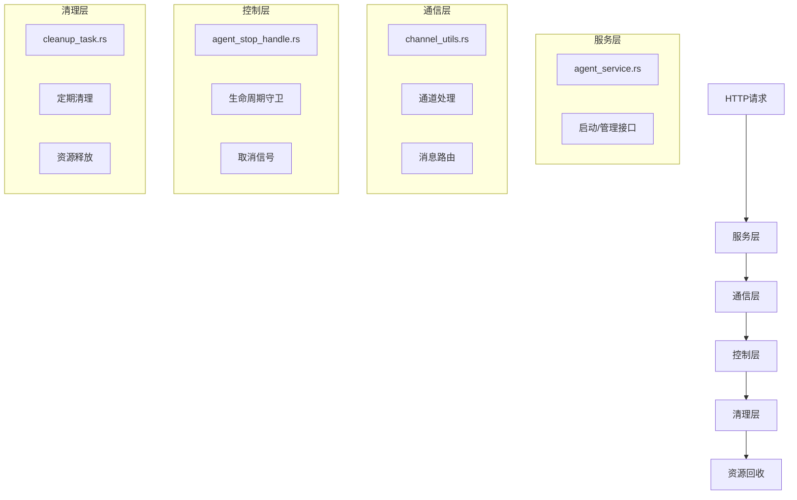

**图源**
- [agent_service.rs](file://crates/agent_runner/src/proxy_agent/agent_service.rs)
- [channel_utils.rs](file://crates/agent_runner/src/proxy_agent/channel_utils.rs)
- [agent_stop_handle.rs](file://crates/agent_runner/src/proxy_agent/agent_stop_handle.rs)
- [cleanup_task.rs](file://crates/agent_runner/src/proxy_agent/cleanup_task.rs)

**本节源文件**
- [agent_service.rs](file://crates/agent_runner/src/proxy_agent/agent_service.rs#L1-L62)
- [channel_utils.rs](file://crates/agent_runner/src/proxy_agent/channel_utils.rs#L1-L230)
- [agent_stop_handle.rs](file://crates/agent_runner/src/proxy_agent/agent_stop_handle.rs#L1-L326)
- [cleanup_task.rs](file://crates/agent_runner/src/proxy_agent/cleanup_task.rs#L1-L310)

## 核心组件分析

代理生命周期管理由多个核心组件构成，每个组件负责特定的功能，共同协作完成完整的生命周期管理。

### 代理服务组件

代理服务组件定义了启动和管理代理服务的统一接口，通过`AcpAgentService` trait提供标准化的服务管理能力。

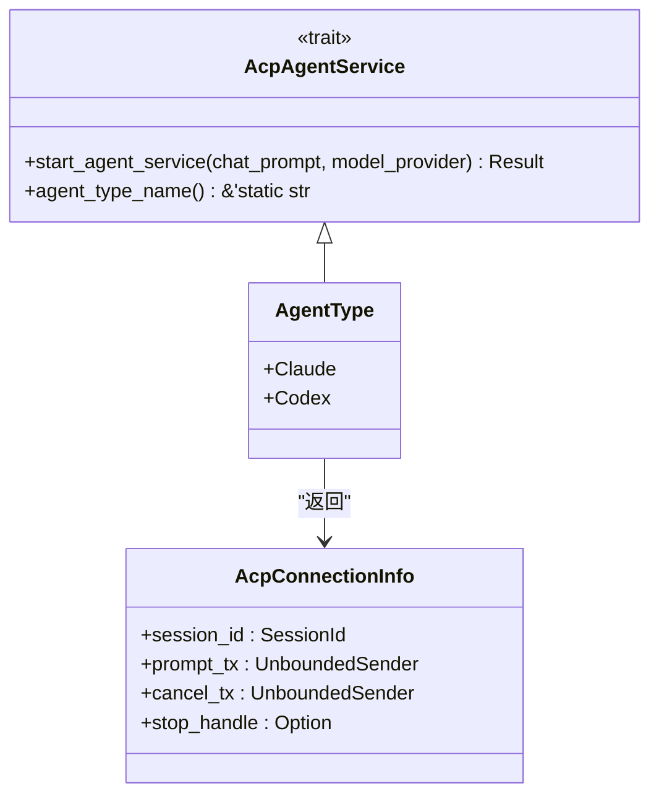

**图源**
- [agent_service.rs](file://crates/agent_runner/src/proxy_agent/agent_service.rs#L7-L62)

**本节源文件**
- [agent_service.rs](file://crates/agent_runner/src/proxy_agent/agent_service.rs#L7-L62)

### 通道工具组件

通道工具组件提供可复用的通道消息处理逻辑，支持取消和提示消息的异步处理。

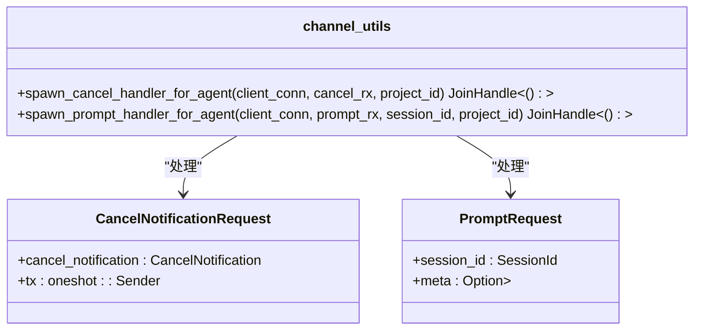

**图源**
- [channel_utils.rs](file://crates/agent_runner/src/proxy_agent/channel_utils.rs#L18-L230)

**本节源文件**
- [channel_utils.rs](file://crates/agent_runner/src/proxy_agent/channel_utils.rs#L18-L230)

### 终止处理组件

终止处理组件基于RAII原则设计，当守卫被drop时自动清理代理资源，确保资源的正确释放。

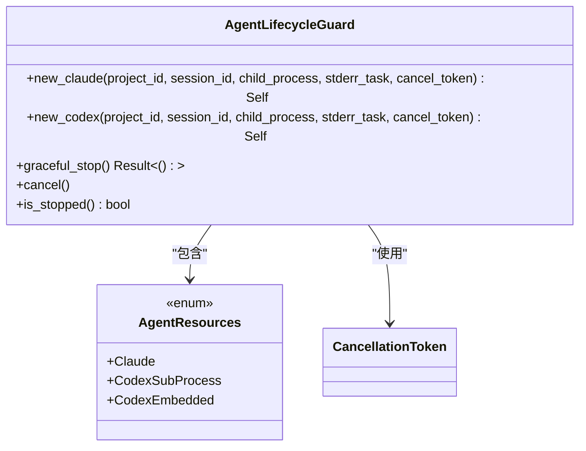

**图源**
- [agent_stop_handle.rs](file://crates/agent_runner/src/proxy_agent/agent_stop_handle.rs#L21-L326)

**本节源文件**
- [agent_stop_handle.rs](file://crates/agent_runner/src/proxy_agent/agent_stop_handle.rs#L21-L326)

### 清理任务组件

清理任务组件负责定期清理闲置的代理，基于RAII原则简化清理逻辑，只从MAP中移除闲置代理，由`AgentLifecycleGuard`自动清理资源。

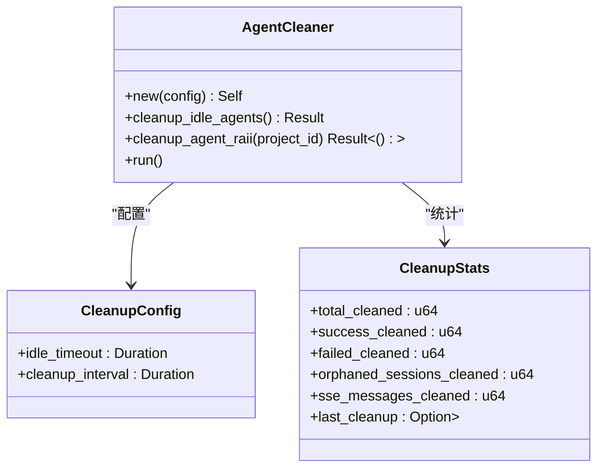

**图源**
- [cleanup_task.rs](file://crates/agent_runner/src/proxy_agent/cleanup_task.rs#L17-L310)

**本节源文件**
- [cleanup_task.rs](file://crates/agent_runner/src/proxy_agent/cleanup_task.rs#L17-L310)

## 代理创建与启动流程

代理的创建与启动流程始于HTTP请求，通过服务层接口触发代理的初始化和启动过程。

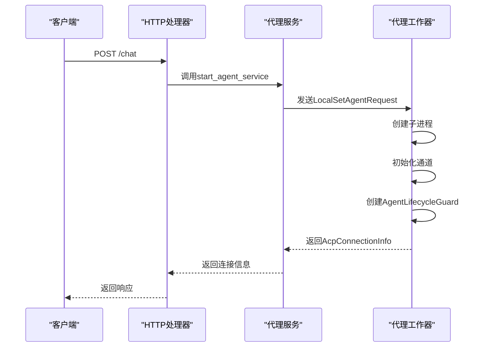

**图源**
- [agent_service.rs](file://crates/agent_runner/src/proxy_agent/agent_service.rs#L20-L24)
- [main.rs](file://crates/agent_runner/src/main.rs#L69-L72)
- [mod.rs](file://crates/agent_runner/src/proxy_agent/mod.rs#L15-L41)

**本节源文件**
- [agent_service.rs](file://crates/agent_runner/src/proxy_agent/agent_service.rs#L20-L24)
- [main.rs](file://crates/agent_runner/src/main.rs#L69-L72)
- [mod.rs](file://crates/agent_runner/src/proxy_agent/mod.rs#L15-L41)

## 异步任务通信机制

系统通过通道（channel）机制实现异步任务间的通信，确保消息的可靠传递和处理。

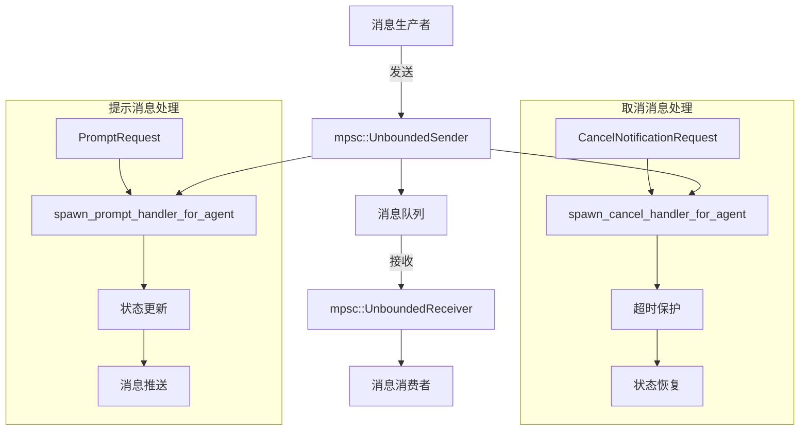

**图源**
- [channel_utils.rs](file://crates/agent_runner/src/proxy_agent/channel_utils.rs#L18-L230)
- [mod.rs](file://crates/agent_runner/src/proxy_agent/mod.rs#L25-L41)

**本节源文件**
- [channel_utils.rs](file://crates/agent_runner/src/proxy_agent/channel_utils.rs#L18-L230)
- [mod.rs](file://crates/agent_runner/src/proxy_agent/mod.rs#L25-L41)

## 优雅终止与超时处理

系统实现了优雅终止机制，通过取消令牌（Cancellation Token）和超时保护确保代理的可靠终止。

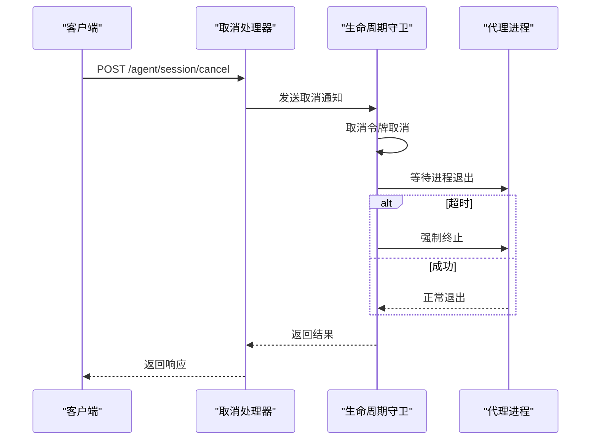

**图源**
- [agent_stop_handle.rs](file://crates/agent_runner/src/proxy_agent/agent_stop_handle.rs#L140-L204)
- [agent_cancel_handler.rs](file://crates/agent_runner/src/handler/agent_cancel_handler.rs#L110-L258)

**本节源文件**
- [agent_stop_handle.rs](file://crates/agent_runner/src/proxy_agent/agent_stop_handle.rs#L140-L204)
- [agent_cancel_handler.rs](file://crates/agent_runner/src/handler/agent_cancel_handler.rs#L110-L258)

## 资源回收与清理策略

系统采用基于RAII的资源回收策略，通过定期清理任务自动回收闲置资源。

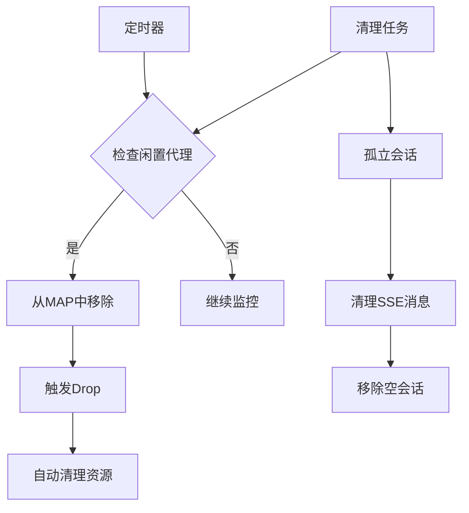

**图源**
- [cleanup_task.rs](file://crates/agent_runner/src/proxy_agent/cleanup_task.rs#L156-L276)
- [main.rs](file://crates/agent_runner/src/main.rs#L55-L56)

**本节源文件**
- [cleanup_task.rs](file://crates/agent_runner/src/proxy_agent/cleanup_task.rs#L156-L276)
- [main.rs](file://crates/agent_runner/src/main.rs#L55-L56)

## 完整调用链路分析

从HTTP请求触发到代理进程结束的完整生命周期调用链路如下：

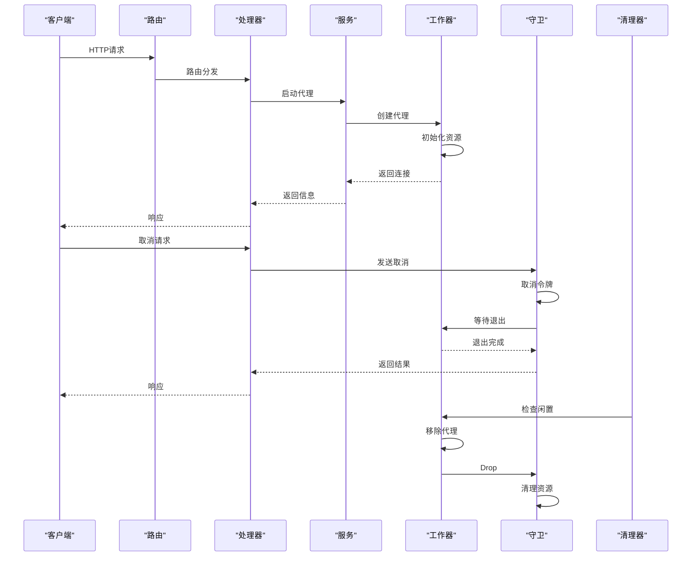

**图源**
- [router.rs](file://crates/agent_runner/src/router.rs#L40-L69)
- [agent_service.rs](file://crates/agent_runner/src/proxy_agent/agent_service.rs#L20-L24)
- [agent_cancel_handler.rs](file://crates/agent_runner/src/handler/agent_cancel_handler.rs#L110-L258)
- [cleanup_task.rs](file://crates/agent_runner/src/proxy_agent/cleanup_task.rs#L156-L276)

**本节源文件**
- [router.rs](file://crates/agent_runner/src/router.rs#L40-L69)
- [agent_service.rs](file://crates/agent_runner/src/proxy_agent/agent_service.rs#L20-L24)
- [agent_cancel_handler.rs](file://crates/agent_runner/src/handler/agent_cancel_handler.rs#L110-L258)
- [cleanup_task.rs](file://crates/agent_runner/src/proxy_agent/cleanup_task.rs#L156-L276)

## 异常场景处理

系统针对各种异常场景提供了相应的处理方案，确保系统的稳定性和可靠性。

### 强制终止处理

当代理进程无法正常终止时，系统会强制终止进程，防止资源泄漏。

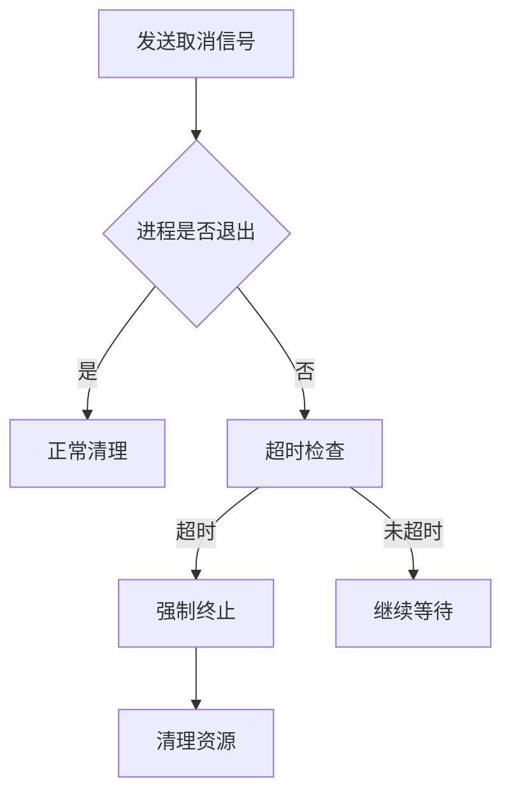

**本节源文件**
- [agent_stop_handle.rs](file://crates/agent_runner/src/proxy_agent/agent_stop_handle.rs#L160-L170)

### 资源泄漏处理

通过RAII机制和定期清理任务防止资源泄漏，确保所有资源都能被正确回收。

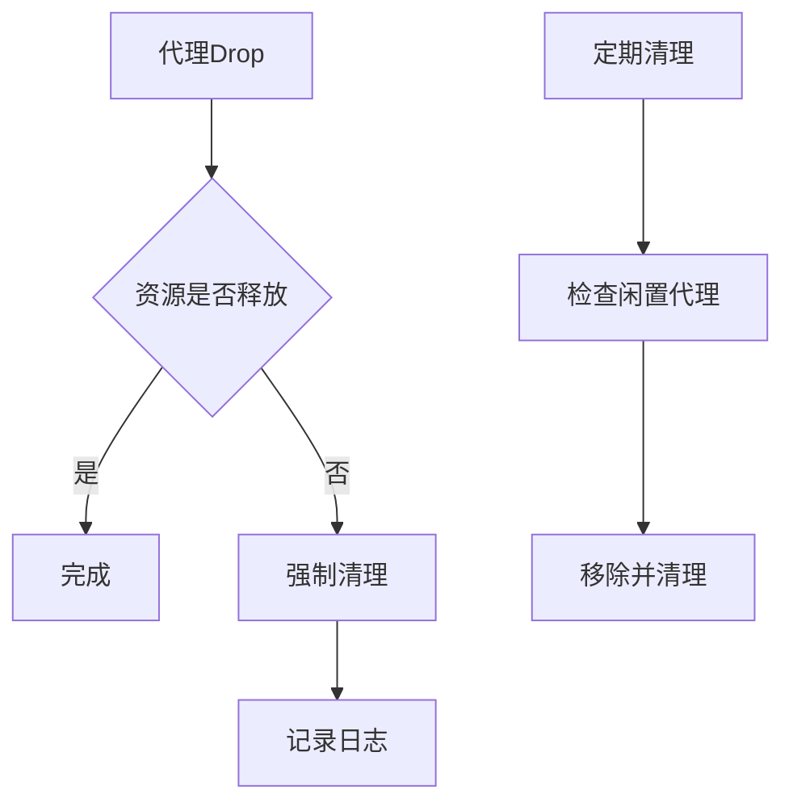

**本节源文件**
- [agent_stop_handle.rs](file://crates/agent_runner/src/proxy_agent/agent_stop_handle.rs#L250-L290)
- [cleanup_task.rs](file://crates/agent_runner/src/proxy_agent/cleanup_task.rs#L245-L276)

## 监控指标建议

为确保代理生命周期管理的可观测性，建议监控以下关键指标：

| 指标名称 | 指标类型 | 说明 | 告警阈值 |
|---------|--------|------|---------|
| active_agents | Gauge | 当前活跃代理数量 | > 100 |
| idle_agents | Gauge | 当前空闲代理数量 | < 10 |
| agent_startup_time | Histogram | 代理启动耗时 | p95 > 30s |
| agent_cleanup_count | Counter | 代理清理数量 | 1h内增长过快 |
| cancel_timeout_count | Counter | 取消超时次数 | 1h内>5次 |
| resource_leak_count | Counter | 资源泄漏检测次数 | > 0 |

**本节不分析具体源文件，因此不提供源文件引用**

## 结论

代理生命周期管理通过分层架构设计，实现了从创建到销毁的完整生命周期管理。系统采用RAII原则确保资源的自动管理和释放，通过通道机制实现异步任务通信，支持高并发场景下的稳定运行。优雅终止机制和超时处理策略确保了代理的可靠终止，定期清理任务防止了资源泄漏。整个生命周期管理流程形成了一个完整的闭环，为AI驱动开发平台提供了可靠的基础设施支持。

**本节不分析具体源文件，因此不提供源文件引用**