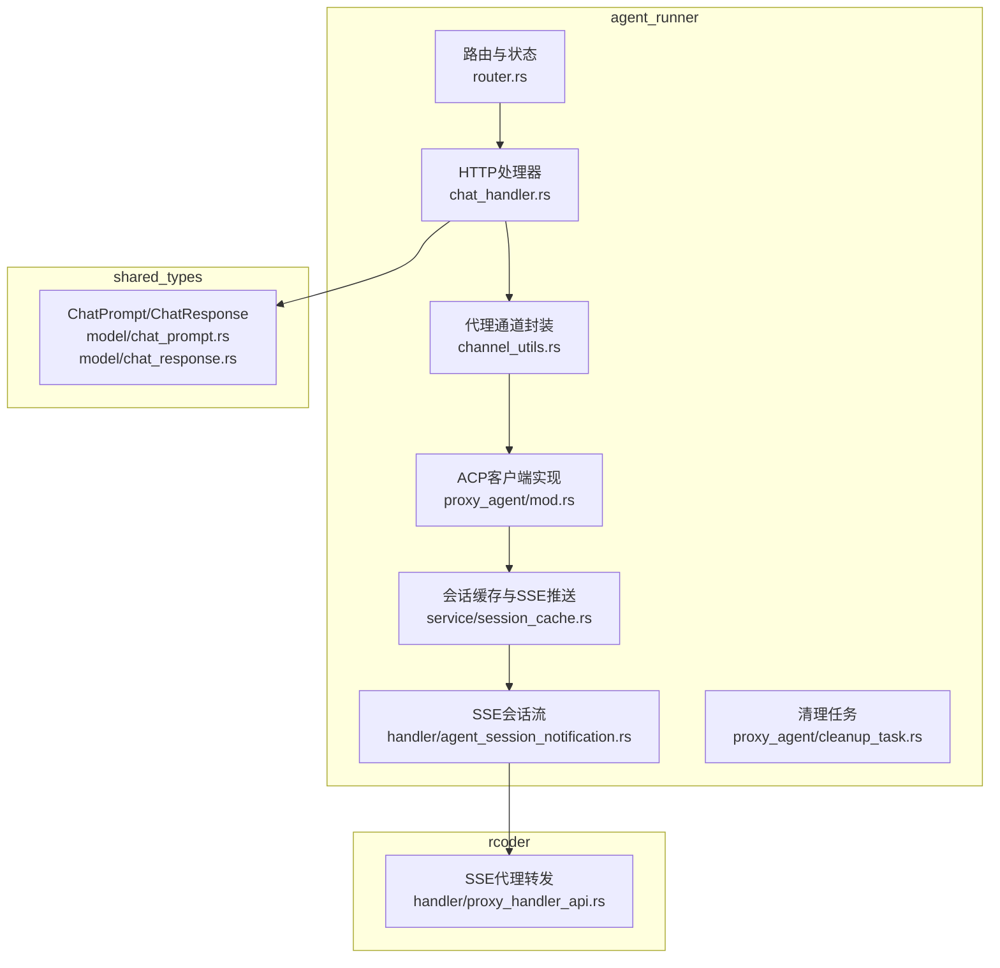
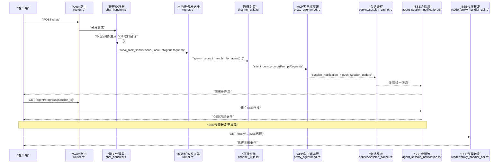
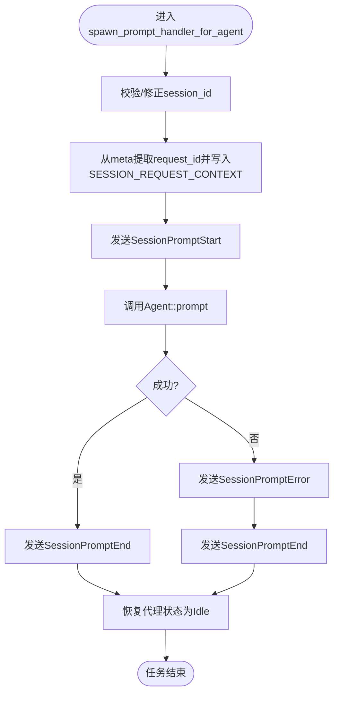
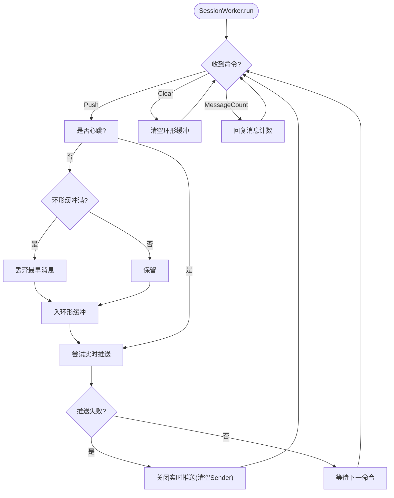
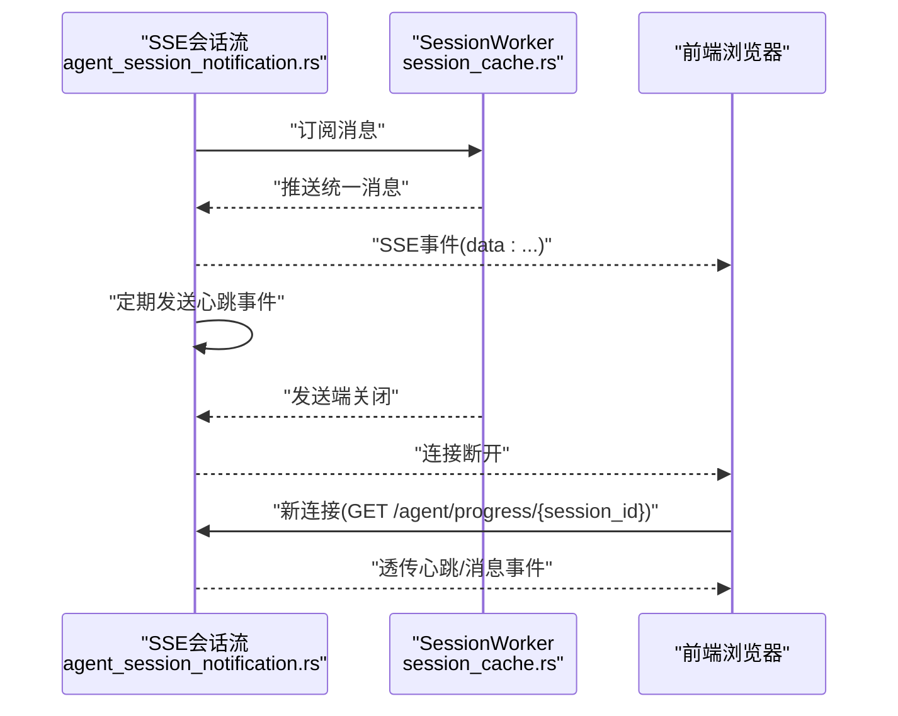
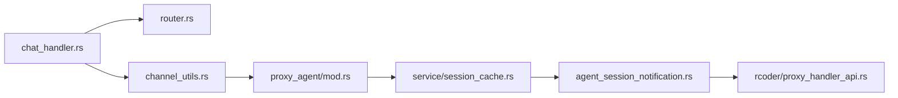

# 通信机制

<cite>
**本文引用的文件**
- [channel_utils.rs](file://crates/agent_runner/src/proxy_agent/channel_utils.rs)
- [agent_service.rs](file://crates/agent_runner/src/proxy_agent/agent_service.rs)
- [mod.rs](file://crates/agent_runner/src/proxy_agent/mod.rs)
- [chat_handler.rs](file://crates/agent_runner/src/handler/chat_handler.rs)
- [session_cache.rs](file://crates/agent_runner/src/service/session_cache.rs)
- [router.rs](file://crates/agent_runner/src/router.rs)
- [chat_prompt.rs](file://crates/shared_types/src/model/chat_prompt.rs)
- [chat_response.rs](file://crates/shared_types/src/model/chat_response.rs)
- [cleanup_task.rs](file://crates/agent_runner/src/proxy_agent/cleanup_task.rs)
- [agent_session_notification.rs](file://crates/agent_runner/src/handler/agent_session_notification.rs)
- [proxy_handler_api.rs](file://crates/rcoder/src/handler/proxy_handler_api.rs)
</cite>

## 目录
1. [引言](#引言)
2. [项目结构](#项目结构)
3. [核心组件](#核心组件)
4. [架构总览](#架构总览)
5. [详细组件分析](#详细组件分析)
6. [依赖分析](#依赖分析)
7. [性能考量](#性能考量)
8. [故障排查指南](#故障排查指南)
9. [结论](#结论)

## 引言
本文件围绕AI代理通信机制展开，重点剖析基于Tokio通道的消息传递架构，解释channel_utils.rs中Sender/Receiver的封装模式及其在代理与运行时之间的数据交换作用；说明ChatPrompt与ChatResponse数据结构的设计意图与序列化方式；描述SSE流式响应的生成过程及其与前端的交互协议；探讨高并发场景下的消息队列性能瓶颈与缓冲策略；并提供消息丢失、积压等问题的排查工具与修复建议。

## 项目结构
该仓库采用多crate组织，其中与通信机制最相关的是：
- agent_runner：负责HTTP入口、会话管理、SSE推送、代理通道封装与清理任务
- shared_types：跨crate共享的数据模型与序列化定义
- rcoder：提供反向代理能力，支撑SSE代理转发

图表来源
- [chat_handler.rs](file://crates/agent_runner/src/handler/chat_handler.rs#L176-L321)
- [channel_utils.rs](file://crates/agent_runner/src/proxy_agent/channel_utils.rs#L1-L230)
- [mod.rs](file://crates/agent_runner/src/proxy_agent/mod.rs#L1-L256)
- [session_cache.rs](file://crates/agent_runner/src/service/session_cache.rs#L1-L355)
- [agent_session_notification.rs](file://crates/agent_runner/src/handler/agent_session_notification.rs#L392-L483)
- [cleanup_task.rs](file://crates/agent_runner/src/proxy_agent/cleanup_task.rs#L87-L180)
- [router.rs](file://crates/agent_runner/src/router.rs#L1-L200)
- [chat_prompt.rs](file://crates/shared_types/src/model/chat_prompt.rs#L1-L52)
- [chat_response.rs](file://crates/shared_types/src/model/chat_response.rs#L1-L18)
- [proxy_handler_api.rs](file://crates/rcoder/src/handler/proxy_handler_api.rs#L106-L299)

章节来源
- [router.rs](file://crates/agent_runner/src/router.rs#L1-L200)

## 核心组件
- 基于Tokio通道的代理封装：在channel_utils.rs中，以spawn_*函数封装Cancel/Prompt两类消息处理任务，分别消费UnboundedReceiver并调用Agent trait方法，同时维护会话状态与上下文。
- 会话缓存与SSE推送：session_cache.rs通过环形缓冲区与mpsc通道，将统一消息推送到当前活跃连接，并提供清理与统计能力。
- SSE会话流：agent_session_notification.rs将统一消息序列化为SSE事件，配合心跳与取消令牌，实现与前端的长连接通信。
- 数据模型：shared_types中的ChatPrompt/ChatResponse定义了请求与响应的字段与序列化规则，贯穿前后端。

章节来源
- [channel_utils.rs](file://crates/agent_runner/src/proxy_agent/channel_utils.rs#L1-L230)
- [session_cache.rs](file://crates/agent_runner/src/service/session_cache.rs#L1-L355)
- [agent_session_notification.rs](file://crates/agent_runner/src/handler/agent_session_notification.rs#L392-L483)
- [chat_prompt.rs](file://crates/shared_types/src/model/chat_prompt.rs#L1-L52)
- [chat_response.rs](file://crates/shared_types/src/model/chat_response.rs#L1-L18)

## 架构总览
下面的序列图展示了从HTTP请求到SSE推送的完整链路，以及代理通道如何在运行时与代理交互。

图表来源
- [router.rs](file://crates/agent_runner/src/router.rs#L1-L200)
- [chat_handler.rs](file://crates/agent_runner/src/handler/chat_handler.rs#L176-L321)
- [channel_utils.rs](file://crates/agent_runner/src/proxy_agent/channel_utils.rs#L92-L229)
- [mod.rs](file://crates/agent_runner/src/proxy_agent/mod.rs#L149-L240)
- [session_cache.rs](file://crates/agent_runner/src/service/session_cache.rs#L231-L355)
- [agent_session_notification.rs](file://crates/agent_runner/src/handler/agent_session_notification.rs#L392-L483)
- [proxy_handler_api.rs](file://crates/rcoder/src/handler/proxy_handler_api.rs#L106-L299)

## 详细组件分析

### 基于Tokio通道的代理封装（channel_utils.rs）
- 封装模式
  - spawn_cancel_handler_for_agent：消费UnboundedReceiver<CancelNotificationRequest>，在超时保护内调用Agent::cancel，并通过请求携带的oneshot Sender回传CancelNotificationResponse，最后将代理状态置为Idle。
  - spawn_prompt_handler_for_agent：消费UnboundedReceiver<PromptRequest>，校验session_id一致性，提取request_id并写入SESSION_REQUEST_CONTEXT（以project_id为键），发送SessionPromptStart通知；随后调用Agent::prompt，成功则发送SessionPromptEnd，失败则先发送SessionPromptError再发送SessionPromptEnd，最后将代理状态置为Idle。
- 与运行时的交互
  - 通过PROJECT_AND_AGENT_INFO_MAP更新代理状态与最后活动时间，保证并发控制与状态一致性。
  - 通过push_session_update_with_project将统一会话消息推送到会话缓存，驱动SSE推送。

图表来源
- [channel_utils.rs](file://crates/agent_runner/src/proxy_agent/channel_utils.rs#L92-L229)

章节来源
- [channel_utils.rs](file://crates/agent_runner/src/proxy_agent/channel_utils.rs#L1-L230)

### 会话缓存与SSE推送（session_cache.rs）
- 设计要点
  - 使用环形缓冲区（ringbuf）承载历史消息，最大容量由构造参数决定；心跳消息不入环形缓冲，仅实时推送。
  - SessionData持有当前活跃连接的Sender与取消令牌，SessionWorker通过UnboundedReceiver接收命令，实时将消息推送到当前Sender，若发送失败则关闭实时推送。
  - 提供clear与message_count命令，便于诊断与清理。
- 缓冲策略
  - 当环形缓冲满且新消息非心跳时，丢弃最早一条，维持窗口大小；实时推送失败时记录告警并清理当前Sender，避免无效堆积。
- 与SSE的关系
  - push_session_update将统一消息转为SSE事件，结合心跳与取消令牌，确保前端连接稳定与及时断开。

图表来源
- [session_cache.rs](file://crates/agent_runner/src/service/session_cache.rs#L160-L229)

章节来源
- [session_cache.rs](file://crates/agent_runner/src/service/session_cache.rs#L1-L355)

### SSE流式响应与前端交互（agent_session_notification.rs）
- 生成过程
  - 建立SSE连接后，持续监听SessionWorker推送的消息；当收到消息时，将其序列化为SSE事件并yield；当发送端关闭时，自然断开连接。
  - 定期发送心跳事件，使用CancellationToken在新连接建立或取消时快速断开旧连接。
- 与前端协议
  - 事件类型与数据内容来自统一消息结构；心跳事件类型为“heartbeat”；错误事件在上游代理或容器连接失败时产生。
- 与rcoder的SSE代理转发
  - rcoder侧通过proxy_handler_api.rs创建SSE代理流，连接容器SSE端点，按双换行符切分SSE事件，透传原始事件到客户端。

图表来源
- [agent_session_notification.rs](file://crates/agent_runner/src/handler/agent_session_notification.rs#L392-L483)
- [session_cache.rs](file://crates/agent_runner/src/service/session_cache.rs#L160-L229)
- [proxy_handler_api.rs](file://crates/rcoder/src/handler/proxy_handler_api.rs#L106-L299)

章节来源
- [agent_session_notification.rs](file://crates/agent_runner/src/handler/agent_session_notification.rs#L392-L483)
- [proxy_handler_api.rs](file://crates/rcoder/src/handler/proxy_handler_api.rs#L106-L299)

### 数据结构：ChatPrompt与ChatResponse
- ChatPrompt
  - 字段包括project_id、project_path、session_id（可选）、prompt、attachments、data_source_attachments、agent_type、service_type、request_id（可选）、model_provider（可选）。
  - 设计意图：统一承载一次对话请求的全部上下文，便于代理侧按需使用；service_type固定为RCoder，确保运行时行为一致。
- ChatResponse
  - 字段包括project_id、session_id、error（可选）、request_id（可选）。
  - 序列化：使用标准JSON序列化，request_id默认在None时不输出，便于前端识别与追踪。

章节来源
- [chat_prompt.rs](file://crates/shared_types/src/model/chat_prompt.rs#L1-L52)
- [chat_response.rs](file://crates/shared_types/src/model/chat_response.rs#L1-L18)

### 代理服务与ACP客户端（agent_service.rs、proxy_agent/mod.rs）
- AcpAgentService：为不同AgentType提供统一启动接口，根据模型提供商选择具体代理实现。
- AcpAgentClient：实现agent_client_protocol::Client，负责权限请求、文件读写、会话通知等；在session_notification中将Agent消息转换为统一会话消息并推送至缓存。

章节来源
- [agent_service.rs](file://crates/agent_runner/src/proxy_agent/agent_service.rs#L1-L62)
- [mod.rs](file://crates/agent_runner/src/proxy_agent/mod.rs#L1-L256)

## 依赖分析
- 组件耦合
  - chat_handler.rs依赖router.rs中的local_task_sender，将LocalSetAgentRequest投递至运行时；随后通过channel_utils.rs与ACP客户端交互。
  - channel_utils.rs依赖PROJECT_AND_AGENT_INFO_MAP与SESSION_REQUEST_CONTEXT，维护代理状态与请求上下文。
  - session_cache.rs通过DashMap与CancellationToken管理会话生命周期，避免环形缓冲与实时推送的竞态。
  - agent_session_notification.rs依赖统一消息结构与心跳策略，结合SSE事件类型与数据内容。
- 外部依赖
  - Tokio mpsc通道、DashMap、ringbuf、CancellationToken等为高并发与低延迟提供了基础能力。
  - rcoder侧的proxy_handler_api.rs提供SSE代理转发，增强跨容器的SSE可达性。

图表来源
- [chat_handler.rs](file://crates/agent_runner/src/handler/chat_handler.rs#L176-L321)
- [router.rs](file://crates/agent_runner/src/router.rs#L1-L200)
- [channel_utils.rs](file://crates/agent_runner/src/proxy_agent/channel_utils.rs#L1-L230)
- [mod.rs](file://crates/agent_runner/src/proxy_agent/mod.rs#L1-L256)
- [session_cache.rs](file://crates/agent_runner/src/service/session_cache.rs#L1-L355)
- [agent_session_notification.rs](file://crates/agent_runner/src/handler/agent_session_notification.rs#L392-L483)
- [proxy_handler_api.rs](file://crates/rcoder/src/handler/proxy_handler_api.rs#L106-L299)

## 性能考量
- 通道选择
  - UnboundedSender用于Cancel/Prompt处理任务，避免背压导致的阻塞；但需注意内存增长风险，应配合超时与状态机约束。
  - mpsc::channel用于SSE实时推送，通过try_send与缓冲区满时的告警，避免阻塞主循环。
- 缓冲策略
  - 环形缓冲仅保留非心跳消息，心跳消息实时推送，降低延迟；满时丢弃最早消息，保障窗口大小稳定。
  - 通过clear命令与message_count统计，便于在高并发场景下进行主动清理与容量评估。
- 并发控制
  - PROJECT_AND_AGENT_INFO_MAP限制同一项目并发请求，避免代理过载；SSE连接通过CancellationToken快速切换，减少资源占用。
- 建议
  - 根据业务峰值调整环形缓冲大小与SSE通道容量；对高频心跳事件进行节流；在清理任务中增加孤儿会话检测与阈值报警。

[本节为通用性能讨论，不直接分析特定文件]

## 故障排查指南
- 常见问题与定位
  - 消息丢失
    - 现象：SSE连接中偶发消息缺失。
    - 排查：检查环形缓冲是否频繁满；确认实时推送try_send失败后的告警日志；核对心跳与取消令牌是否正确传播。
    - 修复：增大环形缓冲或SSE通道容量；优化消息粒度；确保前端及时消费。
  - 会话积压
    - 现象：多个session堆积，SSE连接长时间不刷新。
    - 排查：使用message_count命令查看当前缓冲长度；检查是否存在孤儿session（无活跃映射）。
    - 修复：在清理任务中定期扫描并移除孤儿session；必要时主动调用clear命令清空缓冲。
  - 连接异常断开
    - 现象：SSE连接在发送端关闭后自然断开。
    - 排查：确认SessionWorker中发送端被drop触发recv()返回None；检查取消令牌是否被正确触发。
    - 修复：确保在新连接建立或取消时显式触发取消令牌；避免旧连接长时间占用资源。
  - 代理转发失败
    - 现象：rcoder侧SSE代理无法连接到容器SSE端点。
    - 排查：检查容器SSE URL构建与状态；关注代理连接状态码与错误事件。
    - 修复：重试策略与错误事件透传；必要时切换后端或调整网络策略。
- 工具与建议
  - 清理任务：定期扫描孤儿session与SSE消息，移除无用数据，降低内存压力。
  - 统计与监控：利用message_count与心跳事件，结合日志级别，定位瓶颈与异常。
  - 超时与重试：在代理封装层设置合理超时，避免阻塞；对不可达后端实施指数退避重试。

章节来源
- [session_cache.rs](file://crates/agent_runner/src/service/session_cache.rs#L160-L229)
- [cleanup_task.rs](file://crates/agent_runner/src/proxy_agent/cleanup_task.rs#L87-L180)
- [proxy_handler_api.rs](file://crates/rcoder/src/handler/proxy_handler_api.rs#L106-L299)

## 结论
该通信机制以Tokio通道为核心，结合环形缓冲与SSE长连接，实现了高并发场景下的低延迟与高吞吐。通过统一消息模型与严格的会话管理，确保消息有序、可追踪、可清理。在实际部署中，建议根据业务特征动态调整缓冲与通道容量，并完善监控与告警体系，以应对突发流量与异常情况。