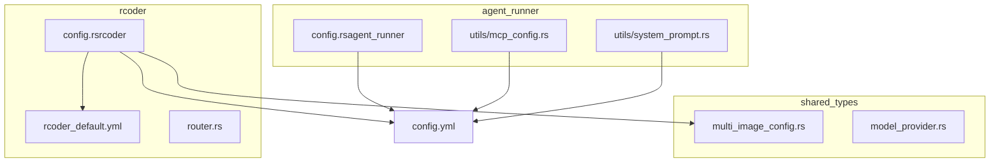
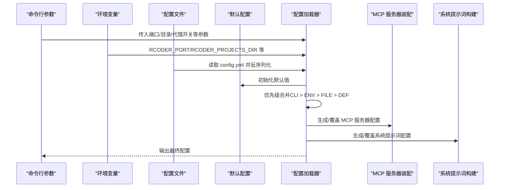
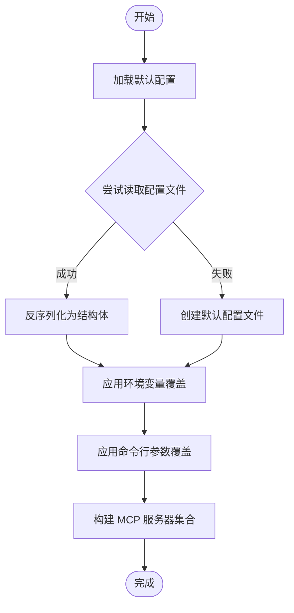
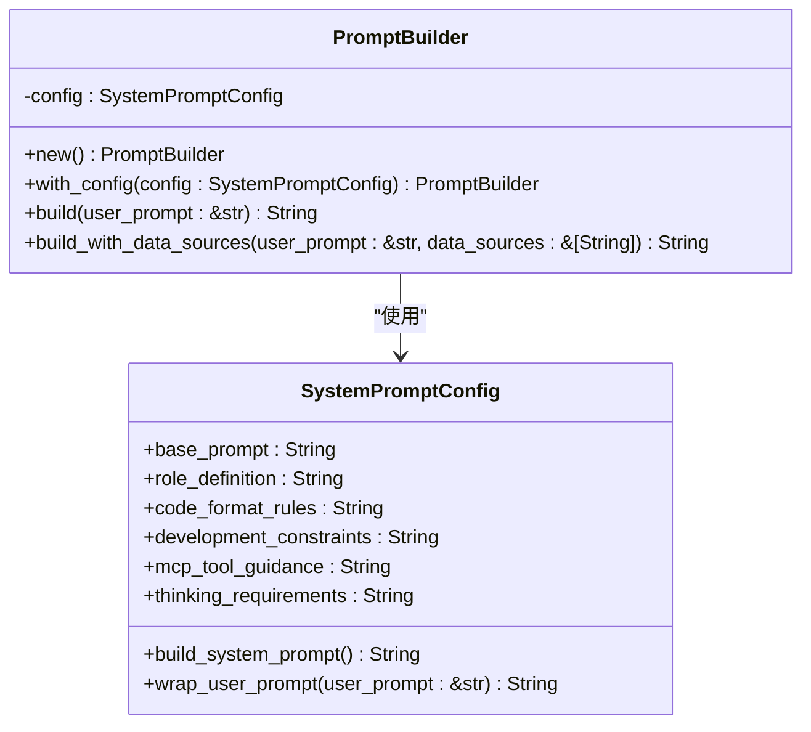
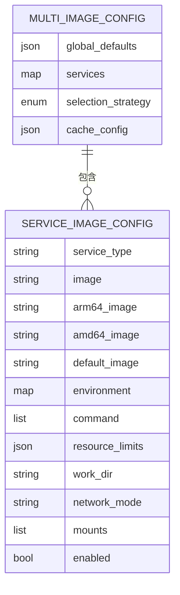
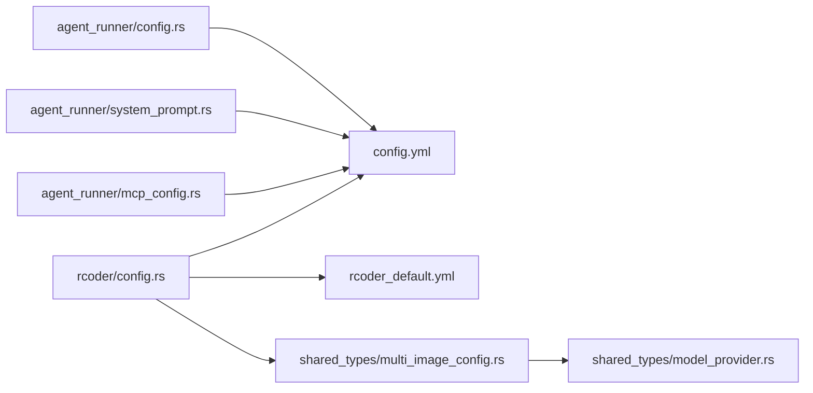

# 配置管理

<cite>
**本文引用的文件**
- [mcp_config.rs](file://crates/agent_runner/src/utils/mcp_config.rs)
- [system_prompt.rs](file://crates/agent_runner/src/utils/system_prompt.rs)
- [config.rs（agent_runner）](file://crates/agent_runner/src/config.rs)
- [config.rs（rcoder）](file://crates/rcoder/src/config.rs)
- [config.yml](file://config.yml)
- [rcoder_default.yml](file://crates/rcoder/src/rcoder_default.yml)
- [multi_image_config.rs](file://crates/shared_types/src/multi_image_config.rs)
- [model_provider.rs](file://crates/shared_types/src/model/model_provider.rs)
- [agent-abstraction-layer-design.md](file://specs/agent-abstraction-layer-design.md)
- [router.rs](file://crates/rcoder/src/router.rs)
</cite>

## 目录
1. [简介](#简介)
2. [项目结构](#项目结构)
3. [核心组件](#核心组件)
4. [架构总览](#架构总览)
5. [详细组件分析](#详细组件分析)
6. [依赖关系分析](#依赖关系分析)
7. [性能考量](#性能考量)
8. [故障排查指南](#故障排查指南)
9. [结论](#结论)
10. [附录](#附录)

## 简介
本文件聚焦“代理配置管理”，围绕以下目标展开：
- 详述 MCP 配置的加载机制与优先级规则（命令行 > 环境变量 > 配置文件），并解析 mcp_config.rs 中的配置结构体与 serde 反序列化实现。
- 阐述 system_prompt.rs 中系统提示词的动态构建逻辑及其对 AI 行为的影响。
- 结合 config.yml 示例，说明多代理环境下配置项的组织方式。
- 说明配置热更新支持现状与限制，并给出敏感信息的安全存储最佳实践。
- 提供配置错误的常见表现与诊断方法。

## 项目结构
本仓库采用多 crate 的分层组织，其中与“配置管理”直接相关的关键模块如下：
- agent_runner：提供 MCP 服务器配置与系统提示词构建能力，以及基础配置加载（命令行/环境变量/文件）。
- rcoder：提供更丰富的 Docker 多镜像配置与环境变量覆盖能力，并负责默认配置文件生成。
- shared_types：提供跨模块共享的配置结构（如多镜像配置、服务配置等）。
- specs：包含设计文档，描述代理抽象层、系统提示词模板解析等高级配置能力。

图表来源
- [mcp_config.rs](file://crates/agent_runner/src/utils/mcp_config.rs#L1-L225)
- [system_prompt.rs](file://crates/agent_runner/src/utils/system_prompt.rs#L1-L407)
- [config.rs（agent_runner）](file://crates/agent_runner/src/config.rs#L110-L192)
- [config.rs（rcoder）](file://crates/rcoder/src/config.rs#L253-L332)
- [rcoder_default.yml](file://crates/rcoder/src/rcoder_default.yml#L1-L175)
- [multi_image_config.rs](file://crates/shared_types/src/multi_image_config.rs#L1-L604)
- [model_provider.rs](file://crates/shared_types/src/model/model_provider.rs#L79-L131)
- [config.yml](file://config.yml#L1-L161)

章节来源
- [config.rs（agent_runner）](file://crates/agent_runner/src/config.rs#L110-L192)
- [config.rs（rcoder）](file://crates/rcoder/src/config.rs#L253-L332)
- [mcp_config.rs](file://crates/agent_runner/src/utils/mcp_config.rs#L1-L225)
- [system_prompt.rs](file://crates/agent_runner/src/utils/system_prompt.rs#L1-L407)
- [config.yml](file://config.yml#L1-L161)
- [rcoder_default.yml](file://crates/rcoder/src/rcoder_default.yml#L1-L175)
- [multi_image_config.rs](file://crates/shared_types/src/multi_image_config.rs#L1-L604)
- [model_provider.rs](file://crates/shared_types/src/model/model_provider.rs#L79-L131)

## 核心组件
- MCP 服务器配置与默认集合：提供 context7、fetch 等默认 MCP 服务器的创建与组合，便于在代理启动时直接使用。
- 系统提示词配置与构建器：定义系统提示词的结构化字段，提供构建完整提示词与包装用户提示词的能力。
- 应用配置加载（命令行/环境变量/文件）：定义优先级顺序，按需覆盖默认配置。
- Docker 多镜像配置：支持全局默认、服务特定配置、选择策略与缓存配置，并提供验证与摘要能力。
- 模型提供商安全信息：对敏感字段进行脱敏展示，便于日志与调试。

章节来源
- [mcp_config.rs](file://crates/agent_runner/src/utils/mcp_config.rs#L1-L225)
- [system_prompt.rs](file://crates/agent_runner/src/utils/system_prompt.rs#L1-L263)
- [config.rs（agent_runner）](file://crates/agent_runner/src/config.rs#L110-L192)
- [config.rs（rcoder）](file://crates/rcoder/src/config.rs#L253-L332)
- [multi_image_config.rs](file://crates/shared_types/src/multi_image_config.rs#L1-L270)
- [model_provider.rs](file://crates/shared_types/src/model/model_provider.rs#L79-L131)

## 架构总览
下图展示了配置加载与生效的总体流程，包括命令行、环境变量、配置文件与默认值的优先级关系，以及 MCP 服务器与系统提示词的装配过程。

图表来源
- [config.rs（agent_runner）](file://crates/agent_runner/src/config.rs#L110-L192)
- [config.rs（rcoder）](file://crates/rcoder/src/config.rs#L253-L332)
- [mcp_config.rs](file://crates/agent_runner/src/utils/mcp_config.rs#L86-L102)
- [system_prompt.rs](file://crates/agent_runner/src/utils/system_prompt.rs#L226-L263)

## 详细组件分析

### MCP 配置加载与优先级
- 优先级规则
  - 命令行参数优先级最高，随后是环境变量，再后是配置文件，最后是默认值。
  - agent_runner 的加载器会先加载默认配置，再尝试从配置文件读取，若失败则创建默认配置文件；随后应用环境变量覆盖；最后应用命令行参数覆盖。
  - rcoder 的加载器同样遵循相同优先级顺序，并在必要时创建默认配置文件。
- MCP 服务器装配
  - 提供默认 MCP 服务器集合（context7、fetch 等），并在代理启动时装配到运行时。
  - 支持为不同代理类型创建不同的服务器集合，便于扩展。
- serde 反序列化
  - 配置文件通过 serde_yaml 反序列化为结构化配置对象，字段与结构体一一对应，便于类型安全地访问配置项。

图表来源
- [config.rs（agent_runner）](file://crates/agent_runner/src/config.rs#L110-L192)
- [config.rs（rcoder）](file://crates/rcoder/src/config.rs#L253-L332)
- [mcp_config.rs](file://crates/agent_runner/src/utils/mcp_config.rs#L86-L102)

章节来源
- [config.rs（agent_runner）](file://crates/agent_runner/src/config.rs#L110-L192)
- [config.rs（rcoder）](file://crates/rcoder/src/config.rs#L253-L332)
- [mcp_config.rs](file://crates/agent_runner/src/utils/mcp_config.rs#L1-L225)

### 系统提示词动态构建逻辑
- 结构化字段
  - 基础提示词、角色定义、代码规范、开发约束、MCP 工具指导、思考要求等，均作为独立字段，便于按需组合与覆盖。
- 动态构建
  - 提供 build_system_prompt 与 wrap_user_prompt 方法，将系统提示词与用户输入拼接为最终提示词。
  - PromptBuilder 支持自定义配置与数据源增强，便于在多代理场景下为不同代理定制提示词。
- 对 AI 行为的影响
  - 通过严格的“框架一致性原则”“安全禁令”“路由模式要求”等，约束 AI 在前端开发中的行为边界，降低风险并提升一致性。
  - 数据源增强可引导 AI 更好地结合外部接口进行开发。

图表来源
- [system_prompt.rs](file://crates/agent_runner/src/utils/system_prompt.rs#L1-L263)

章节来源
- [system_prompt.rs](file://crates/agent_runner/src/utils/system_prompt.rs#L1-L263)

### 多代理环境下的配置组织（结合 config.yml 示例）
- config.yml 提供了主服务端口、项目工作目录、反向代理配置、Docker 多镜像配置等顶层配置。
- rcoder_default.yml 提供了默认配置模板，包含代理服务、镜像选择策略、缓存配置、网络模式、工作目录、自动清理、容器存活时间等。
- 多镜像配置（shared_types）支持：
  - 全局默认镜像配置（registry_prefix、image、arm64_image、amd64_image、default_image）。
  - 服务特定配置（rcoder、agent-runner），包含镜像、环境变量、命令、资源限制、卷挂载等。
  - 选择策略（ServiceOnly）与缓存配置（enabled、ttl_seconds、max_entries）。
  - 验证与摘要能力，便于在启动时校验配置有效性。

图表来源
- [multi_image_config.rs](file://crates/shared_types/src/multi_image_config.rs#L1-L270)
- [rcoder_default.yml](file://crates/rcoder/src/rcoder_default.yml#L31-L175)

章节来源
- [config.yml](file://config.yml#L1-L161)
- [rcoder_default.yml](file://crates/rcoder/src/rcoder_default.yml#L1-L175)
- [multi_image_config.rs](file://crates/shared_types/src/multi_image_config.rs#L1-L270)

### 配置热更新支持现状与限制
- 现状
  - agent_runner 的配置加载器在启动时一次性读取并合并配置，未提供运行时热更新能力。
  - rcoder 的配置加载器同样在启动时读取配置文件并创建默认文件，未内置热重载逻辑。
- 限制
  - 若需变更配置，需重启服务以重新加载配置。
  - Docker 多镜像配置在运行时未提供动态切换镜像的能力，需通过重启应用或外部编排工具实现。
- 建议
  - 对于频繁变更的轻量配置（如端口、日志级别），可通过环境变量在不重启的情况下生效（部分配置支持）。
  - 对于核心配置（如代理服务器、系统提示词模板、Docker 镜像策略），建议通过编排工具（如容器编排平台）进行滚动更新。

章节来源
- [config.rs（agent_runner）](file://crates/agent_runner/src/config.rs#L110-L192)
- [config.rs（rcoder）](file://crates/rcoder/src/config.rs#L253-L332)
- [multi_image_config.rs](file://crates/shared_types/src/multi_image_config.rs#L1-L270)

### 敏感信息的安全存储最佳实践
- 脱敏输出
  - 模型提供商配置在日志输出时自动对 API Key 进行脱敏，仅显示前后部分字符，避免泄露。
- 环境变量与配置文件
  - 建议将敏感信息（如 API Key、数据库密码）置于环境变量中，避免直接写入配置文件。
  - 对于必须写入配置文件的敏感信息，应使用加密存储与密钥管理服务，并在运行时解密。
- 访问控制
  - 限制配置文件与日志文件的访问权限，仅允许必要的服务账户读取。
- 审计与监控
  - 对配置变更进行审计与告警，防止未授权修改。
  - 在日志中避免记录敏感字段，或对敏感字段进行脱敏处理。

章节来源
- [model_provider.rs](file://crates/shared_types/src/model/model_provider.rs#L79-L131)

### 配置错误的常见表现与诊断方法
- 常见表现
  - 无法读取配置文件：启动时报错，提示读取失败或解析失败。
  - 端口冲突或不可用：命令行参数与环境变量冲突导致端口异常。
  - Docker 配置验证失败：镜像名称为空、缓存配置 TTL 或最大条目为 0、服务未启用等。
  - MCP 服务器装配失败：命令不可用或参数缺失。
- 诊断方法
  - 检查配置文件是否存在与格式是否正确，关注反序列化错误信息。
  - 使用默认配置文件模板进行对比，定位字段缺失或格式问题。
  - 查看日志输出，确认最终配置（端口、项目目录、代理开关、Docker 配置摘要）是否符合预期。
  - 对 Docker 配置进行验证，确保至少启用一个服务类型，镜像名称不为空。
  - 对 MCP 服务器进行最小化验证，确保命令与参数正确。

章节来源
- [config.rs（agent_runner）](file://crates/agent_runner/src/config.rs#L206-L270)
- [config.rs（rcoder）](file://crates/rcoder/src/config.rs#L346-L403)
- [multi_image_config.rs](file://crates/shared_types/src/multi_image_config.rs#L82-L158)

## 依赖关系分析
- agent_runner 依赖 shared_types 的多镜像配置结构，用于在代理启动时装配 MCP 服务器与 Docker 服务。
- rcoder 依赖 shared_types 的多镜像配置与模型提供商安全信息，提供默认配置文件生成与环境变量覆盖。
- system_prompt.rs 与 mcp_config.rs 作为工具模块，被代理启动流程调用，用于构建系统提示词与装配 MCP 服务器。

图表来源
- [config.rs（agent_runner）](file://crates/agent_runner/src/config.rs#L110-L192)
- [system_prompt.rs](file://crates/agent_runner/src/utils/system_prompt.rs#L1-L263)
- [mcp_config.rs](file://crates/agent_runner/src/utils/mcp_config.rs#L1-L225)
- [config.rs（rcoder）](file://crates/rcoder/src/config.rs#L253-L332)
- [multi_image_config.rs](file://crates/shared_types/src/multi_image_config.rs#L1-L270)
- [model_provider.rs](file://crates/shared_types/src/model/model_provider.rs#L79-L131)

## 性能考量
- 配置加载性能
  - 配置文件读取与反序列化成本较低，建议在启动阶段一次性完成，避免在热路径重复解析。
- Docker 配置缓存
  - 多镜像配置支持缓存（enabled、ttl_seconds、max_entries），可减少镜像选择与拉取开销。
- 日志与调试
  - 对敏感信息进行脱敏输出，避免日志过大影响性能。
  - 在生产环境中适当降低日志级别，减少 I/O 压力。

## 故障排查指南
- 启动失败
  - 检查配置文件是否存在与格式是否正确；若不存在，查看是否成功创建默认配置文件。
  - 关注反序列化错误与验证错误，逐项修正。
- 端口异常
  - 确认命令行参数、环境变量与配置文件中的端口设置是否一致。
- Docker 配置异常
  - 确认至少启用一个服务类型，镜像名称不为空；检查缓存配置 TTL 与最大条目是否为正数。
- MCP 服务器异常
  - 确认命令与参数正确，必要时最小化验证（仅启用一个服务器）以定位问题。

章节来源
- [config.rs（agent_runner）](file://crates/agent_runner/src/config.rs#L206-L270)
- [config.rs（rcoder）](file://crates/rcoder/src/config.rs#L346-L403)
- [multi_image_config.rs](file://crates/shared_types/src/multi_image_config.rs#L82-L158)

## 结论
- 本项目通过清晰的优先级规则（命令行 > 环境变量 > 配置文件 > 默认值）实现了灵活的配置管理。
- MCP 服务器与系统提示词的动态构建为多代理场景提供了可扩展的基础能力。
- Docker 多镜像配置与验证机制提升了容器化部署的可控性与可观测性。
- 建议在生产环境中优先使用环境变量存储敏感信息，并配合脱敏输出与最小权限访问策略，确保安全与合规。

## 附录
- 代理抽象层设计文档中还描述了系统提示词模板解析与用户提示词包装的高级能力，可用于进一步定制不同代理的行为。

章节来源
- [agent-abstraction-layer-design.md](file://specs/agent-abstraction-layer-design.md#L967-L1535)