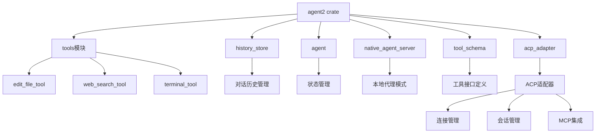
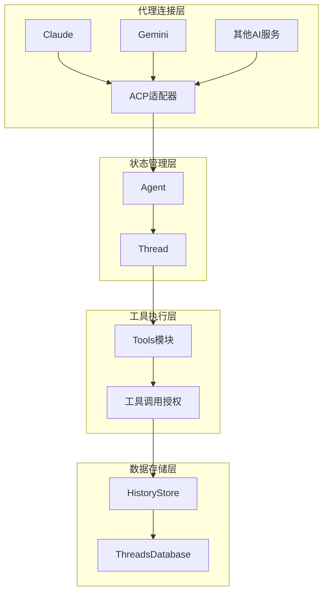
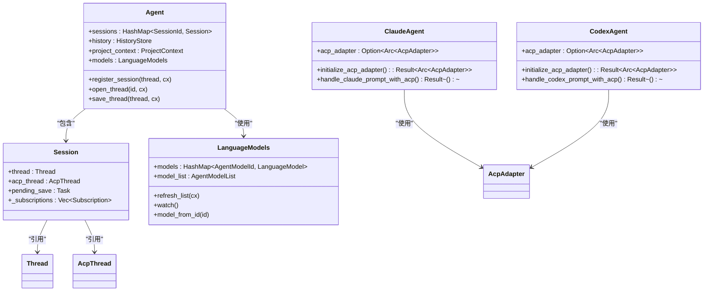
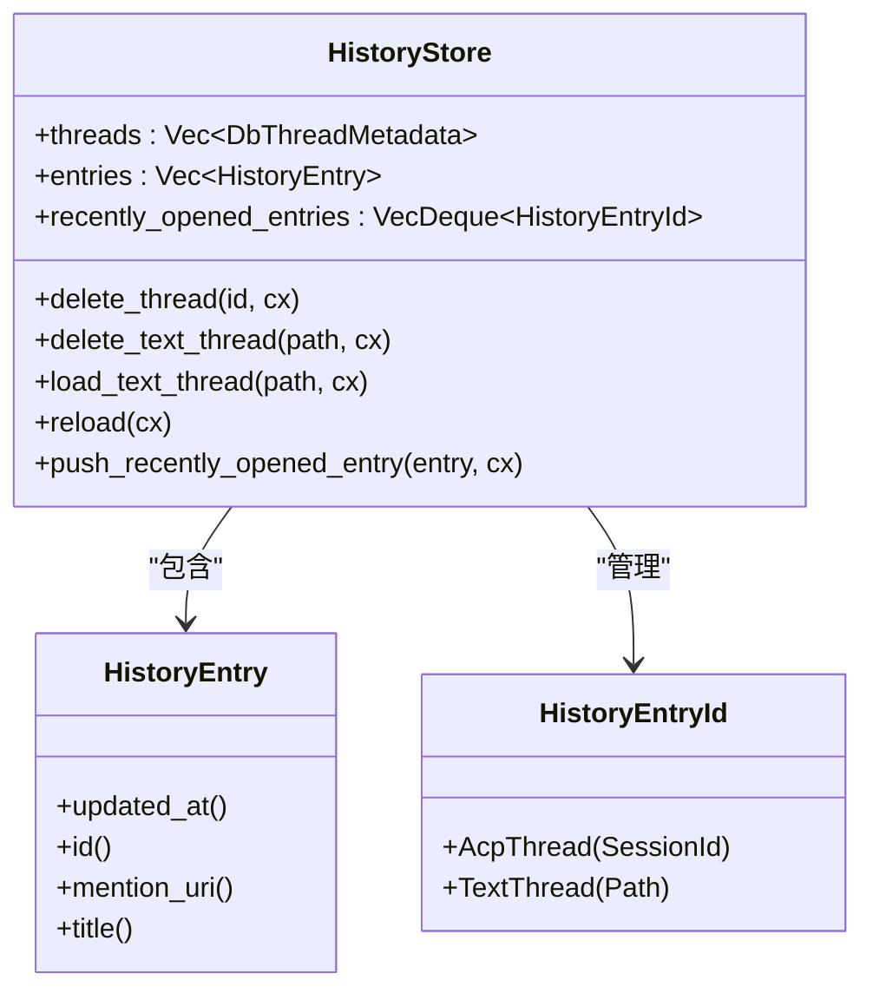
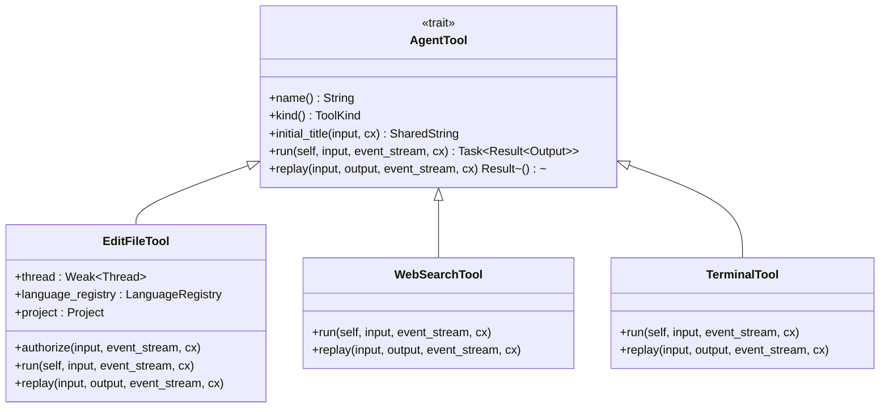
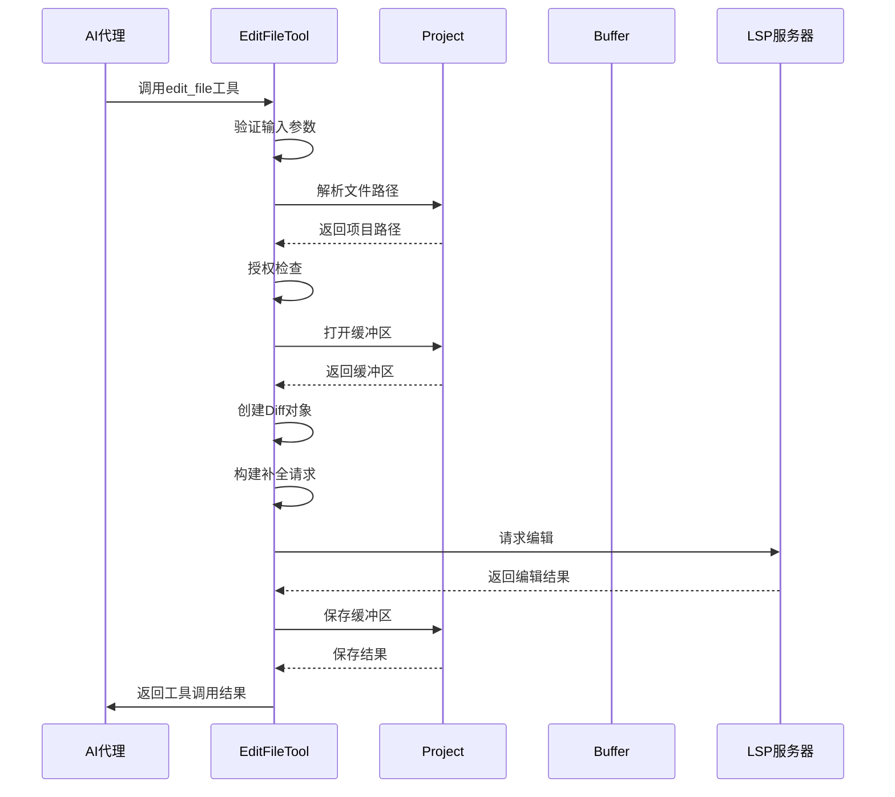
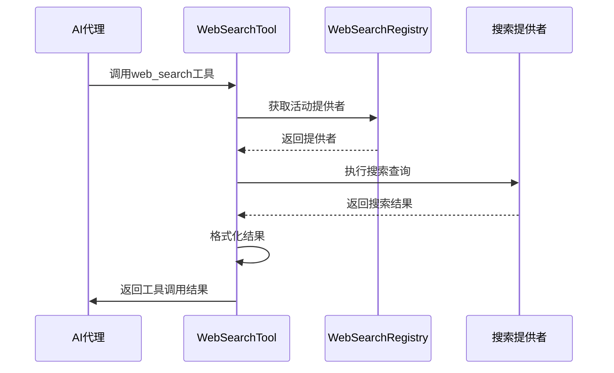
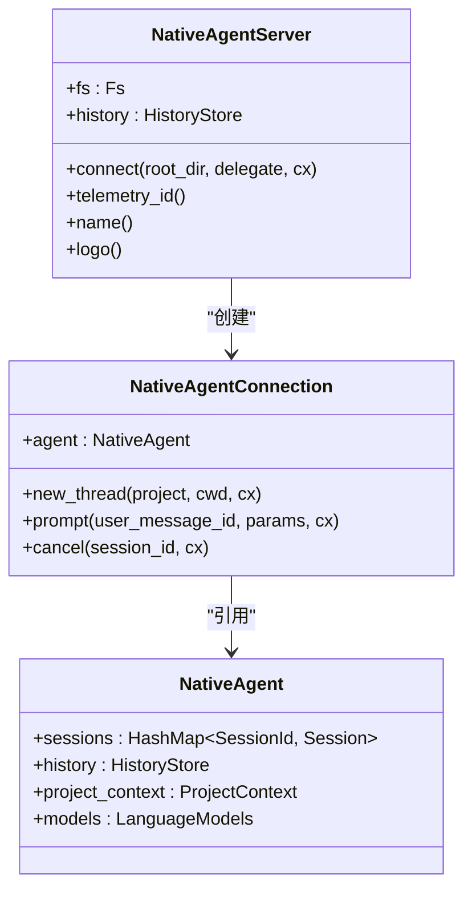
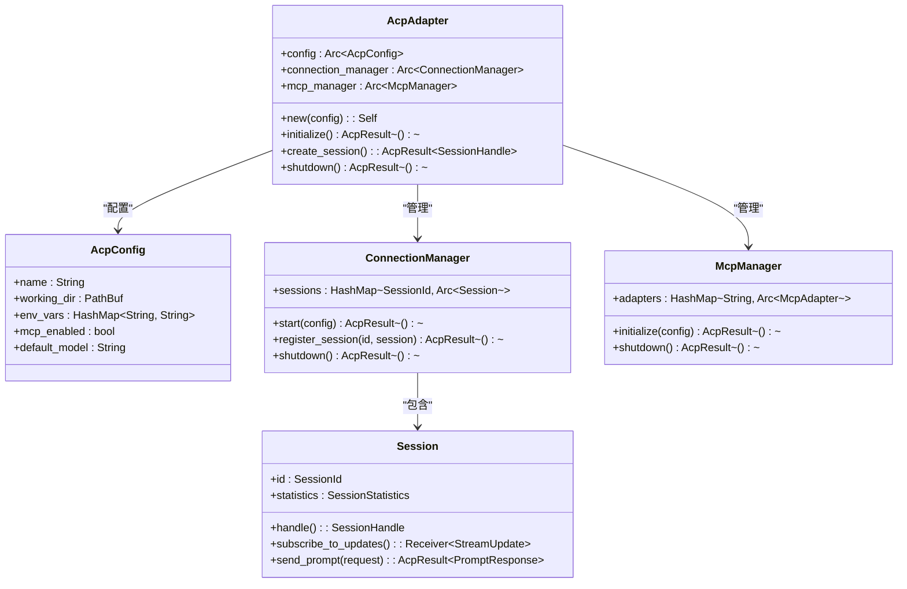
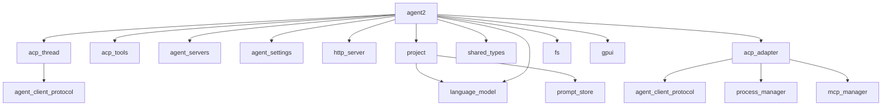

# AI代理系统

<cite>
**本文档引用的文件**
- [agent.rs](file://crates/agent2/src/agent.rs)
- [history_store.rs](file://crates/agent2/src/history_store.rs)
- [tools.rs](file://crates/agent2/src/tools.rs)
- [tool_schema.rs](file://crates/agent2/src/tool_schema.rs)
- [native_agent_server.rs](file://crates/agent2/src/native_agent_server.rs)
- [edit_file_tool.rs](file://crates/agent2/src/tools/edit_file_tool.rs)
- [web_search_tool.rs](file://crates/agent2/src/tools/web_search_tool.rs)
- [terminal_tool.rs](file://crates/agent2/src/tools/terminal_tool.rs)
- [claude/src/agent.rs](file://crates/claude/src/agent.rs) - *在提交457d19ab中更新*
- [codex/src/agent.rs](file://crates/codex/src/agent.rs) - *在提交457d19ab中更新*
- [claude/src/main.rs](file://crates/claude/src/main.rs) - *在提交0d457004中添加*
- [acp_adapter/src/lib.rs](file://crates/acp_adapter/src/lib.rs) - *ACP适配器实现*
</cite>

## 更新摘要
**变更内容**
- 更新了Agent结构体与状态管理部分，反映了ACP适配器的集成
- 新增了ACP适配器实现部分，详细说明了ACP适配器的架构和功能
- 更新了架构概述，增加了ACP适配器在系统中的位置
- 在详细组件分析中添加了对ClaudeAgent和CodexAgent中ACP集成的说明
- 更新了项目结构，反映了新的主程序实现

## 目录
1. [简介](#简介)
2. [项目结构](#项目结构)
3. [核心组件](#核心组件)
4. [架构概述](#架构概述)
5. [详细组件分析](#详细组件分析)
6. [依赖分析](#依赖分析)
7. [性能考虑](#性能考虑)
8. [故障排除指南](#故障排除指南)
9. [结论](#结论)

## 简介
本文档全面记录了AI代理系统的实现机制，重点描述了`agent2` crate如何协调与Claude、Gemini等外部AI服务的交互。系统通过模块化设计实现了灵活的代理功能，支持多种工具调用和本地代理模式。文档详细解释了Agent结构体的状态管理、对话历史存储（history_store）和工具调用机制（tools模块），以及各类内置工具的功能与实现。

## 项目结构
AI代理系统采用Rust语言开发，基于模块化crate架构。核心功能分布在多个crates中，其中`agent2`是主要的代理实现模块，负责协调与外部AI服务的交互。系统通过清晰的目录结构组织代码，将工具实现、状态管理、历史存储等功能分离，提高了代码的可维护性和扩展性。新增的`main.rs`文件为Claude代理提供了主程序运行逻辑，实现了基于ACP协议的通信处理。

**图示来源**
- [agent2/src](file://crates/agent2/src)
- [acp_adapter/src](file://crates/acp_adapter/src)

**本节来源**
- [project_structure](file://.)
- [claude/src/main.rs](file://crates/claude/src/main.rs)

## 核心组件
系统的核心组件包括Agent结构体、对话历史存储（history_store）、工具调用机制（tools模块）、本地代理服务器（native_agent_server）和ACP适配器。这些组件协同工作，实现了完整的AI代理功能。Agent结构体负责管理代理的状态和生命周期，history_store模块处理对话历史的持久化存储，tools模块提供了丰富的内置工具，而native_agent_server则实现了本地代理模式。ACP适配器作为新的核心组件，实现了与外部AI服务的标准化通信。

**本节来源**
- [agent.rs](file://crates/agent2/src/agent.rs#L2-L1558)
- [history_store.rs](file://crates/agent2/src/history_store.rs#L0-L357)
- [acp_adapter/src/lib.rs](file://crates/acp_adapter/src/lib.rs#L85-L91)

## 架构概述
AI代理系统采用分层架构设计，各组件之间通过清晰的接口进行通信。系统架构分为四个主要层次：代理连接层、状态管理层、工具执行层和数据存储层。这种分层设计使得系统具有良好的可扩展性和可维护性，同时也便于添加新的AI服务支持和工具功能。ACP适配器作为代理连接层的核心，统一处理与不同AI服务的通信协议。

**图示来源**
- [agent2/src/agent.rs](file://crates/agent2/src/agent.rs#L2-L1558)
- [agent2/src/history_store.rs](file://crates/agent2/src/history_store.rs#L0-L357)
- [acp_adapter/src/lib.rs](file://crates/acp_adapter/src/lib.rs#L85-L91)

## 详细组件分析

### Agent结构体与状态管理
Agent结构体是系统的核心，负责管理代理的状态和生命周期。它通过Session结构体维护与外部AI服务的会话，每个会话包含内部Thread和ACP Thread，分别处理消息处理和协议通信。Agent还负责模型选择、会话注册和状态同步等关键功能。在ClaudeAgent和CodexAgent中，已集成ACP适配器，通过`initialize_acp_adapter`方法初始化适配器，并在`prompt`方法中使用ACP适配器处理提示。

**图示来源**
- [agent2/src/agent.rs](file://crates/agent2/src/agent.rs#L2-L1558)
- [claude/src/agent.rs](file://crates/claude/src/agent.rs#L74-L85)
- [codex/src/agent.rs](file://crates/codex/src/agent.rs#L43-L51)

**本节来源**
- [agent2/src/agent.rs](file://crates/agent2/src/agent.rs#L2-L1558)
- [claude/src/agent.rs](file://crates/claude/src/agent.rs)
- [codex/src/agent.rs](file://crates/codex/src/agent.rs)

### 对话历史存储（history_store）
history_store模块负责管理对话历史的持久化存储和检索。它通过HistoryStore结构体提供统一的API，支持ACPTread和TextThread两种历史条目类型。模块实现了最近打开条目的管理功能，通过键值存储持久化最近打开的会话列表，并提供了高效的条目检索和排序功能。

**图示来源**
- [agent2/src/history_store.rs](file://crates/agent2/src/history_store.rs#L0-L357)

**本节来源**
- [agent2/src/history_store.rs](file://crates/agent2/src/history_store.rs#L0-L357)

### 工具调用机制（tools模块）
tools模块实现了系统的工具调用机制，提供了丰富的内置工具。每个工具都实现了AgentTool trait，定义了工具的名称、输入输出类型、运行逻辑和重放机制。模块通过统一的接口管理所有内置工具，并提供了工具调用授权和执行状态跟踪功能。

**图示来源**
- [agent2/src/tools.rs](file://crates/agent2/src/tools.rs#L0-L60)
- [agent2/src/tools/edit_file_tool.rs](file://crates/agent2/src/tools/edit_file_tool.rs#L0-L799)
- [agent2/src/tools/web_search_tool.rs](file://crates/agent2/src/tools/web_search_tool.rs#L0-L132)

**本节来源**
- [agent2/src/tools.rs](file://crates/agent2/src/tools.rs#L0-L60)
- [agent2/src/tools/edit_file_tool.rs](file://crates/agent2/src/tools/edit_file_tool.rs#L0-L799)

### 内置工具功能与实现
系统提供了多种内置工具，每种工具都有特定的功能和实现方式。这些工具通过统一的接口与AI代理系统集成，确保了功能的一致性和可扩展性。

#### edit_file_tool
edit_file_tool是文件编辑工具，支持创建、编辑和覆盖文件操作。工具通过EditFileToolInput定义输入参数，包括显示描述、文件路径和操作模式。在执行前，工具会进行授权检查，确保操作的安全性。执行过程中，工具会与语言服务器集成，支持格式化保存等高级功能。

**图示来源**
- [agent2/src/tools/edit_file_tool.rs](file://crates/agent2/src/tools/edit_file_tool.rs#L0-L799)

**本节来源**
- [agent2/src/tools/edit_file_tool.rs](file://crates/agent2/src/tools/edit_file_tool.rs#L0-L799)

#### web_search_tool
web_search_tool是网络搜索工具，允许AI代理执行网络搜索获取实时信息。工具通过WebSearchToolInput接收搜索查询，使用WebSearchRegistry获取活动的搜索提供者，并执行搜索请求。搜索结果以结构化格式返回，包含相关网页的摘要和链接。

**图示来源**
- [agent2/src/tools/web_search_tool.rs](file://crates/agent2/src/tools/web_search_tool.rs#L0-L132)

**本节来源**
- [agent2/src/tools/web_search_tool.rs](file://crates/agent2/src/tools/web_search_tool.rs#L0-L132)

#### terminal_tool
terminal_tool是终端工具，允许AI代理执行系统命令。该工具提供了安全的命令执行环境，支持命令输出的实时流式传输。工具通过命令白名单和权限控制机制确保执行的安全性，防止恶意命令的执行。

**本节来源**
- [agent2/src/tools/terminal_tool.rs](file://crates/agent2/src/tools/terminal_tool.rs)

### 本地代理模式（native_agent_server）
native_agent_server实现了本地代理模式，允许系统作为本地服务运行。该模式通过NativeAgentServer结构体实现，提供了与外部AI服务相同的接口，但所有处理都在本地完成。这种模式适用于需要离线操作或对数据隐私有严格要求的场景。

**图示来源**
- [agent2/src/native_agent_server.rs](file://crates/agent2/src/native_agent_server.rs#L0-L127)

**本节来源**
- [agent2/src/native_agent_server.rs](file://crates/agent2/src/native_agent_server.rs#L0-L127)

### ACP适配器实现
ACP适配器是系统新增的核心组件，负责处理与外部AI服务的标准化通信。`AcpAdapter`结构体作为主适配器，通过`ConnectionManager`管理连接，`McpManager`处理MCP集成，并通过`Session`管理会话生命周期。适配器提供了`initialize`方法用于初始化连接，`create_session`方法用于创建新会话，以及`shutdown`方法用于关闭适配器。

**图示来源**
- [acp_adapter/src/lib.rs](file://crates/acp_adapter/src/lib.rs#L85-L91)

**本节来源**
- [acp_adapter/src/lib.rs](file://crates/acp_adapter/src/lib.rs)

### 工具接口定义（tool_schema）
tool_schema模块负责定义工具接口，使AI能够理解和使用各种工具。模块通过root_schema_for函数生成符合JSON Schema标准的工具模式，支持不同的模式格式（JsonSchema和JsonSchemaSubset）。这种设计确保了工具接口的标准化和互操作性。

**本节来源**
- [agent2/src/tool_schema.rs](file://crates/agent2/src/tool_schema.rs#L0-L43)

### 自定义工具开发指南
开发自定义工具需要实现AgentTool trait，定义工具的名称、输入输出类型和执行逻辑。开发者需要为工具输入和输出类型实现JsonSchema，确保AI能够正确解析和生成工具调用。工具应通过authorize方法进行安全检查，并在run方法中实现核心功能。

**本节来源**
- [agent2/src/tools.rs](file://crates/agent2/src/tools.rs#L0-L60)

## 依赖分析
AI代理系统依赖于多个外部crate和内部模块，形成了复杂的依赖关系网络。系统通过清晰的模块划分和接口定义，降低了组件间的耦合度，提高了系统的可维护性。

**图示来源**
- [Cargo.toml](file://Cargo.toml)
- [crates/agent2/Cargo.toml](file://crates/agent2/Cargo.toml)
- [crates/acp_adapter/Cargo.toml](file://crates/acp_adapter/Cargo.toml)

**本节来源**
- [Cargo.toml](file://Cargo.toml)
- [crates/agent2/Cargo.toml](file://crates/agent2/Cargo.toml)
- [crates/acp_adapter/Cargo.toml](file://crates/acp_adapter/Cargo.toml)

## 性能考虑
系统在设计时充分考虑了性能因素，采用了多种优化策略。异步任务处理机制确保了UI的响应性，批量操作和缓存机制减少了不必要的计算和I/O操作。工具调用的授权和执行分离设计，避免了阻塞主线程。对话历史的增量加载和最近条目缓存，提高了历史数据的访问效率。ACP适配器的连接池和会话复用机制进一步提升了系统性能。

## 故障排除指南
当遇到问题时，建议按照以下步骤进行排查：首先检查代理连接状态，确保与外部AI服务的连接正常；其次验证工具调用参数，确保输入符合要求；然后检查权限设置，确认必要的权限已授予；最后查看系统日志，获取详细的错误信息。对于复杂问题，可以启用调试模式获取更详细的跟踪信息。

**本节来源**
- [agent2/src/agent.rs](file://crates/agent2/src/agent.rs#L2-L1558)
- [agent2/src/history_store.rs](file://crates/agent2/src/history_store.rs#L0-L357)
- [acp_adapter/src/lib.rs](file://crates/acp_adapter/src/lib.rs)

## 结论
AI代理系统通过模块化设计和清晰的架构，实现了强大的代理功能。系统支持与多种外部AI服务的交互，提供了丰富的内置工具，并允许通过自定义工具扩展功能。本地代理模式满足了离线操作和数据隐私的需求。系统的可扩展性和可维护性设计，为未来的功能增强和优化提供了良好的基础。通过集成ACP适配器，系统实现了与不同AI服务的标准化通信，提高了代码的复用性和可维护性。