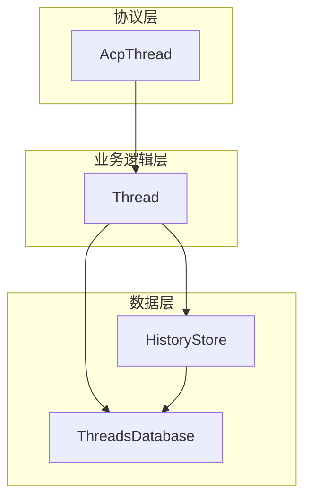
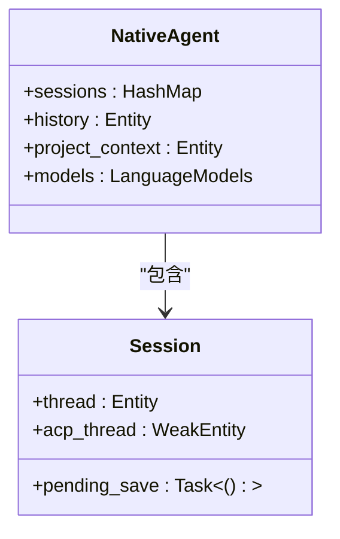
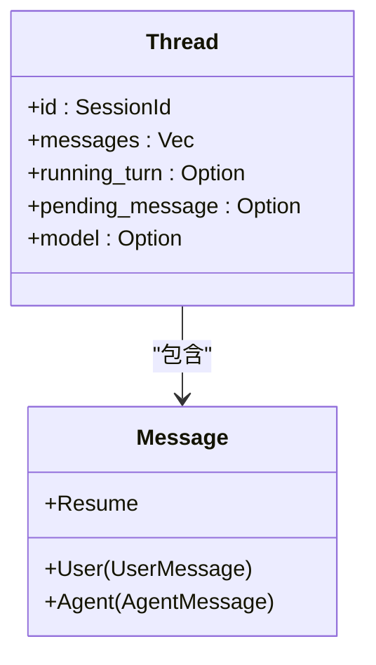
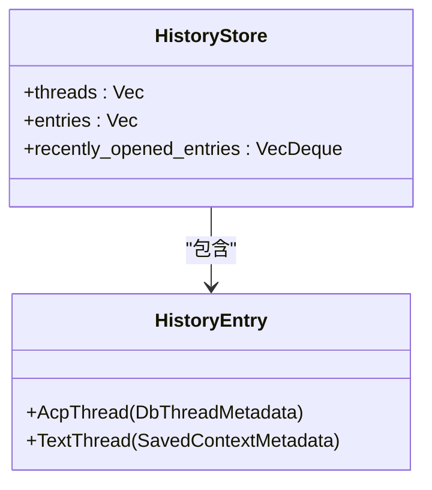
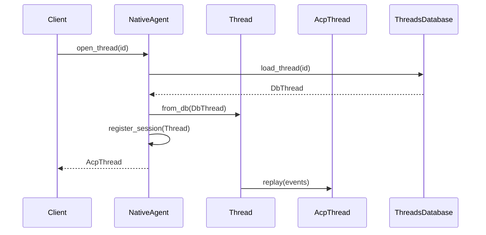
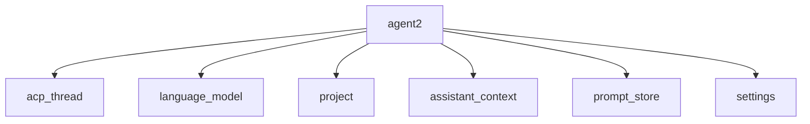

# 代理核心逻辑

<cite>
**本文档中引用的文件**   
- [agent.rs](file://crates/agent2/src/agent.rs)
- [agent2.rs](file://crates/agent2/src/agent2.rs)
- [history_store.rs](file://crates/agent2/src/history_store.rs)
- [thread.rs](file://crates/agent2/src/thread.rs)
- [db.rs](file://crates/agent2/src/db.rs)
- [native_agent_server.rs](file://crates/agent2/src/native_agent_server.rs)
</cite>

## 目录
1. [引言](#引言)
2. [项目结构](#项目结构)
3. [核心组件](#核心组件)
4. [架构概述](#架构概述)
5. [详细组件分析](#详细组件分析)
6. [依赖分析](#依赖分析)
7. [性能考虑](#性能考虑)
8. [故障排查指南](#故障排查指南)
9. [结论](#结论)

## 引言
本文档深入解析AI代理的核心实现机制，重点阐述Agent结构体的状态管理模型、会话生命周期控制以及与thread模块的交互方式。详细说明对话历史存储（history_store）的设计原理与持久化策略，分析其在多轮对话中的作用。解释agent2模块如何协调请求调度、上下文维护和响应聚合。结合代码示例展示代理初始化、提示处理和状态转换的完整流程。提供性能优化建议与常见故障排查指南，如会话超时、上下文丢失等问题的解决方案。

## 项目结构
项目采用模块化设计，核心功能集中在`crates/agent2`目录下。主要模块包括agent、thread、history_store、db等，分别负责代理核心逻辑、会话管理、历史记录存储和数据持久化。`agent2.rs`作为主入口文件，导出所有公共接口。`thread.rs`实现会话的核心状态机和消息处理逻辑，`history_store.rs`管理对话历史的持久化和检索，`db.rs`定义数据库实体和操作接口。

**Section sources**
- [agent2.rs](file://crates/agent2/src/agent2.rs#L1-L20)

## 核心组件
核心组件包括NativeAgent、Thread、HistoryStore和ThreadsDatabase。NativeAgent作为顶层协调器，管理多个会话（Session）的生命周期。每个会话包含一个Thread实例和一个AcpThread实例，分别处理内部逻辑和协议通信。HistoryStore负责维护对话历史的元数据和最近访问记录，ThreadsDatabase提供持久化存储支持。

**Section sources**
- [agent.rs](file://crates/agent2/src/agent.rs#L211-L228)
- [thread.rs](file://crates/agent2/src/thread.rs#L579-L610)
- [history_store.rs](file://crates/agent2/src/history_store.rs#L86-L93)
- [db.rs](file://crates/agent2/src/db.rs#L34-L53)

## 架构概述
系统采用分层架构，上层为协议适配层（AcpThread），中层为业务逻辑层（Thread），下层为数据存储层（HistoryStore和ThreadsDatabase）。NativeAgent作为协调者，负责会话的创建、管理和状态同步。Thread实例维护会话的完整状态，包括消息历史、工具调用、令牌使用等。HistoryStore提供高效的对话历史检索和最近访问记录管理。

**Diagram sources **
- [agent.rs](file://crates/agent2/src/agent.rs#L211-L228)
- [thread.rs](file://crates/agent2/src/thread.rs#L579-L610)
- [history_store.rs](file://crates/agent2/src/history_store.rs#L86-L93)

## 详细组件分析

### Agent状态管理模型
NativeAgent通过HashMap维护Session ID到Session实例的映射，每个Session包含Thread和AcpThread的弱引用。状态变更通过订阅机制自动同步，如项目上下文变更会触发project_context_needs_refresh信号，由_maintain_project_context任务处理更新。

**Diagram sources **
- [agent.rs](file://crates/agent2/src/agent.rs#L211-L228)

### 会话生命周期控制
会话生命周期由Thread结构体管理，包含id、消息历史、模型配置、运行状态等字段。通过running_turn字段持有当前交互任务，支持跨多个请求的工具调用流程。pending_message用于暂存未完成的助手消息，messages存储完整的对话历史。

**Diagram sources **
- [thread.rs](file://crates/agent2/src/thread.rs#L579-L610)

### 对话历史存储设计
HistoryStore采用内存缓存加持久化存储的设计，threads字段缓存DbThreadMetadata，entries字段维护排序后的历史条目。recently_opened_entries使用VecDeque实现最近访问记录的LRU缓存，通过save_recently_opened_entries任务异步持久化到KEY_VALUE_STORE。

**Diagram sources **
- [history_store.rs](file://crates/agent2/src/history_store.rs#L86-L93)

### Agent2模块协调机制
agent2模块通过NativeAgent统一协调请求调度、上下文维护和响应聚合。open_thread方法负责会话的加载和初始化，register_session建立Thread与AcpThread的关联。handle_thread_events处理线程事件并转发到协议层，实现双向通信。

**Diagram sources **
- [agent.rs](file://crates/agent2/src/agent.rs#L211-L228)
- [thread.rs](file://crates/agent2/src/thread.rs#L579-L610)

## 依赖分析
系统依赖关系清晰，agent2模块依赖acp_thread、language_model、project等外部模块。内部模块间通过Entity引用和消息传递解耦，如Thread通过project_context字段引用ProjectContext，通过context_server_registry访问上下文服务器。HistoryStore依赖assistant_context::ContextStore管理文本会话。

**Diagram sources **
- [agent2.rs](file://crates/agent2/src/agent2.rs#L2-L20)

## 性能考虑
系统在性能方面做了多项优化：HistoryStore的recently_opened_entries使用固定大小的VecDeque避免无限增长；save_recently_opened_entries任务通过SAVE_RECENTLY_OPENED_ENTRIES_DEBOUNCE延迟执行，减少I/O频率；Thread的initial_project_snapshot使用Shared<Task>实现懒加载和结果共享。

## 故障排查指南
常见问题包括会话超时和上下文丢失。会话超时通常由于running_turn任务异常终止，可通过检查Thread的running_turn字段状态诊断。上下文丢失可能源于HistoryStore的reload任务失败，需验证ThreadsDatabase连接状态。工具调用失败可通过检查ToolCallAuthorization事件的处理流程定位。

**Section sources**
- [thread.rs](file://crates/agent2/src/thread.rs#L579-L610)
- [history_store.rs](file://crates/agent2/src/history_store.rs#L86-L93)

## 结论
本文档详细解析了AI代理的核心实现机制，涵盖了状态管理、会话控制、历史存储和模块协调等关键方面。系统设计注重解耦和可维护性，通过清晰的分层架构和模块化设计实现了复杂的功能。建议在实际使用中关注会话状态管理和历史数据持久化，确保系统的稳定性和可靠性。