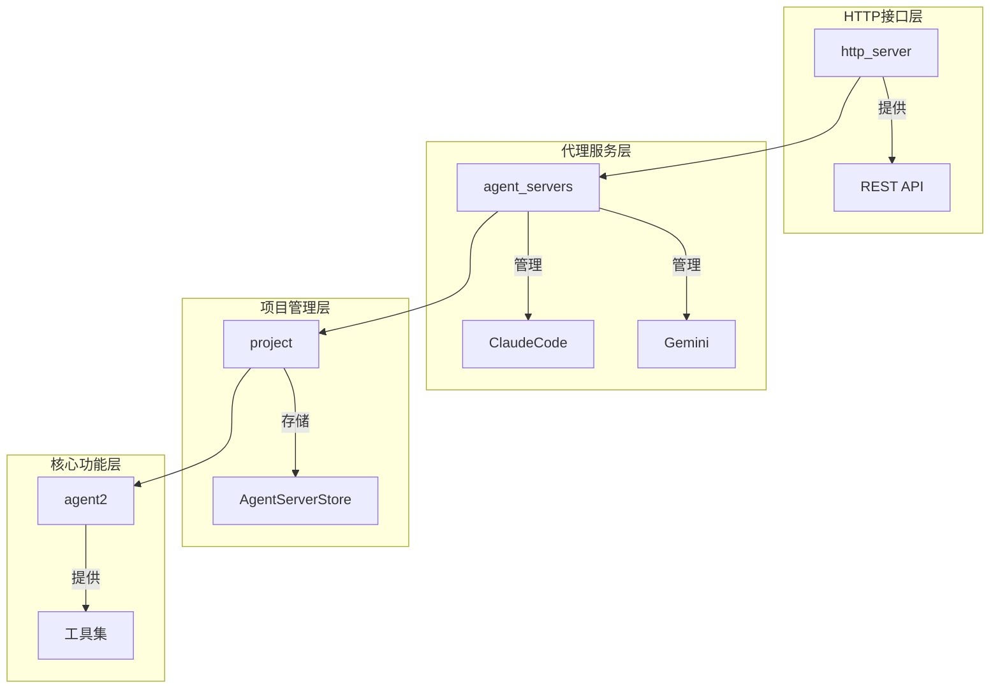
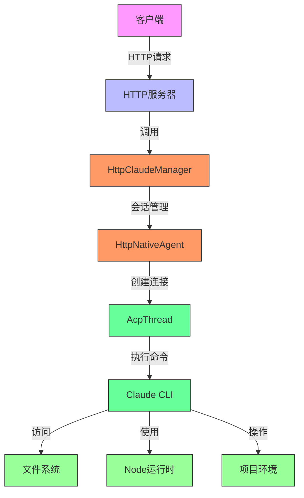
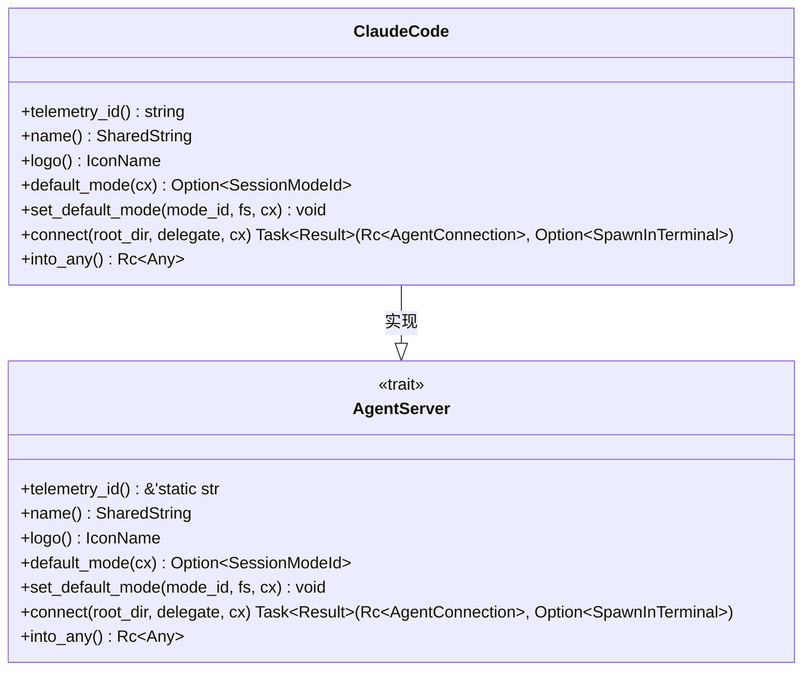
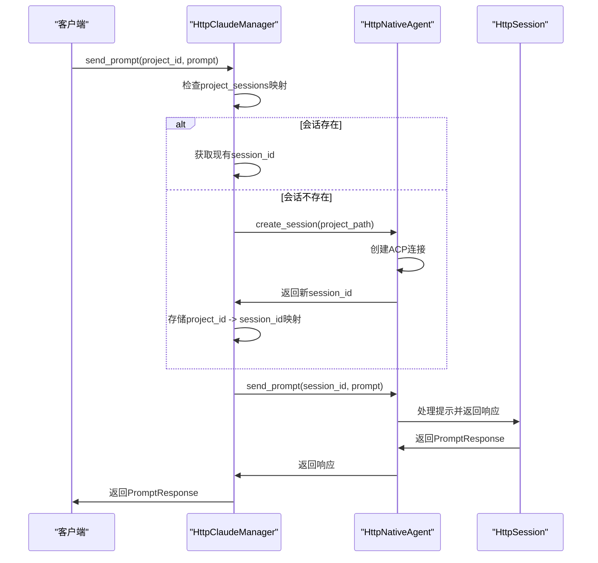
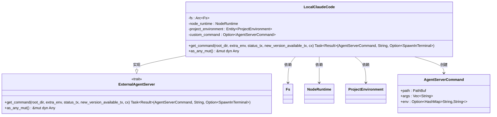
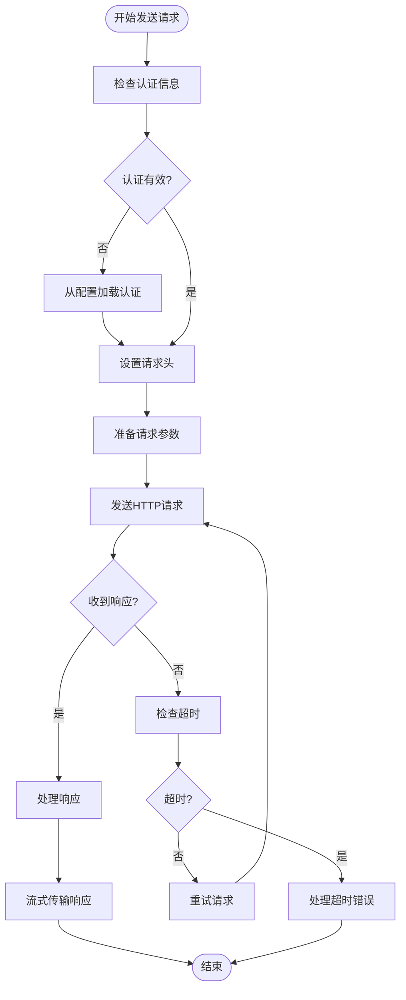
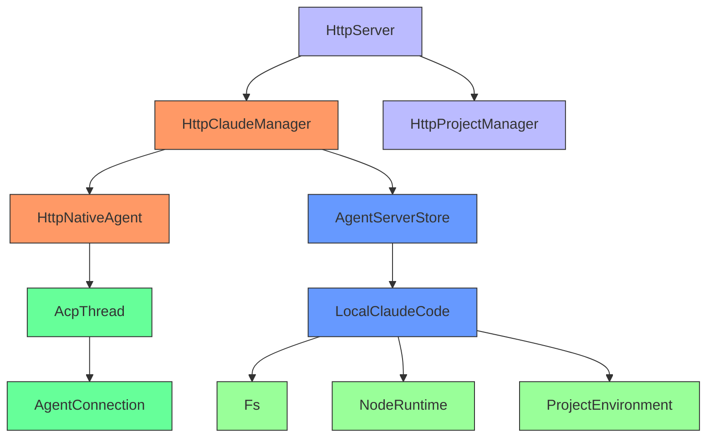

# Claude 服务集成

<cite>
**本文档中引用的文件**
- [claude.rs](file://crates/agent_servers/src/claude.rs)
- [agent_server_store.rs](file://crates/project/src/agent_server_store.rs)
- [http_interface.rs](file://crates/http_server/src/http_interface.rs)
- [http_agent.rs](file://crates/http_server/src/http_agent.rs)
- [lib.rs](file://crates/http_server/src/lib.rs)
- [handlers.rs](file://crates/http_server/src/handlers.rs)
</cite>

## 目录
1. [简介](#简介)
2. [项目结构](#项目结构)
3. [核心组件](#核心组件)
4. [架构概述](#架构概述)
5. [详细组件分析](#详细组件分析)
6. [依赖分析](#依赖分析)
7. [性能考虑](#性能考虑)
8. [故障排除指南](#故障排除指南)
9. [结论](#结论)

## 简介
本文档详细解析了ClaudeCode结构体的实现机制，说明其在agent_servers模块中的角色与生命周期管理。文档描述了HttpClaudeManager如何通过HttpNativeAgent与项目会话进行绑定，实现project_id到session_id的映射管理。同时分析了LocalClaudeCode的本地运行时构造，包括文件系统、Node运行时及项目环境的依赖注入方式。文档涵盖了Claude API的认证流程、请求头构造、流式响应处理策略，以及超时与错误重试机制。提供了实际调用示例，说明在不同网络条件下如何优化请求性能，并记录常见错误码及其排查方法。

## 项目结构
项目结构采用模块化设计，主要分为以下几个核心模块：
- `agent_servers`：负责Claude Code等外部代理服务器的集成和管理
- `http_server`：提供HTTP接口，使外部系统能够与Claude服务交互
- `project`：管理项目相关的状态和资源，包括代理服务器存储
- `agent2`：实现核心代理功能和工具集

这种分层架构使得Claude服务的集成既保持了与核心系统的紧密耦合，又通过HTTP接口提供了良好的外部可访问性。

**图示来源**
- [lib.rs](file://crates/http_server/src/lib.rs#L0-L47)
- [claude.rs](file://crates/agent_servers/src/claude.rs#L0-L44)
- [agent_server_store.rs](file://crates/project/src/agent_server_store.rs#L0-L799)

## 核心组件

`ClaudeCode`结构体是Claude服务集成的核心，实现了`AgentServer` trait，负责与Claude Code代理的通信和管理。`HttpClaudeManager`作为HTTP友好的管理器，通过`HttpNativeAgent`与项目会话进行绑定，实现了project_id到session_id的映射管理。`LocalClaudeCode`则负责本地运行时的构造，包括文件系统、Node运行时及项目环境的依赖注入。

**章节来源**
- [claude.rs](file://crates/agent_servers/src/claude.rs#L15-L16)
- [http_interface.rs](file://crates/http_server/src/http_interface.rs#L65-L69)
- [agent_server_store.rs](file://crates/project/src/agent_server_store.rs#L865-L870)

## 架构概述

系统采用分层架构设计，通过清晰的职责分离实现了Claude服务的高效集成。HTTP服务器层提供RESTful API接口，代理服务层管理Claude Code实例的生命周期，项目管理层维护项目相关的状态信息。

**图示来源**
- [http_interface.rs](file://crates/http_server/src/http_interface.rs#L65-L69)
- [http_agent.rs](file://crates/http_server/src/http_agent.rs#L14-L19)
- [claude.rs](file://crates/agent_servers/src/claude.rs#L70-L101)

## 详细组件分析

### ClaudeCode结构体分析
`ClaudeCode`结构体作为`AgentServer` trait的实现，是Claude服务集成的基础。它通过`connect`方法建立与Claude Code代理的连接，并提供遥测ID、名称和logo等元数据信息。

**图示来源**
- [claude.rs](file://crates/agent_servers/src/claude.rs#L15-L101)

**章节来源**
- [claude.rs](file://crates/agent_servers/src/claude.rs#L15-L101)

### HttpClaudeManager会话管理
`HttpClaudeManager`通过`DashMap`维护project_id到session_id的映射关系，实现了项目与会话的绑定管理。当收到新的prompt请求时，它会检查是否存在对应的会话，若不存在则创建新的会话。

**图示来源**
- [http_interface.rs](file://crates/http_server/src/http_interface.rs#L65-L90)
- [http_agent.rs](file://crates/http_server/src/http_agent.rs#L47-L76)

**章节来源**
- [http_interface.rs](file://crates/http_server/src/http_interface.rs#L65-L90)
- [http_agent.rs](file://crates/http_server/src/http_agent.rs#L47-L76)

### LocalClaudeCode本地运行时构造
`LocalClaudeCode`结构体负责构建Claude Code的本地运行时环境，通过依赖注入的方式提供文件系统、Node运行时和项目环境等必要组件。

**图示来源**
- [agent_server_store.rs](file://crates/project/src/agent_server_store.rs#L865-L870)
- [agent_server_store.rs](file://crates/project/src/agent_server_store.rs#L899-L928)

**章节来源**
- [agent_server_store.rs](file://crates/project/src/agent_server_store.rs#L865-L928)

### API认证与请求处理
系统通过环境变量和配置文件管理API认证信息，在请求时自动构造必要的认证头。流式响应处理策略确保了大响应的高效传输，同时实现了超时和错误重试机制。

**章节来源**
- [claude.rs](file://crates/agent_servers/src/claude.rs#L70-L101)
- [http_agent.rs](file://crates/http_server/src/http_agent.rs#L205-L240)

## 依赖分析

系统各组件之间存在明确的依赖关系，通过接口抽象降低了耦合度。`HttpClaudeManager`依赖`HttpNativeAgent`进行会话管理，`HttpNativeAgent`依赖`AcpThread`进行底层通信，而`LocalClaudeCode`则依赖文件系统、Node运行时等基础设施。

**图示来源**
- [http_interface.rs](file://crates/http_server/src/http_interface.rs#L65-L69)
- [http_agent.rs](file://crates/http_server/src/http_agent.rs#L14-L19)
- [agent_server_store.rs](file://crates/project/src/agent_server_store.rs#L865-L870)

**章节来源**
- [http_interface.rs](file://crates/http_server/src/http_interface.rs#L65-L69)
- [http_agent.rs](file://crates/http_server/src/http_agent.rs#L14-L19)
- [agent_server_store.rs](file://crates/project/src/agent_server_store.rs#L865-L870)

## 性能考虑

系统在设计时充分考虑了性能因素，通过会话复用、连接池、异步处理等机制提高了响应效率。`HttpClaudeManager`通过维护project_id到session_id的映射，避免了重复创建会话的开销。`HttpNativeAgent`使用`DashMap`和`RwLock`等高效并发数据结构，确保了高并发场景下的性能表现。

对于大文件处理和长文本生成等耗时操作，系统采用流式响应策略，避免了内存占用过高和响应延迟过长的问题。同时，通过合理的超时设置和错误重试机制，提高了系统的稳定性和可靠性。

## 故障排除指南

### 常见错误码及排查方法
- **401 Unauthorized**: 认证信息无效或缺失，检查API密钥配置
- **404 Not Found**: 项目或会话不存在，确认project_id和session_id的正确性
- **429 Too Many Requests**: 请求频率过高，实施请求限流
- **500 Internal Server Error**: 服务端错误，检查日志获取详细错误信息
- **504 Gateway Timeout**: 请求超时，检查网络连接和服务器负载

### 性能优化建议
1. 启用会话复用，避免频繁创建和销毁会话
2. 合理设置请求超时时间，平衡响应速度和用户体验
3. 对大响应采用流式处理，减少内存占用
4. 监控token使用情况，避免超出模型限制
5. 定期清理无效会话，释放系统资源

**章节来源**
- [http_agent.rs](file://crates/http_server/src/http_agent.rs#L47-L76)
- [http_interface.rs](file://crates/http_server/src/http_interface.rs#L65-L90)

## 结论

本文档详细解析了Claude服务的集成机制，涵盖了从核心组件实现到API调用的各个方面。通过`ClaudeCode`结构体、`HttpClaudeManager`和`LocalClaudeCode`等组件的协同工作，系统实现了高效、可靠的Claude服务集成。会话管理机制确保了项目与会话的正确绑定，而完善的错误处理和性能优化策略则保证了系统的稳定性和响应速度。这些设计使得Claude服务能够无缝集成到现有系统中，为用户提供强大的AI辅助功能。