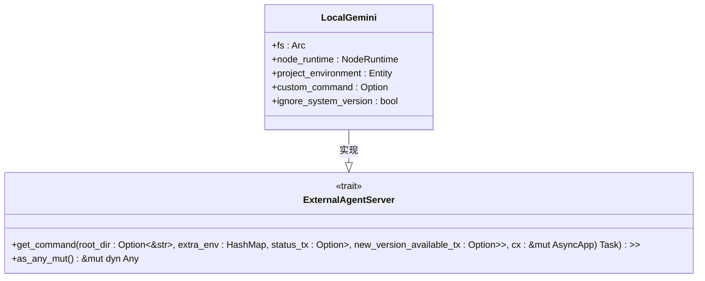
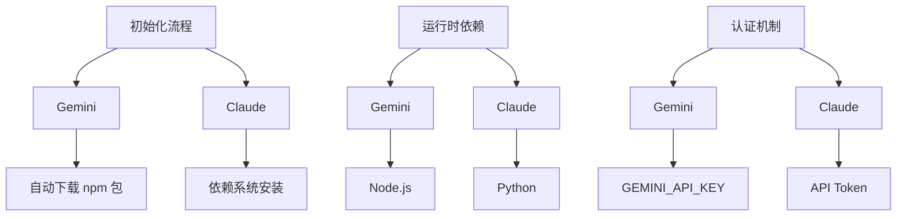
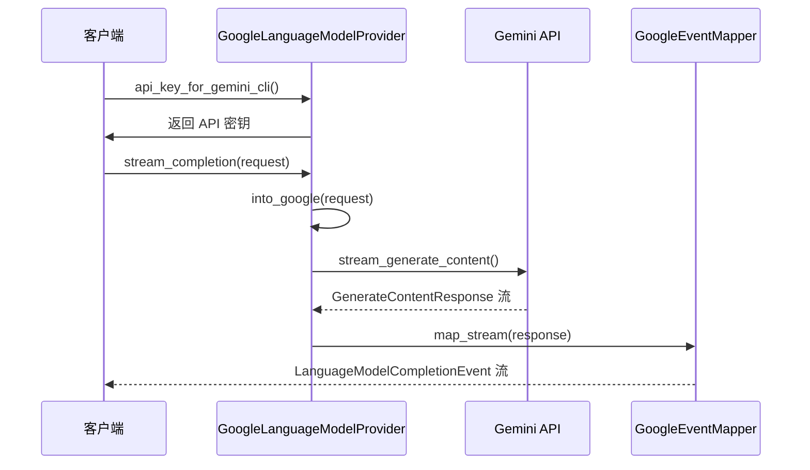
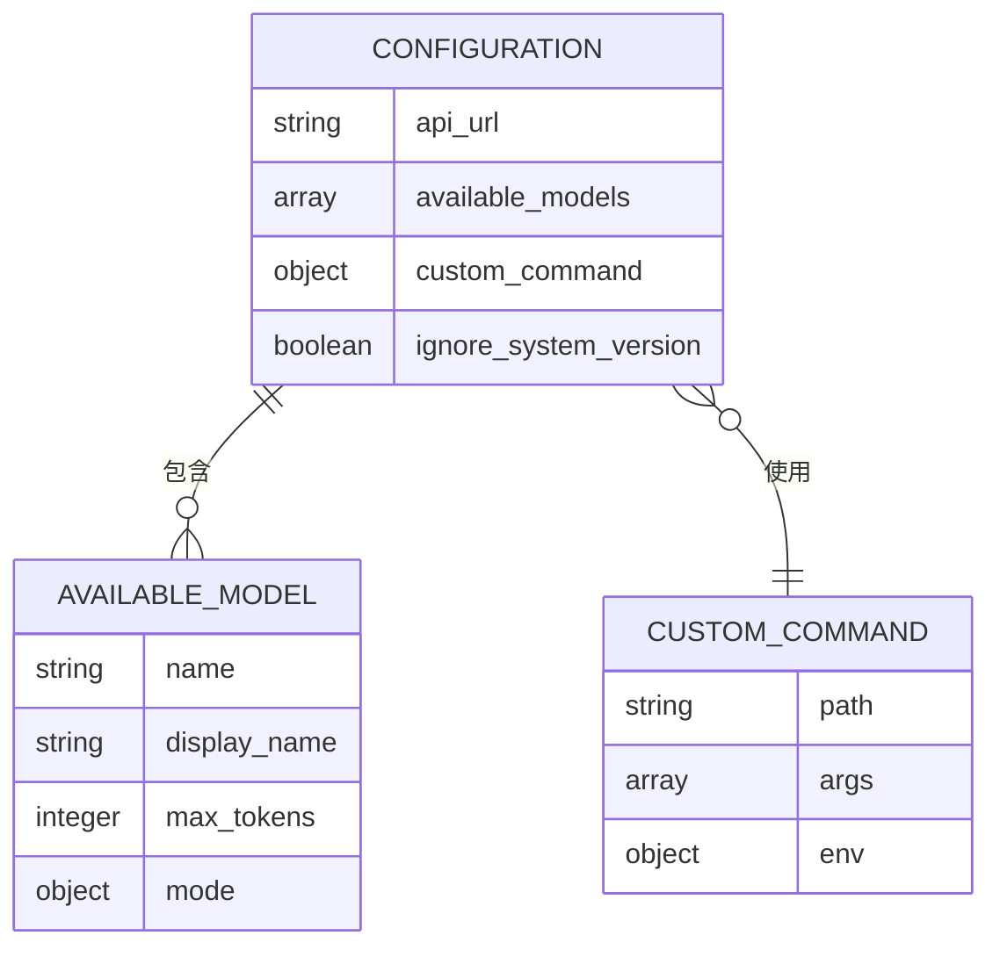
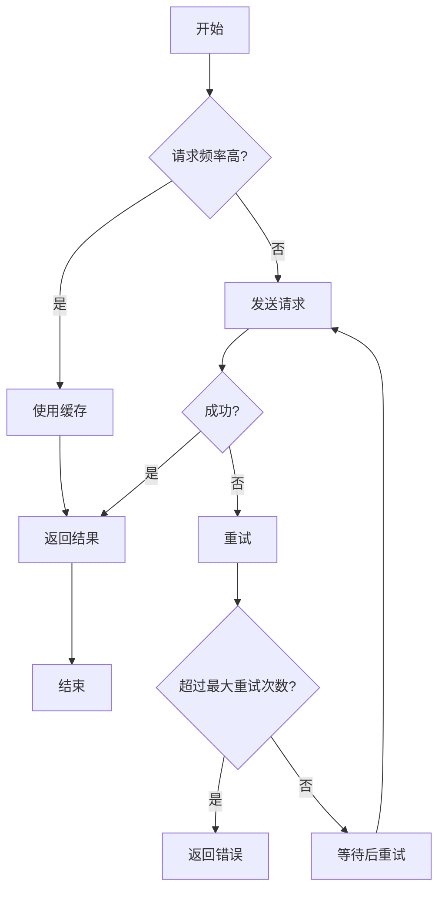
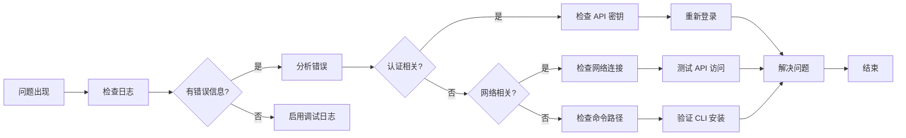

# Gemini 服务集成

<cite>
**本文档引用的文件**   
- [gemini.rs](file://crates/agent_servers/src/gemini.rs)
- [google.rs](file://crates/language_models/src/provider/google.rs)
- [agent_server_store.rs](file://crates/project/src/agent_server_store.rs)
</cite>

## 目录
1. [引言](#引言)
2. [Gemini 结构体设计原理](#gemini-结构体设计原理)
3. [LocalGemini 封装机制](#localgemini-封装机制)
4. [Gemini 与其他 AI 服务对比](#gemini-与其他-ai-服务对比)
5. [API 接入与认证机制](#api-接入与认证机制)
6. [配置参数说明](#配置参数说明)
7. [调用限制与性能优化](#调用限制与性能优化)
8. [故障排查指南](#故障排查指南)
9. [结论](#结论)

## 引言
本文档深入分析 Gemini 结构体在外部 AI 服务中的适配方式，阐述其如何通过 LocalGemini 封装文件系统、Node 运行时和项目环境，并支持自定义命令与系统版本忽略策略。文档涵盖 Gemini API 的接入方式、请求构造规范、响应解析逻辑及认证机制，提供配置参数说明、调用限制处理策略，并结合实际场景给出性能优化建议和故障排查指南。

## Gemini 结构体设计原理

Gemini 结构体实现了 `AgentServer` trait，作为外部 AI 服务的适配器，负责连接和管理 Gemini CLI 的生命周期。其核心设计包括：

- **遥测标识**：`telemetry_id` 返回 `"gemini-cli"`，用于区分不同代理服务。
- **名称与图标**：`name` 返回 `"Gemini CLI"`，`logo` 使用 `ui::IconName::AiGemini` 图标。
- **连接机制**：`connect` 方法异步启动连接流程，注入必要的环境变量（如 `SURFACE=zed` 和 `GEMINI_API_KEY`），并通过 `agent_server_store` 获取外部代理命令。

```mermaid
classDiagram
class Gemini {
+telemetry_id() string
+name() SharedString
+logo() IconName
+connect(root_dir : Option<Path>, delegate : AgentServerDelegate, cx : &mut App) Task<Result<(Rc<dyn AgentConnection>, Option<SpawnInTerminal>)>>
+into_any(self : Rc<Self>) Rc<dyn Any>
}
class AgentServer {
<<trait>>
+telemetry_id() &'static str
+name() SharedString
+logo() IconName
+connect(root_dir : Option<&Path>, delegate : AgentServerDelegate, cx : &mut App) Task<Result<(Rc<dyn AgentConnection>, Option<task : : SpawnInTerminal>)>>
+into_any(self : Rc<Self>) Rc<dyn Any>
}
Gemini --|> AgentServer : 实现
```

**图示来源**
- [gemini.rs](file://crates/agent_servers/src/gemini.rs#L0-L104)

**本节来源**
- [gemini.rs](file://crates/agent_servers/src/gemini.rs#L0-L104)

## LocalGemini 封装机制

`LocalGemini` 结构体封装了文件系统、Node 运行时和项目环境，支持自定义命令与系统版本忽略策略。其主要功能包括：

- **文件系统与运行时**：持有 `Arc<dyn Fs>` 和 `NodeRuntime` 实例，用于文件操作和 Node.js 脚本执行。
- **项目环境**：通过 `Entity<ProjectEnvironment>` 访问项目上下文。
- **自定义命令**：允许用户通过配置指定自定义的 Gemini CLI 命令。
- **版本忽略策略**：`ignore_system_version` 标志控制是否忽略系统安装的 Gemini 版本，优先使用内置版本。



**图示来源**
- [agent_server_store.rs](file://crates/project/src/agent_server_store.rs#L815-L870)

**本节来源**
- [agent_server_store.rs](file://crates/project/src/agent_server_store.rs#L815-L870)

## Gemini 与其他 AI 服务对比

Gemini 与其他 AI 服务（如 Claude）在初始化流程和运行时依赖上存在显著差异：

- **初始化流程**：Gemini 通过 `get_or_npm_install_builtin_agent` 自动下载并管理其 CLI 工具，而其他服务可能依赖系统安装或手动配置。
- **运行时依赖**：Gemini 依赖 Node.js 运行时执行其 CLI，而其他服务可能使用不同的语言运行时（如 Python 或 Rust）。
- **认证机制**：Gemini 使用 `GEMINI_API_KEY` 环境变量或系统密钥链进行认证，而其他服务可能有不同的认证方式。



**图示来源**
- [agent_server_store.rs](file://crates/project/src/agent_server_store.rs#L815-L870)
- [gemini.rs](file://crates/agent_servers/src/gemini.rs#L0-L104)

**本节来源**
- [agent_server_store.rs](file://crates/project/src/agent_server_store.rs#L815-L870)
- [gemini.rs](file://crates/agent_servers/src/gemini.rs#L0-L104)

## API 接入与认证机制

Gemini API 的接入涉及以下关键步骤：

- **API 密钥获取**：通过 `GoogleLanguageModelProvider::api_key_for_gemini_cli` 从环境变量或系统密钥链获取 `GEMINI_API_KEY`。
- **请求构造**：将 `LanguageModelRequest` 转换为 `GenerateContentRequest`，设置模型、系统指令、内容、生成配置和工具。
- **响应解析**：使用 `GoogleEventMapper` 将 `GenerateContentResponse` 流映射为 `LanguageModelCompletionEvent` 流，处理文本、工具调用和使用情况更新。



**图示来源**
- [google.rs](file://crates/language_models/src/provider/google.rs#L0-L799)

**本节来源**
- [google.rs](file://crates/language_models/src/provider/google.rs#L0-L799)

## 配置参数说明

Gemini 服务的配置参数主要包括：

- **API URL**：`api_url` 设置 Gemini API 的基础 URL，默认为 `https://generativelanguage.googleapis.com`。
- **可用模型**：`available_models` 列出可用的 Gemini 模型及其配置（如最大 token 数、模式）。
- **自定义命令**：`custom_command` 允许用户指定自定义的 Gemini CLI 命令路径和参数。
- **忽略系统版本**：`ignore_system_version` 控制是否忽略系统安装的 Gemini 版本。



**图示来源**
- [google.rs](file://crates/language_models/src/provider/google.rs#L0-L799)
- [agent_server_store.rs](file://crates/project/src/agent_server_store.rs#L815-L870)

**本节来源**
- [google.rs](file://crates/language_models/src/provider/google.rs#L0-L799)
- [agent_server_store.rs](file://crates/project/src/agent_server_store.rs#L815-L870)

## 调用限制与性能优化

### 调用限制处理
- **速率限制**：使用 `RateLimiter` 限制每秒请求数，避免触发 API 限流。
- **重试机制**：在网络错误或限流时自动重试，使用指数退避策略。
- **缓存策略**：对频繁请求的结果进行缓存，减少重复调用。

### 性能优化建议
- **批量请求**：合并多个小请求为一个大请求，减少网络开销。
- **异步处理**：使用异步任务处理长时间运行的操作，避免阻塞主线程。
- **资源复用**：复用已建立的连接和会话，减少初始化开销。



**图示来源**
- [google.rs](file://crates/language_models/src/provider/google.rs#L0-L799)

**本节来源**
- [google.rs](file://crates/language_models/src/provider/google.rs#L0-L799)

## 故障排查指南

### 常见问题
- **认证失败**：检查 `GEMINI_API_KEY` 是否正确设置，或尝试重新登录。
- **连接超时**：检查网络连接，确保可以访问 Gemini API。
- **命令未找到**：确认 Gemini CLI 是否已正确安装，或检查自定义命令路径。

### 排查步骤
1. 检查日志输出，定位错误信息。
2. 验证 API 密钥和网络配置。
3. 尝试手动运行 Gemini CLI 命令，确认其正常工作。
4. 查看系统环境变量，确保 `GEMINI_API_KEY` 存在。



**图示来源**
- [gemini.rs](file://crates/agent_servers/src/gemini.rs#L0-L104)
- [google.rs](file://crates/language_models/src/provider/google.rs#L0-L799)

**本节来源**
- [gemini.rs](file://crates/agent_servers/src/gemini.rs#L0-L104)
- [google.rs](file://crates/language_models/src/provider/google.rs#L0-L799)

## 结论
Gemini 服务通过精心设计的结构体和封装机制，实现了与外部 AI 服务的高效适配。其灵活的配置选项、可靠的认证机制和完善的错误处理策略，使其成为集成 AI 功能的强大工具。通过遵循本文档的指导，开发者可以更好地理解和优化 Gemini 服务的使用。