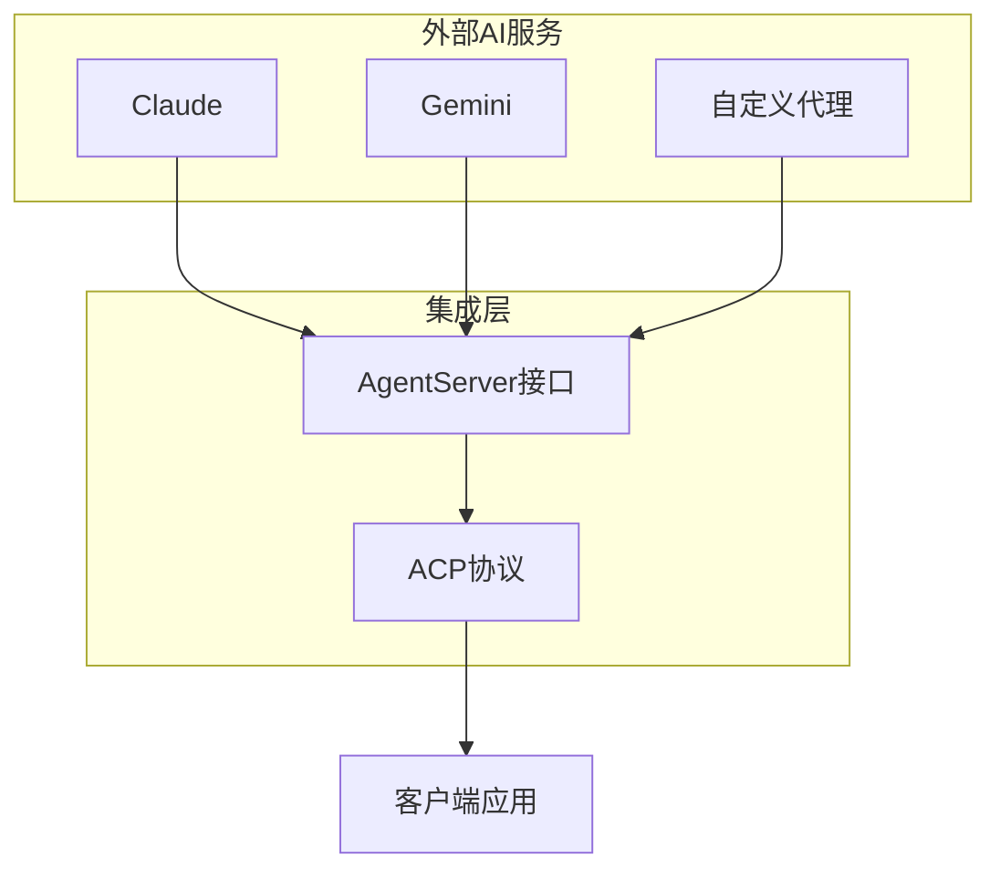
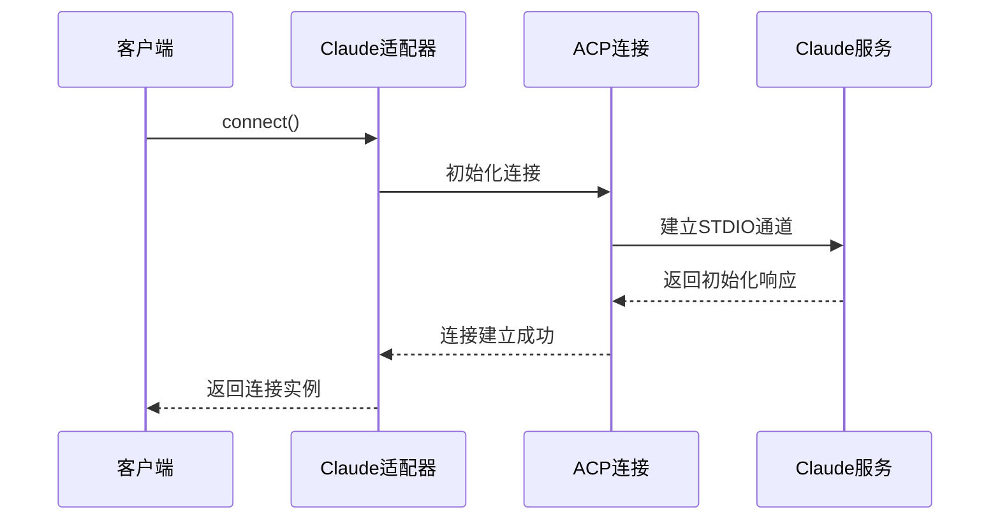
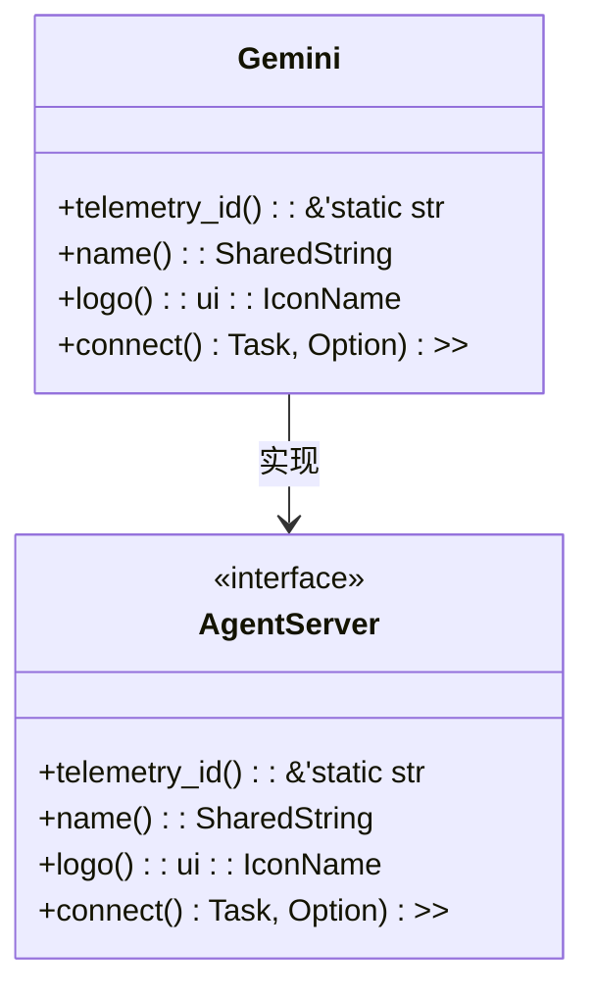
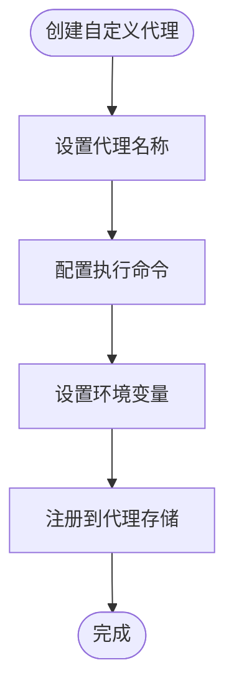
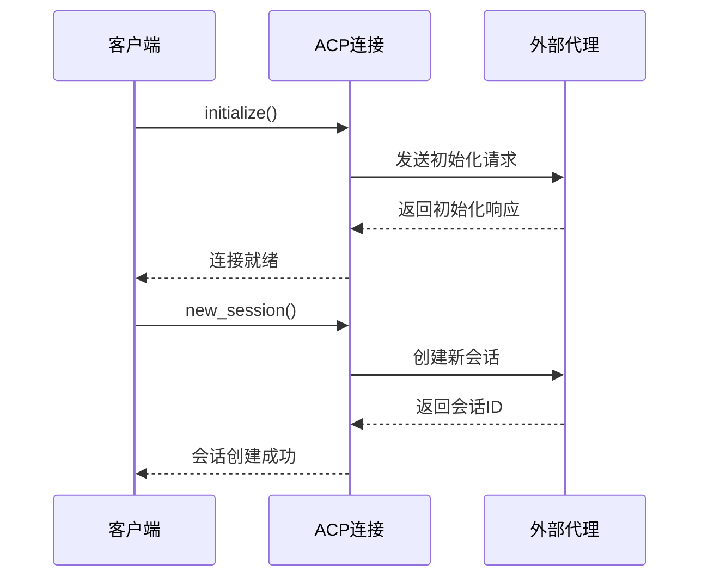
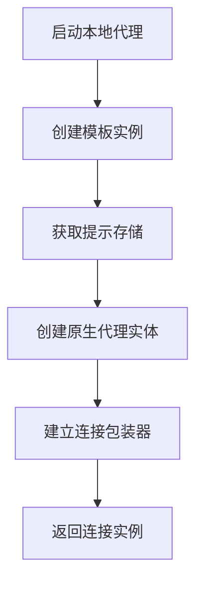

# 外部AI服务集成

<cite>
**本文档引用的文件**   
- [claude.rs](file://crates/agent_servers/src/claude.rs)
- [gemini.rs](file://crates/agent_servers/src/gemini.rs)
- [custom.rs](file://crates/agent_servers/src/custom.rs)
- [acp.rs](file://crates/agent_servers/src/acp.rs)
- [native_agent_server.rs](file://crates/agent2/src/native_agent_server.rs)
- [agent_server_store.rs](file://crates/project/src/agent_server_store.rs)
</cite>

## 目录
1. [简介](#简介)
2. [集成机制概览](#集成机制概览)
3. [Claude服务集成](#claude服务集成)
4. [Gemini服务集成](#gemini服务集成)
5. [自定义代理扩展](#自定义代理扩展)
6. [ACP协议通信](#acp协议通信)
7. [本地代理模式](#本地代理模式)
8. [配置与错误处理](#配置与错误处理)
9. [性能调优与故障恢复](#性能调优与故障恢复)
10. [结论](#结论)

## 简介
本文档详细记录了与外部AI服务（如Claude、Gemini）的集成机制，重点解析agent_servers模块中各适配器的实现差异。文档涵盖了请求构造、流式响应处理、认证方式、扩展接口设计等核心内容，并深入分析了ACPServer的双向通信机制和native_agent_server的本地代理模式。

## 集成机制概览
系统通过agent_servers模块实现了与多种外部AI服务的集成，包括Claude、Gemini以及自定义代理。这些服务通过统一的AgentServer接口进行管理，并通过ACP（Agent Client Protocol）协议实现与客户端的双向通信。



**Diagram sources**
- [agent_servers.rs](file://crates/agent_servers/src/agent_servers.rs)
- [acp.rs](file://crates/agent_servers/src/acp.rs)

**Section sources**
- [agent_servers.rs](file://crates/agent_servers/src/agent_servers.rs#L0-L51)
- [agent_server_store.rs](file://crates/project/src/agent_server_store.rs#L169-L208)

## Claude服务集成

### 请求构造与认证
Claude服务通过ClaudeCode结构体实现，其认证机制依赖于环境变量和配置文件。系统在连接时会自动处理认证流程，并通过ACP协议建立安全通信通道。



**Diagram sources**
- [claude.rs](file://crates/agent_servers/src/claude.rs#L0-L102)
- [acp.rs](file://crates/agent_servers/src/acp.rs#L0-L703)

**Section sources**
- [claude.rs](file://crates/agent_servers/src/claude.rs#L0-L102)
- [acp.rs](file://crates/agent_servers/src/acp.rs#L0-L703)

### 流式响应处理
系统通过异步任务处理Claude服务的流式响应，确保实时性和响应性。响应数据通过ACP协议的prompt方法进行传输和处理。

## Gemini服务集成

### 集成特点
Gemini服务通过Gemini结构体实现，其主要特点是通过环境变量GEMINI_API_KEY进行认证，并在连接时自动注入必要的环境配置。



**Diagram sources**
- [gemini.rs](file://crates/agent_servers/src/gemini.rs#L0-L104)
- [agent_server_store.rs](file://crates/project/src/agent_server_store.rs#L988-L1026)

**Section sources**
- [gemini.rs](file://crates/agent_servers/src/gemini.rs#L0-L104)
- [agent_server_store.rs](file://crates/project/src/agent_server_store.rs#L988-L1026)

### 环境变量注入
Gemini服务在连接时会自动注入SURFACE=zed环境变量，并从配置中获取GEMINI_API_KEY进行认证。

## 自定义代理扩展

### 扩展接口设计
自定义代理通过CustomAgentServer结构体实现，提供了灵活的扩展接口，允许用户定义自己的AI代理服务。



**Diagram sources**
- [custom.rs](file://crates/agent_servers/src/custom.rs#L0-L109)
- [agent_server_store.rs](file://crates/project/src/agent_server_store.rs#L169-L208)

**Section sources**
- [custom.rs](file://crates/agent_servers/src/custom.rs#L0-L109)
- [agent_server_store.rs](file://crates/project/src/agent_server_store.rs#L169-L208)

## ACP协议通信

### 双向通信机制
ACPServer通过ACP协议实现双向通信，使用STDIO作为传输通道，支持初始化、会话管理、权限请求等多种功能。



**Diagram sources**
- [acp.rs](file://crates/agent_servers/src/acp.rs#L0-L703)
- [agent_server_store.rs](file://crates/project/src/agent_server_store.rs#L251-L298)

**Section sources**
- [acp.rs](file://crates/agent_servers/src/acp.rs#L0-L703)
- [agent_server_store.rs](file://crates/project/src/agent_server_store.rs#L251-L298)

## 本地代理模式

### 启动流程
native_agent_server模块实现了本地代理模式，通过NativeAgentServer结构体管理本地AI代理的生命周期。



**Diagram sources**
- [native_agent_server.rs](file://crates/agent2/src/native_agent_server.rs#L0-L127)
- [agent_servers.rs](file://crates/agent_servers/src/agent_servers.rs#L0-L51)

**Section sources**
- [native_agent_server.rs](file://crates/agent2/src/native_agent_server.rs#L0-L127)
- [agent_servers.rs](file://crates/agent_servers/src/agent_servers.rs#L0-L51)

### 上下文隔离与资源管理
本地代理模式通过实体引用和异步任务管理实现了良好的上下文隔离和资源管理，确保了系统的稳定性和安全性。

## 配置与错误处理

### 配置参数
系统通过AllAgentServersSettings结构体管理所有代理服务器的配置参数，包括路径、参数、环境变量等。

```mermaid
erDiagram
ALL_AGENT_SERVERS_SETTINGS {
option<BuiltinAgentServerSettings> gemini
option<BuiltinAgentServerSettings> claude
HashMap<SharedString, CustomAgentServerSettings> custom
}
BUILTIN_AGENT_SERVER_SETTINGS {
option<PathBuf> path
option<Vec<String>> args
option<HashMap<String, String>> env
option<bool> ignore_system_version
option<String> default_mode
}
ALL_AGENT_SERVERS_SETTINGS ||--o{ BUILTIN_AGENT_SERVER_SETTINGS : 包含
```

**Diagram sources**
- [agent_server_store.rs](file://crates/project/src/agent_server_store.rs#L988-L1026)
- [custom.rs](file://crates/agent_servers/src/custom.rs#L0-L109)

**Section sources**
- [agent_server_store.rs](file://crates/project/src/agent_server_store.rs#L988-L1026)
- [custom.rs](file://crates/agent_servers/src/custom.rs#L0-L109)

### 错误码处理
系统定义了统一的错误处理机制，通过ErrorCode枚举处理各种错误情况，并提供详细的错误信息。

## 性能调优与故障恢复

### 重试机制
系统实现了智能重试机制，在连接失败或请求超时时自动进行重试，确保服务的可靠性。

### 最佳实践
1. **连接池管理**：复用ACP连接以减少建立连接的开销
2. **异步处理**：充分利用异步任务处理流式响应
3. **资源监控**：监控代理进程的资源使用情况
4. **错误日志**：详细记录错误信息以便故障排查

## 结论
本文档详细解析了外部AI服务的集成机制，涵盖了Claude、Gemini和自定义代理的实现细节。通过ACP协议的双向通信机制和本地代理模式，系统实现了灵活、可靠的AI服务集成。建议在实际使用中遵循性能调优和故障恢复的最佳实践，以确保系统的稳定性和高效性。