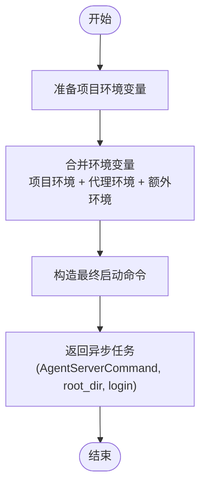
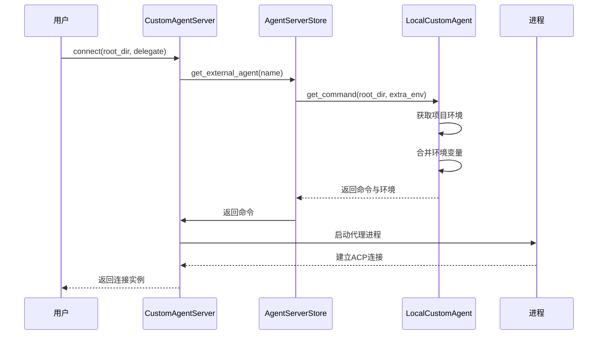

# 自定义代理集成

<cite>
**本文档中引用的文件**  
- [custom.rs](file://crates/agent_servers/src/custom.rs)
- [agent_server_store.rs](file://crates/project/src/agent_server_store.rs)
- [native_agent_server.rs](file://crates/agent2/src/native_agent_server.rs)
</cite>

## 目录
1. [引言](#引言)
2. [扩展接口设计](#扩展接口设计)
3. [配置语义与使用场景](#配置语义与使用场景)
4. [本地自定义代理执行机制](#本地自定义代理执行机制)
5. [本地代理启动流程与资源管理](#本地代理启动流程与资源管理)
6. [开发模板与最佳实践](#开发模板与最佳实践)
7. [结论](#结论)

## 引言
本文档全面记录了 `CustomAgentServer` 的扩展接口设计，解释其作为通用用户自定义代理的核心机制。详细说明 `CustomAgentServerSettings` 中 `command` 与 `default_mode` 字段的配置语义及使用场景，分析 `LocalCustomAgent` 如何执行自定义命令并管理项目环境上下文。结合 `NativeAgentServer` 的实现，描述本地代理的启动流程、资源隔离策略与历史记录管理。最后提供自定义代理的开发模板、启动脚本示例及调试方法，涵盖安全性校验、输入验证与进程通信的最佳实践。

## 扩展接口设计

`CustomAgentServer` 是一个通用的代理服务器实现，用于支持用户自定义的代理服务。它通过 `AgentServer` trait 提供标准化接口，允许系统动态加载和连接自定义代理进程。

该结构体仅包含一个 `name` 字段，代表代理的唯一标识。其核心功能通过 `connect` 方法实现，该方法根据当前项目环境和配置生成代理连接任务，并通过 ACP（Agent Client Protocol）协议建立双向通信通道。

`default_mode` 方法从全局设置中读取代理的默认会话模式，允许用户在不同行为模式间切换（如调试模式、生产模式等）。`set_default_mode` 方法支持运行时更新默认模式，并持久化至配置文件。

**Section sources**
- [custom.rs](file://crates/agent_servers/src/custom.rs#L11-L14)
- [custom.rs](file://crates/agent_servers/src/custom.rs#L44-L73)

## 配置语义与使用场景

### CustomAgentServerSettings 配置结构

`CustomAgentServerSettings` 定义了自定义代理的核心配置参数：

- **command**: `AgentServerCommand` 类型，指定代理可执行文件的路径、启动参数及环境变量。该字段为必需项，决定了代理进程的启动方式。
- **default_mode**: `Option<String>` 类型，表示代理的默认会话模式 ID。并非所有代理都支持多模式，若未设置则使用代理自身的默认行为。

该配置通过 `settings` 模块从用户配置文件加载，并在代理初始化时注入到运行时上下文中。

### 使用场景

- **本地工具集成**：将 CLI 工具（如 linter、formatter）封装为智能代理，实现上下文感知的代码操作。
- **私有模型接入**：连接本地部署的大语言模型服务，确保数据隐私与网络可控性。
- **自动化脚本代理**：将复杂的工作流脚本注册为代理，通过自然语言指令触发执行。

**Section sources**
- [agent_server_store.rs](file://crates/project/src/agent_server_store.rs#L1039-L1048)
- [agent_server_store.rs](file://crates/project/src/agent_server_store.rs#L1028-L1078)

## 本地自定义代理执行机制

### LocalCustomAgent 结构

`LocalCustomAgent` 是 `ExternalAgentServer` 的具体实现，负责在本地环境中执行自定义代理命令。其包含两个核心字段：

- **project_environment**: 对 `ProjectEnvironment` 实体的引用，用于获取项目特定的环境变量（如 `.env` 文件、direnv 集成等）。
- **command**: 存储代理的启动命令配置。

### 执行流程

1. **环境准备**：调用 `get_directory_environment` 获取当前项目目录的完整环境上下文。
2. **环境合并**：将项目环境、代理自身配置的环境变量及额外传入的环境变量进行合并。
3. **命令构造**：生成最终的 `AgentServerCommand`，包含完整的可执行路径、参数列表和环境变量。
4. **异步返回**：通过 `Task` 异步返回构造好的命令、根目录路径及可选的登录终端任务。

此机制确保了代理在正确的项目上下文中运行，具备访问项目依赖和环境变量的能力。



**Diagram sources**
- [agent_server_store.rs](file://crates/project/src/agent_server_store.rs#L949-L989)

**Section sources**
- [agent_server_store.rs](file://crates/project/src/agent_server_store.rs#L949-L989)
- [agent_server_store.rs](file://crates/project/src/agent_server_store.rs#L169-L208)

## 本地代理启动流程与资源管理

### NativeAgentServer 启动流程

`NativeAgentServer` 是内置代理服务器的实现，其启动流程如下：

1. **初始化**：接收文件系统 (`Fs`) 和历史记录存储 (`HistoryStore`) 的引用。
2. **连接请求**：当收到 `connect` 请求时，异步创建 `NativeAgent` 实例。
3. **依赖注入**：注入项目上下文、历史记录、模板系统、提示存储和文件系统。
4. **连接建立**：创建 `NativeAgentConnection` 包装器，实现 `AgentConnection` 接口，完成连接。

该流程确保每个代理会话都拥有独立的状态和资源视图，避免跨会话污染。

### 资源隔离策略

- **实体引用（Entity Reference）**：使用 `Entity<T>` 类型管理状态，确保跨线程访问的安全性。
- **作用域隔离**：每个代理会话在独立的上下文（`AppContext`）中运行，限制资源访问范围。
- **文件系统抽象**：通过 `Arc<dyn Fs>` 接口访问文件系统，便于在测试中替换为内存文件系统。

### 历史记录管理

`HistoryStore` 负责持久化代理交互历史，支持会话恢复和上下文学习。它与 `ContextStore` 集成，将用户操作、代码变更和代理响应关联起来，形成完整的开发上下文图谱。



**Diagram sources**
- [native_agent_server.rs](file://crates/agent2/src/native_agent_server.rs#L10-L14)
- [custom.rs](file://crates/agent_servers/src/custom.rs#L44-L73)

**Section sources**
- [native_agent_server.rs](file://crates/agent2/src/native_agent_server.rs#L10-L127)
- [agent_server_store.rs](file://crates/project/src/agent_server_store.rs#L335-L373)

## 开发模板与最佳实践

### 自定义代理开发模板

```rust
use agent_servers::{AgentServer, AgentServerDelegate};
use gpui::{App, SharedString, Task};
use anyhow::Result;

pub struct MyCustomAgent {
    name: SharedString,
}

impl MyCustomAgent {
    pub fn new(name: SharedString) -> Self {
        Self { name }
    }
}

impl AgentServer for MyCustomAgent {
    fn telemetry_id(&self) -> &'static str { "my-agent" }

    fn name(&self) -> SharedString { self.name.clone() }

    fn logo(&self) -> ui::IconName { ui::IconName::Robot }

    fn connect(
        &self,
        root_dir: Option<&std::path::Path>,
        delegate: AgentServerDelegate,
        cx: &mut App,
    ) -> Task<Result<(std::rc::Rc<dyn acp_thread::AgentConnection>, Option<task::SpawnInTerminal>)>> {
        // 实现连接逻辑，通常调用 agent_servers::acp::connect
        todo!()
    }
}
```

### 启动脚本示例

```bash
#!/bin/bash
# my-agent.sh
echo "Content-Type: application/json"
echo ""
cat <<EOF
{
  "name": "My Custom Agent",
  "version": "1.0.0",
  "capabilities": ["edit", "terminal"]
}
EOF

# 处理ACP消息流
while IFS= read -r line; do
  # 解析并响应ACP请求
  echo "{\"error\":{\"message\":\"Not implemented\"}}"
done
```

### 调试方法

1. **日志输出**：在代理进程中使用 `log::debug!` 输出关键状态。
2. **环境验证**：检查 `AgentServerCommand` 中的 `env` 字段是否正确包含项目环境。
3. **进程通信测试**：使用 `echo '{"jsonrpc":"2.0"}' | ./agent.sh` 测试基本通信。
4. **集成调试**：在 IDE 中启用代理调试模式，查看 ACP 消息交换。

### 最佳实践

- **安全性校验**：验证 `command.path` 是否为可信路径，避免任意代码执行。
- **输入验证**：对 `root_dir` 和 `extra_env` 进行边界检查，防止路径遍历。
- **进程通信**：遵循 ACP 协议规范，确保 JSON-RPC 消息格式正确。
- **错误处理**：返回详细的 `anyhow::Error` 信息，便于用户排查问题。

## 结论

`CustomAgentServer` 提供了一套灵活且安全的机制，用于集成用户自定义的代理服务。通过 `CustomAgentServerSettings` 的 `command` 和 `default_mode` 配置，用户可以精确控制代理的行为。`LocalCustomAgent` 确保了代理在正确的项目上下文中执行，而 `NativeAgentServer` 的设计则保证了资源隔离和历史记录的完整性。开发者可基于提供的模板快速构建自定义代理，并遵循最佳实践确保安全性与稳定性。