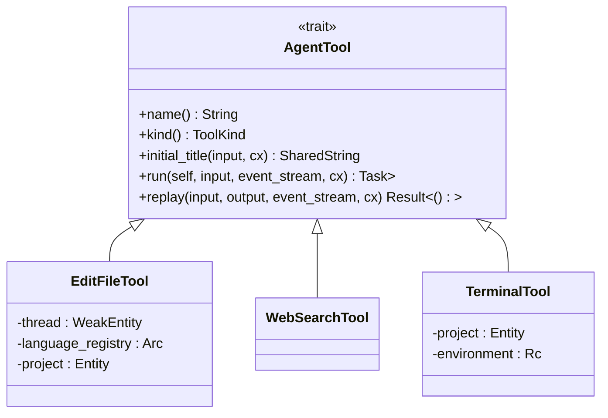
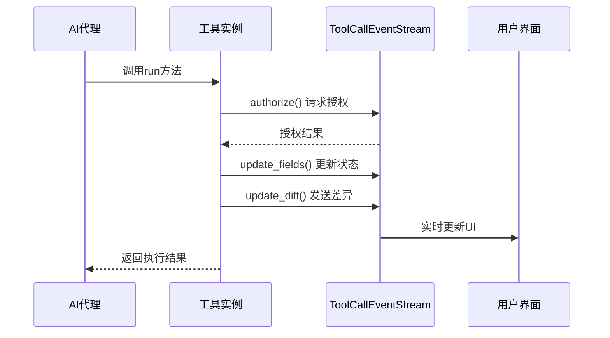
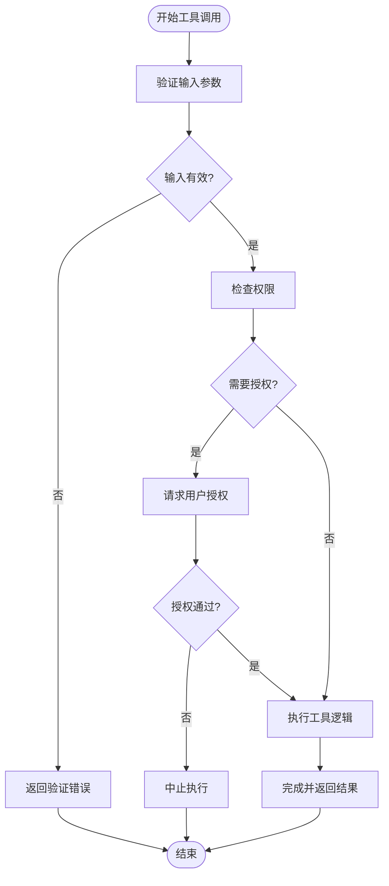

# 工具生态系统

<cite>
**本文档引用的文件**  
- [edit_file_tool.rs](file://crates/agent2/src/tools/edit_file_tool.rs)
- [web_search_tool.rs](file://crates/agent2/src/tools/web_search_tool.rs)
- [terminal_tool.rs](file://crates/agent2/src/tools/terminal_tool.rs)
- [tool_schema.rs](file://crates/agent2/src/tool_schema.rs)
- [thread.rs](file://crates/agent2/src/thread.rs)
</cite>

## 目录
1. [引言](#引言)
2. [核心工具功能详解](#核心工具功能详解)
3. [工具调用机制与安全执行](#工具调用机制与安全执行)
4. [工具权限控制与输入验证](#工具权限控制与输入验证)
5. [自定义工具开发指南](#自定义工具开发指南)
6. [调试与性能监控建议](#调试与性能监控建议)
7. [结论](#结论)

## 引言
本文档全面记录AI代理的工具调用系统，重点解析`edit_file_tool`的文件修改流程、`web_search_tool`的网络请求处理、`terminal_tool`的命令执行沙箱机制。阐述`tool_schema`如何定义JSON Schema供AI理解工具接口，并提供自定义新工具的开发步骤与集成方法。

## 核心工具功能详解

### 文件编辑工具（edit_file_tool）
该工具用于创建新文件或修改现有文件内容。使用前需通过`read_file`工具读取文件内容以获取上下文，并通过`list_directory`验证路径正确性。

支持三种操作模式：
- `edit`：对已有文件进行细粒度编辑
- `create`：创建新文件
- `overwrite`：覆盖现有文件内容

在保存文件后，若启用了`format_on_save`设置，系统会自动调用LSP格式化服务进行代码格式化。

**Section sources**
- [edit_file_tool.rs](file://crates/agent2/src/tools/edit_file_tool.rs#L5-L799)

### 网络搜索工具（web_search_tool）
此工具允许AI代理执行实时网络搜索以获取最新信息。当前仅支持Zed Cloud作为搜索服务提供商。

输入参数包含一个查询字符串，输出结果为包含网页摘要和链接的响应对象。执行过程中会动态更新UI显示搜索状态和结果数量。

**Section sources**
- [web_search_tool.rs](file://crates/agent2/src/tools/web_search_tool.rs#L1-L133)

### 终端命令工具（terminal_tool）
该工具用于执行shell命令并返回输出结果。命令在一个独立的进程中运行，标准输出和错误流按写入顺序合并返回。

关键特性包括：
- 工作目录必须指定为项目根目录之一
- 不支持长期运行的服务类命令
- 每次调用都启动新的shell进程，无状态继承
- 输出内容超过16KB时会被截断

**Section sources**
- [terminal_tool.rs](file://crates/agent2/src/tools/terminal_tool.rs#L1-L214)

## 工具调用机制与安全执行

### 工具接口定义（AgentTool Trait）
所有工具均实现`AgentTool` trait，该trait定义了统一的接口规范：



**Diagram sources**
- [thread.rs](file://crates/agent2/src/thread.rs#L2134-L2195)
- [edit_file_tool.rs](file://crates/agent2/src/tools/edit_file_tool.rs#L5-L799)
- [web_search_tool.rs](file://crates/agent2/src/tools/web_search_tool.rs#L1-L133)
- [terminal_tool.rs](file://crates/agent2/src/tools/terminal_tool.rs#L1-L214)

### 工具调用事件流（ToolCallEventStream）
工具执行过程中通过`ToolCallEventStream`向客户端发送状态更新，包括：
- 工具调用ID
- 位置信息（文件路径、行号）
- 内容更新（终端ID、资源链接等）
- 差异显示（Diff对象）



**Diagram sources**
- [thread.rs](file://crates/agent2/src/thread.rs#L2385-L2390)
- [edit_file_tool.rs](file://crates/agent2/src/tools/edit_file_tool.rs#L5-L799)

## 工具权限控制与输入验证

### 安全检查机制
`edit_file_tool`在执行前进行多重安全验证：
1. 检查路径是否涉及本地设置目录
2. 验证路径是否位于全局配置目录内
3. 确认文件路径属于项目范围内

对于敏感操作，系统会要求用户显式授权。

### 输入参数验证
各工具均通过`JsonSchema`自动验证输入参数：
- `edit_file_tool`验证文件路径存在性和模式有效性
- `terminal_tool`验证工作目录属于项目根目录
- `web_search_tool`确保查询字符串非空



**Diagram sources**
- [edit_file_tool.rs](file://crates/agent2/src/tools/edit_file_tool.rs#L5-L799)
- [terminal_tool.rs](file://crates/agent2/src/tools/terminal_tool.rs#L1-L214)

## 自定义工具开发指南

### 工具Schema生成
`tool_schema.rs`模块负责将Rust结构体转换为JSON Schema，支持两种格式：
- `JsonSchema`：完整Draft-07规范
- `JsonSchemaSubset`：OpenAPI 3兼容子集

转换过程包含以下处理：
- 将`type`数组简化为单个类型
- 将`oneOf`替换为`anyOf`
- 移除元数据模式

**Section sources**
- [tool_schema.rs](file://crates/agent2/src/tool_schema.rs#L1-L44)

### 开发步骤
1. 定义输入结构体并实现`JsonSchema`
2. 创建工具结构体并实现`AgentTool` trait
3. 实现`run`方法包含核心逻辑
4. 在模块中注册新工具
5. 添加单元测试验证功能

### 接口规范
```rust
impl AgentTool for MyCustomTool {
    type Input = MyInputStruct;
    type Output = MyOutputStruct;

    fn name() -> &'static str { "my_tool" }

    fn kind() -> ToolKind { ToolKind::Custom }

    fn run(self: Arc<Self>, input: Self::Input, 
           stream: ToolCallEventStream, cx: &mut App) 
           -> Task<Result<Self::Output>> {
        // 核心逻辑实现
    }
}
```

## 调试与性能监控建议

### 调试技巧
- 使用`ToolCallEventStream::test()`创建测试流进行单元测试
- 监听`ThreadEventStream`捕获所有工具事件
- 启用详细日志记录关键执行步骤
- 利用`replay`方法重现历史调用

### 性能优化
- 对频繁调用的工具实施结果缓存
- 限制长时间运行的外部进程
- 批量处理多个文件操作
- 异步执行耗时任务避免阻塞主线程

## 结论
本工具生态系统提供了安全、可扩展的AI代理功能扩展框架。通过标准化的接口定义、严格的输入验证和灵活的事件通知机制，确保了工具调用的可靠性与用户体验。开发者可基于此框架快速构建新的功能模块，同时系统内置的安全机制有效防范了潜在风险。