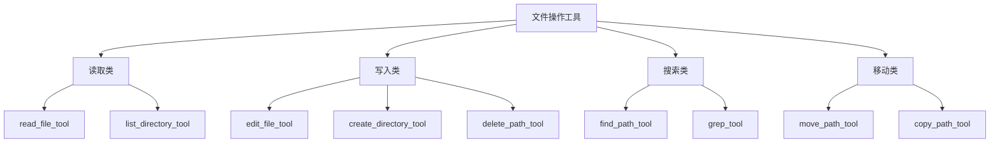
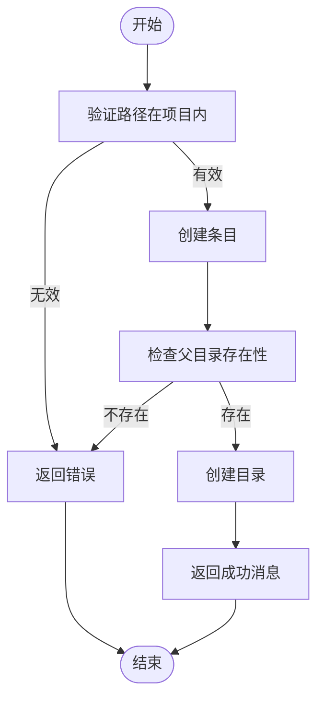
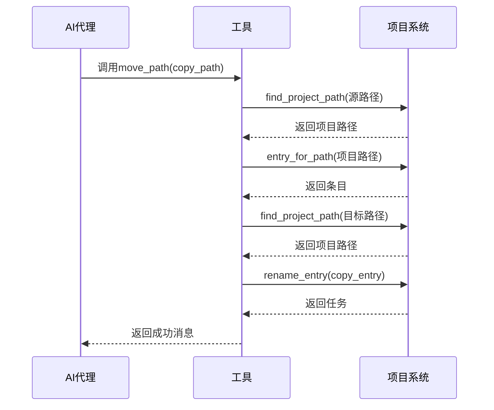
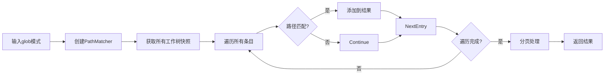

# 文件操作工具

<cite>
**本文档中引用的文件**  
- [edit_file_tool.rs](file://crates/agent2/src/tools/edit_file_tool.rs)
- [read_file_tool.rs](file://crates/agent2/src/tools/read_file_tool.rs)
- [create_directory_tool.rs](file://crates/agent2/src/tools/create_directory_tool.rs)
- [delete_path_tool.rs](file://crates/agent2/src/tools/delete_path_tool.rs)
- [list_directory_tool.rs](file://crates/agent2/src/tools/list_directory_tool.rs)
- [move_path_tool.rs](file://crates/agent2/src/tools/move_path_tool.rs)
- [copy_path_tool.rs](file://crates/agent2/src/tools/copy_path_tool.rs)
- [find_path_tool.rs](file://crates/agent2/src/tools/find_path_tool.rs)
- [grep_tool.rs](file://crates/agent2/src/tools/grep_tool.rs)
- [tool_schema.rs](file://crates/agent2/src/tool_schema.rs)
</cite>

## 目录
1. [简介](#简介)
2. [核心工具功能解析](#核心工具功能解析)
3. [文件读写操作](#文件读写操作)
4. [目录管理操作](#目录管理操作)
5. [路径搜索与内容检索](#路径搜索与内容检索)
6. [工具调用规范与错误处理](#工具调用规范与错误处理)
7. [实际调用示例](#实际调用示例)

## 简介
本文档深入解析AI代理系统中的文件操作工具集，涵盖文件读写、目录管理、路径搜索与内容检索等核心功能。文档详细说明各工具的实现机制、安全策略、权限校验流程及并发处理逻辑，并结合JSON Schema定义展示输入参数验证规则与错误响应模式。

## 核心工具功能解析

### 工具架构概览
AI代理的文件操作工具集提供了一套完整的文件系统交互能力，包括：
- 文件读取与写入
- 目录创建与删除
- 文件/目录移动与复制
- 路径搜索与内容检索
- 并发安全与权限控制

这些工具通过统一的AgentTool接口实现，确保了行为的一致性和可预测性。

**工具类型映射**


**Diagram sources**
- [edit_file_tool.rs](file://crates/agent2/src/tools/edit_file_tool.rs#L1-L50)
- [read_file_tool.rs](file://crates/agent2/src/tools/read_file_tool.rs#L1-L50)

## 文件读写操作

### edit_file_tool：安全文件编辑
`edit_file_tool` 提供了安全的文件编辑能力，支持三种操作模式：编辑、创建和覆盖。

#### 操作模式
- **Edit**: 对现有文件进行细粒度修改
- **Create**: 创建新文件（父目录必须存在）
- **Overwrite**: 替换现有文件的全部内容

#### 并发写入冲突处理
该工具通过以下机制确保并发安全：
1. 使用弱引用（WeakEntity）管理线程生命周期
2. 在编辑前进行路径解析和存在性验证
3. 通过Diff机制跟踪变更并生成统一差异（unified diff）
4. 支持格式化保存（format_on_save）功能

当编辑导致空差异时，工具会验证是否存在幻觉旧文本或模糊范围匹配问题，并相应报错。

**Section sources**
- [edit_file_tool.rs](file://crates/agent2/src/tools/edit_file_tool.rs#L50-L200)

### read_file_tool：智能文件读取
`read_file_tool` 提供了智能的文件读取功能，具有以下特性：

#### 读取限制
- **路径验证**：必须在项目工作树内
- **安全过滤**：遵循全局和工作树级别的`file_scan_exclusions`和`private_files`设置
- **大小限制**：对大文件自动生成大纲（outline）而非完整内容

#### 编码处理机制
- 支持文本和图像文件的自动识别
- 对图像文件使用`LanguageModelImage`进行处理
- 文本文件保持原始编码格式

#### 行范围读取
支持指定起始行和结束行进行部分读取：
- 行号为1-based索引
- 支持边界情况处理（如0行号视为1）
- 当起始行大于结束行时，仍保证至少读取一行

**Section sources**
- [read_file_tool.rs](file://crates/agent2/src/tools/read_file_tool.rs#L50-L200)

## 目录管理操作

### create_directory_tool：目录创建
`create_directory_tool` 用于创建新目录，其核心逻辑包括：

#### 递归操作逻辑
- 类似于`mkdir -p`命令，自动创建所有必要父目录
- 验证目标路径在项目范围内
- 返回创建成功的确认信息

#### 权限校验流程
1. 检查路径是否在项目工作树内
2. 验证父目录是否存在且为目录类型
3. 确保文件名有效



**Diagram sources**
- [create_directory_tool.rs](file://crates/agent2/src/tools/create_directory_tool.rs#L1-L50)

### delete_path_tool：路径删除
`delete_path_tool` 支持文件和目录的递归删除，其工作机制如下：

#### 递归删除逻辑
- 对于目录：遍历并删除所有子条目
- 使用通道（mpsc::channel）异步处理删除操作
- 先通知操作日志将要删除的缓冲区

#### 权限校验流程
1. 验证源路径在项目内
2. 获取对应的工作树快照
3. 遍历所有待删除路径
4. 执行删除任务并等待完成

**Section sources**
- [delete_path_tool.rs](file://crates/agent2/src/tools/delete_path_tool.rs#L50-L100)

### move_path_tool与copy_path_tool：路径移动与复制
这两个工具提供了文件/目录的移动和复制功能：

#### 移动操作（move_path_tool）
- 支持重命名（同目录下文件名变更）
- 支持跨目录移动
- 使用`rename_entry`方法实现原子性操作

#### 复制操作（copy_path_tool）
- 支持递归复制目录内容（类似`cp -r`）
- 使用`copy_entry`方法确保高效复制
- 比读取-写入组合方式更高效



**Diagram sources**
- [move_path_tool.rs](file://crates/agent2/src/tools/move_path_tool.rs#L1-L20)
- [copy_path_tool.rs](file://crates/agent2/src/tools/copy_path_tool.rs#L1-L20)

## 路径搜索与内容检索

### list_directory_tool：目录列表
`list_directory_tool` 提供了目录内容的树形结构输出：

#### 输出格式
- 分别列出文件夹和文件
- 空目录返回"目录为空"消息
- 支持根目录通配符（., *, ./）的特殊处理

#### 安全过滤机制
- 遵循全局和工作树级别的排除设置
- 自动跳过私有和排除的文件/目录
- 对每个条目进行双重验证

**Section sources**
- [list_directory_tool.rs](file://crates/agent2/src/tools/list_directory_tool.rs#L50-L150)

### find_path_tool：路径搜索
`find_path_tool` 实现了快速的路径模式匹配：

#### 模糊匹配策略
- 支持glob模式（如"**/*.js"）
- 使用`PathMatcher`进行高效匹配
- 返回结果按字母顺序排序

#### 分页机制
- 每页50个匹配结果
- 支持offset参数进行分页
- 自动提示更多结果的获取方式



**Diagram sources**
- [find_path_tool.rs](file://crates/agent2/src/tools/find_path_tool.rs#L1-L50)

### grep_tool：内容搜索
虽然未提供具体实现，但根据上下文可推断`grep_tool`具有以下特征：

#### 正则搜索实现
- 支持正则表达式模式匹配
- 针对文件内容而非路径名
- 可能集成到语言服务器协议（LSP）中

#### 使用场景
- 搜索代码中的符号或函数
- 查找特定内容模式
- 作为`find_path_tool`的补充

## 工具调用规范与错误处理

### JSON Schema输入验证
所有工具的输入参数都通过JSON Schema进行严格验证：

#### Schema定义特点
- 使用`JsonSchema`派生宏自动生成
- 支持默认值和可选字段
- 包含详细的文档示例

#### 子模式转换
- 将`oneOf`转换为`anyOf`以提高兼容性
- 确保类型字段不是数组形式
- 支持OpenAPI 3.0子集

**Section sources**
- [tool_schema.rs](file://crates/agent2/src/tool_schema.rs#L1-L50)

### 错误响应模式
各工具采用统一的错误处理策略：

#### 常见错误类型
- 路径不存在
- 权限不足
- 文件已存在（创建时）
- 目录非空（删除时）
- 安全策略阻止

#### 错误信息结构
- 清晰描述错误原因
- 包含相关路径信息
- 提供可能的解决方案建议

## 实际调用示例

### 编辑文件示例
```json
{
  "tool": "edit_file",
  "input": {
    "display_description": "修复API端点URL",
    "path": "backend/src/api.rs",
    "mode": "edit"
  }
}
```

### 读取文件示例
```json
{
  "tool": "read_file",
  "input": {
    "path": "frontend/components/header.js",
    "start_line": 10,
    "end_line": 20
  }
}
```

### 创建目录示例
```json
{
  "tool": "create_directory",
  "input": {
    "path": "backend/src/models"
  }
}
```

### 搜索路径示例
```json
{
  "tool": "find_path",
  "input": {
    "glob": "**/*.test.js",
    "offset": 0
  }
}
```