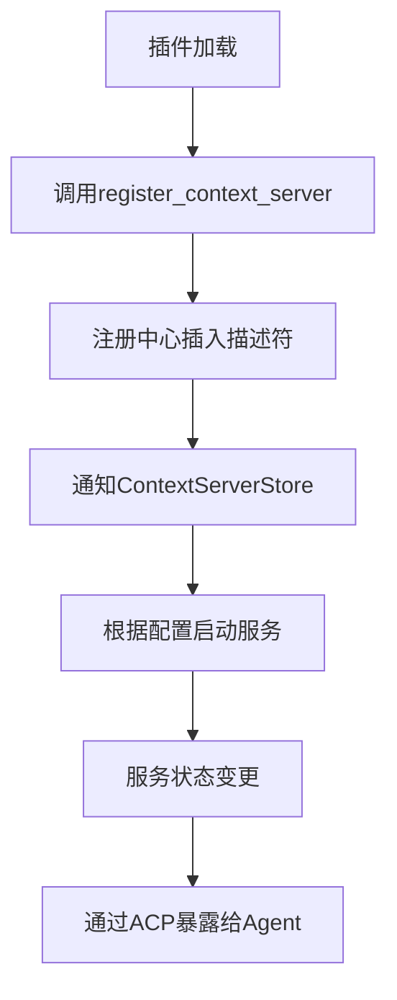

# 辅助功能工具

<cite>
**本文档引用的文件**  
- [now_tool.rs](file://crates/agent2/src/tools/now_tool.rs)
- [thinking_tool.rs](file://crates/agent2/src/tools/thinking_tool.rs)
- [registry.rs](file://crates/project/src/context_server_store/registry.rs)
- [context_server_store.rs](file://crates/project/src/context_server_store.rs)
- [http_agent.rs](file://crates/http_server/src/http_agent.rs)
- [acp.rs](file://crates/agent_servers/src/acp.rs)
- [extension.rs](file://crates/project/src/context_server_store/extension.rs)
</cite>

## 目录
1. [引言](#引言)
2. [核心工具功能解析](#核心工具功能解析)
3. [时间获取工具（now_tool）](#时间获取工具now_tool)
4. [思维模拟工具（thinking_tool）](#思维模拟工具thinking_tool)
5. [上下文服务注册中心（context_server_registry）](#上下文服务注册中心context_server_registry)
6. [工具集成与认知增强机制](#工具集成与认知增强机制)
7. [实际开发中的集成用例](#实际开发中的集成用例)
8. [结论](#结论)

## 引言
AI代理在现代软件系统中扮演着越来越重要的角色，其能力不仅限于响应式交互，更体现在主动理解上下文、推理复杂任务和管理动态环境的能力。为实现这些高级功能，一套完善的辅助工具集至关重要。本文档深入分析三个核心辅助功能：时间获取、思维模拟与上下文管理，分别通过`now_tool`、`thinking_tool`和`context_server_registry`实现。这些工具共同提升了AI代理的认知能力与上下文感知水平，使其能够在多时区场景下准确获取时间、在复杂任务中进行内部推理，并动态维护上下文服务的生命周期。

## 核心工具功能解析
本节概述三大辅助工具的核心职责及其在AI代理架构中的定位：

- **时间获取工具（now_tool）**：提供标准化的时间戳服务，支持UTC与本地时区两种模式，输出符合RFC 3339规范的字符串格式。
- **思维模拟工具（thinking_tool）**：允许AI代理在不执行外部操作的前提下进行内部推理，用于问题拆解、策略规划与思路整理。
- **上下文服务注册中心（context_server_registry）**：实现上下文服务的注册、发现与生命周期管理，协同ACP协议支持动态扩展的服务架构。

这些工具通过统一的`AgentTool`接口集成，确保行为一致性与可扩展性。

## 时间获取工具（now_tool）

`now_tool`用于返回当前时间的标准化表示，适用于需要精确时间信息的场景。该工具的关键设计在于支持多时区语义，并以RFC 3339格式输出，确保跨平台兼容性。

### 功能机制
用户可通过指定`timezone`参数选择使用UTC或本地时区。工具内部利用`chrono`库分别调用`Utc::now()`或`Local::now()`获取时间，并转换为RFC 3339格式字符串（如`2025-04-05T12:34:56+00:00`），最终封装为自然语言响应。

此设计避免了时区歧义，支持全球化应用场景下的时间一致性处理。

**Section sources**
- [now_tool.rs](file://crates/agent2/src/tools/now_tool.rs#L1-L64)

## 思维模拟工具（thinking_tool）

`thinking_tool`是AI代理进行内部推理的核心组件，允许其在不触发外部副作用的情况下“思考”问题解决方案。

### 作用机制
当AI代理面临复杂任务时，可调用此工具输入待分析内容（`content`字段）。工具本身不执行计算或决策，而是将输入内容通过`ToolCallEventStream`传递至事件流，供后续处理模块记录或展示。

其关键价值在于：
- **任务分解支持**：将大任务拆解为多个子步骤，在调用实际执行工具前完成逻辑梳理。
- **策略预演**：模拟不同解决路径的可行性，提升最终输出质量。
- **透明化推理过程**：使AI的“思考”过程对用户可见，增强可解释性。

尽管工具返回值为固定字符串`"Finished thinking."`，但真正的价值体现在事件流中传递的中间内容。

**Section sources**
- [thinking_tool.rs](file://crates/agent2/src/tools/thinking_tool.rs#L1-L52)

## 上下文服务注册中心（context_server_registry）

`context_server_registry`是上下文服务的注册与发现核心，负责管理所有可用的上下文服务器描述符（`ContextServerDescriptor`），并与ACP协议协同工作。

### 注册与发现模式
该注册中心基于`HashMap<Arc<str>, Arc<dyn ContextServerDescriptor>>`实现，提供以下核心方法：
- `register_context_server_descriptor`：注册新的上下文服务描述符。
- `unregister_context_server_descriptor_by_id`：根据ID注销服务。
- `context_server_descriptor`：按ID查询服务描述符。
- `context_server_descriptors`：获取所有已注册服务列表。

注册中心作为全局单例存在，通过`GlobalContextServerDescriptorRegistry`注入应用上下文，确保跨组件访问一致性。

### 生命周期管理
上下文服务的生命周期由`ContextServerStore`统一管理，其状态包括：
- `Starting`：服务启动中
- `Running`：服务运行中
- `Stopped`：服务已停止
- `Error`：服务异常

每当注册中心发生变化（如新服务注册），会触发`cx.notify()`通知监听者，进而可能触发服务的自动启动或配置更新。

### 与ACP协议的协同
在ACP连接建立过程中（`AcpConnection::new_thread`），系统会从`context_server_store`获取已配置的服务ID列表，并将其作为MCP（Model Context Protocol）服务器参数传递给客户端，实现上下文能力的动态暴露。

此外，`extension.rs`中的代理机制允许插件动态注册/注销上下文服务，进一步增强了系统的可扩展性。

**Diagram sources**
- [registry.rs](file://crates/project/src/context_server_store/registry.rs#L1-L84)
- [extension.rs](file://crates/project/src/context_server_store/extension.rs#L89-L119)
- [context_server_store.rs](file://crates/project/src/context_server_store.rs#L51-L90)

**Section sources**
- [registry.rs](file://crates/project/src/context_server_store/registry.rs#L1-L84)
- [context_server_store.rs](file://crates/project/src/context_server_store.rs#L284-L323)
- [acp.rs](file://crates/agent_servers/src/acp.rs#L202-L231)

## 工具集成与认知增强机制

上述工具共同构建了一个具备高阶认知能力的AI代理系统：

- **时间感知能力**：`now_tool`使AI能够理解时间上下文，支持定时任务、日志分析、跨时区协作等场景。
- **推理能力**：`thinking_tool`赋予AI“内省”能力，使其能在执行前进行策略规划，显著提升任务完成质量。
- **上下文感知能力**：`context_server_registry`实现了动态上下文服务发现，使AI能根据项目环境自动加载相关上下文（如代码语义、调试状态、版本控制信息）。

三者结合，使得AI代理不仅能响应指令，更能主动理解环境、规划行动路径并适应动态变化。

## 实际开发中的集成用例

### 多时区任务调度
当用户请求“在北京时间下午三点提醒我”时，AI代理可调用`now_tool`获取UTC时间，并结合时区转换逻辑生成准确的调度指令。

### 复杂代码重构任务
面对“重构用户认证模块”的请求，AI代理可先调用`thinking_tool`列出重构步骤（如：1. 分析现有结构；2. 设计新接口；3. 迁移实现），再依次调用代码分析、编辑等工具执行。

### 动态上下文加载
在打开一个Rust项目时，系统自动通过`context_server_registry`发现并启动`rust-analyzer`上下文服务，AI代理随即获得类型推导、引用查找等能力，提升交互智能性。

### 会话上下文清理
在HTTP会话管理中（`http_agent.rs`），当上下文大小超过限制时，系统自动清理旧消息，保留关键上下文，防止内存溢出同时维持对话连贯性。

**Section sources**
- [http_agent.rs](file://crates/http_server/src/http_agent.rs#L397-L431)
- [context_server_store.rs](file://crates/project/src/context_server_store.rs#L366-L410)

## 结论

`now_tool`、`thinking_tool`与`context_server_registry`构成了AI代理的核心辅助功能体系。它们分别解决了时间感知、内部推理与上下文管理三大关键问题，显著增强了代理的认知能力与环境适应性。通过标准化接口设计与事件驱动架构，这些工具实现了高度的模块化与可扩展性，为构建智能、可靠、透明的AI系统奠定了坚实基础。未来可进一步探索工具间的协同优化，例如基于上下文自动选择时区、或将思维过程与上下文服务联动以实现更深层次的推理支持。