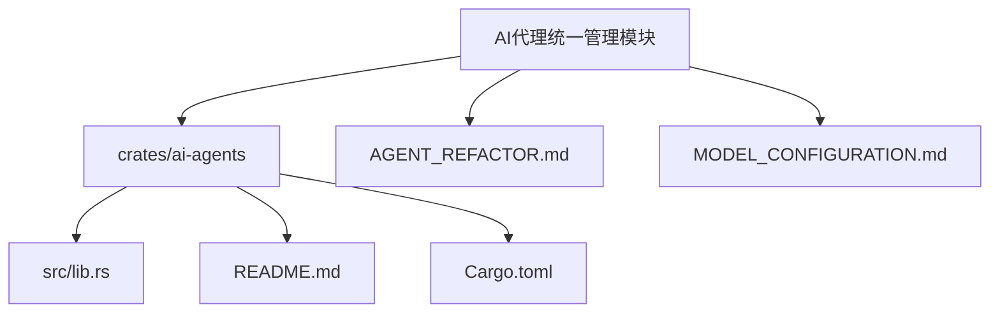
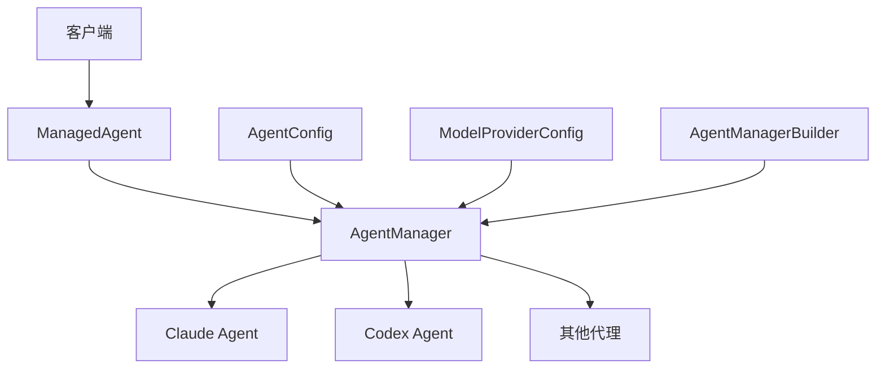
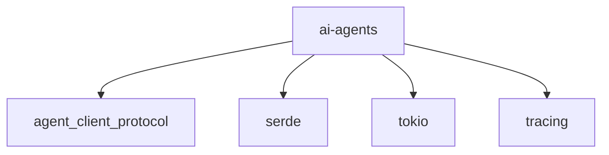

# AI代理统一管理

<cite>
**本文档中引用的文件**
- [lib.rs](file://crates/ai-agents/src/lib.rs)
- [README.md](file://crates/ai-agents/README.md)
- [AGENT_REFACTOR.md](file://AGENT_REFACTOR.md)
- [MODEL_CONFIGURATION.md](file://MODEL_CONFIGURATION.md)
- [shared_types/src/lib.rs](file://crates/shared_types/src/lib.rs)
</cite>

## 目录
1. [简介](#简介)
2. [项目结构](#项目结构)
3. [核心组件](#核心组件)
4. [架构概述](#架构概述)
5. [详细组件分析](#详细组件分析)
6. [依赖分析](#依赖分析)
7. [性能考虑](#性能考虑)
8. [故障排除指南](#故障排除指南)
9. [结论](#结论)

## 简介
AI代理统一管理模块提供了一个统一的接口来管理和切换不同的AI代理（如Claude、Codex等），通过Agent Client Protocol (ACP) 实现透明访问。该模块支持配置国内大模型服务（如智谱GLM）以接入不同的代理工具，并允许在运行时动态切换代理。

## 项目结构
AI代理统一管理模块位于`crates/ai-agents`目录下，主要包含以下文件和子目录：
- `src/lib.rs`: 核心实现，定义了代理管理器、配置结构和相关枚举。
- `README.md`: 模块的使用说明和快速入门指南。
- `Cargo.toml`: 项目依赖和元数据。

此外，相关配置和重构说明分布在以下文件中：
- `AGENT_REFACTOR.md`: 代理重构的设计文档。
- `MODEL_CONFIGURATION.md`: 模型配置的详细说明。



**图示来源**
- [lib.rs](file://crates/ai-agents/src/lib.rs)
- [README.md](file://crates/ai-agents/README.md)
- [AGENT_REFACTOR.md](file://AGENT_REFACTOR.md)
- [MODEL_CONFIGURATION.md](file://MODEL_CONFIGURATION.md)

**节来源**
- [lib.rs](file://crates/ai-agents/src/lib.rs)
- [README.md](file://crates/ai-agents/README.md)

## 核心组件
本模块的核心组件包括`AgentManager`、`AgentConfig`、`ModelProviderConfig`和`AgentManagerBuilder`。这些组件共同实现了AI代理的注册、管理和切换功能。

**节来源**
- [lib.rs](file://crates/ai-agents/src/lib.rs#L17-L164)

## 架构概述
AI代理统一管理模块采用分层架构设计，主要包括以下几个层次：
1. **接口层**：通过`Agent` trait提供统一的API接口。
2. **管理层**：`AgentManager`负责注册和管理多个AI代理。
3. **配置层**：`AgentConfig`和`ModelProviderConfig`提供灵活的配置选项。
4. **构建层**：`AgentManagerBuilder`提供链式配置和自动回退机制。



**图示来源**
- [lib.rs](file://crates/ai-agents/src/lib.rs#L190-L195)
- [lib.rs](file://crates/ai-agents/src/lib.rs#L145-L164)
- [lib.rs](file://crates/ai-agents/src/lib.rs#L47-L60)
- [lib.rs](file://crates/ai-agents/src/lib.rs#L466-L470)

**节来源**
- [lib.rs](file://crates/ai-agents/src/lib.rs#L190-L195)
- [lib.rs](file://crates/ai-agents/src/lib.rs#L145-L164)
- [lib.rs](file://crates/ai-agents/src/lib.rs#L47-L60)
- [lib.rs](file://crates/ai-agents/src/lib.rs#L466-L470)

## 详细组件分析

### AgentType 枚举
`AgentType` 枚举定义了支持的AI代理类型，目前包括Claude和Codex两种。

```rust
#[derive(Debug, Clone, Copy, PartialEq, Eq, Hash, Serialize, Deserialize)]
pub enum AgentType {
    /// Claude Code 代理
    Claude,
    /// OpenAI Codex 代理
    Codex,
}
```

**节来源**
- [lib.rs](file://crates/ai-agents/src/lib.rs#L17-L24)

### ModelProviderConfig 结构
`ModelProviderConfig` 结构用于配置模型提供商的相关信息，如名称、API基础URL、环境变量中的密钥名称等。

```rust
#[derive(Debug, Clone, Serialize, Deserialize)]
pub struct ModelProviderConfig {
    /// 提供商名称 (如: glm, anthropic, openai)
    pub name: String,
    /// API 基础 URL
    pub base_url: String,
    /// 环境变量中的密钥名称
    pub env_key: String,
    /// 是否需要 OpenAI 兼容的认证
    pub requires_openai_auth: bool,
    /// 额外的配置参数
    pub extra_params: std::collections::HashMap<String, String>,
}
```

**节来源**
- [lib.rs](file://crates/ai-agents/src/lib.rs#L47-L60)

### AgentConfig 结构
`AgentConfig` 结构定义了AI代理的配置，包括代理类型、工作目录、主目录、使用的模型、提供商配置、额外环境变量、推理努力程度和首选认证方法。

```rust
#[derive(Debug, Clone)]
pub struct AgentConfig {
    /// 代理类型
    pub agent_type: AgentType,
    /// 工作目录
    pub cwd: std::path::PathBuf,
    /// 代理主目录
    pub home_dir: std::path::PathBuf,
    /// 使用的模型
    pub model: String,
    /// 模型提供商配置
    pub provider: ModelProviderConfig,
    /// 额外的环境变量
    pub env_vars: std::collections::HashMap<String, String>,
    /// 推理努力程度 (如: high, medium, low)
    pub reasoning_effort: String,
    /// 首选的认证方法
    pub preferred_auth_method: String,
}
```

**节来源**
- [lib.rs](file://crates/ai-agents/src/lib.rs#L145-L164)

### AgentManager 结构
`AgentManager` 是主要的代理管理器，负责注册和管理多个AI代理，并提供运行时切换不同代理的功能。

```rust
pub struct AgentManager {
    agents: std::collections::HashMap<AgentType, Arc<dyn Agent>>,
    current_agent: Option<AgentType>,
    session_update_tx: mpsc::UnboundedSender<(SessionNotification, Sender<()>)>,
}
```

**节来源**
- [lib.rs](file://crates/ai-agents/src/lib.rs#L190-L195)

### AgentManagerBuilder 结构
`AgentManagerBuilder` 提供了一种构建`AgentManager`的便捷方式，支持链式配置和偏好代理列表。

```rust
pub struct AgentManagerBuilder {
    config: AgentConfig,
    preferred_agents: Vec<AgentType>,
}
```

**节来源**
- [lib.rs](file://crates/ai-agents/src/lib.rs#L466-L470)

## 依赖分析
AI代理统一管理模块依赖于以下几个外部库：
- `agent_client_protocol`: 提供统一的API接口。
- `serde`: 用于序列化和反序列化。
- `tokio`: 异步运行时支持。
- `tracing`: 日志记录。



**图示来源**
- [Cargo.toml](file://crates/ai-agents/Cargo.toml)

**节来源**
- [Cargo.toml](file://crates/ai-agents/Cargo.toml)

## 性能考虑
在使用AI代理统一管理模块时，应注意以下性能考虑：
- **环境变量设置**：频繁设置环境变量可能影响性能，建议在启动时一次性设置。
- **代理切换**：频繁切换代理可能导致初始化开销，建议在必要时进行切换。
- **并发处理**：利用`tokio`的异步特性，可以有效提高并发处理能力。

## 故障排除指南
### 常见错误
- `invalid_params`: 参数无效，检查代理类型是否已注册。
- `internal_error`: 内部错误，检查代理初始化是否成功。
- `auth_required`: 需要认证，检查API密钥是否已设置。

### 调试建议
- 查看日志输出，特别是`info!`和`warn!`级别的日志。
- 确保环境变量正确设置。
- 使用`auto_register_agents`方法自动检测并注册可用的代理。

**节来源**
- [lib.rs](file://crates/ai-agents/src/lib.rs#L265-L303)
- [README.md](file://crates/ai-agents/README.md#L109-L135)

## 结论
AI代理统一管理模块提供了一个强大且灵活的框架，用于管理和切换不同的AI代理。通过统一的API接口和灵活的配置选项，开发者可以轻松集成和使用多种AI代理，同时保持代码的简洁和可维护性。