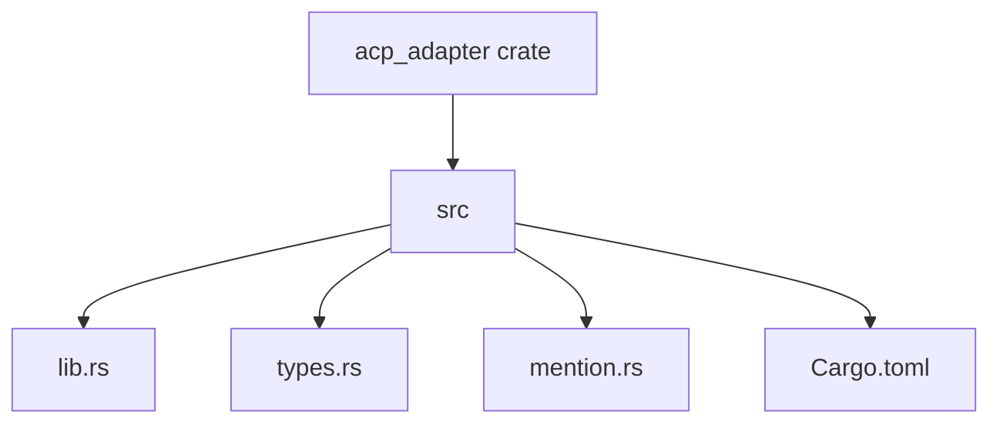
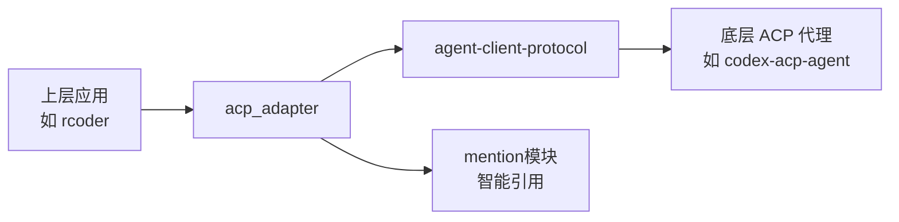
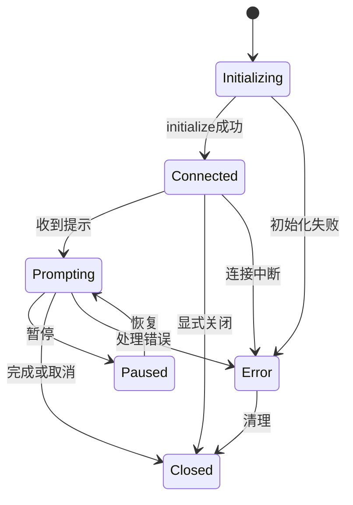
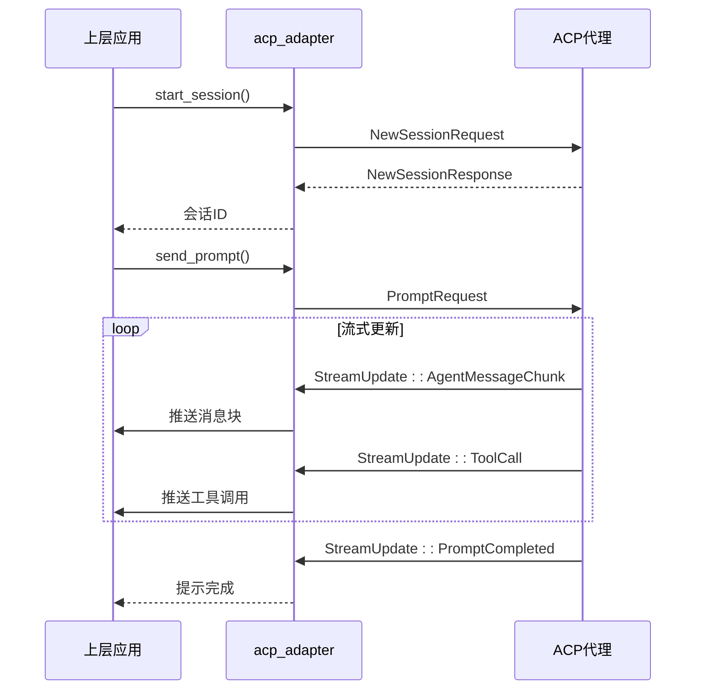
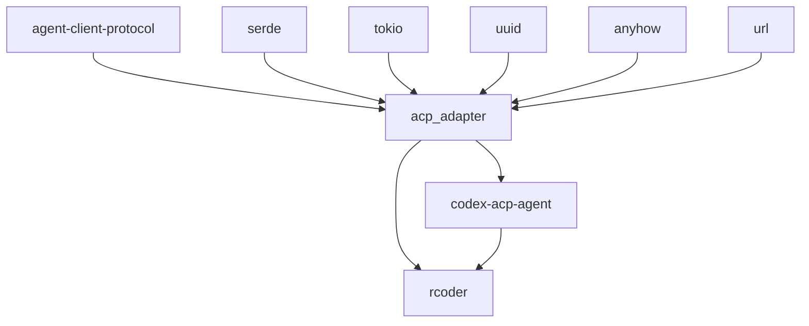

# ACP协议适配层

<cite>
**本文档引用的文件**
- [lib.rs](file://crates/acp_adapter/src/lib.rs)
- [types.rs](file://crates/acp_adapter/src/types.rs)
- [mention.rs](file://crates/acp_adapter/src/mention.rs)
- [Cargo.toml](file://crates/acp_adapter/Cargo.toml)
- [agent.rs](file://crates/codex-acp-agent/src/agent.rs)
- [commands.rs](file://crates/codex-acp-agent/src/commands/commands.rs)
</cite>

## 目录
1. [简介](#简介)
2. [项目结构](#项目结构)
3. [核心组件](#核心组件)
4. [架构概述](#架构概述)
5. [详细组件分析](#详细组件分析)
6. [依赖分析](#依赖分析)
7. [性能考虑](#性能考虑)
8. [故障排除指南](#故障排除指南)
9. [结论](#结论)

## 简介
`acp_adapter` crate 提供了一个通用的适配层，用于与符合 Agent Client Protocol (ACP) 的 AI 代理进行通信。该适配层抽象了底层的通信细节，为上层应用提供了一套统一的接口。它负责管理连接、会话生命周期、消息处理，并集成了 MCP (Model Control Protocol) 功能。核心功能包括定义客户端能力、会话状态、流式更新事件以及智能引用系统。

## 项目结构
`acp_adapter` crate 是一个独立的模块，位于 `crates/acp_adapter` 目录下。其主要结构包括 `src` 目录下的 `lib.rs`、`types.rs` 和 `mention.rs` 文件，以及 `Cargo.toml` 配置文件。`lib.rs` 是模块的入口，导出了 `mention` 和 `types` 模块。`types.rs` 定义了所有核心数据结构和枚举，而 `mention.rs` 实现了资源引用系统。



**图源**
- [lib.rs](file://crates/acp_adapter/src/lib.rs#L1-L11)
- [types.rs](file://crates/acp_adapter/src/types.rs#L1-L10)
- [mention.rs](file://crates/acp_adapter/src/mention.rs#L1-L10)

**节源**
- [lib.rs](file://crates/acp_adapter/src/lib.rs#L1-L11)
- [types.rs](file://crates/acp_adapter/src/types.rs#L1-L10)
- [mention.rs](file://crates/acp_adapter/src/mention.rs#L1-L10)

## 核心组件
`acp_adapter` 的核心组件包括 `ClientCapabilities`（客户端能力）、`SessionState`（会话状态）、`StreamUpdate`（流式更新）和 `ResourceUri`（资源引用）。这些组件共同构成了与 ACP 代理交互的基础。`ClientCapabilities` 定义了客户端支持的功能，`SessionState` 跟踪会话的生命周期，`StreamUpdate` 用于实时推送状态变化，而 `ResourceUri` 则提供了一种统一的方式来引用代码片段、文件和其他资源。

**节源**
- [types.rs](file://crates/acp_adapter/src/types.rs#L20-L50)
- [mention.rs](file://crates/acp_adapter/src/mention.rs#L1-L50)

## 架构概述
`acp_adapter` 的架构是一个典型的适配器模式，它位于上层应用（如 `rcoder`）和底层 ACP 代理（如 `codex-acp-agent`）之间。它通过 `types.rs` 中定义的类型与 `agent-client-protocol` crate 进行交互，并通过 `mention.rs` 提供高级的引用功能。`lib.rs` 作为公共接口，将内部实现细节封装起来。



**图源**
- [lib.rs](file://crates/acp_adapter/src/lib.rs#L1-L11)
- [types.rs](file://crates/acp_adapter/src/types.rs#L1-L10)
- [mention.rs](file://crates/acp_adapter/src/mention.rs#L1-L10)

## 详细组件分析

### 客户端能力与会话状态分析
`acp::ClientCapabilities` 和 `acp::SessionState` 是客户端与代理协商和状态同步的关键类型。`ClientCapabilities` 允许客户端在初始化连接时声明其支持的功能，例如文件系统读写、终端访问等。这使得代理可以根据客户端的能力调整其行为。`SessionState` 枚举则定义了会话的完整生命周期，从 `Initializing` 到 `Connected`、`Prompting`，再到 `Closed` 或 `Error` 状态。这些状态变化通过 `StreamUpdate::SessionStateChanged` 事件实时通知上层应用。



**图源**
- [types.rs](file://crates/acp_adapter/src/types.rs#L150-L180)
- [types.rs](file://crates/acp_adapter/src/types.rs#L200-L220)

**节源**
- [types.rs](file://crates/acp_adapter/src/types.rs#L150-L220)

### mention模块分析
`mention` 模块实现了对代码片段的智能引用和上下文关联。其核心是 `ResourceUri` 枚举，它定义了多种资源类型，如 `File`、`Symbol`、`Selection` 等。`ResourceUri` 可以从一个 URI 字符串解析而来，并能生成一个可链接的格式。`ResourceUriBuilder` 提供了便捷的构造方法。该模块的解析规则基于 URL 的 scheme 和 path，定位算法通过 `line_range` 来指定代码行，序列化格式遵循自定义的 URI 规范。

```mermaid
classDiagram
class ResourceUri {
+File { abs_path : PathBuf }
+Symbol { abs_path : PathBuf, name : String, line_range : RangeInclusive<u32> }
+Selection { abs_path : Option<PathBuf>, line_range : RangeInclusive<u32> }
+Thread { id : String, name : String }
+...
+parse(input : &str) Result~Self~
+to_uri() Url
+name() String
+icon_name() &'static str
}
class ResourceUriBuilder {
+file(path : P) ResourceUri
+symbol(path : P, name : String, line_range : RangeInclusive<u32>) ResourceUri
+selection(path : Option<P>, line_range : RangeInclusive<u32>) ResourceUri
+thread(id : String, name : String) ResourceUri
+...
}
ResourceUriBuilder --> ResourceUri : "构建"
```

**图源**
- [mention.rs](file://crates/acp_adapter/src/mention.rs#L10-L50)
- [mention.rs](file://crates/acp_adapter/src/mention.rs#L500-L550)

**节源**
- [mention.rs](file://crates/acp_adapter/src/mention.rs#L1-L687)

### 统一客户端接口分析
`acp_adapter` 通过 `types.rs` 中定义的类型为上层应用提供了统一的客户端接口。关键方法包括会话创建（通过 `NewSessionRequest`）、命令执行（通过 `ToolCall`）和状态更新订阅（通过 `StreamUpdate` 事件流）。上层应用可以通过监听 `StreamUpdate` 来获取 `PromptStarted`、`ToolCallStarted`、`Plan` 更新、`AvailableCommandsUpdate` 等关键事件，从而实现对代理行为的实时监控和响应。



**图源**
- [types.rs](file://crates/acp_adapter/src/types.rs#L200-L270)
- [agent.rs](file://crates/codex-acp-agent/src/agent.rs#L589-L626)
- [commands.rs](file://crates/codex-acp-agent/src/commands/commands.rs#L191-L225)

**节源**
- [types.rs](file://crates/acp_adapter/src/types.rs#L200-L270)

## 依赖分析
`acp_adapter` 的依赖关系清晰。它直接依赖于 `agent-client-protocol` crate 来获取基础的 ACP 类型，并依赖于 `serde`、`tokio`、`uuid` 等通用库来处理序列化、异步运行时和唯一标识符。`codex-acp-agent` crate 依赖于 `acp_adapter`，从而复用其类型定义和功能。`rcoder` crate 作为最终的应用层，同时依赖于 `acp_adapter` 和具体的代理实现。



**图源**
- [Cargo.toml](file://crates/acp_adapter/Cargo.toml#L1-L28)
- [Cargo.toml](file://crates/codex-acp-agent/Cargo.toml#L1-L52)

**节源**
- [Cargo.toml](file://crates/acp_adapter/Cargo.toml#L1-L28)

## 性能考虑
`acp_adapter` 本身是一个轻量级的类型定义和适配层，其性能开销主要在于数据的序列化和反序列化。使用 `Arc<str>` 作为 `UserMessageId` 和 `ToolCallId` 的内部存储，可以有效减少字符串拷贝的开销。`StreamUpdate` 事件流的设计允许增量更新，避免了传输大量完整状态的需要，这对于实时性要求高的场景非常有利。整体上，该适配层对性能的影响较小，主要性能瓶颈在于底层 ACP 代理的实现。

## 故障排除指南
当使用 `acp_adapter` 时，常见的问题包括连接失败、会话状态不一致和权限请求处理错误。连接失败通常源于网络问题或代理未启动，应检查 `ConnectionState` 是否为 `Failed`。会话状态不一致可能是因为 `StreamUpdate` 事件丢失，需要确保事件监听逻辑的健壮性。权限请求处理错误可能与 `ClientCapabilities` 的配置有关，应确认客户端正确声明了其能力。详细的错误信息通常包含在 `StreamUpdate::Error` 事件中。

**节源**
- [types.rs](file://crates/acp_adapter/src/types.rs#L260-L270)
- [agent.rs](file://crates/codex-acp-agent/src/agent.rs#L108-L132)

## 结论
`acp_adapter` crate 成功地为 ACP 协议提供了一个强大且灵活的适配层。它通过精心设计的类型系统，抽象了复杂的通信细节，使得上层应用能够以一种统一和类型安全的方式与不同的 ACP 代理进行交互。其 `mention` 模块为智能引用提供了坚实的基础。该适配层的设计遵循了模块化和可扩展的原则，为新代理的开发提供了清晰的协议指导，是整个系统中不可或缺的基础设施。