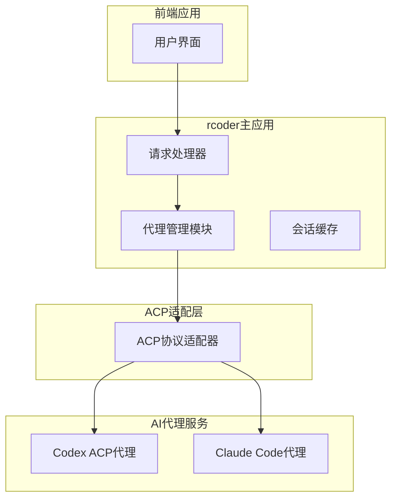
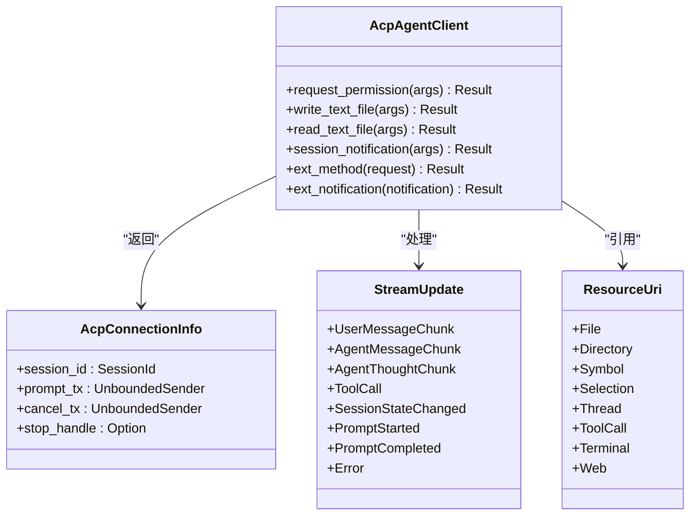
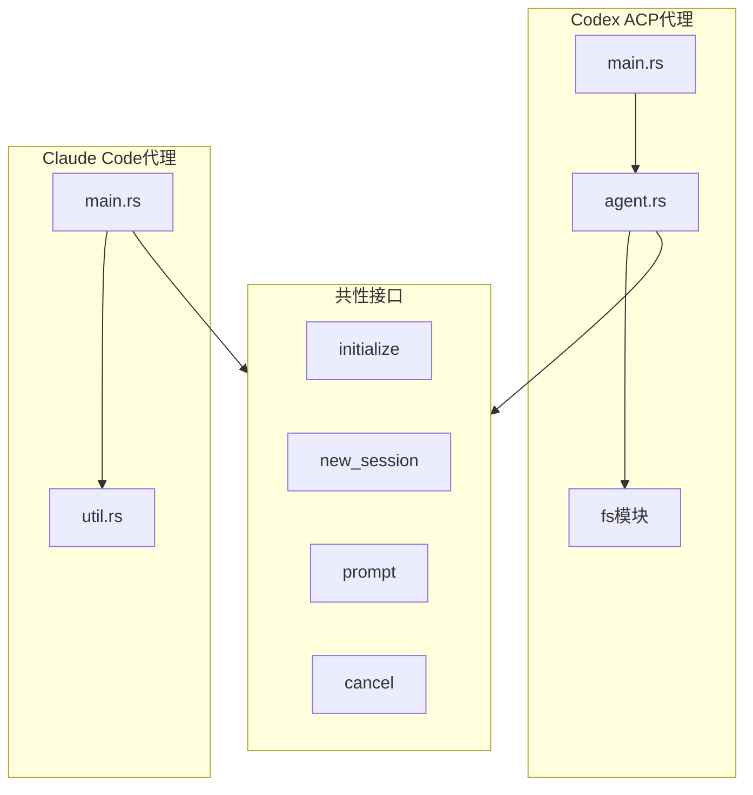
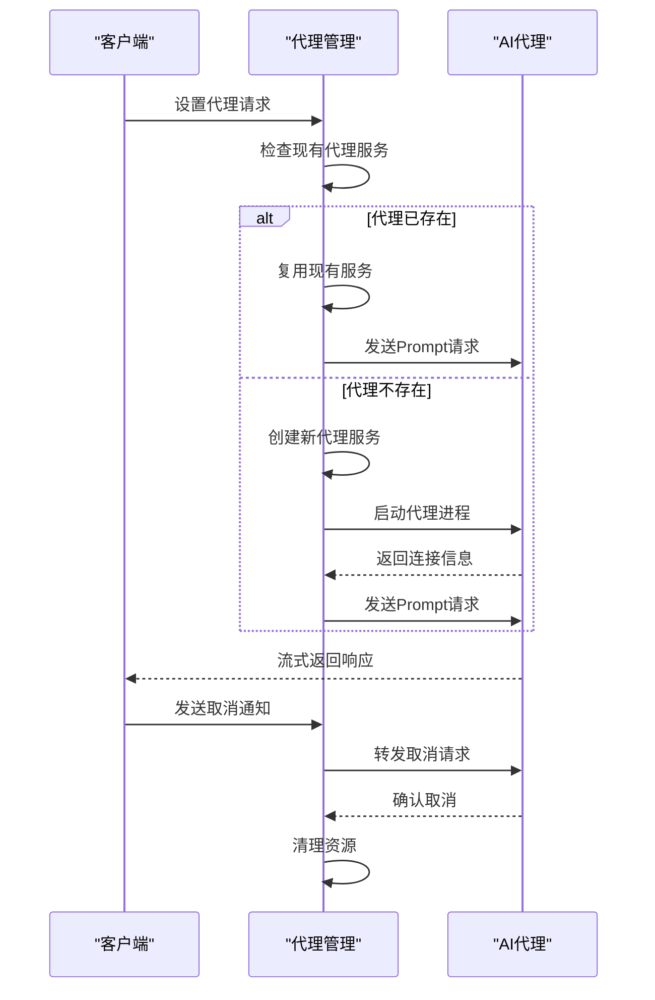
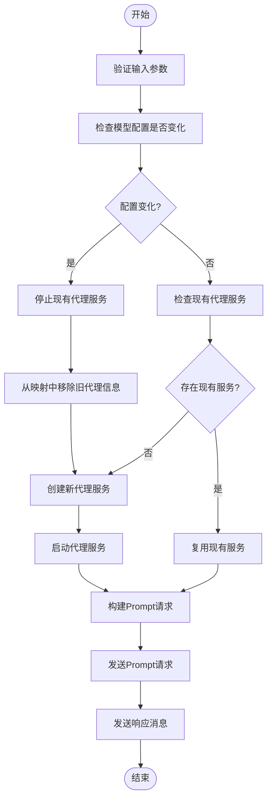
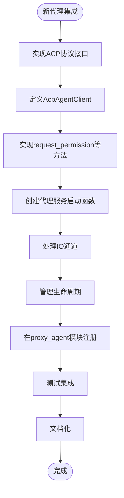

# AI代理集成

<cite>
**本文档引用的文件**
- [lib.rs](file://crates/acp_adapter/src/lib.rs)
- [types.rs](file://crates/acp_adapter/src/types.rs)
- [mention.rs](file://crates/acp_adapter/src/mention.rs)
- [lib.rs](file://crates/codex-acp-agent/src/lib.rs)
- [agent.rs](file://crates/codex-acp-agent/src/agent.rs)
- [main.rs](file://crates/codex-acp-agent/src/main.rs)
- [lib.rs](file://crates/claude-code-agent/src/lib.rs)
- [main.rs](file://crates/claude-code-agent/src/main.rs)
- [mod.rs](file://crates/rcoder/src/proxy_agent/mod.rs)
- [acp_agent.rs](file://crates/rcoder/src/proxy_agent/acp_agent.rs)
- [codex_agent.rs](file://crates/rcoder/src/proxy_agent/codex_agent.rs)
- [claude_code_agent.rs](file://crates/rcoder/src/proxy_agent/claude_code_agent.rs)
- [channel_utils.rs](file://crates/rcoder/src/proxy_agent/channel_utils.rs)
</cite>

## 目录
1. [引言](#引言)
2. [AI代理集成架构](#ai代理集成架构)
3. [ACP协议适配器设计](#acp协议适配器设计)
4. [代理实现差异与共性](#代理实现差异与共性)
5. [代理生命周期管理](#代理生命周期管理)
6. [代理调用实现细节](#代理调用实现细节)
7. [新代理集成指南](#新代理集成指南)
8. [结论](#结论)

## 引言
rcoder平台通过ACP（Agent Client Protocol）协议实现对不同类型AI代理的统一集成。本文档深入剖析了平台的AI代理集成机制，重点说明如何通过ACP协议适配器统一接入Codex ACP代理和Claude Code代理。文档详细解释了两种代理的实现差异和共性设计模式，剖析了acp_adapter crate如何抽象化ACP协议的通信细节并提供统一的客户端接口。

## AI代理集成架构

**图表来源**
- [mod.rs](file://crates/rcoder/src/proxy_agent/mod.rs#L1-L217)
- [acp_agent.rs](file://crates/rcoder/src/proxy_agent/acp_agent.rs#L1-L298)

## ACP协议适配器设计

**图表来源**
- [lib.rs](file://crates/acp_adapter/src/lib.rs#L1-L13)
- [types.rs](file://crates/acp_adapter/src/types.rs#L1-L799)
- [mention.rs](file://crates/acp_adapter/src/mention.rs#L1-L687)

**章节来源**
- [lib.rs](file://crates/acp_adapter/src/lib.rs#L1-L13)
- [types.rs](file://crates/acp_adapter/src/types.rs#L1-L799)
- [mention.rs](file://crates/acp_adapter/src/mention.rs#L1-L687)

## 代理实现差异与共性

**图表来源**
- [lib.rs](file://crates/codex-acp-agent/src/lib.rs#L1-L11)
- [agent.rs](file://crates/codex-acp-agent/src/agent.rs#L1-L799)
- [main.rs](file://crates/codex-acp-agent/src/main.rs#L1-L108)
- [lib.rs](file://crates/claude-code-agent/src/lib.rs#L1-L9)
- [main.rs](file://crates/claude-code-agent/src/main.rs#L1-L108)

**章节来源**
- [lib.rs](file://crates/codex-acp-agent/src/lib.rs#L1-L11)
- [agent.rs](file://crates/codex-acp-agent/src/agent.rs#L1-L799)
- [main.rs](file://crates/codex-acp-agent/src/main.rs#L1-L108)
- [lib.rs](file://crates/claude-code-agent/src/lib.rs#L1-L9)
- [main.rs](file://crates/claude-code-agent/src/main.rs#L1-L108)

## 代理生命周期管理

**图表来源**
- [acp_agent.rs](file://crates/rcoder/src/proxy_agent/acp_agent.rs#L1-L298)
- [codex_agent.rs](file://crates/rcoder/src/proxy_agent/codex_agent.rs#L1-L248)
- [claude_code_agent.rs](file://crates/rcoder/src/proxy_agent/claude_code_agent.rs#L1-L306)

**章节来源**
- [acp_agent.rs](file://crates/rcoder/src/proxy_agent/acp_agent.rs#L1-L298)
- [codex_agent.rs](file://crates/rcoder/src/proxy_agent/codex_agent.rs#L1-L248)
- [claude_code_agent.rs](file://crates/rcoder/src/proxy_agent/claude_code_agent.rs#L1-L306)

## 代理调用实现细节

**图表来源**
- [acp_agent.rs](file://crates/rcoder/src/proxy_agent/acp_agent.rs#L1-L298)
- [channel_utils.rs](file://crates/rcoder/src/proxy_agent/channel_utils.rs#L1-L154)

**章节来源**
- [acp_agent.rs](file://crates/rcoder/src/proxy_agent/acp_agent.rs#L1-L298)
- [channel_utils.rs](file://crates/rcoder/src/proxy_agent/channel_utils.rs#L1-L154)

## 新代理集成指南

**章节来源**
- [mod.rs](file://crates/rcoder/src/proxy_agent/mod.rs#L1-L217)
- [acp_agent.rs](file://crates/rcoder/src/proxy_agent/acp_agent.rs#L1-L298)
- [channel_utils.rs](file://crates/rcoder/src/proxy_agent/channel_utils.rs#L1-L154)

## 结论
rcoder平台通过ACP协议适配器实现了对不同AI代理的统一集成。acp_adapter crate抽象化了ACP协议的通信细节，提供了统一的客户端接口。主应用通过proxy_agent模块管理不同代理实例的生命周期，包括启动、通信、状态监控和清理过程。Codex ACP代理和Claude Code代理虽然实现方式不同，但都遵循了相同的ACP协议接口，体现了共性设计模式。新代理的集成需要实现关键接口并遵循设计规范，确保与现有系统的兼容性。