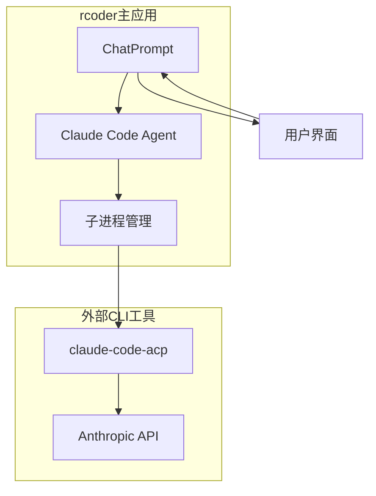
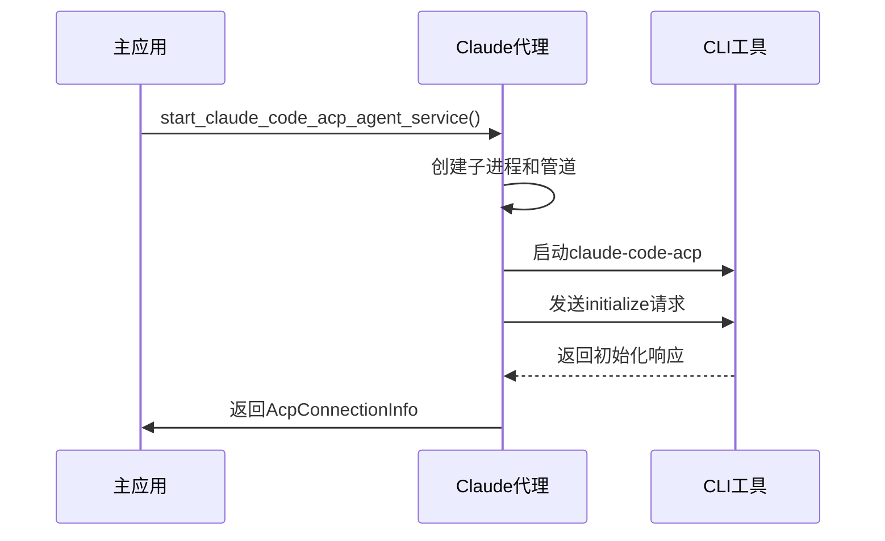
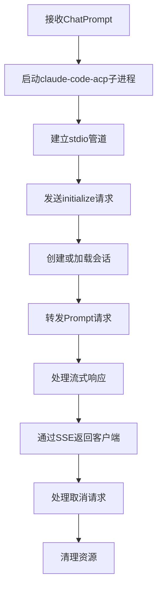
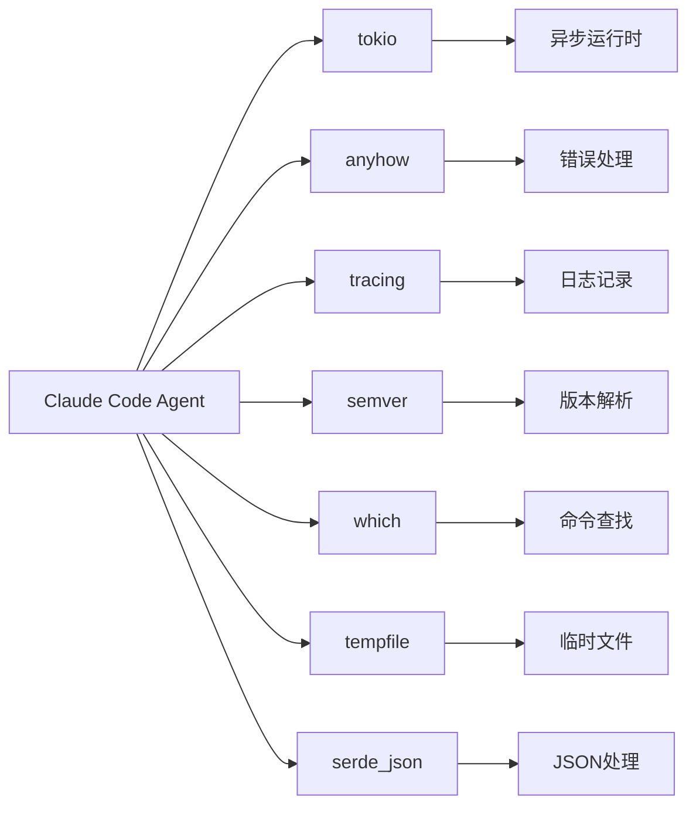

# Claude Code代理集成

<cite>
**本文档引用的文件**   
- [lib.rs](file://crates/claude-code-agent/src/lib.rs)
- [util.rs](file://crates/claude-code-agent/src/util.rs)
- [main.rs](file://crates/claude-code-agent/src/main.rs)
- [claude_code_agent.rs](file://crates/rcoder/src/proxy_agent/claude_code_agent.rs)
- [codex_agent.rs](file://crates/rcoder/src/proxy_agent/codex_agent.rs)
- [agent.rs](file://crates/codex-acp-agent/src/agent.rs)
</cite>

## 目录
1. [简介](#简介)
2. [项目结构](#项目结构)
3. [核心组件](#核心组件)
4. [架构概述](#架构概述)
5. [详细组件分析](#详细组件分析)
6. [依赖分析](#依赖分析)
7. [性能考虑](#性能考虑)
8. [故障排除指南](#故障排除指南)
9. [结论](#结论)

## 简介
本文档深入文档化Claude Code代理的集成实现，重点说明其与Codex代理在架构设计上的异同。详细描述claude-code-agent crate的模块结构和核心组件，特别是主代理类的初始化过程、请求处理流水线和响应解析逻辑。解释该代理如何处理Claude特有的流式响应格式，并与rcoder主应用的SSE机制进行适配。结合代码示例展示聊天请求的转换过程，包括提示词工程、上下文窗口管理、多轮对话状态维护。分析该代理在错误码映射、速率限制处理和超时重试方面的特殊实现。对比其轻量级设计与Codex代理的复杂状态管理，说明不同AI模型服务对代理实现的影响。

## 项目结构
Claude Code代理位于`crates/claude-code-agent`目录下，采用Rust语言实现，通过ACP（Agent Client Protocol）协议与Claude Code CLI工具集成。该代理作为rcoder主应用的子模块，通过`crates/rcoder/src/proxy_agent/claude_code_agent.rs`文件与主应用进行交互。与Codex代理相比，Claude Code代理采用更轻量级的设计，主要依赖外部CLI工具而非嵌入式服务。

**Section sources**
- [lib.rs](file://crates/claude-code-agent/src/lib.rs#L1-L9)
- [claude_code_agent.rs](file://crates/rcoder/src/proxy_agent/claude_code_agent.rs#L1-L306)

## 核心组件
Claude Code代理的核心组件包括`ClaudeCodeAcpManager`、`ClaudeCodeAcpConfig`和`ClaudeCodeAcpCommand`等结构体。`ClaudeCodeAcpManager`负责管理Claude Code ACP的安装、更新和命令获取，通过`get_command`方法返回执行CLI工具所需的命令信息。代理通过`ensure_claude_acp_installed`等便捷函数确保依赖的CLI工具已正确安装。

**Section sources**
- [util.rs](file://crates/claude-code-agent/src/util.rs#L1-L758)

## 架构概述
Claude Code代理采用进程外架构，通过启动`claude-code-acp`子进程并与之通信来实现功能。与Codex代理的嵌入式架构不同，Claude代理通过stdio管道与外部CLI工具交互，降低了主应用的复杂性。这种设计使得代理能够利用CLI工具的完整功能，同时保持主应用的稳定性。

**Diagram sources **
- [claude_code_agent.rs](file://crates/rcoder/src/proxy_agent/claude_code_agent.rs#L1-L306)
- [util.rs](file://crates/claude-code-agent/src/util.rs#L1-L758)

## 详细组件分析

### Claude Code代理分析
Claude Code代理通过`start_claude_code_acp_agent_service`函数启动，该函数创建一个长驻的代理服务，返回会话信息和用于持续发送Prompt的通道。代理使用`tokio::process::Command`启动`claude-code-acp`子进程，并通过stdio管道进行双向通信。

#### 初始化过程

**Diagram sources **
- [claude_code_agent.rs](file://crates/rcoder/src/proxy_agent/claude_code_agent.rs#L1-L306)

#### 请求处理流水线

**Diagram sources **
- [claude_code_agent.rs](file://crates/rcoder/src/proxy_agent/claude_code_agent.rs#L1-L306)

### Codex代理对比分析
与Codex代理相比，Claude代理采用不同的架构设计。Codex代理使用嵌入式架构，将`CodexAgent`直接集成到主应用中，而Claude代理依赖外部CLI工具。

#### 架构差异对比
| 特性 | Claude Code代理 | Codex代理 |
|------|----------------|---------|
| **架构模式** | 进程外 | 进程内 |
| **通信方式** | stdio管道 | 内存管道 |
| **依赖管理** | 外部CLI工具 | 内部库依赖 |
| **状态管理** | 轻量级 | 复杂状态管理 |
| **错误处理** | 子进程退出码 | 内部异常处理 |
| **资源占用** | 较高（额外进程） | 较低 |

**Section sources**
- [codex_agent.rs](file://crates/rcoder/src/proxy_agent/codex_agent.rs#L1-L248)
- [agent.rs](file://crates/codex-acp-agent/src/agent.rs#L1-L1176)

## 依赖分析
Claude Code代理的主要依赖包括`tokio`用于异步处理，`anyhow`用于错误处理，`tracing`用于日志记录，以及`semver`用于版本管理。代理通过`npm`安装和管理`@zed-industries/claude-code-acp`包，确保CLI工具的正确版本。

**Diagram sources **
- [util.rs](file://crates/claude-code-agent/src/util.rs#L1-L758)
- [Cargo.toml](file://crates/claude-code-agent/Cargo.toml#L1-L10)

## 性能考虑
Claude Code代理的性能主要受子进程启动时间和stdio管道通信开销的影响。由于每次会话都需要启动外部CLI工具，初始化延迟相对较高。然而，一旦连接建立，流式响应的处理效率较高，能够有效适配rcoder主应用的SSE机制。

## 故障排除指南
常见问题包括CLI工具未安装、权限不足和环境变量配置错误。通过`check_claude_acp_status`函数可以检查代理状态，`ensure_claude_acp_installed`函数可以自动安装缺失的依赖。子进程的stderr输出会被捕获并记录，便于调试问题。

**Section sources**
- [util.rs](file://crates/claude-code-agent/src/util.rs#L1-L758)
- [claude_code_agent.rs](file://crates/rcoder/src/proxy_agent/claude_code_agent.rs#L1-L306)

## 结论
Claude Code代理通过轻量级的进程外架构实现了与Codex代理不同的设计选择。这种设计降低了主应用的复杂性，同时利用了CLI工具的完整功能。尽管存在较高的初始化开销，但其稳定的性能和易于维护的特性使其成为rcoder项目中AI代理实现的重要组成部分。