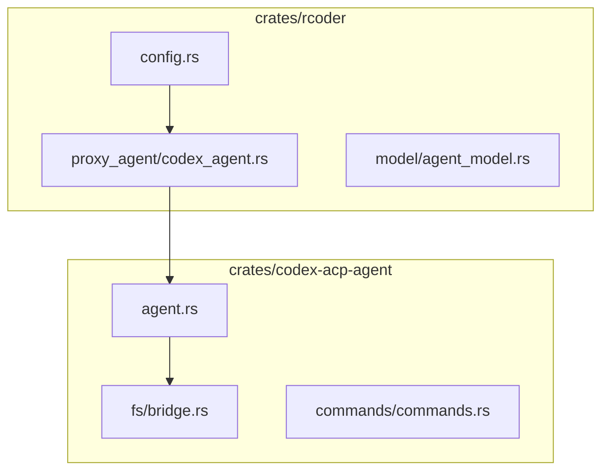
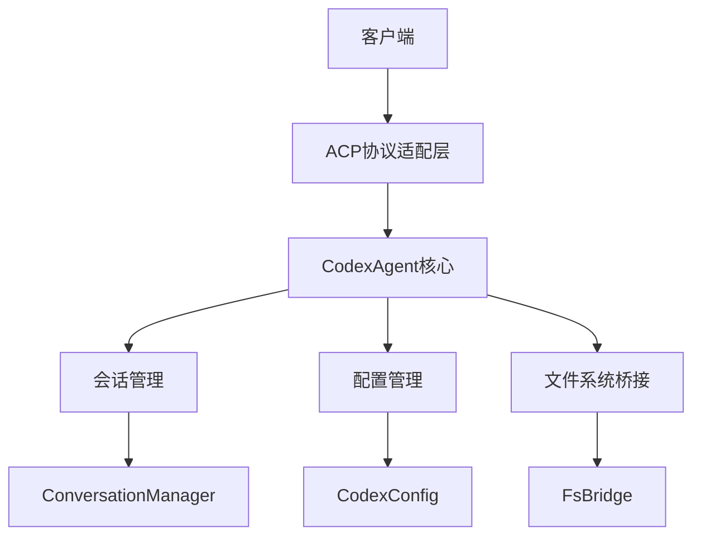
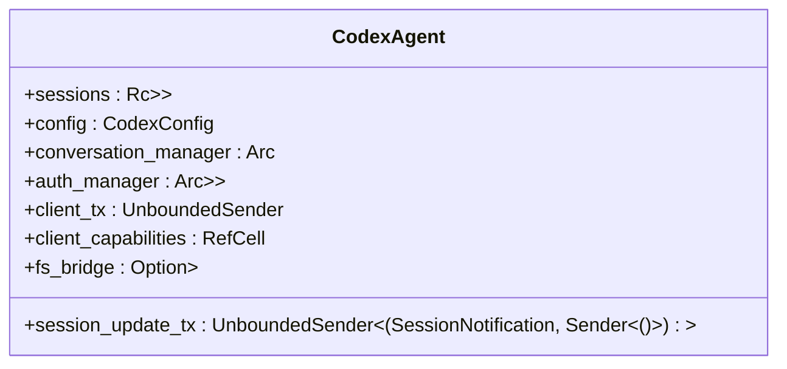
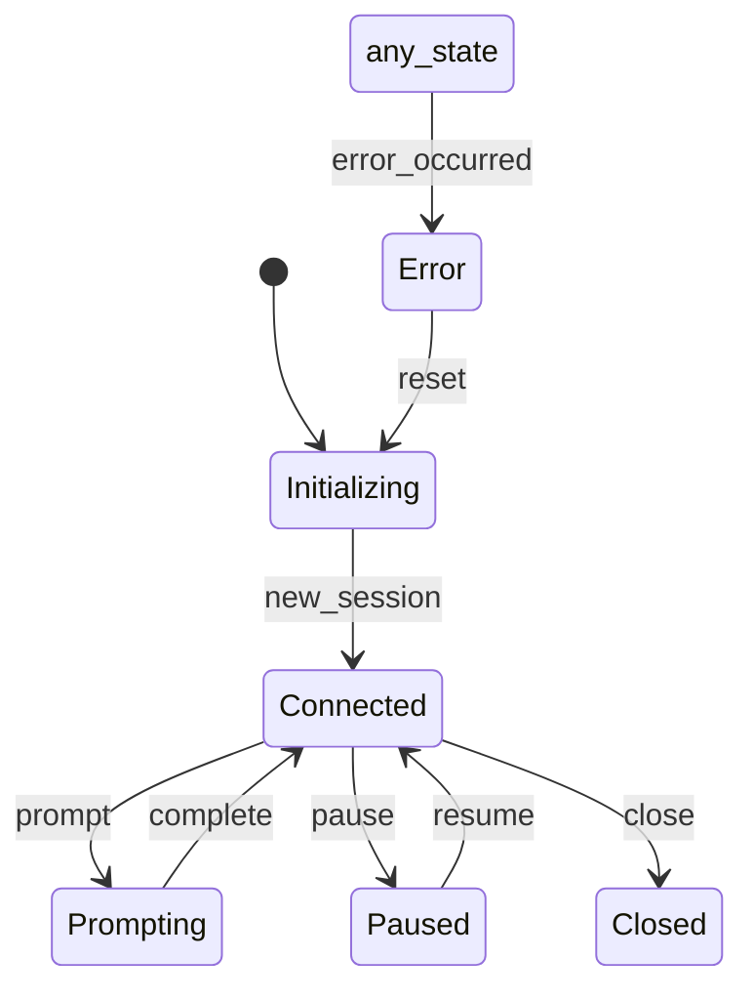
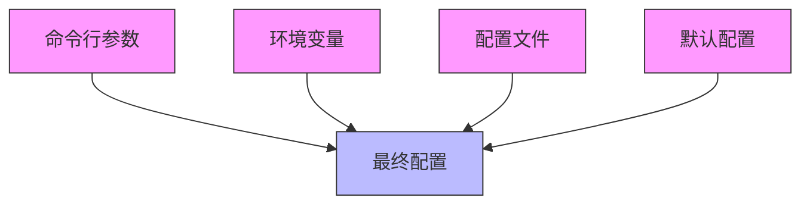
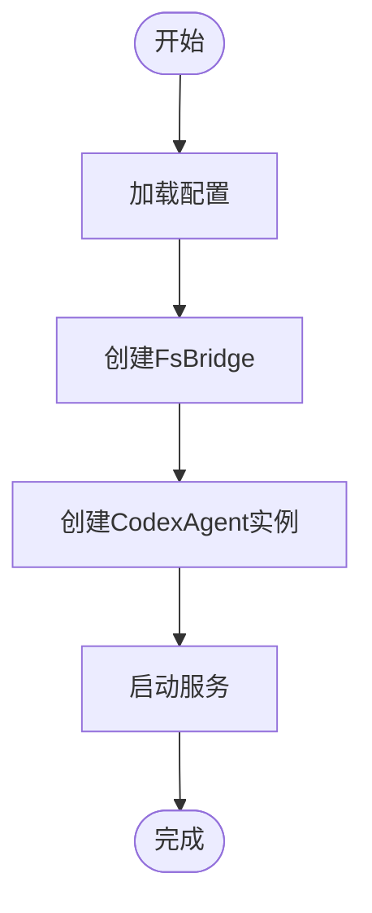
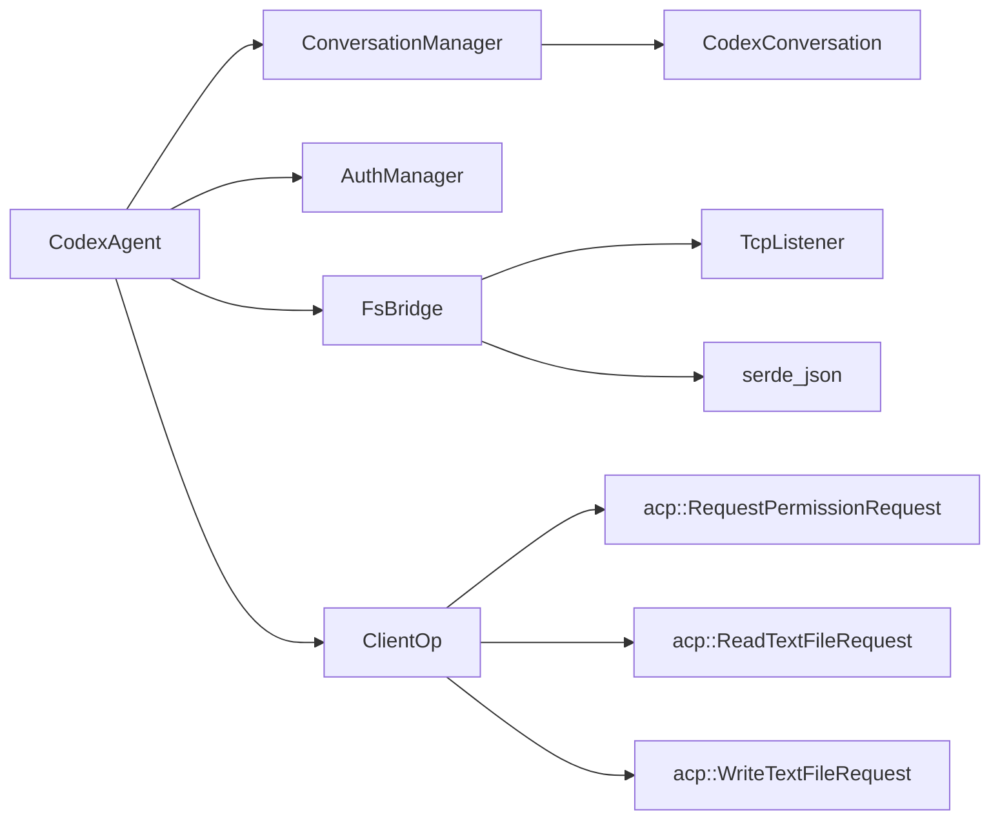

# Codex代理集成

<cite>
**本文档中引用的文件**   
- [agent.rs](file://crates/codex-acp-agent/src/agent.rs)
- [bridge.rs](file://crates/codex-acp-agent/src/fs/bridge.rs)
- [codex_agent.rs](file://crates/rcoder/src/proxy_agent/codex_agent.rs)
- [config.rs](file://crates/rcoder/src/config.rs)
</cite>

## 目录
1. [介绍](#介绍)
2. [项目结构](#项目结构)
3. [核心组件](#核心组件)
4. [架构概述](#架构概述)
5. [详细组件分析](#详细组件分析)
6. [依赖分析](#依赖分析)
7. [性能考虑](#性能考虑)
8. [故障排除指南](#故障排除指南)
9. [结论](#结论)

## 介绍
本文档详细阐述了Codex代理的集成设计与实现，重点分析CodexAgent结构体的核心字段、会话管理机制、配置注入方式以及与ACP协议适配层的交互模式。文档涵盖了代理实例的初始化流程、会话状态生命周期管理、异步通信通道的作用以及文件系统桥接的实现原理。

## 项目结构
Codex代理集成主要分布在`crates/codex-acp-agent`和`crates/rcoder`两个核心模块中。`codex-acp-agent`负责实现基于ACP协议的AI代理服务，而`rcoder`则提供主应用的路由、业务逻辑和代理管理功能。

**图示来源**
- [agent.rs](file://crates/codex-acp-agent/src/agent.rs#L89-L99)
- [bridge.rs](file://crates/codex-acp-agent/src/fs/bridge.rs#L13-L17)
- [codex_agent.rs](file://crates/rcoder/src/proxy_agent/codex_agent.rs#L0-L30)

**本节来源**
- [agent.rs](file://crates/codex-acp-agent/src/agent.rs#L0-L31)
- [codex_agent.rs](file://crates/rcoder/src/proxy_agent/codex_agent.rs#L0-L30)

## 核心组件
Codex代理的核心组件包括CodexAgent结构体、会话管理、配置系统和文件系统桥接。这些组件共同实现了与OpenAI Codex的集成，并通过ACP协议提供服务。

**本节来源**
- [agent.rs](file://crates/codex-acp-agent/src/agent.rs#L89-L99)
- [config.rs](file://crates/rcoder/src/config.rs#L187-L227)

## 架构概述
Codex代理采用分层架构设计，上层为ACP协议适配层，中层为代理核心逻辑，底层为文件系统桥接和配置管理。这种设计实现了关注点分离，提高了系统的可维护性和可扩展性。

**图示来源**
- [agent.rs](file://crates/codex-acp-agent/src/agent.rs#L89-L99)
- [bridge.rs](file://crates/codex-acp-agent/src/fs/bridge.rs#L13-L17)

## 详细组件分析

### CodexAgent结构体分析
CodexAgent是代理的核心结构体，包含了会话管理、配置注入、异步通信通道和文件系统桥接等关键字段。

#### 结构体字段

**图示来源**
- [agent.rs](file://crates/codex-acp-agent/src/agent.rs#L89-L99)

#### 会话状态管理

**图示来源**
- [types.rs](file://crates/acp_adapter/src/types.rs#L119-L134)
- [agent.rs](file://crates/codex-acp-agent/src/agent.rs#L33-L47)

**本节来源**
- [agent.rs](file://crates/codex-acp-agent/src/agent.rs#L89-L99)
- [agent.rs](file://crates/codex-acp-agent/src/agent.rs#L33-L47)

### 配置系统分析
CodexConfig配置结构与全局配置系统集成，支持多种配置方式，包括命令行参数、环境变量、配置文件和默认配置。

**图示来源**
- [config.rs](file://crates/rcoder/src/config.rs#L187-L227)

**本节来源**
- [config.rs](file://crates/rcoder/src/config.rs#L187-L227)

### 初始化流程分析
代理实例的初始化流程涉及配置加载、文件系统桥接创建和代理实例化。

**图示来源**
- [codex_agent.rs](file://crates/rcoder/src/proxy_agent/codex_agent.rs#L0-L30)
- [agent.rs](file://crates/codex-acp-agent/src/agent.rs#L101-L143)

**本节来源**
- [codex_agent.rs](file://crates/rcoder/src/proxy_agent/codex_agent.rs#L0-L30)
- [agent.rs](file://crates/codex-acp-agent/src/agent.rs#L101-L143)

## 依赖分析
Codex代理依赖于多个核心组件和外部库，这些依赖关系确保了代理功能的完整性和稳定性。

**图示来源**
- [agent.rs](file://crates/codex-acp-agent/src/agent.rs#L89-L99)
- [bridge.rs](file://crates/codex-acp-agent/src/fs/bridge.rs#L13-L17)
- [agent.rs](file://crates/codex-acp-agent/src/agent.rs#L442-L456)

**本节来源**
- [agent.rs](file://crates/codex-acp-agent/src/agent.rs#L0-L31)
- [bridge.rs](file://crates/codex-acp-agent/src/fs/bridge.rs#L0-L352)

## 性能考虑
在设计和实现Codex代理时，考虑了多个性能因素，包括异步通信、资源管理和错误处理。

**本节来源**
- [agent.rs](file://crates/codex-acp-agent/src/agent.rs#L101-L143)
- [bridge.rs](file://crates/codex-acp-agent/src/fs/bridge.rs#L13-L17)

## 故障排除指南
本节提供常见的错误处理策略和调试建议。

**本节来源**
- [agent.rs](file://crates/codex-acp-agent/src/agent.rs#L458-L502)
- [codex_agent.rs](file://crates/rcoder/src/proxy_agent/codex_agent.rs#L121-L157)

## 结论
Codex代理集成通过精心设计的架构和实现，提供了稳定可靠的AI代理服务。通过理解其核心组件和交互模式，开发者可以更好地利用和扩展该系统。