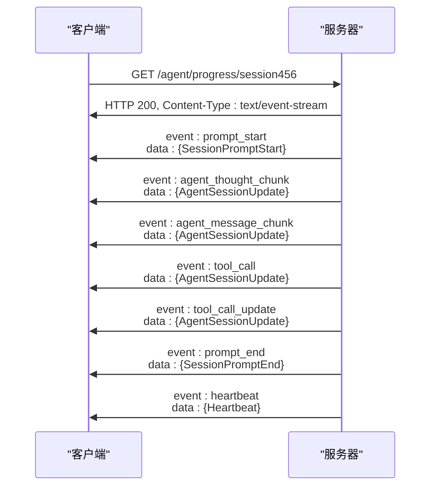

# API参考

<cite>
**本文档引用的文件**  
- [router.rs](file://crates/rcoder/src/router.rs)
- [chat_handler.rs](file://crates/rcoder/src/handler/chat_handler.rs)
- [agent_session_notification.rs](file://crates/rcoder/src/handler/agent_session_notification.rs)
- [agent_stop_handler.rs](file://crates/rcoder/src/handler/agent_stop_handler.rs)
- [health_handler.rs](file://crates/rcoder/src/handler/health_handler.rs)
- [proxy_api.rs](file://crates/rcoder/src/handler/proxy_api.rs)
- [proxy_handler_api.rs](file://crates/rcoder/src/handler/proxy_handler_api.rs)
- [chat_prompt.rs](file://crates/rcoder/src/model/chat_prompt.rs)
- [agent_model.rs](file://crates/rcoder/src/model/agent_model.rs)
- [attachment.rs](file://crates/rcoder/src/model/attachment.rs)
- [app_error.rs](file://crates/rcoder/src/model/app_error.rs)
- [http_result.rs](file://crates/rcoder/src/model/http_result.rs)
</cite>

## 目录
1. [简介](#简介)
2. [API概览](#api概览)
3. [聊天API](#聊天api)
4. [会话通知API](#会话通知api)
5. [Agent管理API](#agent管理api)
6. [健康检查API](#健康检查api)
7. [代理API](#代理api)
8. [错误码体系](#错误码体系)
9. [客户端实现指南](#客户端实现指南)
10. [性能建议](#性能建议)

## 简介
RCoder AI服务API基于ACP（Agent Client Protocol）v0.4协议，提供完整的AI代理集成解决方案。本API支持智能对话、实时进度通知、会话管理和反向代理功能，适用于构建AI驱动的开发工具和智能助手应用。

API采用标准的RESTful设计，所有响应均遵循统一的`HttpResult<T>`封装格式，包含`code`、`message`、`data`、`tid`（trace ID）和`success`字段。所有接口均通过OpenAPI 3.0规范进行描述，并提供Swagger UI文档界面。

**API版本控制**  
当前API版本为1.0.0，通过URL路径进行版本控制。未来版本将保持向后兼容性，重大变更将通过新的版本号标识。

**认证要求**  
本API当前未实现认证机制，所有端点均可公开访问。在生产环境中部署时，建议通过外部网关添加认证层。

## API概览

```mermaid
graph TB
subgraph "核心功能"
ChatAPI[/chat POST/]
NotificationAPI[/agent/progress/{session_id} GET/]
AgentAPI[/agent/stop POST/]
HealthAPI[/health GET/]
end
subgraph "代理功能"
ProxyStatus[/proxy/status GET/]
ProxyStats[/proxy/stats GET/]
ProxyConfig[/proxy/config GET/]
ProxyPort[/proxy/{port} GET/]
ProxyPath[/proxy/{port}/{*path} GET/]
end
Client[客户端] --> ChatAPI
Client --> NotificationAPI
Client --> AgentAPI
Client --> HealthAPI
Client --> ProxyStatus
Client --> ProxyStats
Client --> ProxyConfig
Client --> ProxyPort
Client --> ProxyPath
ChatAPI --> NotificationAPI
AgentAPI --> ChatAPI
```

**API来源**  
- [router.rs](file://crates/rcoder/src/router.rs#L1-L202)

## 聊天API

### `/chat` - 发送聊天消息

通过ACP协议发送聊天消息给AI代理，支持文本和多媒体内容。

**HTTP方法**  
`POST`

**URL路径**  
`/chat`

**请求头**  
- `Content-Type: application/json`

**请求体结构**

```json
{
  "prompt": "帮我写一个Rust的Hello World程序",
  "project_id": "test_project",
  "session_id": "session456",
  "attachments": [
    {
      "type": "text",
      "content": {
        "id": "att_123",
        "source": {
          "source_type": "FilePath",
          "path": "requirements.txt"
        },
        "filename": "requirements.txt",
        "description": "项目依赖文件"
      }
    }
  ],
  "data_source_attachments": [
    "{\"type\":\"api\",\"url\":\"https://api.example.com/v1/users\",\"method\":\"GET\"}"
  ],
  "model_provider": {
    "id": "openai_gpt4",
    "name": "openai",
    "base_url": "https://api.openai.com/v1",
    "api_key": "sk-...",
    "requires_openai_auth": true,
    "default_model": "gpt-4",
    "api_protocol": "openai"
  },
  "request_id": "req_123456789"
}
```

**字段说明**  
- `prompt`: 用户输入的提示文本
- `project_id`: 可选的项目ID，如果不提供则自动生成
- `session_id`: 可选的会话ID，如果不提供则创建新会话
- `attachments`: 可选的附件列表，支持文本、图像、音频和文档
- `data_source_attachments`: 数据源附件列表，直接传递JSON字符串数组
- `model_provider`: 模型提供商配置
- `request_id`: 可选的请求ID，用于标识和追踪请求

**响应格式**

```json
{
  "success": true,
  "data": {
    "project_id": "test_project",
    "session_id": "session456",
    "error": null
  },
  "error": null,
  "code": "0000",
  "message": "成功",
  "tid": "a1b2c3d4e5f6g7h8i9j0k1l2m3n4o5p6"
}
```

**curl命令示例**

```bash
curl -X POST http://localhost:3000/chat \
  -H "Content-Type: application/json" \
  -d '{
    "prompt": "帮我写一个Rust的Hello World程序",
    "project_id": "test_project",
    "model_provider": {
      "id": "openai_gpt4",
      "name": "openai",
      "base_url": "https://api.openai.com/v1",
      "api_key": "sk-...",
      "requires_openai_auth": true,
      "default_model": "gpt-4",
      "api_protocol": "openai"
    }
  }'
```

**错误响应示例**

```json
{
  "success": false,
  "data": null,
  "error": {
    "code": "VALIDATION001",
    "message": "Invalid request parameters"
  },
  "code": "VALIDATION001",
  "message": "Invalid request parameters",
  "tid": "a1b2c3d4e5f6g7h8i9j0k1l2m3n4o5p6"
}
```

**状态码**  
- `200`: 成功处理聊天请求
- `400`: 请求参数错误
- `500`: 服务器内部错误

**API来源**  
- [chat_handler.rs](file://crates/rcoder/src/handler/chat_handler.rs#L1-L232)
- [chat_prompt.rs](file://crates/rcoder/src/model/chat_prompt.rs#L1-L40)

## 会话通知API

### `/agent/progress/{session_id}` - 建立Agent会话通知连接

通过Server-Sent Events（SSE）协议建立与指定会话的实时通信连接，推送AI代理执行进度更新。

**HTTP方法**  
`GET`

**URL路径**  
`/agent/progress/{session_id}`

**路径参数**  
- `session_id`: 会话ID，用于标识特定的会话连接

**响应格式**  
`text/event-stream`

### SSE流式响应机制

本API采用SSE协议实现服务器到客户端的单向实时通信。客户端建立连接后，服务器将实时推送该会话的所有状态更新消息。

**事件类型映射**  
- `prompt_start`: SessionPromptStart消息
- `prompt_end`: SessionPromptEnd消息
- `user_message_chunk`: 用户消息块
- `agent_message_chunk`: Agent响应消息块
- `agent_thought_chunk`: Agent思考过程
- `tool_call`: 工具调用通知
- `tool_call_update`: 工具调用状态更新
- `available_commands_update`: 可用命令更新
- `heartbeat`: 心跳消息

**连接管理策略**  
- **心跳机制**: 每30秒发送一次心跳消息，确保连接活跃
- **自动重连**: 客户端应实现自动重连机制，建议使用指数退避算法
- **连接超时**: 服务器未设置显式超时，但建议客户端在长时间无消息后主动重连
- **错误恢复**: 当连接中断时，客户端应重新建立SSE连接并继续接收后续消息

**SSE消息格式示例**

```text
event: prompt_start
data: {"session_id":"session456","message_type":"SessionPromptStart","sub_type":"prompt_start","data":{"type":"prompt_start","prompt":"帮我写一个Rust的Hello World程序","attachments":[],"user_id":"user123","project_id":"test_project"},"timestamp":"2023-12-01T10:30:00Z"}

event: agent_message_chunk
data: {"session_id":"session456","message_type":"AgentSessionUpdate","sub_type":"agent_message_chunk","data":{"content":{"type":"text","text":"当然可以！以下是一个简单的Rust Hello World程序：\n\n```rust\nfn main() {\n    println!(\"Hello, World!\");\n}\n```","annotations":null,"meta":null},"is_final":false},"timestamp":"2023-12-01T10:30:02Z"}

event: heartbeat
data: {"session_id":"session456","message_type":"Heartbeat","sub_type":"ping","data":{"type":"heartbeat","message":"keep-alive","timestamp":"2023-12-01T10:31:00Z"},"timestamp":"2023-12-01T10:31:00Z"}
```

**curl命令示例**

```bash
curl -N http://localhost:3000/agent/progress/session456
```

**完整流程示例**



**状态码**  
- `200`: 成功建立SSE连接，开始推送实时更新
- `400`: 无效的会话ID
- `404`: 会话不存在

**API来源**  
- [agent_session_notification.rs](file://crates/rcoder/src/handler/agent_session_notification.rs#L1-L439)

## Agent管理API

### `/agent/stop` - 停止Agent服务

停止指定项目的Agent服务，用于测试和管理。基于RAII原则自动清理所有相关资源。

**HTTP方法**  
`POST`

**URL路径**  
`/agent/stop`

**查询参数**  
- `project_id`: 项目ID

**请求示例**

```bash
curl -X POST "http://localhost:3000/agent/stop?project_id=test_project"
```

**响应格式**

```json
{
  "success": true,
  "data": {
    "success": true,
    "project_id": "test_project",
    "session_id": "session123",
    "message": "Agent服务已成功停止"
  },
  "error": null
}
```

### `/agent/status/{project_id}` - 查询Agent状态

查询指定项目的Agent服务状态信息。

**HTTP方法**  
`GET`

**URL路径**  
`/agent/status/{project_id}`

**路径参数**  
- `project_id`: 项目ID

**响应格式**

```json
{
  "success": true,
  "data": {
    "project_id": "test_project",
    "is_alive": true,
    "session_id": "session123",
    "status": "Active",
    "last_activity": "2024-01-01T12:00:00Z",
    "created_at": "2024-01-01T10:00:00Z",
    "model_provider": {
      "id": "custom",
      "name": "custom",
      "api_protocol": "OpenAI",
      "default_model": "gpt-4"
    }
  },
  "error": null
}
```

当Agent不存活时：

```json
{
  "success": true,
  "data": {
    "project_id": "test_project",
    "is_alive": false
  },
  "error": null
}
```

**API来源**  
- [agent_stop_handler.rs](file://crates/rcoder/src/handler/agent_stop_handler.rs#L1-L266)

## 健康检查API

### `/health` - 健康检查端点

检查服务的健康状态。

**HTTP方法**  
`GET`

**URL路径**  
`/health`

**响应格式**

```json
{
  "status": "healthy",
  "timestamp": "2023-12-01T10:30:00Z",
  "service": "rcoder-ai-service"
}
```

**curl命令示例**

```bash
curl http://localhost:3000/health
```

**API来源**  
- [health_handler.rs](file://crates/rcoder/src/handler/health_handler.rs#L1-L36)

## 代理API

### `/proxy/status` - 获取Pingora代理服务状态

返回当前Pingora代理服务的运行状态和配置信息。

**HTTP方法**  
`GET`

**URL路径**  
`/proxy/status`

**响应格式**

```json
{
  "status": "running",
  "listen_port": 8080,
  "default_backend_port": 3000,
  "default_backend_host": "127.0.0.1",
  "backends": [
    {
      "port": 3000,
      "host": "127.0.0.1",
      "health_status": "healthy",
      "last_check": "2025-01-12T10:30:00Z"
    }
  ],
  "load_balancer": {
    "algorithm": "round-robin",
    "health_check_enabled": true,
    "backend_count": 1
  }
}
```

### `/proxy/stats` - 获取Pingora代理统计信息

返回代理服务的请求统计和性能指标。

**HTTP方法**  
`GET`

**URL路径**  
`/proxy/stats`

**响应格式**

```json
{
  "total_requests": 15420,
  "successful_requests": 15200,
  "failed_requests": 220,
  "avg_response_time_ms": 35.5,
  "active_connections": 12,
  "port_stats": [
    {
      "port": 3000,
      "requests": 8560,
      "success_rate": 0.987,
      "avg_response_time_ms": 28.3
    }
  ]
}
```

### `/proxy/config` - 获取Pingora代理配置

返回当前代理服务的配置信息。

**HTTP方法**  
`GET`

**URL路径**  
`/proxy/config`

**响应格式**

```json
{
  "listen_port": 8080,
  "default_backend_port": 3000,
  "default_backend_host": "127.0.0.1",
  "load_balancing_algorithm": "round-robin",
  "health_check": {
    "enabled": true,
    "interval_seconds": 5,
    "timeout_seconds": 3,
    "healthy_threshold": 2,
    "unhealthy_threshold": 3
  }
}
```

### `/proxy/{port}` - 代理到指定端口（无路径）

将请求代理到指定端口的服务，无额外路径。

**HTTP方法**  
`GET`

**URL路径**  
`/proxy/{port}`

**路径参数**  
- `port`: 目标端口号

### `/proxy/{port}/{*path}` - 代理到指定端口和路径

将请求代理到指定端口的服务，包含完整路径信息。

**HTTP方法**  
`GET`

**URL路径**  
`/proxy/{port}/{*path}`

**路径参数**  
- `port`: 目标端口号
- `path`: 目标路径

### `/proxy` - 使用查询参数代理（向后兼容）

通过查询参数指定目标端口和路径，保持向后兼容性。

**HTTP方法**  
`GET`

**URL路径**  
`/proxy`

**查询参数**  
- `port`: 端口号（用于向后兼容）
- `path`: 路径（可选）

**API来源**  
- [proxy_handler_api.rs](file://crates/rcoder/src/handler/proxy_handler_api.rs#L1-L437)
- [proxy_api.rs](file://crates/rcoder/src/handler/proxy_api.rs#L1-L195)

## 错误码体系

本API采用统一的错误码体系，所有错误响应均遵循`HttpResult<T>`格式。

| 错误码 | 类型 | 描述 |
|--------|------|------|
| 0000 | 成功 | 操作成功 |
| 0001 | 内部错误 | 服务器内部错误 |
| 5000 | 内部错误 | 内部服务器错误 |
| VALIDATION001 | 客户端错误 | 请求参数验证失败 |
| INVALID_SESSION | 客户端错误 | 无效的会话ID |
| SESSION_NOT_FOUND | 客户端错误 | 会话不存在 |
| AGENT_NOT_FOUND | 客户端错误 | 未找到对应的Agent服务 |
| INVALID_PARAMS | 客户端错误 | 请求参数错误 |
| AGENT_ALREADY_STOPPED | 客户端错误 | Agent服务已停止 |
| BACKEND_NOT_FOUND | 代理错误 | 未找到后端服务 |
| PROXY_DISABLED | 代理错误 | 代理服务未启用 |
| MISSING_PORT | 代理错误 | 缺少端口号参数 |

**重试策略**  
- 对于`5xx`错误，建议使用指数退避算法进行重试
- 对于`4xx`错误，通常表示客户端错误，不应重试
- 对于SSE连接中断，应立即尝试重连

## 客户端实现指南

### 流式响应处理

处理SSE流式响应时，建议采用以下模式：

```javascript
const eventSource = new EventSource('/agent/progress/session456');

eventSource.onmessage = function(event) {
  const message = JSON.parse(event.data);
  // 根据message_type处理不同消息类型
  switch(message.message_type) {
    case 'SessionPromptStart':
      handlePromptStart(message);
      break;
    case 'SessionPromptEnd':
      handlePromptEnd(message);
      break;
    case 'AgentSessionUpdate':
      handleAgentUpdate(message);
      break;
    case 'Heartbeat':
      handleHeartbeat(message);
      break;
  }
};

eventSource.onerror = function(err) {
  console.error('SSE连接错误:', err);
  // 实现自动重连逻辑
  setTimeout(() => reconnect(), 1000);
};
```

### 连接超时处理

```javascript
// 设置连接超时
const connectionTimeout = setTimeout(() => {
  eventSource.close();
  console.error('SSE连接超时');
}, 30000);

// 收到消息时重置超时
eventSource.onmessage = function(event) {
  clearTimeout(connectionTimeout);
  connectionTimeout = setTimeout(() => {
    eventSource.close();
    console.error('SSE连接超时');
  }, 30000);
};
```

### 错误恢复

```javascript
let retryCount = 0;
const maxRetries = 5;

function connect() {
  const eventSource = new EventSource('/agent/progress/session456');
  
  eventSource.onerror = function() {
    if (retryCount < maxRetries) {
      retryCount++;
      setTimeout(connect, Math.pow(2, retryCount) * 1000); // 指数退避
    }
  };
  
  eventSource.onopen = function() {
    retryCount = 0; // 连接成功，重置重试计数
  };
}
```

## 性能建议

### 请求大小限制
- 单个请求体大小不应超过10MB
- 附件文件大小建议限制在5MB以内
- `data_source_attachments`数组长度建议不超过100项

### 调用频率控制
- 聊天API建议每秒不超过10次调用
- SSE连接建议每个用户会话保持一个连接
- 代理API调用频率取决于后端服务的处理能力

### 最佳实践
1. **连接复用**: 对于同一会话，应复用SSE连接，避免频繁建立和关闭
2. **批量处理**: 对于多个相关操作，考虑批量处理以减少网络开销
3. **缓存策略**: 对于频繁查询的静态数据（如代理配置），建议在客户端缓存
4. **资源清理**: 当不再需要SSE连接时，应及时调用`eventSource.close()`释放资源
5. **错误监控**: 实现全面的错误监控和日志记录，便于问题排查

**API来源**  
- [router.rs](file://crates/rcoder/src/router.rs#L1-L202)
- [chat_handler.rs](file://crates/rcoder/src/handler/chat_handler.rs#L1-L232)
- [agent_session_notification.rs](file://crates/rcoder/src/handler/agent_session_notification.rs#L1-L439)