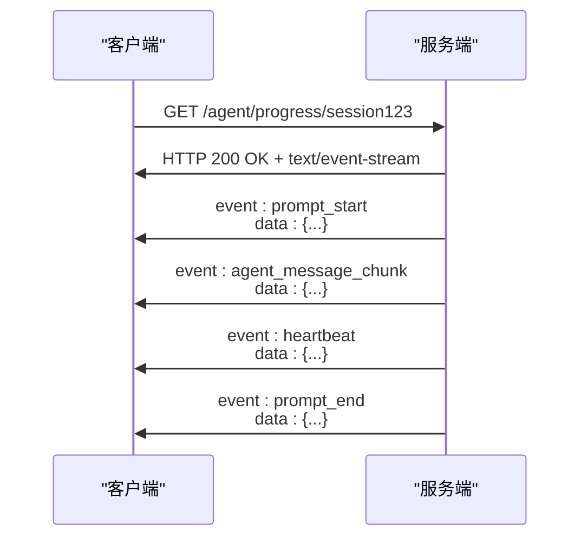
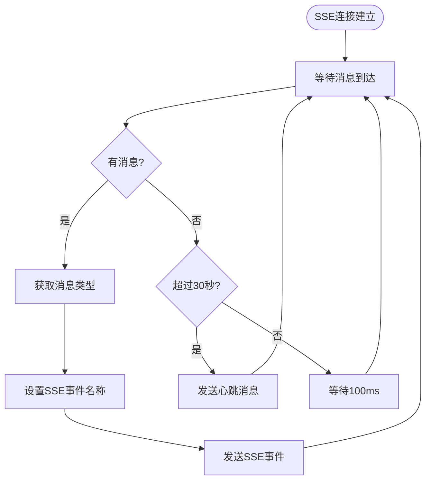
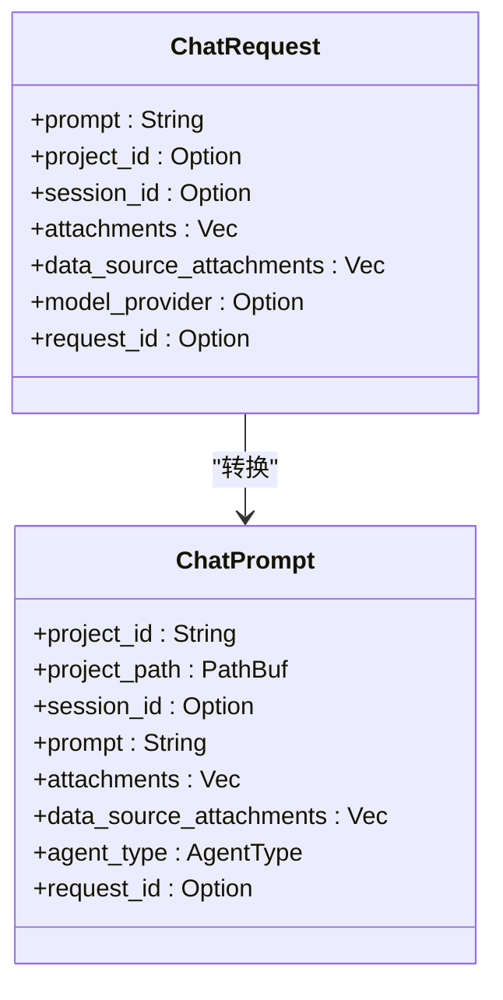
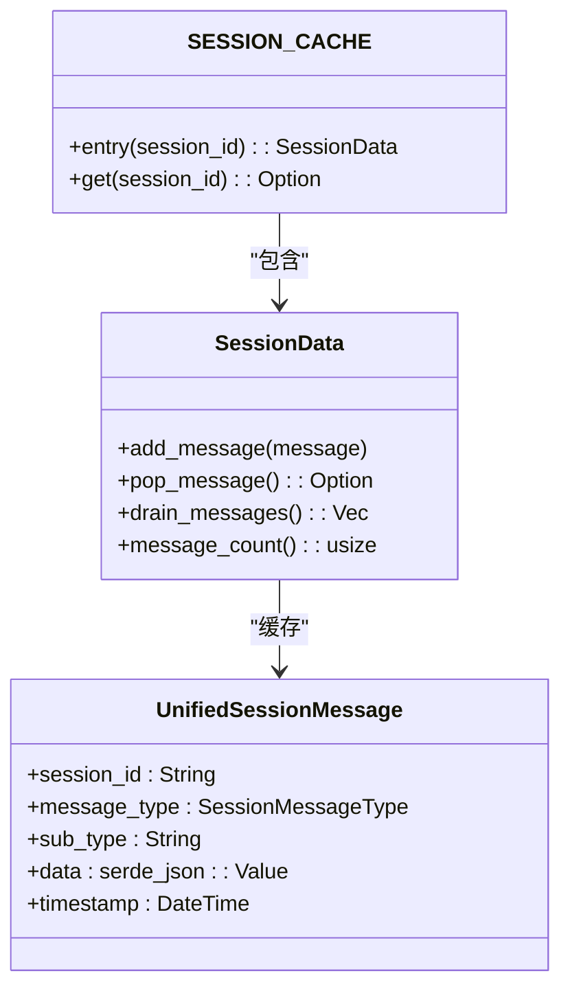
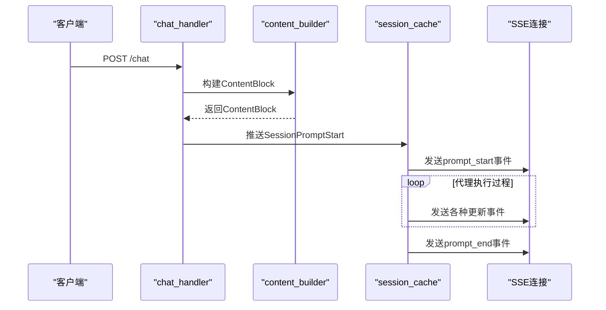

# SSE流式API

<cite>
**本文档引用的文件**   
- [chat_handler.rs](file://crates/rcoder/src/handler/chat_handler.rs)
- [chat_prompt.rs](file://crates/rcoder/src/model/chat_prompt.rs)
- [content_builder.rs](file://crates/rcoder/src/utils/content_builder.rs)
- [agent_session_notification.rs](file://crates/rcoder/src/handler/agent_session_notification.rs)
- [session_cache.rs](file://crates/rcoder/src/service/session_cache.rs)
- [agent_session_notify.rs](file://crates/rcoder/src/model/agent_session_notify.rs)
</cite>

## 目录
1. [引言](#引言)
2. [SSE连接建立与维护](#sse连接建立与维护)
3. [流式响应逻辑解析](#流式响应逻辑解析)
4. [客户端请求构造](#客户端请求构造)
5. [SSE消费示例代码](#sse消费示例代码)
6. [服务端背压处理与恢复策略](#服务端背压处理与恢复策略)
7. [内容组装与消息推送](#内容组装与消息推送)
8. [性能优化建议](#性能优化建议)
9. [结论](#结论)

## 引言
本文档深入文档化rcoder的SSE（Server-Sent Events）流式聊天API，详细说明如何建立和维护SSE连接，解析流式响应逻辑，描述事件流中不同事件类型的触发条件和数据格式，并提供完整的JavaScript和curl示例代码。

## SSE连接建立与维护
SSE连接通过`/agent/progress/{session_id}`端点建立，使用HTTP GET方法。客户端需要设置`Accept: text/event-stream`头部以表明期望接收SSE流。服务端会保持连接打开，直到代理执行完成或连接超时。

连接建立后，服务端会定期发送心跳消息以保持连接活跃，心跳间隔为30秒。如果在30秒内没有其他消息发送，服务端会自动发送一个`heartbeat`事件，防止代理或防火墙关闭空闲连接。



**图示来源**
- [agent_session_notification.rs](file://crates/rcoder/src/handler/agent_session_notification.rs#L36-L437)

**本节来源**
- [agent_session_notification.rs](file://crates/rcoder/src/handler/agent_session_notification.rs#L36-L437)

## 流式响应逻辑解析
流式响应逻辑在`agent_session_notification.rs`中实现，通过SSE协议实时推送AI代理执行进度和状态更新。事件流包含多种事件类型，每种类型对应不同的消息场景。

### 事件类型与数据格式
| 事件类型 | 触发条件 | 数据格式 |
|---------|---------|---------|
| `prompt_start` | 用户发送prompt开始 | SessionPromptStart消息 |
| `prompt_end` | Agent执行结束 | SessionPromptEnd消息 |
| `agent_message_chunk` | Agent响应消息块 | AgentSessionUpdate消息 |
| `heartbeat` | 心跳检测 | Heartbeat消息 |

服务端根据`UnifiedSessionMessage`的`message_type`和`sub_type`字段动态设置SSE事件名称。例如，`SessionMessageType::SessionPromptStart`映射为`prompt_start`事件，`SessionMessageType::Heartbeat`映射为`heartbeat`事件。



**图示来源**
- [agent_session_notification.rs](file://crates/rcoder/src/handler/agent_session_notification.rs#L36-L437)
- [agent_session_notify.rs](file://crates/rcoder/src/model/agent_session_notify.rs#L48-L75)

**本节来源**
- [agent_session_notification.rs](file://crates/rcoder/src/handler/agent_session_notification.rs#L36-L437)
- [agent_session_notify.rs](file://crates/rcoder/src/model/agent_session_notify.rs#L48-L75)

## 客户端请求构造
客户端通过`/chat`端点发送聊天请求，使用HTTP POST方法，Content-Type为`application/json`。请求体基于`ChatRequest`结构体构造，包含prompt、项目ID、会话ID等字段。

### 请求模型
```json
{
  "prompt": "帮我写一个Rust的Hello World程序",
  "project_id": "test_project",
  "session_id": "session456",
  "attachments": [],
  "data_source_attachments": [],
  "model_provider": {
    "id": "openai_gpt4",
    "name": "openai",
    "base_url": "https://api.openai.com/v1",
    "api_key": "sk-...",
    "requires_openai_auth": true,
    "default_model": "gpt-4",
    "api_protocol": "openai"
  },
  "request_id": "req_123456789"
}
```

如果未提供`project_id`，系统会自动生成新的项目ID并创建相应的工作目录。如果未提供`session_id`，系统会创建新的会话。`model_provider`配置用于自动选择agent类型。



**图示来源**
- [chat_handler.rs](file://crates/rcoder/src/handler/chat_handler.rs#L14-L50)
- [chat_prompt.rs](file://crates/rcoder/src/model/chat_prompt.rs#L4-L39)

**本节来源**
- [chat_handler.rs](file://crates/rcoder/src/handler/chat_handler.rs#L14-L50)
- [chat_prompt.rs](file://crates/rcoder/src/model/chat_prompt.rs#L4-L39)

## SSE消费示例代码
以下提供JavaScript和curl两种方式消费SSE流的示例代码。

### JavaScript示例
```javascript
// 建立SSE连接
const eventSource = new EventSource('/agent/progress/session123');

// 监听不同类型的事件
eventSource.addEventListener('prompt_start', (event) => {
    const data = JSON.parse(event.data);
    console.log('用户请求开始:', data);
});

eventSource.addEventListener('agent_message_chunk', (event) => {
    const data = JSON.parse(event.data);
    console.log('Agent响应:', data.data.content.text);
    // 逐步更新UI
});

eventSource.addEventListener('tool_call', (event) => {
    const data = JSON.parse(event.data);
    console.log('工具调用:', data.data.toolCallId, data.data.title);
});

eventSource.addEventListener('prompt_end', (event) => {
    const data = JSON.parse(event.data);
    console.log('执行结束:', data.data.reason);
    eventSource.close(); // 关闭连接
});

eventSource.addEventListener('heartbeat', (event) => {
    console.log('收到心跳:', new Date());
});

// 错误处理
eventSource.addEventListener('error', (event) => {
    console.error('SSE连接错误:', event);
    if (eventSource.readyState === EventSource.CLOSED) {
        console.log('连接已关闭，可尝试重连');
    }
});
```

### curl示例
```bash
# 使用curl消费SSE流
curl -N -H "Accept: text/event-stream" \
  http://localhost:3000/agent/progress/session123

# 输出示例
event: prompt_start
data: {"session_id":"session123","message_type":"SessionPromptStart","sub_type":"prompt_start","data":{},"timestamp":"2023-12-01T10:30:00Z"}

event: agent_message_chunk
data: {"session_id":"session123","message_type":"AgentSessionUpdate","sub_type":"agent_message_chunk","data":{"content":{"type":"text","text":"当然可以！以下是一个简单的Rust Hello World程序：\n\n```rust\nfn main() {\n    println!(\"Hello, World!\");\n}\n```"}},"timestamp":"2023-12-01T10:30:02Z"}

event: prompt_end
data: {"session_id":"session123","message_type":"SessionPromptEnd","sub_type":"end_turn","data":{"reason":"EndTurn","description":"正常结束"},"timestamp":"2023-12-01T10:30:05Z"}
```

**本节来源**
- [agent_session_notification.rs](file://crates/rcoder/src/handler/agent_session_notification.rs#L36-L437)
- [agent_session_notify.rs](file://crates/rcoder/src/model/agent_session_notify.rs#L48-L75)

## 服务端背压处理与恢复策略
服务端通过`SESSION_CACHE`全局缓存实现背压处理，使用`DashMap`按`session_id`分组缓存统一会话消息到`ringbuf`循环缓冲区。

### 背压处理机制
- 每个会话的消息缓存大小限制为1000条
- 使用`ringbuf::HeapRb`实现循环缓冲区，当缓冲区满时自动覆盖最老的消息
- `SessionData`结构体封装了消息缓存的添加和读取操作
- `push_session_update`函数作为便捷函数，将`SessionNotify`消息转换为`UnifiedSessionMessage`并添加到缓存

### 连接中断恢复
当连接中断后，客户端可以重新建立SSE连接。由于消息缓存是循环的，客户端可能会丢失部分历史消息，但可以接收到后续的所有更新。服务端没有提供消息重放机制，因此客户端需要在应用层处理消息丢失的情况。



**图示来源**
- [session_cache.rs](file://crates/rcoder/src/service/session_cache.rs#L14-L18)
- [session_cache.rs](file://crates/rcoder/src/service/session_cache.rs#L68-L95)
- [agent_session_notify.rs](file://crates/rcoder/src/model/agent_session_notify.rs#L4-L37)

**本节来源**
- [session_cache.rs](file://crates/rcoder/src/service/session_cache.rs#L14-L18)
- [session_cache.rs](file://crates/rcoder/src/service/session_cache.rs#L68-L95)
- [agent_session_notify.rs](file://crates/rcoder/src/model/agent_session_notify.rs#L4-L37)

## 内容组装与消息推送
消息的组装和推送过程涉及多个组件的协作。`content_builder.rs`负责将附件转换为ACP协议的`ContentBlock`，而`chat_handler.rs`负责处理聊天请求并启动代理执行。

### 消息生成流程
1. 客户端发送`/chat`请求
2. `handle_chat`函数处理请求，创建`ChatPrompt`
3. 通过`local_task_sender`发送本地任务请求
4. 代理执行过程中，通过`push_session_update`推送各种状态更新
5. `agent_session_notification`从缓存中读取消息并推送给SSE连接

### 内容构建器
`ContentBuilder`结构体提供了一系列方法将不同类型的附件转换为`ContentBlock`：
- `text_to_content_block`: 文本附件转换
- `image_to_content_block`: 图像附件转换
- `audio_to_content_block`: 音频附件转换
- `document_to_content_block`: 文档附件转换



**图示来源**
- [chat_handler.rs](file://crates/rcoder/src/handler/chat_handler.rs#L97-L230)
- [content_builder.rs](file://crates/rcoder/src/utils/content_builder.rs#L14-L15)
- [session_cache.rs](file://crates/rcoder/src/service/session_cache.rs#L68-L95)

**本节来源**
- [chat_handler.rs](file://crates/rcoder/src/handler/chat_handler.rs#L97-L230)
- [content_builder.rs](file://crates/rcoder/src/utils/content_builder.rs#L14-L15)
- [session_cache.rs](file://crates/rcoder/src/service/session_cache.rs#L68-L95)

## 性能优化建议
为确保SSE流式API的高性能和稳定性，建议采取以下优化措施：

### TCP_NODELAY设置
启用TCP_NODELAY选项可以防止Nagle算法引入延迟，对于实时性要求高的SSE流非常重要。这可以确保消息立即发送，而不是等待缓冲区填满。

### 高并发连接处理
- 使用异步非阻塞I/O处理大量并发连接
- 限制每个会话的消息缓存大小，防止内存耗尽
- 实现连接超时机制，及时清理空闲连接
- 使用连接池管理数据库连接

### 其他优化建议
- 启用Gzip压缩减少网络传输量
- 使用CDN缓存静态资源，减轻服务器压力
- 监控连接数和消息速率，及时发现异常
- 实现优雅的降级机制，当系统负载过高时提供有限服务

**本节来源**
- [chat_handler.rs](file://crates/rcoder/src/handler/chat_handler.rs)
- [agent_session_notification.rs](file://crates/rcoder/src/handler/agent_session_notification.rs)
- [session_cache.rs](file://crates/rcoder/src/service/session_cache.rs)

## 结论
rcoder的SSE流式聊天API提供了一套完整的实时通信解决方案，通过`/chat`端点接收用户请求，通过`/agent/progress/{session_id}`端点推送实时更新。API设计考虑了背压处理、连接保持、错误恢复等关键问题，为开发者提供了稳定可靠的流式通信能力。