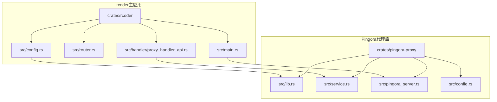
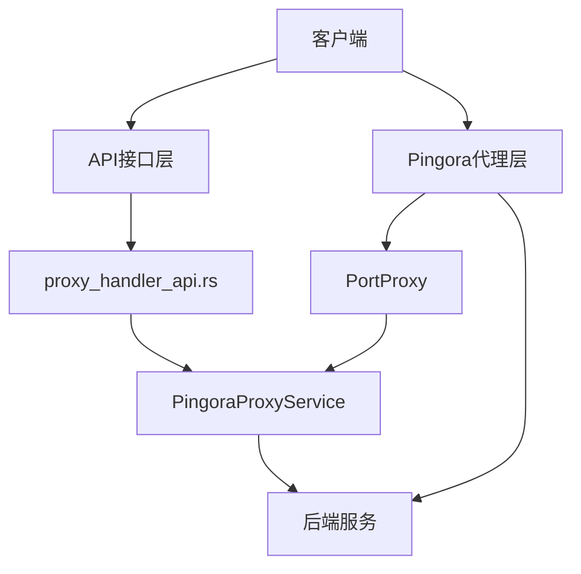
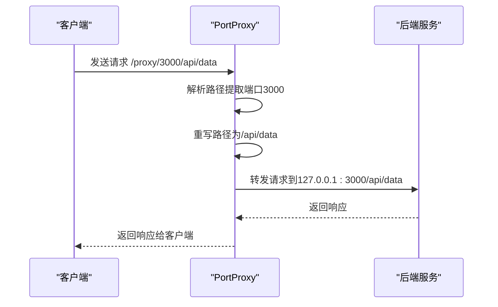
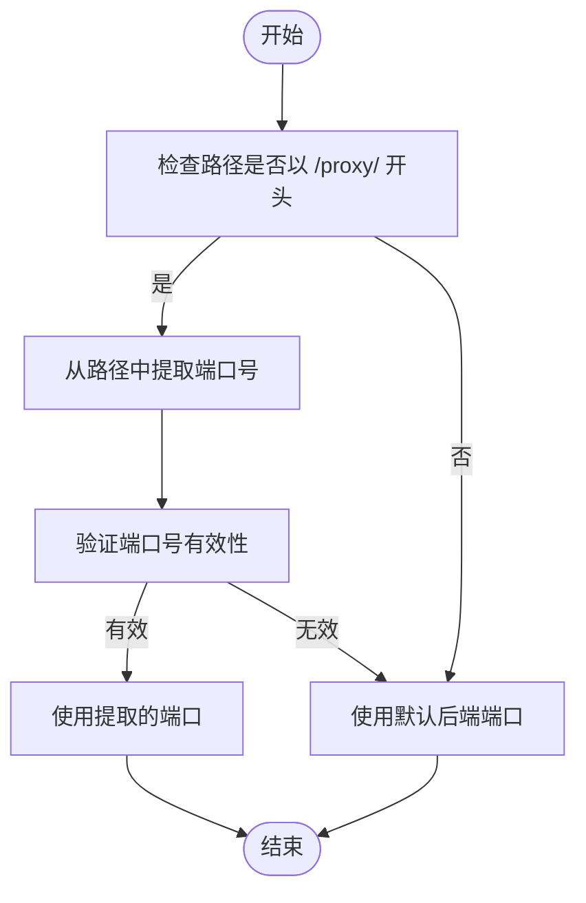
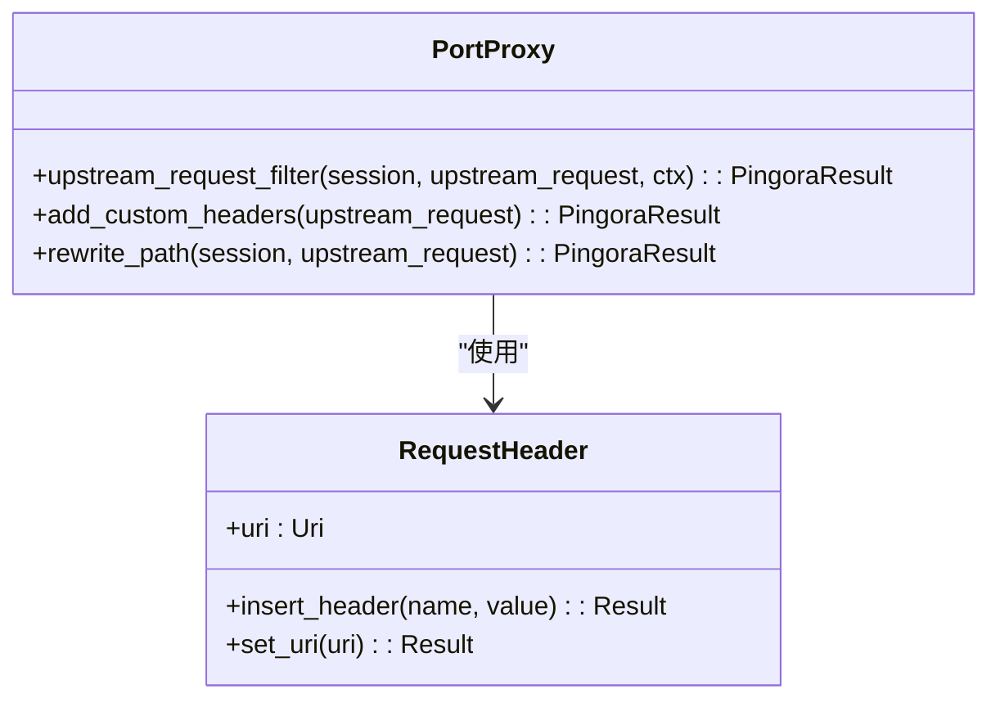
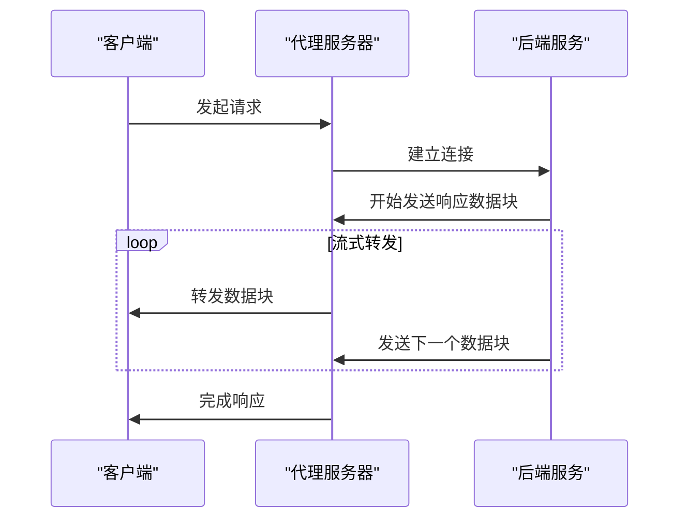
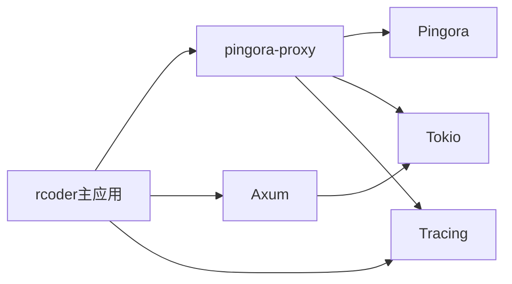

# 反向代理API

<cite>
**本文档引用的文件**
- [proxy_handler_api.rs](file://crates/rcoder/src/handler/proxy_handler_api.rs)
- [proxy_api.rs](file://crates/rcoder/src/handler/proxy_api.rs)
- [pingora-proxy/src/lib.rs](file://crates/pingora-proxy/src/lib.rs)
- [service.rs](file://crates/pingora-proxy/src/service.rs)
- [pingora_server.rs](file://crates/pingora-proxy/src/pingora_server.rs)
- [main.rs](file://crates/rcoder/src/main.rs)
- [config.rs](file://crates/rcoder/src/config.rs)
- [router.rs](file://crates/rcoder/src/router.rs)
</cite>

## 目录
1. [简介](#简介)
2. [项目结构](#项目结构)
3. [核心组件](#核心组件)
4. [架构概述](#架构概述)
5. [详细组件分析](#详细组件分析)
6. [依赖分析](#依赖分析)
7. [性能考虑](#性能考虑)
8. [故障排除指南](#故障排除指南)
9. [结论](#结论)

## 简介
rcoder网关的反向代理API基于Cloudflare的Pingora框架构建，提供高性能的端口路由代理服务。该系统允许通过URL路径中的端口号将请求动态路由到相应的后端服务，支持动态后端发现、负载均衡和健康检查等高级功能。代理API不仅提供实际的代理功能，还包含用于监控和管理的REST接口。

## 项目结构
rcoder项目采用模块化设计，反向代理功能主要分布在`crates/pingora-proxy`和`crates/rcoder/src/handler`两个目录中。`pingora-proxy` crate提供了基于Pingora框架的核心代理实现，而`rcoder`主应用则集成了该功能并提供了API接口。

**图示来源**
- [proxy_handler_api.rs](file://crates/rcoder/src/handler/proxy_handler_api.rs)
- [service.rs](file://crates/pingora-proxy/src/service.rs)
- [pingora_server.rs](file://crates/pingora-proxy/src/pingora_server.rs)
- [main.rs](file://crates/rcoder/src/main.rs)

**章节来源**
- [proxy_handler_api.rs](file://crates/rcoder/src/handler/proxy_handler_api.rs)
- [pingora_server.rs](file://crates/pingora-proxy/src/pingora_server.rs)

## 核心组件
反向代理系统的核心组件包括PingoraProxyService（代理服务实现）、PortProxy（Pingora代理处理器）和PingoraServerManager（服务器管理器）。这些组件协同工作，实现了高性能的反向代理功能。API处理函数则提供了对代理服务状态、统计信息和配置的查询接口。

**章节来源**
- [service.rs](file://crates/pingora-proxy/src/service.rs)
- [pingora_server.rs](file://crates/pingora-proxy/src/pingora_server.rs)
- [proxy_handler_api.rs](file://crates/rcoder/src/handler/proxy_handler_api.rs)

## 架构概述
系统采用分层架构设计，上层为API接口层，下层为Pingora代理引擎层。API接口层提供RESTful接口用于查询代理状态和配置，而Pingora代理引擎层负责实际的请求转发。这种分离设计使得监控和管理功能与核心代理功能解耦，提高了系统的可维护性和可扩展性。

**图示来源**
- [proxy_handler_api.rs](file://crates/rcoder/src/handler/proxy_handler_api.rs)
- [service.rs](file://crates/pingora-proxy/src/service.rs)
- [pingora_server.rs](file://crates/pingora-proxy/src/pingora_server.rs)

## 详细组件分析

### 代理转发逻辑分析
代理转发逻辑通过`PortProxy`结构体实现，该结构体实现了Pingora框架的`ProxyHttp` trait。请求处理流程包括路径解析、端口提取、后端选择和请求转发等步骤。

#### 代理请求处理流程

**图示来源**
- [service.rs](file://crates/pingora-proxy/src/service.rs#L233-L355)
- [pingora_server.rs](file://crates/pingora-proxy/src/pingora_server.rs#L116-L160)

#### 请求路径匹配机制

**图示来源**
- [service.rs](file://crates/pingora-proxy/src/service.rs#L316-L355)
- [proxy_handler_api.rs](file://crates/rcoder/src/handler/proxy_handler_api.rs#L312-L352)

**章节来源**
- [service.rs](file://crates/pingora-proxy/src/service.rs)
- [proxy_handler_api.rs](file://crates/rcoder/src/handler/proxy_handler_api.rs)

### 请求头处理分析
代理层在转发请求时会对请求头进行透传和修改，确保必要的信息能够正确传递到后端服务。

#### 请求头处理流程

**图示来源**
- [service.rs](file://crates/pingora-proxy/src/service.rs#L233-L260)
- [pingora_server.rs](file://crates/pingora-proxy/src/pingora_server.rs#L116-L160)

**章节来源**
- [service.rs](file://crates/pingora-proxy/src/service.rs)

### 响应流式转发机制
系统采用流式转发机制，实现了零拷贝的数据传输，提高了代理性能。

**图示来源**
- [service.rs](file://crates/pingora-proxy/src/service.rs#L316-L355)
- [pingora_server.rs](file://crates/pingora-proxy/src/pingora_server.rs#L116-L160)

**章节来源**
- [service.rs](file://crates/pingora-proxy/src/service.rs)

## 依赖分析
系统依赖关系清晰，主要依赖Pingora框架进行核心代理功能实现，同时依赖Axum框架提供API接口。各组件之间的依赖关系如下：

**图示来源**
- [Cargo.toml](file://crates/rcoder/Cargo.toml)
- [Cargo.toml](file://crates/pingora-proxy/Cargo.toml)
- [main.rs](file://crates/rcoder/src/main.rs)

**章节来源**
- [main.rs](file://crates/rcoder/src/main.rs)
- [lib.rs](file://crates/pingora-proxy/src/lib.rs)

## 性能考虑
基于Pingora框架的反向代理实现了高性能的非阻塞I/O模型和零拷贝数据传输。系统通过连接池、连接复用和异步处理等技术优化性能。对于大文件传输和高并发连接等场景，建议调整Pingora的缓冲区大小和连接超时设置以获得最佳性能。

**章节来源**
- [service.rs](file://crates/pingora-proxy/src/service.rs)
- [pingora_server.rs](file://crates/pingora-proxy/src/pingora_server.rs)

## 故障排除指南
常见问题包括代理服务未启用、后端服务不可达和配置错误等。通过`/proxy/status`和`/proxy/stats`接口可以快速诊断问题。健康检查功能会定期检测后端服务状态，自动将不可用的服务标记为不健康，实现故障转移。

**章节来源**
- [proxy_handler_api.rs](file://crates/rcoder/src/handler/proxy_handler_api.rs)
- [service.rs](file://crates/pingora-proxy/src/service.rs)

## 结论
rcoder的反向代理API提供了一套完整的高性能代理解决方案，基于Pingora框架实现了高效的请求转发和负载均衡功能。系统设计合理，功能完善，适用于需要动态端口路由和高性能代理的场景。通过合理的配置和调优，可以满足各种规模的应用需求。