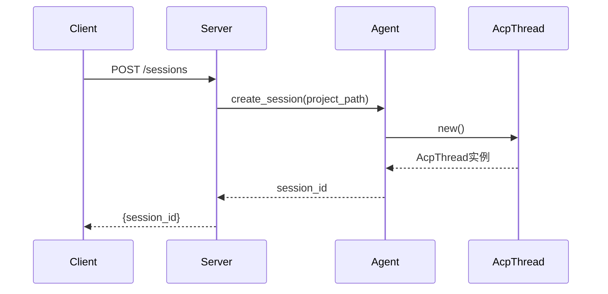
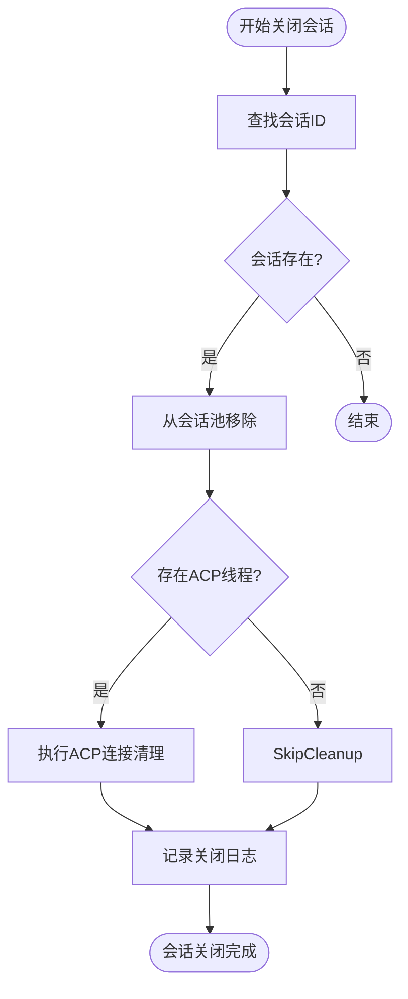
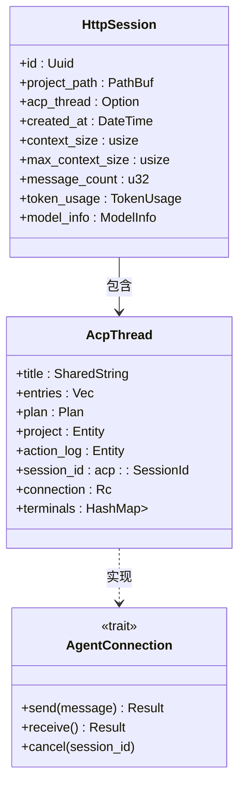

# 会话API

<cite>
**本文档中引用的文件**  
- [http_agent.rs](file://crates/http_server/src/http_agent.rs)
- [handlers.rs](file://crates/http_server/src/handlers.rs)
- [http_interface.rs](file://crates/http_server/src/http_interface.rs)
- [acp_thread.rs](file://crates/acp_thread/src/acp_thread.rs)
- [acp.rs](file://crates/agent_servers/src/acp.rs)
- [agent.rs](file://crates/agent2/src/agent.rs)
</cite>

## 目录
1. [简介](#简介)
2. [会话生命周期控制](#会话生命周期控制)
3. [会话与ACP线程的绑定关系](#会话与acp线程的绑定关系)
4. [SSE流式响应端点](#sse流式响应端点)
5. [会话超时与资源释放机制](#会话超时与资源释放机制)
6. [错误处理与调试建议](#错误处理与调试建议)

## 简介
本文档详细描述了rcoder系统中的会话管理功能，重点涵盖会话的创建、状态查询、清理以及与ACP（Agent Communication Protocol）线程的集成机制。通过RESTful API和SSE（Server-Sent Events）实现对智能代理会话的全生命周期控制，支持流式响应、上下文管理及资源自动回收。

## 会话生命周期控制

### 创建新会话 (POST /sessions)
启动一个新的ACP会话，初始化代理环境并返回唯一会话标识符。

**请求参数：**
- `project_path`: 项目根路径（必需）
- `agent_config`: 代理配置选项（可选）
- `context`: 初始上下文数据（可选）

**返回值：**
- `session_id`: UUID格式的会话唯一标识

该接口在内部调用`HttpNativeAgent::create_session`方法，创建`HttpSession`实例并将其存储于异步读写锁中。会话创建时会记录创建时间、项目路径、最大上下文大小等元信息。



**Diagram sources**  
- [http_agent.rs](file://crates/http_server/src/http_agent.rs#L74-L103)

**Section sources**  
- [http_agent.rs](file://crates/http_server/src/http_agent.rs#L74-L103)
- [http_interface.rs](file://crates/http_server/src/http_interface.rs#L120-L130)

### 查询会话状态 (GET /sessions/:id)
获取指定会话的当前运行状态和元数据。

**返回字段：**
- `id`: 会话ID
- `created_at`: 创建时间戳
- `message_count`: 消息数量
- `context_size`: 当前上下文大小
- `token_usage`: 令牌使用统计
- `model_info`: 使用的模型信息

此操作通过`get_session`异步方法从会话映射表中安全读取克隆副本，确保并发访问的安全性。

**Section sources**  
- [http_agent.rs](file://crates/http_server/src/http_agent.rs#L415-L420)

### 关闭会话 (DELETE /sessions/:id)
主动清理会话资源，释放关联的内存和连接。

**行为说明：**
- 从会话池中移除指定会话
- 触发ACP连接的清理逻辑（占位实现）
- 记录关闭日志

调用`close_session`方法后，系统将异步执行资源释放流程，并确保所有相关引用被正确清除。



**Diagram sources**  
- [http_agent.rs](file://crates/http_server/src/http_agent.rs#L397-L431)

**Section sources**  
- [http_agent.rs](file://crates/http_server/src/http_agent.rs#L422-L431)

## 会话与acp_thread模块中AcpThread实例的绑定关系

每个HTTP会话（`HttpSession`）在创建时会关联一个`AcpThread`实例，形成一对一的绑定关系。`AcpThread`作为ACP协议的核心执行单元，负责与远程代理服务进行双向通信。

**关键字段绑定：**
- `session_id`: 与`acp::SessionId`对应，用于跨层追踪
- `connection`: 实现`AgentConnection` trait的连接实例
- `project`: 关联的项目实体
- `action_log`: 动作日志记录器

`AcpThread`通过事件驱动模型对外发布状态变更，包括：
- `NewEntry`: 新条目生成
- `TitleUpdated`: 标题更新
- `TokenUsageUpdated`: 令牌使用量更新
- `Stopped`: 会话停止
- `Error`: 发生错误

这些事件可被上层订阅并转发至客户端，实现状态同步。



**Diagram sources**  
- [acp_thread.rs](file://crates/acp_thread/src/acp_thread.rs#L775-L789)
- [http_agent.rs](file://crates/http_server/src/http_agent.rs#L74-L103)

**Section sources**  
- [acp_thread.rs](file://crates/acp_thread/src/acp_thread.rs#L775-L807)
- [agent.rs](file://crates/agent2/src/agent.rs#L1133-L1135)

## SSE流式响应端点

提供基于Server-Sent Events的实时消息推送接口，用于接收代理生成的流式响应。

### 消息格式
事件流包含以下类型的消息：

| 事件类型 | 数据结构 | 说明 |
|---------|--------|------|
| token | { "content": "..." } | 文本令牌流 |
| tool_call | { "name": "...", "args": {} } | 工具调用请求 |
| tool_result | { "tool_call_id": "...", "result": {} } | 工具执行结果 |
| session_update | { "status": "active\|stopped" } | 会话状态更新 |
| error | { "message": "..." } | 错误通知 |

### 客户端重连策略
- 使用`Last-Event-ID`头部实现断点续传
- 建议初始重连间隔为1秒，指数退避至最大30秒
- 服务端自动维护最近10条消息的缓存用于恢复

**Section sources**  
- [acp_tools.rs](file://crates/acp_tools/src/acp_tools.rs#L162-L184)
- [acp.rs](file://crates/agent_servers/src/acp.rs#L416-L461)

## 会话超时与资源释放机制

系统采用主动与被动相结合的资源管理策略，确保长时间空闲或异常会话不会占用过多资源。

### 上下文清理策略
当会话上下文超过预设阈值时触发自动清理：
- 保留最近10条消息
- 重置消息计数器
- 记录清理日志

```rust
fn cleanup_session_context(&self, session: &mut HttpSession) {
    if session.context_size > session.max_context_size {
        session.context_size = session.max_context_size;
        session.message_count = session.message_count.max(10) - 10;
        info!("Cleaned up session {} context", session.id);
    }
}
```

### 超时控制
目前依赖外部调度器定期检查会话活跃度。建议实现以下增强机制：
- 心跳检测：客户端定期发送ping消息
- 活跃时间戳更新：每次收到新消息时刷新`last_active`时间
- 后台任务扫描：定时清理超过TTL的会话

**Section sources**  
- [http_agent.rs](file://crates/http_server/src/http_agent.rs#L397-L407)

## 错误处理与调试建议

### 常见错误码
| 状态码 | 原因 | 建议操作 |
|-------|------|---------|
| 404 | 会话不存在 | 检查session_id是否正确或重新创建 |
| 429 | 上下文超限 | 调用清理接口或升级配额 |
| 500 | 内部错误 | 查看服务端日志，重试请求 |

### 调试工具
- 日志追踪：通过`session_id`过滤`info!`和`debug!`日志
- 会话快照：调用`GET /sessions/:id`获取当前状态
- 强制关闭：使用`DELETE /sessions/:id`手动释放资源

**Section sources**  
- [http_agent.rs](file://crates/http_server/src/http_agent.rs#L397-L431)
- [handlers.rs](file://crates/http_server/src/handlers.rs#L200-L250)