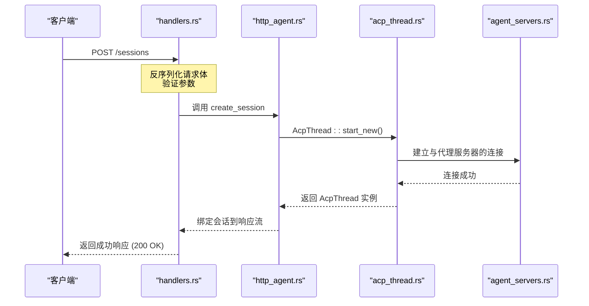
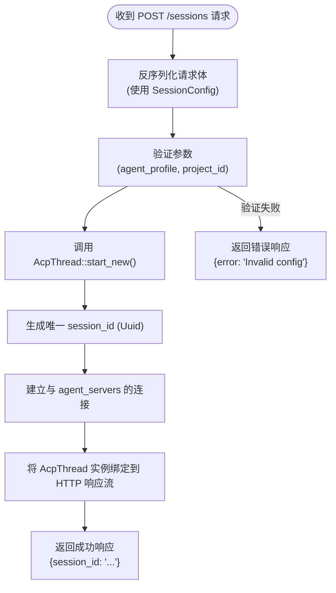
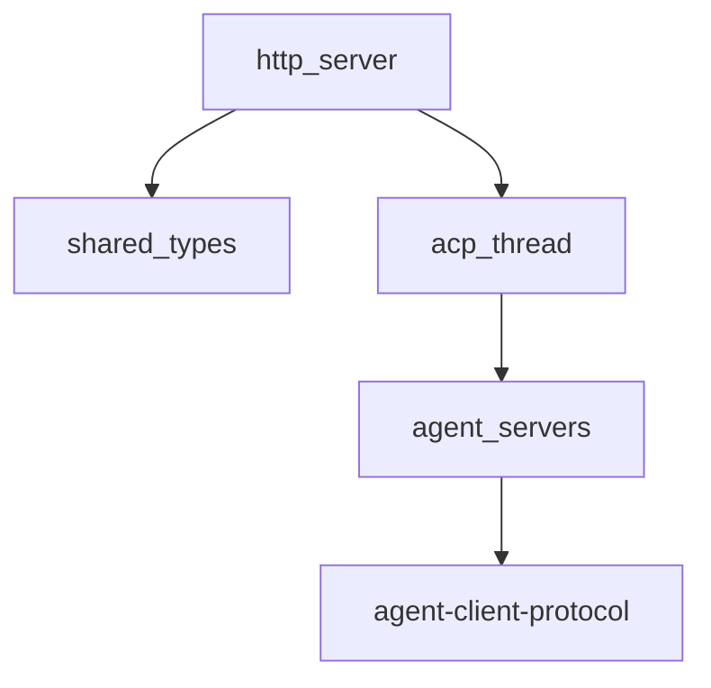

# 会话创建

<cite>
**本文档中引用的文件**  
- [handlers.rs](file://crates/http_server/src/handlers.rs)
- [lib.rs](file://crates/shared_types/src/lib.rs)
- [acp_thread.rs](file://crates/acp_thread/src/acp_thread.rs)
- [http_agent.rs](file://crates/http_server/src/http_agent.rs)
- [acp.rs](file://crates/agent_servers/src/acp.rs)
</cite>

## 目录
1. [简介](#简介)
2. [项目结构](#项目结构)
3. [核心组件](#核心组件)
4. [架构概述](#架构概述)
5. [详细组件分析](#详细组件分析)
6. [依赖分析](#依赖分析)
7. [性能考虑](#性能考虑)
8. [故障排除指南](#故障排除指南)
9. [结论](#结论)

## 简介
本文档详细描述了 `rcoder` 系统中会话创建功能的实现机制，重点分析 `POST /sessions` 端点的 API 设计与内部逻辑。文档涵盖请求参数结构、数据模型定义、会话初始化流程、与 agent_servers 的连接机制、唯一 session_id 的生成与生命周期管理，并提供成功与错误响应示例及客户端调用代码。

## 项目结构
`rcoder` 项目采用模块化设计，核心功能分散在多个 `crates` 目录下的独立模块中。会话创建功能主要涉及 `http_server`（处理HTTP请求）、`shared_types`（共享数据模型）、`acp_thread`（会话核心逻辑）和 `agent_servers`（代理服务器连接）等模块。

**Section sources**
- [handlers.rs](file://crates/http_server/src/handlers.rs)
- [lib.rs](file://crates/shared_types/src/lib.rs)

## 核心组件
本功能的核心组件包括：
- `handlers.rs` 中的 `create_session` 函数，作为HTTP端点的入口。
- `shared_types` 模块中的 `SessionConfig` 数据模型，定义请求体结构。
- `acp_thread` 模块中的 `AcpThread::start_new` 方法，负责创建和管理ACP会话实例。
- `http_agent.rs` 中的 `HttpAgent` 结构，协调会话的HTTP流绑定。

**Section sources**
- [handlers.rs](file://crates/http_server/src/handlers.rs#L1-L260)
- [lib.rs](file://crates/shared_types/src/lib.rs#L1-L85)
- [acp_thread.rs](file://crates/acp_thread/src/acp_thread.rs)
- [http_agent.rs](file://crates/http_server/src/http_agent.rs)

## 架构概述
会话创建流程遵循典型的请求-处理-响应模式。HTTP请求由 `http_server` 接收，经由 `shared_types` 定义的模型反序列化后，`http_agent` 协调调用 `acp_thread` 模块创建新的会话实例。新会话通过 `agent_servers` 模块与后端代理建立连接，并将响应流绑定回HTTP客户端。



**Diagram sources**
- [handlers.rs](file://crates/http_server/src/handlers.rs)
- [http_agent.rs](file://crates/http_server/src/http_agent.rs)
- [acp_thread.rs](file://crates/acp_thread/src/acp_thread.rs)
- [acp.rs](file://crates/agent_servers/src/acp.rs)

## 详细组件分析

### 请求参数与数据模型
`POST /sessions` 端点的请求体包含 `agent_profile` 和 `project_id` 等关键参数。这些参数的结构由 `shared_types` crate 中的 `SessionConfig` 数据模型定义。该模型使用 `serde` 进行序列化/反序列化，确保了类型安全和数据完整性。

**Section sources**
- [lib.rs](file://crates/shared_types/src/lib.rs#L1-L85)

### 会话创建与初始化
在 `handlers.rs` 中，接收到创建会话的请求后，会调用 `http_agent` 提供的接口。`HttpAgent` 随后调用 `acp_thread` 模块的 `AcpThread::start_new` 方法来创建一个新的ACP会话实例。此过程会生成一个全局唯一的 `session_id`（基于 `Uuid`），并初始化会话的生命周期管理。



**Diagram sources**
- [handlers.rs](file://crates/http_server/src/handlers.rs)
- [acp_thread.rs](file://crates/acp_thread/src/acp_thread.rs)
- [http_agent.rs](file://crates/http_server/src/http_agent.rs)

### 成功与错误响应
API 返回标准化的JSON响应。
- **成功响应 (200 OK)**:
```json
{
  "session_id": "a1b2c3d4-e5f6-7890-g1h2-i3j4k5l6m7n8"
}
```
- **错误响应 (400 Bad Request)**:
```json
{
  "error": "Invalid configuration",
  "message": "The provided agent_profile is not valid."
}
```
- **错误响应 (404 Not Found)**:
```json
{
  "error": "Project not found",
  "message": "No project exists with the given project_id."
}
```

**Section sources**
- [handlers.rs](file://crates/http_server/src/handlers.rs)
- [http_agent.rs](file://crates/http_server/src/http_agent.rs)

### 客户端调用示例
**使用 curl**:
```bash
curl -X POST http://localhost:3000/sessions \
  -H "Content-Type: application/json" \
  -d '{
    "agent_profile": "default",
    "project_id": "a1b2c3d4-e5f6-7890-g1h2-i3j4k5l6m7n8"
  }'
```

**使用 JavaScript (Fetch API)**:
```javascript
fetch('/sessions', {
  method: 'POST',
  headers: { 'Content-Type': 'application/json' },
  body: JSON.stringify({
    agent_profile: 'default',
    project_id: 'a1b2c3d4-e5f6-7890-g1h2-i3j4k5l6m7n8'
  })
})
.then(response => {
  if (!response.ok) throw new Error('Network response was not ok');
  return response.json();
})
.then(data => console.log('Session created:', data.session_id))
.catch(error => console.error('Error creating session:', error));
```

### 超时与重试策略
客户端应实现指数退避重试策略以应对网络波动或服务暂时不可用的情况。建议的初始重试延迟为1秒，最大重试次数为3次。对于 `5xx` 错误，应进行重试；对于 `4xx` 错误，通常表示客户端错误，不应重试。

## 依赖分析
该功能依赖于多个内部crate，形成了清晰的依赖链：
- `http_server` -> `shared_types` (数据模型)
- `http_server` -> `acp_thread` (会话核心)
- `acp_thread` -> `agent_servers` (代理连接)
- `agent_servers` -> `agent-client-protocol` (外部依赖)



**Diagram sources**
- [Cargo.toml](file://crates/http_server/Cargo.toml)
- [Cargo.toml](file://crates/acp_thread/Cargo.toml)
- [Cargo.toml](file://crates/agent_servers/Cargo.toml)

## 性能考虑
会话创建是一个相对轻量的操作，主要开销在于网络连接的建立。`acp_thread` 模块的设计确保了会话状态的高效管理，而 `http_agent` 使用异步I/O将响应流绑定到HTTP连接，避免了阻塞。对于高并发场景，应监控 `acp_thread` 实例的创建速率和资源消耗。

## 故障排除指南
- **会话创建超时**: 检查 `agent_servers` 的可用性和网络连接。
- **配置无效错误**: 验证 `agent_profile` 名称是否存在于配置中。
- **项目不存在错误**: 确认 `project_id` 是否正确且项目未被删除。
- **500内部服务器错误**: 检查服务日志，可能是 `acp_thread` 初始化失败。

**Section sources**
- [handlers.rs](file://crates/http_server/src/handlers.rs)
- [http_agent.rs](file://crates/http_server/src/http_agent.rs)

## 结论
`rcoder` 的会话创建功能通过模块化设计和清晰的API契约，实现了可靠且可扩展的会话管理。通过深入理解其内部机制，开发者可以更有效地集成和调试此功能。