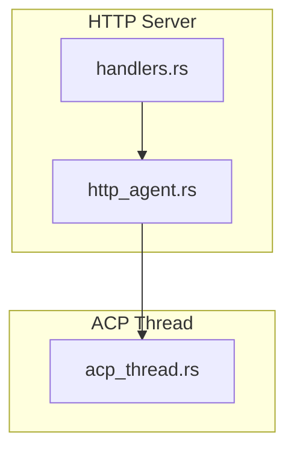
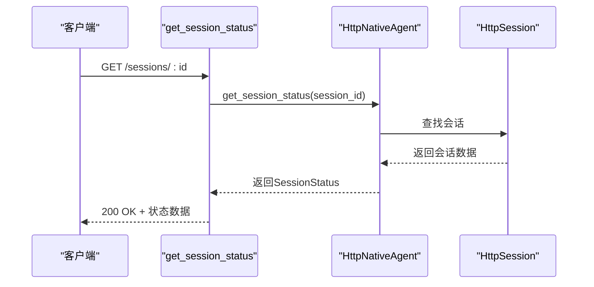
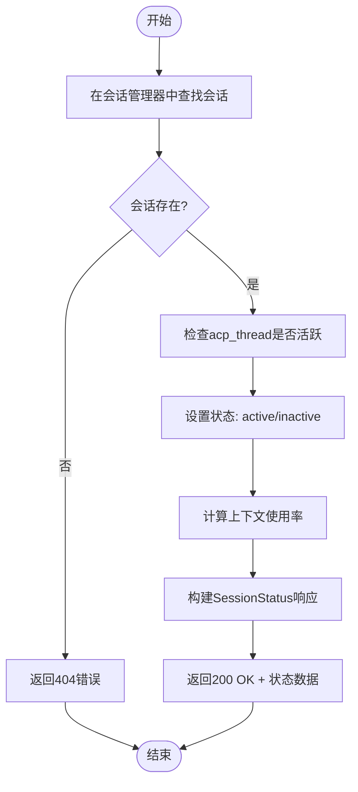
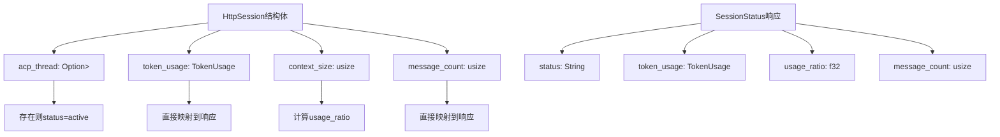
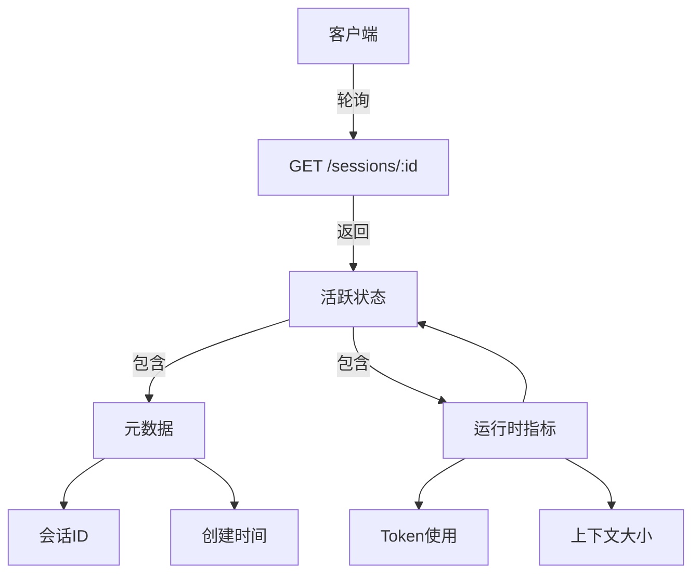
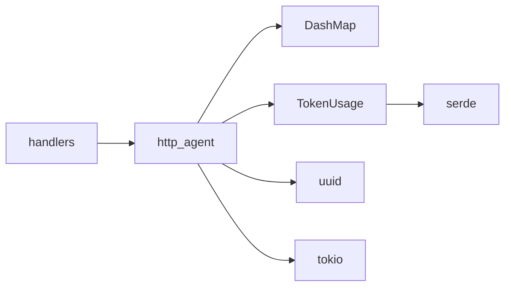

# 会话状态查询

<cite>
**本文档中引用的文件**   
- [handlers.rs](file://crates/http_server/src/handlers.rs)
- [http_agent.rs](file://crates/http_server/src/http_agent.rs)
- [acp_thread.rs](file://crates/acp_thread/src/acp_thread.rs)
</cite>

## 目录
1. [简介](#简介)
2. [项目结构](#项目结构)
3. [核心组件](#核心组件)
4. [架构概述](#架构概述)
5. [详细组件分析](#详细组件分析)
6. [依赖分析](#依赖分析)
7. [性能考虑](#性能考虑)
8. [故障排除指南](#故障排除指南)
9. [结论](#结论)
10. [附录](#附录)（如有必要）

## 简介
本文档详细说明了如何通过会话ID获取当前会话的运行状态，重点介绍GET /sessions/:id状态查询接口的实现机制。文档将深入解析handlers.rs中的get_session_status处理函数如何与会话管理器交互，从AcpThread实例中提取关键信息，并将其转换为API响应数据。同时，文档将阐述当会话不存在或已终止时的错误处理机制，并提供响应示例和客户端使用建议。

## 项目结构
项目采用模块化设计，核心功能分布在多个crates中。会话状态查询功能主要涉及http_server crate中的handlers.rs和http_agent.rs文件，以及acp_thread crate中的acp_thread.rs文件。这种分层结构将HTTP接口处理、会话管理与底层ACP线程逻辑分离，提高了代码的可维护性和可扩展性。



**Diagram sources**
- [handlers.rs](file://crates/http_server/src/handlers.rs#L0-L260)
- [http_agent.rs](file://crates/http_server/src/http_agent.rs#L0-L652)
- [acp_thread.rs](file://crates/acp_thread/src/acp_thread.rs#L0-L799)

**Section sources**
- [handlers.rs](file://crates/http_server/src/handlers.rs#L0-L260)
- [http_agent.rs](file://crates/http_server/src/http_agent.rs#L0-L652)

## 核心组件
会话状态查询功能的核心组件包括HttpSession结构体、SessionStatus结构体和get_session_status方法。HttpSession封装了会话的所有元数据和运行时指标，而SessionStatus则定义了API响应的数据结构。get_session_status方法作为桥梁，将内部会话状态转换为客户端可理解的格式。

**Section sources**
- [http_agent.rs](file://crates/http_server/src/http_agent.rs#L22-L606)

## 架构概述
会话状态查询的架构遵循典型的请求-处理-响应模式。当客户端发起GET /sessions/:id请求时，Axum框架将请求路由到get_session_status处理函数。该函数通过AppState访问HttpNativeAgent实例，调用其get_session_status方法查询会话状态。整个过程涉及HTTP层、会话管理层和底层ACP线程的协同工作。



**Diagram sources**
- [handlers.rs](file://crates/http_server/src/handlers.rs#L437-L468)
- [http_agent.rs](file://crates/http_server/src/http_agent.rs#L437-L468)

## 详细组件分析

### 会话状态查询分析
get_session_status处理函数是会话状态查询的核心。它首先通过会话ID在会话管理器中查找对应的HttpSession实例。如果会话不存在，则返回404错误。如果会话存在，函数会检查acp_thread字段来确定会话的活跃状态，并收集各种运行时指标。

#### 对于API/服务组件：


**Diagram sources**
- [http_agent.rs](file://crates/http_server/src/http_agent.rs#L437-L468)

#### 对于复杂逻辑组件：


**Diagram sources**
- [http_agent.rs](file://crates/http_server/src/http_agent.rs#L22-L606)
- [acp_thread.rs](file://crates/acp_thread/src/acp_thread.rs#L0-L799)

**Section sources**
- [handlers.rs](file://crates/http_server/src/handlers.rs#L437-L468)
- [http_agent.rs](file://crates/http_server/src/http_agent.rs#L437-L468)

### 概念概述
会话状态查询接口为客户端提供了实时监控会话运行状态的能力。通过该接口，客户端可以了解会话的活跃状态、资源使用情况和执行进度，从而做出相应的决策，如继续等待、取消任务或调整请求频率。



## 依赖分析
会话状态查询功能依赖于多个组件的协同工作。HttpNativeAgent作为核心会话管理器，依赖于DashMap进行高效的会话存储和检索。SessionStatus结构体依赖于TokenUsage结构体来表示资源使用情况。整个功能还依赖于uuid、serde和tokio等外部库来处理唯一标识、序列化和异步操作。



**Diagram sources**
- [http_agent.rs](file://crates/http_server/src/http_agent.rs#L0-L652)
- [Cargo.toml](file://crates/http_server/Cargo.toml#L1-L50)

**Section sources**
- [http_agent.rs](file://crates/http_server/src/http_agent.rs#L0-L652)

## 性能考虑
会话状态查询操作设计为轻量级读取操作，对系统性能影响较小。会话数据存储在内存中的DashMap中，确保了O(1)的查找时间复杂度。为了进一步优化性能，建议客户端采用指数退避策略进行轮询，避免在会话活跃期间过于频繁地查询状态。

## 故障排除指南
当会话状态查询返回404错误时，可能的原因包括会话ID不存在、会话已过期或已被手动关闭。客户端应首先验证会话ID的正确性，然后检查会话的生命周期管理逻辑。对于频繁出现的404错误，建议增加会话创建和管理的日志记录，以便追踪问题根源。

**Section sources**
- [http_agent.rs](file://crates/http_server/src/http_agent.rs#L437-L468)

## 结论
会话状态查询接口为系统提供了重要的监控能力，使客户端能够实时了解会话的运行状态和资源使用情况。通过合理的架构设计和组件分离，该功能实现了高效、可靠的会话状态管理。建议客户端根据实际需求调整轮询频率，并充分利用返回的状态信息来优化用户体验。

## 附录

### 响应示例

**活跃会话响应：**
```json
{
  "session_id": "a1b2c3d4-e5f6-7890-g1h2-i3j4k5l6m7n8",
  "status": "active",
  "project_path": "/projects/my-app",
  "created_at": "2024-01-01T00:00:00Z",
  "context_size": 15000,
  "max_context_size": 200000,
  "message_count": 25,
  "usage_ratio": 0.075,
  "token_usage": {
    "input_tokens": 12000,
    "output_tokens": 3000,
    "total_tokens": 15000,
    "max_tokens": 200000,
    "model_name": "claude-3-opus-20240229"
  }
}
```

**已完成会话响应：**
```json
{
  "session_id": "a1b2c3d4-e5f6-7890-g1h2-i3j4k5l6m7n8",
  "status": "inactive",
  "project_path": "/projects/my-app",
  "created_at": "2024-01-01T00:00:00Z",
  "context_size": 8000,
  "max_context_size": 200000,
  "message_count": 15,
  "usage_ratio": 0.04,
  "token_usage": {
    "input_tokens": 6000,
    "output_tokens": 2000,
    "total_tokens": 8000,
    "max_tokens": 200000,
    "model_name": "claude-3-opus-20240229"
  }
}
```

### 客户端建议
- **轮询频率**：初始轮询间隔建议为5秒，可根据会话状态动态调整。当会话处于活跃状态时，可适当增加间隔至10-15秒；当接近完成时，可减少至2-3秒。
- **缓存策略**：客户端应缓存最近的会话状态，避免在短时间内重复查询相同会话。建议设置至少1秒的缓存有效期。
- **错误处理**：当收到404响应时，应停止轮询并通知用户会话已结束或不存在。对于其他错误，建议实现指数退避重试机制。