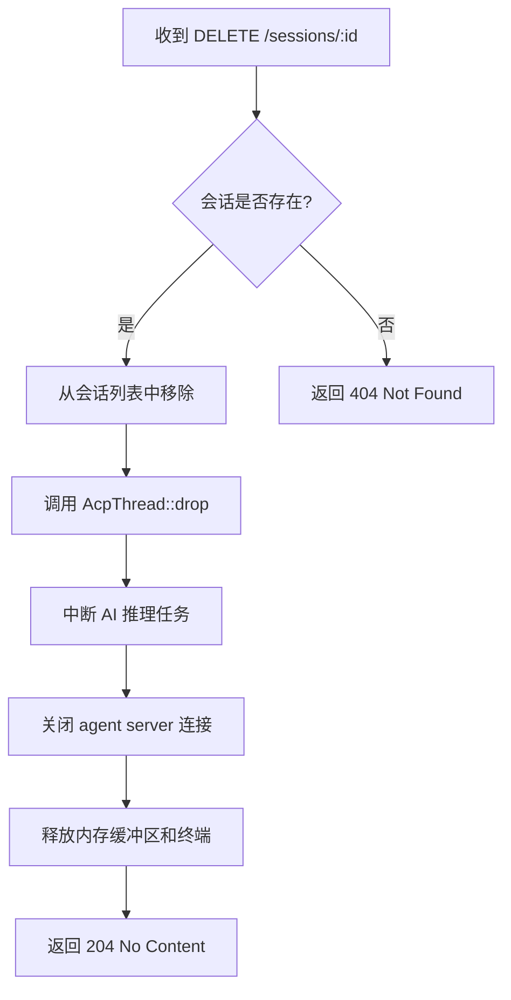

# 会话终止

<cite>
**本文档中引用的文件**  
- [handlers.rs](file://crates/http_server/src/handlers.rs)
- [http_agent.rs](file://crates/http_server/src/http_agent.rs)
- [acp_thread.rs](file://crates/acp_thread/src/acp_thread.rs)
- [connection.rs](file://crates/acp_thread/src/connection.rs)
</cite>

## 目录
1. [简介](#简介)
2. [DELETE /sessions/:id 接口说明](#delete-sessionsid-接口说明)
3. [会话清理机制](#会话清理机制)
4. [AcpThread 的终止与 Drop 行为](#acpThread-的终止与-drop-行为)
5. [HTTP 响应状态码说明](#http-响应状态码说明)
6. [资源释放的重要性](#资源释放的重要性)
7. [客户端 UI 状态更新建议](#客户端-ui-状态更新建议)

## 简介
本文档详细说明 `DELETE /sessions/:id` 接口的实现机制，重点描述如何安全地终止指定 ID 的会话。该操作涉及中断正在进行的 AI 推理任务、关闭与 agent server 的连接、释放内存中的缓冲区和终端资源。文档还解释了 `AcpThread` 的 `drop` 行为及其与 `connection` 字段的交互，确保底层 TCP 或 WebSocket 连接被正确关闭。

## DELETE /sessions/:id 接口说明

该接口用于显式终止一个指定 ID 的会话。当客户端发送 DELETE 请求至 `/sessions/{session_id}` 时，服务端将执行完整的会话清理流程。

**Section sources**
- [handlers.rs](file://crates/http_server/src/handlers.rs#L0-L259)

## 会话清理机制

会话清理由 `HttpNativeAgent::close_session` 方法驱动，其核心逻辑如下：

1. **日志记录**：记录会话关闭的起始操作。
2. **会话移除**：从会话映射表中移除指定 ID 的 `HttpSession`。
3. **ACP 线程清理**：如果会话中存在 `acp_thread`，则触发其清理逻辑。
4. **连接关闭**：通过 `connection` 字段的 `cancel` 方法中断与 agent server 的通信。
5. **资源释放**：`AcpThread` 的 `Drop` 实现确保所有关联资源（如终端、缓冲区）被释放。

**Diagram sources**
- [http_agent.rs](file://crates/http_server/src/http_agent.rs#L429-L468)
- [acp_thread.rs](file://crates/acp_thread/src/acp_thread.rs#L775-L807)
- [connection.rs](file://crates/acp_thread/src/connection.rs#L21-L87)

## AcpThread 的终止与 Drop 行为

`AcpThread` 是会话的核心执行单元，其实现了 `Drop` trait 以确保资源的自动释放。

### 终止流程
- **中断任务**：`AcpThread` 内部的 `send_task`（`Task<()>`）会在 `drop` 时被取消，从而中断任何正在进行的 AI 推理。
- **连接交互**：`AcpThread` 持有 `Rc<dyn AgentConnection>` 的引用。在 `drop` 时，它会通过此连接的 `cancel` 方法通知 agent server 终止会话。
- **资源释放**：`AcpThread` 管理的 `terminals`（`HashMap<acp::TerminalId, Entity<Terminal>>`）和 `shared_buffers`（`HashMap<Entity<Buffer>, BufferSnapshot>`）会在结构体销毁时自动释放。

### 关键字段
- `connection: Rc<dyn AgentConnection>`：与 agent server 的连接抽象，负责发送 `cancel` 指令。
- `send_task: Option<Task<()>>`：代表当前运行的 AI 推理任务，`drop` 时自动取消。
- `terminals: HashMap<acp::TerminalId, Entity<Terminal>>`：管理所有打开的终端实例。

**Section sources**
- [acp_thread.rs](file://crates/acp_thread/src/acp_thread.rs#L775-L807)
- [connection.rs](file://crates/acp_thread/src/connection.rs#L21-L87)

## HTTP 响应状态码说明

| 状态码 | 含义 | 说明 |
|-------|------|------|
| 204 No Content | 成功删除 | 会话已成功终止，所有资源已释放，响应体为空 |
| 404 Not Found | 会话不存在 | 指定的 `session_id` 在服务端不存在，无法执行删除操作 |

**Section sources**
- [handlers.rs](file://crates/http_server/src/handlers.rs#L0-L259)

## 资源释放的重要性

及时释放会话资源至关重要，原因如下：
- **防止内存泄漏**：未释放的 `AcpThread`、`BufferSnapshot` 和 `Terminal` 实例会持续占用内存。
- **避免连接耗尽**：未关闭的 TCP/WS 连接会耗尽系统文件描述符。
- **保证服务稳定性**：资源泄漏会累积，最终导致服务性能下降或崩溃。
- **成本控制**：与 agent server 的连接通常涉及计算成本，及时关闭可避免不必要的费用。

## 客户端 UI 状态更新建议

客户端在收到 `DELETE /sessions/:id` 的响应后，应进行以下 UI 更新：
1. **204 响应**：
   - 立即禁用或移除与该会话相关的所有交互控件（如输入框、发送按钮）。
   - 在 UI 上显示“会话已结束”或类似状态提示。
   - 清理本地缓存的会话临时数据。
2. **404 响应**：
   - 提示用户“会话不存在”，可能已被其他客户端关闭或 ID 输入错误。
   - 提供创建新会话的选项。
3. **通用处理**：
   - 无论成功与否，都应从会话列表中刷新或移除该条目。
   - 记录操作日志以供调试。

**Section sources**
- [handlers.rs](file://crates/http_server/src/handlers.rs#L0-L259)
- [http_agent.rs](file://crates/http_server/src/http_agent.rs#L429-L468)