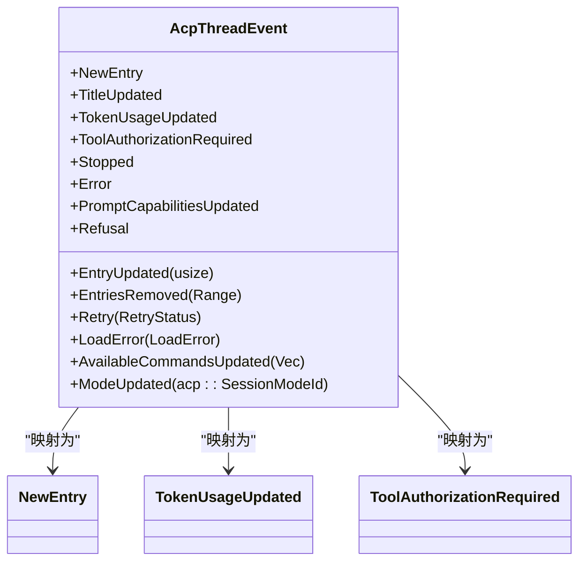
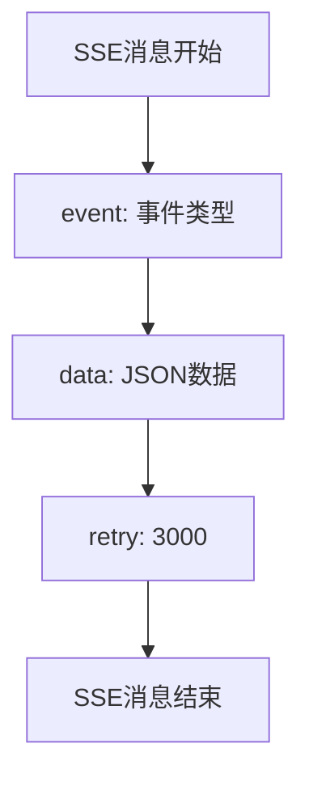
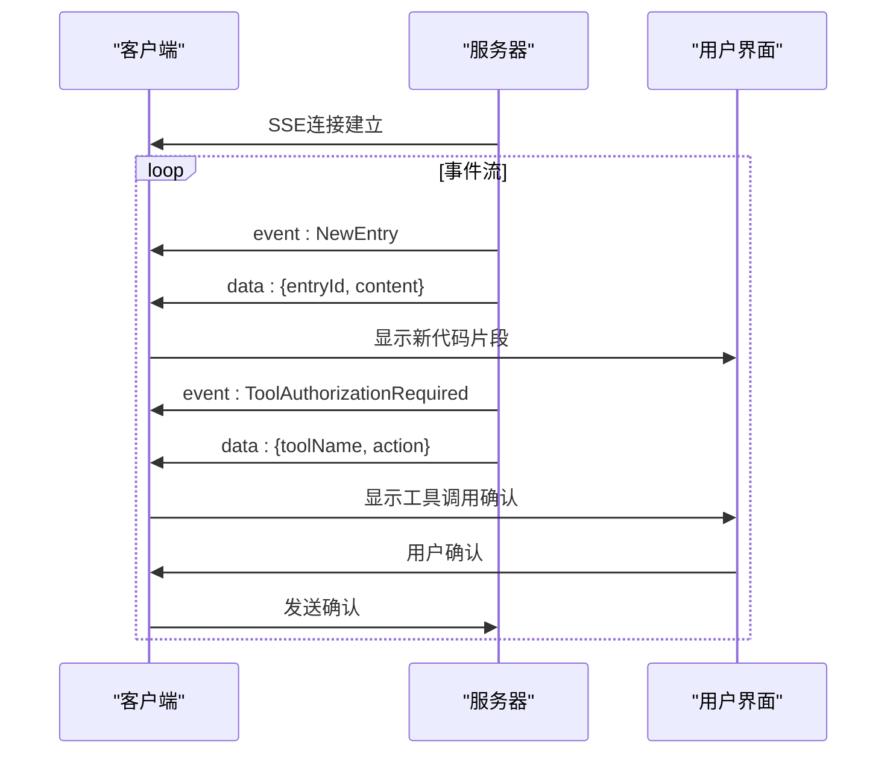
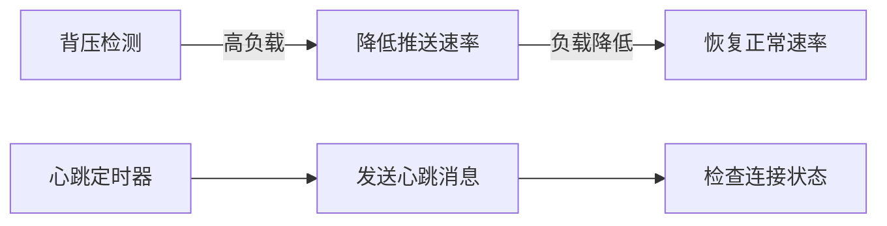
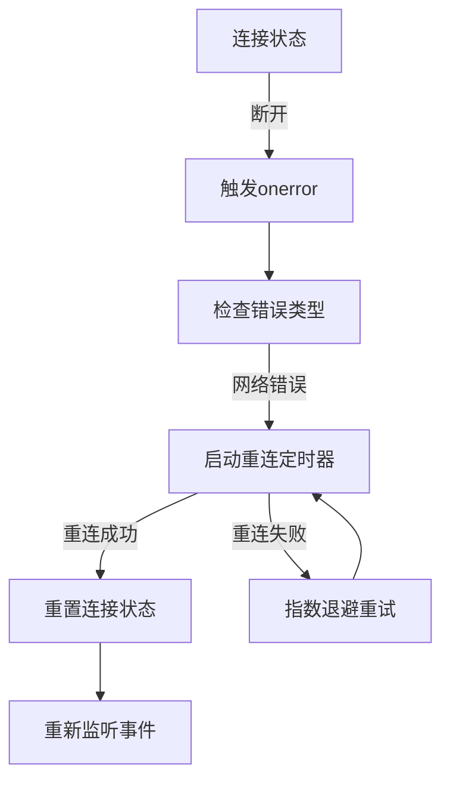

# 流式事件订阅

<cite>
**本文档引用的文件**
- [handlers.rs](file://crates/http_server/src/handlers.rs)
- [acp_thread.rs](file://crates/acp_thread/src/acp_thread.rs)
</cite>

## 目录
1. [简介](#简介)
2. [SSE流式事件端点机制](#sse流式事件端点机制)
3. [事件类型与SSE消息映射](#事件类型与sse消息映射)
4. [消息格式与重连机制](#消息格式与重连机制)
5. [客户端处理与UI更新](#客户端处理与ui更新)
6. [服务端稳定性机制](#服务端稳定性机制)
7. [使用示例](#使用示例)
8. [错误处理策略](#错误处理策略)

## 简介
本文档详细说明了`GET /sessions/:id/events` SSE流式事件端点的服务器推送机制。该端点用于实时推送会话中的各种事件，使客户端能够及时更新用户界面。文档重点分析了`handlers.rs`中`handle_session_events`函数如何将`AcpThreadEvent`枚举事件转换为SSE消息流，以及客户端如何处理这些事件。

## SSE流式事件端点机制

服务器发送事件（SSE）是一种允许服务器向客户端推送实时更新的技术。`GET /sessions/:id/events`端点利用SSE机制，通过持久连接将`AcpThreadEvent`事件流式传输到客户端。

**Section sources**
- [handlers.rs](file://crates/http_server/src/handlers.rs)

## 事件类型与SSE消息映射

`AcpThreadEvent`枚举定义了会话中可能发生的各种事件类型，这些事件在`handle_session_events`函数中被转换为相应的SSE消息。



**Diagram sources**
- [acp_thread.rs](file://crates/acp_thread/src/acp_thread.rs#L791-L807)

### 事件类型映射关系
- **NewEntry**: 当会话中创建新条目时触发，通知客户端有新的内容生成
- **TokenUsageUpdated**: 当令牌使用情况更新时触发，用于显示当前的使用统计
- **ToolAuthorizationRequired**: 当需要用户授权工具调用时触发，触发UI显示确认对话框
- **EntryUpdated**: 当现有条目更新时触发，用于实时更新显示内容
- **TitleUpdated**: 当会话标题更新时触发，用于更新会话标题显示

**Section sources**
- [acp_thread.rs](file://crates/acp_thread/src/acp_thread.rs#L791-L807)

## 消息格式与重连机制

SSE消息遵循特定的格式规范，确保客户端能够正确解析和处理。

### 消息数据格式
每个SSE消息包含以下部分：
- `event`: 事件类型（如"NewEntry"、"TokenUsageUpdated"）
- `data`: JSON格式的有效载荷，包含事件相关数据
- `retry`: 重连间隔（毫秒）



**Diagram sources**
- [handlers.rs](file://crates/http_server/src/handlers.rs)

### 重连机制
服务端设置`retry: 3000`，指示客户端在网络中断后3秒自动重连，确保连接的持久性。

**Section sources**
- [handlers.rs](file://crates/http_server/src/handlers.rs)

## 客户端处理与UI更新

客户端通过解析不同的事件类型来更新用户界面，提供实时的交互体验。

### 事件处理流程


**Diagram sources**
- [handlers.rs](file://crates/http_server/src/handlers.rs)
- [acp_thread.rs](file://crates/acp_thread/src/acp_thread.rs)

### UI更新策略
- **NewEntry事件**: 在聊天界面中添加新的代码生成结果
- **TokenUsageUpdated事件**: 更新令牌使用进度条和统计信息
- **ToolAuthorizationRequired事件**: 弹出确认对话框，显示工具调用详情
- **EntryUpdated事件**: 实时更新现有条目的内容显示

**Section sources**
- [handlers.rs](file://crates/http_server/src/handlers.rs)

## 服务端稳定性机制

为了维持长连接的稳定性，服务端实现了多种机制。

### 背压控制
服务端监控客户端的接收能力，当检测到客户端处理速度较慢时，会暂时减缓事件推送速率，防止消息积压。

### 心跳机制
定期发送心跳消息以保持连接活跃，防止代理或防火墙断开空闲连接。



**Diagram sources**
- [handlers.rs](file://crates/http_server/src/handlers.rs)

**Section sources**
- [handlers.rs](file://crates/http_server/src/handlers.rs)

## 使用示例

### 浏览器端EventSource使用
```javascript
const eventSource = new EventSource(`/sessions/${sessionId}/events`);

eventSource.addEventListener('NewEntry', (event) => {
    const data = JSON.parse(event.data);
    updateUIWithNewEntry(data);
});

eventSource.addEventListener('TokenUsageUpdated', (event) => {
    const data = JSON.parse(event.data);
    updateTokenUsageDisplay(data);
});

eventSource.addEventListener('ToolAuthorizationRequired', (event) => {
    const data = JSON.parse(event.data);
    showToolAuthorizationDialog(data);
});

eventSource.onerror = (error) => {
    console.error('SSE连接错误:', error);
    // 错误处理将在下一节详细说明
};
```

**Section sources**
- [handlers.rs](file://crates/http_server/src/handlers.rs)

## 错误处理策略

### 网络中断处理
客户端应实现自动重连逻辑，利用SSE内置的重连机制。



**Diagram sources**
- [handlers.rs](file://crates/http_server/src/handlers.rs)

### 建议的错误处理实现
1. 监听`onerror`事件，区分不同类型的错误
2. 对于网络中断，利用`retry: 3000`设置进行自动重连
3. 实现指数退避算法，避免频繁重连导致服务器压力
4. 维护连接状态，提供用户友好的错误提示
5. 在重连后请求丢失的事件，确保数据完整性

**Section sources**
- [handlers.rs](file://crates/http_server/src/handlers.rs)