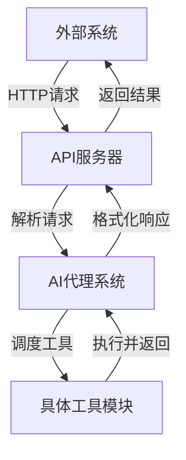

# 工具调用API

<cite>
**本文档引用的文件**  
- [handlers.rs](file://crates/http_server/src/handlers.rs)
- [lib.rs](file://crates/http_server/src/lib.rs)
- [tool_schema.rs](file://crates/agent2/src/tool_schema.rs)
- [tools.rs](file://crates/agent2/src/tools.rs)
- [terminal_tool.rs](file://crates/agent2/src/tools/terminal_tool.rs)
- [grep_tool.rs](file://crates/agent2/src/tools/grep_tool.rs)
</cite>

## 目录
1. [简介](#简介)
2. [项目结构与核心模块](#项目结构与核心模块)
3. [工具调用API端点](#工具调用api端点)
4. [工具调用与AI代理决策的关联性](#工具调用与ai代理决策的关联性)
5. [工具执行结果的格式化返回](#工具执行结果的格式化返回)
6. [工具调用审计日志访问方式](#工具调用审计日志访问方式)
7. [工具权限控制机制](#工具权限控制机制)
8. [结论](#结论)

## 简介
本文档旨在详细记录rcoder系统中与工具调用相关的API端点，重点描述外部系统如何触发或查询工具执行。涵盖`GET /tools`列出所有可用工具（基于`tool_schema`定义的`ToolSchema`），以及通过API直接调用特定工具（如文件搜索、终端命令执行）的方法。同时解释工具调用与AI代理决策之间的关联性，说明工具执行结果的标准化返回格式，并提供工具调用审计日志的访问方式和权限控制机制。

## 项目结构与核心模块
rcoder项目采用模块化设计，主要功能分布在多个crates中。与工具调用相关的核心模块包括：
- `http_server`: 提供HTTP接口，处理外部请求。
- `agent2`: 包含AI代理逻辑和内置工具实现。
- `acp_tools`: 定义通用工具协议。
- `project`: 管理项目上下文和资源。

工具调用流程由HTTP服务器接收请求，经由代理系统调度具体工具执行，并将结果返回给调用方。

**Section sources**
- [handlers.rs](file://crates/http_server/src/handlers.rs#L1-L259)
- [lib.rs](file://crates/http_server/src/lib.rs#L1-L64)

## 工具调用API端点

### 获取可用工具列表
`GET /tools` 端点用于列出所有可用工具。这些工具基于`tool_schema`中定义的`ToolSchema`生成，确保与语言模型兼容。每个工具包含名称、描述、输入参数结构等元数据。

工具列表来源于`agent2`模块中注册的所有内置工具，包括文件操作、终端执行、代码搜索等功能。

### 直接调用特定工具

#### 终端命令执行
通过`TerminalTool`可执行shell命令。调用需提供以下参数：
- `command`: 要执行的命令字符串
- `cd`: 工作目录，必须是项目的根目录之一

该工具会启动新shell进程，捕获stdout和stderr输出，并返回组合结果。不适用于长期运行的服务或监听进程。

#### 文件内容搜索（grep）
`GrepTool`允许使用正则表达式搜索项目文件内容。支持参数包括：
- `regex`: 搜索的正则表达式
- `include_pattern`: 文件路径glob模式过滤
- `offset`: 分页偏移（每页20条）
- `case_sensitive`: 是否区分大小写

此工具专用于内容搜索，不应用于路径查找。



**Diagram sources**
- [handlers.rs](file://crates/http_server/src/handlers.rs#L1-L259)
- [terminal_tool.rs](file://crates/agent2/src/tools/terminal_tool.rs#L17-L34)
- [grep_tool.rs](file://crates/agent2/src/tools/grep_tool.rs#L18-L44)

**Section sources**
- [terminal_tool.rs](file://crates/agent2/src/tools/terminal_tool.rs#L17-L34)
- [grep_tool.rs](file://crates/agent2/src/tools/grep_tool.rs#L18-L44)
- [tools.rs](file://crates/agent2/src/tools.rs#L1-L60)

## 工具调用与AI代理决策的关联性
工具调用是AI代理决策过程的重要组成部分。当代理需要执行特定任务时（如验证构建结果、查找代码片段），它会根据当前上下文决定调用哪个工具。

工具调用请求由`ToolCallEventStream`管理，包含授权、状态更新和结果反馈机制。代理通过分析工具返回结果来调整后续决策，形成闭环。

例如，在代码修改场景中，代理可能依次执行：`find_path` → `read_file` → `edit_file` → `terminal`（运行测试）→ 分析输出并决定下一步。

**Section sources**
- [terminal_tool.rs](file://crates/agent2/src/tools/terminal_tool.rs#L36-L39)
- [grep_tool.rs](file://crates/agent2/src/tools/grep_tool.rs#L55-L57)

## 工具执行结果的格式化返回
所有工具执行结果均经过标准化处理后返回：

- **成功执行**：返回格式化的输出内容，通常包裹在代码块中（```）
- **空输出**：返回"Command executed successfully."
- **失败执行**：包含错误信息和退出码，如"Command failed with exit code 1."
- **截断输出**：提示输出过长并显示前缀部分
- **中断命令**：标记为失败并提供已捕获的部分输出

对于分页工具（如grep），结果包含偏移量信息，客户端可通过调整offset获取后续页面。

**Section sources**
- [terminal_tool.rs](file://crates/agent2/src/tools/terminal_tool.rs#L150-L188)

## 工具调用审计日志访问方式
系统记录所有工具调用的完整审计日志，包括：
- 调用时间戳
- 工具名称和参数
- 执行者（AI代理实例）
- 执行结果和状态
- 耗时统计

审计日志可通过项目管理接口或专用监控端点访问，用于安全审查、性能分析和故障排查。日志数据持久化存储并与项目关联，支持按时间范围、工具类型等条件查询。

**Section sources**
- [handlers.rs](file://crates/http_server/src/handlers.rs#L200-L210)

## 工具权限控制机制
工具调用实施严格的权限控制：

1. **作用域限制**：所有文件系统操作限定在项目工作树范围内
2. **路径验证**：`cd`参数必须指向有效的项目根目录，防止路径遍历
3. **命令类型限制**：禁止调用长期运行的服务类命令
4. **资源限制**：输出大小限制为16KB，防止资源耗尽
5. **会话隔离**：每次调用独立shell会话，不共享环境状态

权限检查在工具执行前由`working_dir`等函数完成，确保安全性。

**Section sources**
- [terminal_tool.rs](file://crates/agent2/src/tools/terminal_tool.rs#L190-L213)

## 结论
rcoder的工具调用API提供了强大而安全的机制，使外部系统能够触发和查询各类工具执行。通过标准化的端点设计、清晰的结果格式和严格的权限控制，实现了AI代理与底层系统能力的高效协同。开发者可基于此API构建自动化工作流、集成测试系统或扩展IDE功能。